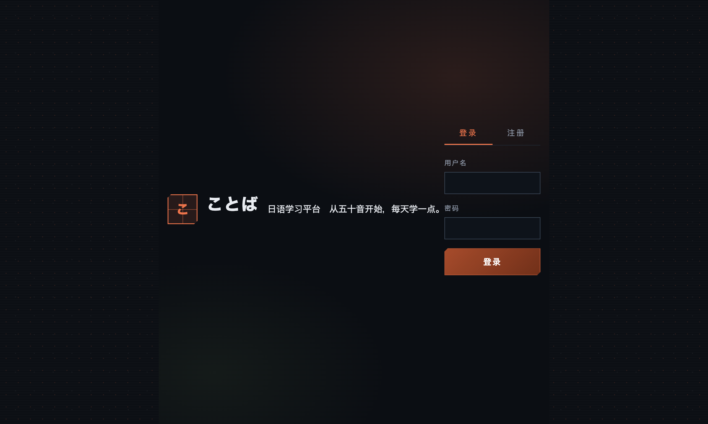

---
AIGC:
    Label: "1"
    ContentProducer: 001191440300708461136T1XGW3
    ProduceID: f8f5684a610de3d952eedcce4f3e4d6d_e2946ed7a52e11f1903b525400f8a581
    ReservedCode1: rpIEUfi6/ISxJ2RbrynfuzGuEN4Lz3OpG6fMfurqM5iCTIYvRarFOQPHj5B6MgFxwEQ2rdkBPRZOyT0dvRjl0VDLaWGZp/BbqIWT8aDT7B5MvkPQe0e5U73Fd+QQMjw7CzsOkOFKnP5GNMBj3FcHUBvBWsLXhHF1CLVfdW+mdD+FBYemL/tpWHOdnR8=
    ContentPropagator: 001191440300708461136T1XGW3
    PropagateID: f8f5684a610de3d952eedcce4f3e4d6d_e2946ed7a52e11f1903b525400f8a581
    ReservedCode2: rpIEUfi6/ISxJ2RbrynfuzGuEN4Lz3OpG6fMfurqM5iCTIYvRarFOQPHj5B6MgFxwEQ2rdkBPRZOyT0dvRjl0VDLaWGZp/BbqIWT8aDT7B5MvkPQe0e5U73Fd+QQMjw7CzsOkOFKnP5GNMBj3FcHUBvBWsLXhHF1CLVfdW+mdD+FBYemL/tpWHOdnR8=
---

# 日本語学習プラットフォーム（Japanese Learning Platform）

一个面向 JLPT（N3–N5）备考的**前后端分离日语学习平台**，集背单词、五十音练习、模拟测验、真题练习、错题本、每日打卡、SRS 间隔复习、学习统计于一体，并内置 **AI 日语助教**（DeepSeek：错题解析、单词例句、语法问答、多轮记忆流式对话）。后端使用 Spring Boot 3 + MyBatis + MySQL/TiDB + Redis，前端为原生 HTML/CSS/JavaScript，支持 Docker Compose 一键启动。

> 本项目为 **Java 后端工程师求职作品**，重点展示：后端分层架构、RESTful API 设计、JWT 认证、Redis 缓存、SRS 算法实现、定时任务、Docker 部署与云数据库接入等能力。

---

## ✨ 功能特性

| 模块 | 说明 |
|------|------|
| 用户认证 | 注册 / 登录，JWT Token 鉴权，密码 BCrypt 加密存储 |
| 单词库 | 内置 N3 / N4 / N5 共 **1377 条**单词，支持分页、分类查询 |
| 五十音练习 | 平假名 / 片假名对照练习，点击发音 |
| 模拟测验 | 基于题库随机组卷（**120 题 / 480 选项**），自动判分 |
| 真题练习 | JLPT 真题风格题目，支持逐题作答与查看解析 |
| 错题本 | 自动收录错题，支持重做与移除 |
| 每日打卡 | 学习打卡，记录连续天数 |
| SRS 复习 | 基于 **SM-2 间隔重复算法**的背词复习，按遗忘曲线安排复习 |
| 每日统计 | 定时任务聚合每日学习数据，趋势图展示 |
| AI 助教 | 集成 **DeepSeek（Spring AI / OpenAI 兼容协议）**：错题解析、单词例句、语法问答；连续对话支持 **SSE 流式打字机输出 + Redis 多轮记忆（约 10 轮 / 7 天）** |

## 🛠 技术栈

### 后端
- **Spring Boot 3.4.1**（Java 17）— Web 应用框架，自动装配与 Starter 生态
- **MyBatis 3.0.4** — 持久层框架，XML/注解 SQL 映射，`#{}` 预编译防注入
- **MySQL 8 / TiDB Cloud Serverless** — 业务数据库（本地 Docker / 云端兼容）
- **Redis 7 / Upstash Redis** — 缓存与在线状态（`word:*` 缓存系列、AI 多轮记忆与问答缓存）
- **Spring AI（openai starter 1.0.0-M6）** — 统一大模型调用抽象，经 OpenAI 兼容协议接入 DeepSeek
- **DeepSeek（deepseek-chat）** — AI 对话模型，`ChatModel.stream` SSE 流式输出
- **SseEmitter + Reactor** — 流式响应推送与取消订阅管理
- **JJWT 0.12.6** — 无状态登录态（JWT 签发与校验）
- **Spring Security Crypto** — BCrypt 密码哈希
- **springdoc-openapi 2.8.9** — Swagger UI / OpenAPI 文档（`/doc.html`）
- **Lombok** — 减少样板代码
- **AOP 日志** — WebLogAspect 统一记录接口调用日志
- **Spring Task** — `@Scheduled` 每日统计定时任务

### 前端
原生 **HTML + CSS + JavaScript**（ES Module 化）：`fetch` 调用 REST API、`localStorage` 持久化登录态、模块化 JS 文件分工。

### 工程化 / 部署
- **Docker / Docker Compose** — 三容器编排：mysql(3308) + redis(6380) + backend(8080)
- **Maven 多阶段构建** — `maven:3.9-eclipse-temurin-17` → `eclipse-temurin:17-jre`
- **TiDB Cloud Serverless** — 云数据库（MySQL 协议兼容，TLS 连接）
- **Upstash Redis** — 云 Redis（TLS + 密码）
- **Hugging Face Spaces (Static)** — 前端静态托管
- **localhost.run SSH 隧道 + launchd 守护** — 后端临时公网暴露（本机演示方案）

## 🏗 架构图

```
┌─────────────────────────┐        ┌──────────────────────────┐
│      前端 (纯静态)        │        │         后端              │
│  frontend/ (HTML/JS)     │  HTTP  │ Spring Boot 3.4.1        │
│  · index.html 登录页      │ ─────► │  Controller → Service    │
│  · app.html   主应用      │  /api  │  → Mapper → MySQL/TiDB   │
│  · js/ 10个模块文件       │        │  JWT 拦截器 · Redis 缓存  │
└─────────────────────────┘        └────────────┬─────────────┘
                                                │
                                    ┌───────────┴───────────┐
                                    │ MySQL 8 (本地 Docker)  │
                                    │ TiDB Cloud (云端备选)  │
                                    │ Redis 7 (缓存/在线)    │
                                    └──────────┬────────────┘
                                               │
                                               │ Spring AI (OpenAI 兼容协议)
                                               ▼
                              ┌──────────────────────────┐
                              │ DeepSeek API（外部模型）   │
                              │ https://api.deepseek.com  │
                              └──────────────────────────┘
```

**请求链路**：浏览器 → 前端静态页 → `fetch(/api/...)` → Spring Boot（JwtInterceptor 鉴权）→ Service 业务逻辑 → MyBatis Mapper → MySQL/TiDB；热点数据走 Redis 缓存（`word:*`）。

## 🚀 快速开始（本地 Docker）

```bash
# 1. 克隆仓库
git clone git@github.com:NAY200212/japanese-learning.git
cd japanese-learning

# 2. 一键启动（mysql:3308 + redis:6380 + backend:8080）
docker compose up -d --build

# 3. 初始化数据库
docker exec -i japanese-learning-mysql-1 mysql -uroot -proot japanese_learning < sql/init_tables.sql
docker exec -i japanese-learning-mysql-1 mysql -uroot -proot japanese_learning < sql/seed_words_n5_more.sql
docker exec -i japanese-learning-mysql-1 mysql -uroot -proot japanese_learning < sql/seed_words_n4.sql
docker exec -i japanese-learning-mysql-1 mysql -uroot -proot japanese_learning < sql/seed_words_n3.sql
docker exec -i japanese-learning-mysql-1 mysql -uroot -proot japanese_learning < sql/seed_questions_jlpt.sql

# 4. 访问
# 后端接口文档（Swagger）: http://localhost:8080/doc.html
# 接口示例:            http://localhost:8080/api/word/list?page=1&pageSize=5
```

### 本地非 Docker 启动

```bash
# 后端
cd src/main/java/com/japaneselearning/ && mvn spring-boot:run   # 需本地 MySQL(3306) + Redis(6379)

# 前端（纯静态，直接打开或起任意静态服务器）
cd frontend && python3 -m http.server 3000
# 访问 http://localhost:3000/index.html
```

## 🌐 在线演示（临时）

| 项目 | 地址 | 说明 |
|------|------|------|
| 前端 | https://nay20024-japanese-frontend.static.hf.space/index.html | Hugging Face Static Space 托管 |
| 后端 API | https://1d531354277d9d.lhr.life/api | localhost.run SSH 隧道，**演示用临时地址，可能变更** |

> 注意：后端公网地址基于本机 SSH 隧道，属于**临时演示方案**（已配置 launchd 守护自动重启 + 前端同步）。正式云端部署后端后地址将长期稳定。

## ⚙️ 环境变量

后端已全部环境变量化（见 `application.yml`），云端部署时注入以下 7 项：

| 变量 | 说明 | 示例 |
|------|------|------|
| `MYSQL_URL` | 数据库 JDBC URL | `jdbc:mysql://host:4000/japanese_learning?...` |
| `MYSQL_USER` | 数据库用户名 | `root` |
| `MYSQL_PASSWORD` | 数据库密码 | `your-password` |
| `REDIS_HOST` | Redis 主机 | `new-lacewing-105715.upstash.io` |
| `REDIS_PORT` | Redis 端口 | `6379` |
| `REDIS_PASSWORD` | Redis 密码 | `your-password` |
| `REDIS_SSL` | 是否启用 Redis TLS | `true` |
| `DEEPSEEK_API_KEY` | DeepSeek API Key（AI 助教必需，仅从环境变量读取，不入库） | `sk-...` |

本地默认值（docker-compose）：MySQL `localhost:3308`、Redis `localhost:6380`。

## 📁 目录结构

```
japanese-learning/
├── src/main/java/com/japaneselearning/
│   ├── controller/     # 12 个 REST 控制器（含 AiController）
│   ├── service/        # 业务层接口 + impl（含 SM-2、AiService / AiChatService）
│   ├── mapper/         # MyBatis Mapper（13 个）
│   ├── entity/         # 实体类（13 个，对应 14 张表）
│   ├── dto/            # 请求/响应 DTO
│   ├── config/         # WebConfig / JwtInterceptor / RedisConfig / OpenApiConfig / WebLogAspect
│   ├── common/         # Result<T> / PageResult<T> 统一返回
│   ├── util/           # JwtUtil
│   ├── task/           # DailyStatsTask 每日统计定时任务
│   └── exception/      # 全局异常处理
├── frontend/
│   ├── index.html      # 登录页
│   ├── app.html        # 主应用页
│   ├── css/style.css
│   └── js/             # api.js / auth.js / word.js / quiz.js / exam.js / kana.js / checkin.js / wrong.js / ai.js / app.js
├── sql/                # 建表 + 种子数据（1377 词 / 120 题）
├── docker/             # Docker initdb 脚本
├── Dockerfile          # Maven 多阶段构建
├── docker-compose.yml  # mysql(3308) + redis(6380) + backend(8080)
└── docs/screenshots/   # 项目截图
```

## 📸 截图

| 登录页 | 前端托管页 |
|--------|-----------|
|  |  |

## 📊 数据规模

- 单词 **1,377 条**（N5 / N4 / N3 分级）
- 测验题库 **120 题 / 480 个选项**（JLPT 真题风格）
- 数据库 **14 张表**：user / word / question / question_option / answer_record / wrong_book / word_review / daily_checkin / daily_stats / exam_record 等

## 🔑 核心设计要点

1. **JWT 无状态认证**：登录签发 Token，`JwtInterceptor` 统一拦截校验，前端 `localStorage` 携带。
2. **MyBatis `#{}` 预编译**：杜绝 SQL 注入；动态条件用 `<script><if>` + `WHERE 1=1`。
3. **Redis 缓存**：单词热点数据缓存于 `word:*`，减少数据库压力；数据修复后需清理缓存。
4. **SM-2 间隔重复算法**：根据用户每次复习反馈（重来/困难/良好/简单）动态调整下次复习间隔与熟练度。
5. **统一返回体**：`Result<T>` 包装接口响应，`PageResult<T>` 统一分页结构。
6. **AOP 接口日志**：`@Aspect` 切面记录请求路径、耗时，便于排查与演示。
7. **每日统计定时任务**：`@Scheduled` 每天聚合学习时长 / 打卡 / 复习数据。
8. **环境变量化配置**：同一套代码本地 Docker 与云端 TiDB / Upstash 无缝切换。
9. **Spring AI 统一模型接入**：仅加 `spring-ai-openai-spring-boot-starter` 并将 base-url 指向 DeepSeek（OpenAI 兼容协议），业务层面向 `ChatModel` 编程、不感知具体厂商，后续可平滑切换 GPT / 通义等模型。
10. **SSE 流式对话**：`SseEmitter` + `ChatModel.stream` 增量推送，前端 `fetch` ReadableStream 解码 + 打字机渲染；超时 / 断连自动 `dispose` 取消订阅防泄漏。
11. **AI 多轮记忆**：Redis `ai:chat:{sessionId}` 保存最近 20 条（约 10 轮）user/assistant 消息（TTL 7 天）；会话按 JWT userId（登录）或 `X-Chat-Session`（游客）识别，Redis 异常自动降级为无记忆直连。
12. **AI 问答短缓存**：相同提问结果写 Redis（TTL 10 分钟），重复问题不重复计费；缓存读取失败自动降级直连。

## 🗺 Roadmap

- [ ] 后端云端化（部署至可长期运行的云平台，替换本地 SSH 隧道）
- [ ] 单词发音音频
- [ ] 移动端适配 / PWA
- [ ] 更多 JLPT 真题题源

---

MIT License © 2026 [NAY200212](https://github.com/NAY200212)

