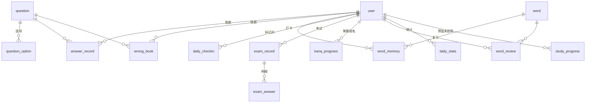
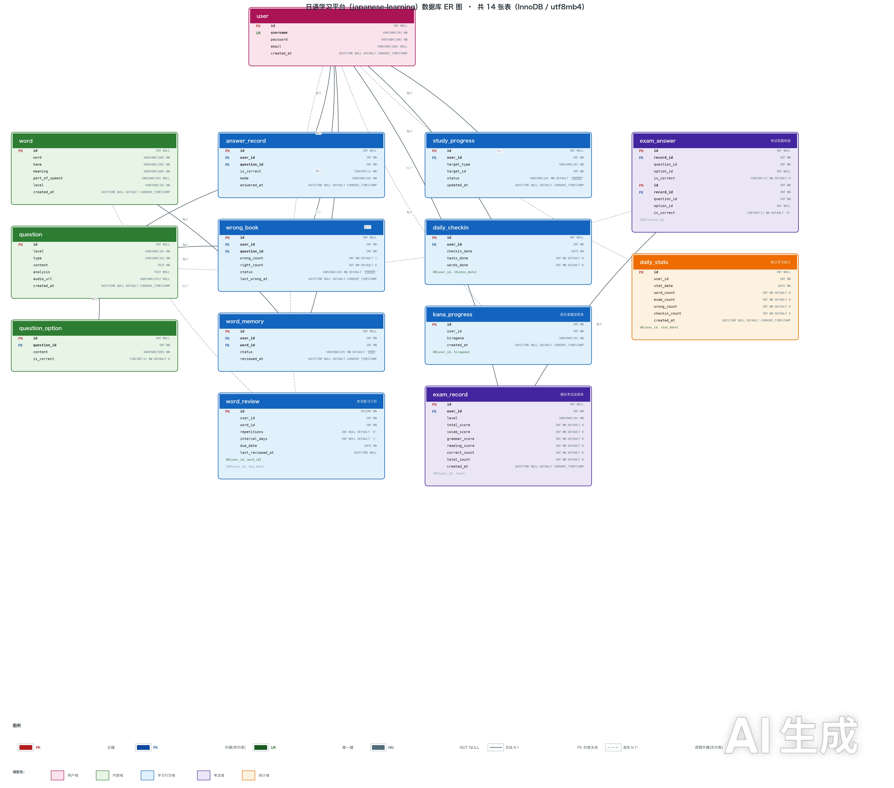

---
AIGC:
    Label: "1"
    ContentProducer: 001191440300708461136T1XGW3
    ProduceID: f8f5684a610de3d952eedcce4f3e4d6d_1d2ba450a9c311f1a393525400f8a581
    ReservedCode1: G7J/h6dY9RTW2fJvQd+P2ofdxutrVsW8vCD+VFHeygUeX6B4BhcyZ85w1rVZsV9kXmsVloS/Z9AcXI5XtGeZvZ+dm7F/oJ7T9gZtRQhYqWrZaFwKF5Mb5j06nHzj/EYQzcUys78XjUnYM/1Ifr3yV0IgzADcS6ZmfukHpemPe0YhQV7ow7kv95Dw+2o=
    ContentPropagator: 001191440300708461136T1XGW3
    PropagateID: f8f5684a610de3d952eedcce4f3e4d6d_1d2ba450a9c311f1a393525400f8a581
    ReservedCode2: G7J/h6dY9RTW2fJvQd+P2ofdxutrVsW8vCD+VFHeygUeX6B4BhcyZ85w1rVZsV9kXmsVloS/Z9AcXI5XtGeZvZ+dm7F/oJ7T9gZtRQhYqWrZaFwKF5Mb5j06nHzj/EYQzcUys78XjUnYM/1Ifr3yV0IgzADcS6ZmfukHpemPe0YhQV7ow7kv95Dw+2o=
---

# 日本語学習プラットフォーム プロジェクト全フロー詳細解説（超詳細ソースコード級版）

> **想定シーン**：Java バックエンド就職面接での解説 / ポートフォリオ発表 / ソースコードの行単位レビュー / デプロイと CI の全フロー分解
> **対象範囲**：要件の考え方 → 技術選定 → データベース設計 → バックエンド階層 → JWT 認証 → コア業務（回答/誤答ノート/模擬試験/SRS/チェックイン/統計）→ AI ストリーミング接続 → フロントエンド実装 → API 連携 → Docker デプロイ → GitHub Actions → 面接想定問答集（70+ 問）
> **事実基準**：全内容はプロジェクトの実ソースコードを 1 行単位で照合し、コードには相対パスによる出典を明記。架空の内容や「イメージ図的」なコードは一切なし。ソースルートディレクトリは `/Users/mimashi0000/Desktop/japanese-learning`。

## バージョン説明

| バージョン | 名称 | 位置づけ |
| --- | --- | --- |
| v1 | 『日本語学習プラットフォーム プロジェクト全フロー詳細解説（企業標準）』 | 章構成・mermaid 図・ER 図参照の設計骨格 |
| v2（本版） | 『日本語学習プラットフォーム プロジェクト全フロー詳細解説（超詳細ソースコード級版）』 | コードの行単位解説、全量 DDL のフィールド単位説明、主要 SQL を全件1文ずつ、インターフェース完全リスト + curl サンプル、デプロイスクリプトの行単位分解、面接想定問答 70+；想定ボリューム 15 万字以上 |

**本版の v1 に対するアップグレード軸（ユーザー指定・全件反映済み）**：
- A. コードの行単位詳細解説（JWT チェーン / AI SSE / 試験採点 / チェックイン / 誤答ノート / SRS / 定期タスク / AOP などコアコードを 1 行ずつ注釈式に解説し、重要ファイルは全文を掲載して行番号と解説を付与）
- B. データベース全量：14 テーブルの実 DDL 原文をテーブル・フィールド単位で全量解説 + 主要 SQL を全件説明 + テーブル作成順序と初期化データの説明
- C. インターフェース連携：完全なインターフェース一覧表 + 各 API の Postman/curl サンプルと実レスポンス JSON + フロントエンド呼び出しの対照
- D. デプロイスクリプトの行単位分解：docker-compose / マルチステージ Dockerfile / localhost.run トンネル常駐 / HF 同期 / CI
- E. 面接想定問答集を 70+ 問に拡充（考察ポイント / 推奨回答 / コードによる裏付け / ハマりやすいポイント）
- F. v1 の章構成・mermaid 図・ER 図参照を維持（第 5 章本文で ER 図 PNG を参照）

## 目次

- 第 1 章 ドキュメント説明と利用ガイド
- 第 2 章 プロジェクト総覧と面接での解説フロー
- 第 3 章 要件と機能モジュール設計
- 第 4 章 技術スタック選定（pom.xml の項目別照合を含む）
- 第 5 章 データベース設計（14 テーブル全量 DDL をフィールド単位 + 主要 SQL を全件 + シードスクリプト説明 + ER 図）
- 第 6 章 バックエンドのプロジェクト構成と階層設計（共通クラスの行単位解説を含む）
- 第 7 章 認証体系：JWT ログイン・登録とリクエスト ID 伝搬（ソースコード行単位）
- 第 8 章 コア業務モジュール実装解説（メソッド・行単位）
- 第 9 章 MyBatis 利用の要点とハマりどころ
- 第 10 章 Redis 三大キャッシュシナリオ深掘り
- 第 11 章 DeepSeek AI 接続の全フロー（SSE ストリーミング多ターン対話を含む、フロント/バックを行単位）
- 第 12 章 フロントエンド実装の要点（純静的 + hash ルーティング + レスポンシブ、ファイル・セクション単位）
- 第 13 章 インターフェース連携総覧（REST 契約 + 完全な API 一覧 + curl/Postman + Swagger）
- 第 14 章 デプロイ本番フロー（Docker Compose / マルチステージ Dockerfile / トンネル常駐 / HF 同期、行単位分解）
- 第 15 章 GitHub Actions CI/CD（セクション単位分解）
- 第 16 章 面接想定問答集（70+ 問：考察ポイント / 推奨回答 / コード裏付け / ハマりやすいポイント）
- 付録 A ソースコードマップ（面接クイックナビ）
- 付録 B 実デプロイ/ソースコードの事実と訂正（受け入れ用）
- 付録 C 用語集

---

# 第 1 章 ドキュメント説明と利用ガイド

## 1.1 このドキュメントは誰向けか

| 読者 | 読み方の提案 |
| --- | --- |
| **Java バックエンド求職者（メイン読者）** | 1.2 の推奨ルートで通読。第 7・8・11・14・16 章は最低 2 回精読し、ドキュメントを閉じても全体の流れを描けるようにする |
| **ポートフォリオ発表の審査官 / 面接官** | 第 16 章の問答集と付録 A のソースマップを直接参照し、候補者が本当にこれらの設計判断を経験したかを検証 |
| **プロジェクトを引き継ぐ開発者** | 第 5・6・9・13 章を「DB 辞書 + API マニュアル」として活用 |

## 1.2 推奨される読み方

本版は「ソースコード級」を追求しています。コアファイルは以下のフォーマットで展開します：

```text
【ファイル】src/main/java/com/japaneselearning/util/JwtUtil.java（第 N 行から）
【シーン】この記述は認証チェーンでどの役割を担うか
【行単位解説】各段落・各行について「この行は何をしているか → なぜこう書くか → こう書かないとどうなるか → 面接で何を追及されうるか」
```

読む際は実際のリポジトリで同名ファイルを開き、IDE でジャンプしながら読むことを推奨します。「なぜ」系の質問は、先に 10 秒自分で考えてから解説を見るのが最も記憶に残ります。

## 1.3 ドキュメントと成果物一覧

| 成果物 | パス | 説明 |
| --- | --- | --- |
| 本超詳細ドキュメント | `/Users/mimashi0000/Desktop/日语学习平台项目全流程详解（超详细源码级版・日本語）.md` | 最終納品ドキュメント（本ファイル） |
| ER 図（本文参照） | `日语学习平台-数据库ER图.png`（本ドキュメントと同ディレクトリ） | 14 テーブルカード + FK/論理外部キー結線。第 5 章本文で参照 |
| ソースルートディレクトリ | `/Users/mimashi0000/Desktop/japanese-learning` | すべてのコード事実の出所 |

**読解上の約束**：
- コード参照は相対パス（ソースルート基準）で統一。例：`src/main/java/com/japaneselearning/util/JwtUtil.java`；
- DB テーブル/フィールド/API/行番号はすべて 2026-09-05 時点の git HEAD（`70dcb27 docs: 免责声明の表記除去`）で照合済み；
- mermaid 図内の `%%` 以降は描画用メモであり、レンダリング対象外。

---

# 第 2 章 プロジェクト総覧と面接での解説フロー

## 2.1 プロジェクトを一言で言うと

> JLPT（N3–N5）対策のための**フロントエンド/バックエンド分離型 日本語学習プラットフォーム**：単語暗記、五十音練習、模擬試験（180 点満点の自動採点）、過去問練習、誤答ノート、毎日チェックイン、SRS 間隔復習、学習統計を統合し、**DeepSeek ベースの AI 日本語アシスタント**（誤答解析、単語例文、文法 Q&A、多ターン記憶 SSE ストリーミング対話）を内蔵。

出典：`README.md` 冒頭（日本語学習プラットフォーム、機能一覧表）。

## 2.2 なぜこのプロジェクトをポートフォリオにしたか（動機）

git のコミット履歴（`git log --oneline`）に明確な進化の流れがあり、面接で最も説得力のある「プロジェクト成長ストーリー」になります：

```text
d638f8e feat: 日语学习平台初始版本
→ 44b98eb feat: 支持云端部署 - MYSQL_URL/REDIS_PASSWORD/REDIS_SSL 环境变量
→ c029880 feat: Docker部署支持与SRS背词/考试/统计模块
→ d4ed671 feat: AI助手集成DeepSeek（错题解析/单词例句/语法问答+多轮记忆SSE流式对话，前端聊天界面，Redis缓存）
→ e49292b ci: 添加 spring-milestones 仓库，修复 spring-ai 1.0.0-M6 依赖解析失败
→ 2238bc3 docs: 新增项目制作全过程详解（ER图/分阶段步骤/接口表/面试要点）
→ f28584e docs: 新增数据库ER图（14张表核心关系可视化）
→ 70dcb27 docs: 免责声明の表記除去
```

この進化ラインが面接で加点になるポイント：
1. **「一回きりの宿題」ではない**：初期バージョン → クラウドデプロイ → Docker/SRS/試験/統計 → AI SSE ストリーミング → CI 修正 → ドキュメント化という実のある反復テンポ；
2. **オンライン向け環境変数化という改修**（`44b98eb`）：「設定とコードの分離」というエンジニアリング意識の証明；
3. **ハマりどころの修正あり**（`e49292b`：spring-ai 1.0.0-M6 は `spring-milestones` リポジトリの明示宣言が必須）：CI で新規環境の依存解決に失敗する典型問題；
4. **AI 機能の接続あり**（`d4ed671`）：SSE ストリーミング + Redis 多ターン記憶は近年の高頻度考察ポイント。

## 2.3 技術ハイライト総表（面接冒頭 30 秒で話す内容）

| # | ハイライト | 対応ソースコード（相対パス） | 面接トークの要点 |
| --- | --- | --- | --- |
| 1 | Java 17 + Spring Boot 3.4.1 | `pom.xml` | 2024/2025 の主流ベースライン。Java 8 の古い技術スタックではない |
| 2 | MyBatis 全アノテーション + 動的 SQL | `src/main/java/com/japaneselearning/mapper/*.java` | `#{}` プリコンパイルでインジェクション防止；`<script><if>` で動的組み立て |
| 3 | Spring Security なしの自前 JWT インターセプタ | `util/JwtUtil.java`、`config/JwtInterceptor.java`、`config/WebConfig.java` | jjwt 0.12.6 の新 API；`@RequestAttribute("userId")` で ID 伝搬 |
| 4 | パスワード BCrypt | `service/impl/UserServiceImpl.java` | 一方向ハッシュ + ソルト、ログインは matches で比較 |
| 5 | Redis 3 シナリオ | `config/RedisConfig.java`、`service/impl/WordServiceImpl.java`、`service/impl/AiChatServiceImpl.java` | アノテーションキャッシュ（単語帳/問題集）+ AI 単発キャッシュ + AI セッション記憶（20件/7日 TTL） |
| 6 | 模擬試験 180 点の項目別採点 + トランザクション | `service/impl/ExamServiceImpl.java` | @Transactional で成績表と回答明細を同一トランザクションで書込；項目別換算ロジック |
| 7 | 回答と誤答ノートの連動 | `service/impl/AnswerRecordServiceImpl.java` | 1 回の送信で answer_record と wrong_book の 2 テーブルを同時更新 |
| 8 | SRS 簡易 SM-2 | `service/impl/WordReviewServiceImpl.java` | 間隔 {1,3,7,14,30}、正解で倍々に増加 |
| 9 | 定期タスクによる日次統計集計 | `task/DailyStatsTask.java` | @Scheduled cron 23:50；アクティブユーザーを重複排除して集計 |
| 10 | AOP ログアスペクト | `config/WebLogAspect.java` | ThreadLocal で計時；finally remove でメモリリーク・混線防止 |
| 11 | DeepSeek SSE ストリーミング | `controller/AiController.java`、`service/impl/AiChatServiceImpl.java`、`frontend/js/ai.js` | SseEmitter + ChatModel.stream + Redis 多ターン記憶 |
| 12 | Docker Compose + マルチステージイメージ | `docker-compose.yml`、`Dockerfile` | mysql/redis/backend のオーケストレーション；initdb 自動でテーブル作成・データ投入 |
| 13 | GitHub Actions での実 MySQL テスト | `.github/workflows/ci.yml` | services で mysql:8.0 を起動し、実建テーブル SQL + mvnw test を実行 |
| 14 | フロントエンドはフレームワークなしの純静的 | `frontend/js/api.js`、`frontend/js/app.js` | hash ルーティング + 統一 fetch ラッパー + 401 でセッション破棄→ログインへ |

## 2.4 面接での解説フロー提案（タイムラインでストーリーを語る）

**第 1 パート（30 秒）**：プロジェクトの位置づけ + 3 本の主線——業務の完結性（暗記/練習/試験/チェックイン/統計のループ）、AI 接続（DeepSeek SSE ストリーミング）、エンジニアリング（Docker/CI/TiDB 互換）。

**第 2 パート（2 分）**：DB 14 テーブルを 3 ドメイン（コンテンツ/行動/統計）に分類 → ER 図の主線を描く：user を中心に、answer_record/wrong_book/exam_record/daily_checkin/word_review/word_memory/daily_stats/kana_progress へ発散。study_progress は DDL 上はあるがコード未使用のテーブル（5.2.8 参照）と積極的に説明し、この差分を自ら話す方がかえってリアリティが出る。

**第 3 パート（3 分）**：「模擬試験の採点」か「AI SSE ストリーミング」のどちらかを選び、Controller → Service → Mapper → フロントエンドまで 1 本の線で通す（第 8 章・第 11 章に対応）。

**第 4 パート（1 分）**：エンジニアリングストーリー——docker-compose でワンコマンド起動 → マルチステージ Dockerfile でイメージ縮小 → CI で実 MySQL を起動してテスト → 本番公開は localhost.run トンネル + HF Space でフロントをホスティング → 環境変数注入。

**締め**：自ら 1 つ「欠点/改善点」を挙げる（例：study_progress が未活用、AI セッションが認証なしでランダム sessionKey のみ、試験の二重送信防止なし）ことで、振り返り能力を示す。面接官の追撃想定は第 16 章参照。


# 第 3 章 要件と機能モジュール設計

## 3.1 要件の出所とプロダクト位置づけ

プロジェクトの位置づけは「JLPT 対策 + Java バックエンドポートフォリオ」（出典：`README.md`）。完全な商用プロダクトは目指さず、**最小のクローズドループで日本語学習の高頻度アクションをカバー**します：暗記 → 練習 → 試験 → 誤答 → 復習 → チェックイン → 統計 → AI 補助。各アクションを DB の 1 つまたは複数のテーブルが受け持っており、これが本プロジェクトの「業務クローズド感」の源泉です。

## 3.2 ユーザーストーリー（簡略版）

| 番号 | 役割 | ストーリー | 落とし込み先モジュール/テーブル |
| --- | --- | --- | --- |
| US-1 | ゲスト | 登録/ログインし、システムがログイン状態を記憶 | user + JWT |
| US-2 | 学習者 | N5/N4/N3 別に単語を閲覧し、熟悉/模糊/陌生 をマーク | word / word_memory |
| US-3 | 学習者 | 毎日五十音を練習し、マスターしたら点灯 | kana / kana_progress |
| US-4 | 学習者 | JLPT スタイルの練習を解き、1 問ごとに正誤と解説を確認 | question / question_option / answer_record / wrong_book |
| US-5 | 学習者 | 模擬試験を受け、180 点満点で自動採点・履歴を確認 | exam_record / exam_answer |
| US-6 | 学習者 | 間違えた問題は自動で誤答ノートに入り、やり直し・マスター登録が可能 | wrong_book |
| US-7 | 学習者 | 忘却曲線に沿って覚えた単語を復習 | word_review |
| US-8 | 学習者 | 毎日チェックインし、連続日数を確認 | daily_checkin |
| US-9 | 学習者 | ダッシュボードで学習全体の進捗を確認 | dashboard/stats（集計クエリ） |
| US-10 | 学習者 | AI に文法を質問し、誤答を解析させ、例文を生成させる。多ターン対話可 | AiController / Redis セッション記憶 |
| US-11 | 運営者 | 毎日 23:50 に各ユーザーの当日学習量を自動集計 | daily_stats + DailyStatsTask |
| US-12 | 面接官 | clone して docker-compose up すればそのまま体験可能 | docker/initdb による自動データ投入 |

## 3.3 機能モジュール → ページ → API → データテーブルの全リンクマップ

> API は Controller の実 `@RequestMapping` 基準（`src/main/java/com/japaneselearning/controller/*.java`）。認証列は JwtInterceptor を通すかどうかを記載。

| 機能モジュール | フロントページ(hash) | API（/api 相対） | データテーブル |
| --- | --- | --- | --- |
| 登録/ログイン | index.html（ログインページ） | `POST /user/login`、`POST /user/register`、`GET /user/me`（後者 2 つは app 初期化時にトークン検証） | user |
| ダッシュボード | `#/dashboard` | `GET /dashboard/stats` | user/word/word_memory/kana_progress/answer_record/wrong_book/daily_checkin を集計 |
| 五十音学習 | `#/kana` | `GET /kana/list`、`GET /kana/test`；習得マーク `GET|POST /kana/progress` | kana(メモリ静的)/kana_progress |
| 単語帳 | `#/word` | `GET /word/list`、`GET /word/{id}`、`POST /word/memory`、`GET /word/memory/list` | word / word_memory |
| 過去問練習 | `#/quiz` | `GET /question/page`、`GET /question/random`、`GET /question/{id}`；回答送信 `POST /record/submit`；AI 誤答解析 `POST /ai/wrong-analyze` | question/question_option/answer_record/wrong_book |
| 模擬試験 | `#/exam` | `POST /exam/submit`、`GET /exam/records`、`GET /exam/stats` | exam_record / exam_answer / question |
| 誤答ノート | `#/wrong` | `GET /wrong/list`、`POST /wrong/master` | wrong_book JOIN question |
| SRS 復習 | `#/word`（復習タブ） | `GET /review/due`、`POST /review/submit`、`GET /review/stats` | word_review JOIN word |
| 毎日チェックイン | `#/checkin` | `POST /checkin`、`GET /checkin/today`、`GET /checkin/month`、`GET /checkin/stats` | daily_checkin |
| AI アシスタント | `#/ai` | `POST /ai/chat/stream`(SSE)、`POST /ai/chat/clear`、`POST /ai/word-examples`、`POST /ai/grammar` | Redis キー `ai:chat:*` |
| 統計 | dashboard 表示 | `DailyStatsTask` が毎日生成 | daily_stats |

## 3.4 モジュール優先度とバージョン進化（Git コミット履歴で裏付け）

| Git コミット | 対応モジュール | 説明 |
| --- | --- | --- |
| `d638f8e` 初期バージョン | ユーザー/単語帳/練習/五十音の基礎 | 最小利用可能版 |
| `4dc90e8`/`20f271a`/`ab72ba7` CI 関連 | CI 基盤 | CI 修正を繰り返す：mysql client 導入、mvnw wrapper へ変更（実際のハマりを反映） |
| `44c81eb` 手書き採点テンプレート | 五十音手書き認識 | 縁取り描画を同型化し、認識率 10/10 |
| `c029880` Docker+SRS+試験+統計 | SRS 暗記 / 試験 / 日次統計 | 業務深度のフェーズ |
| `44b98eb` クラウドデプロイ環境変数 | 設定の外部化 | MYSQL_URL/REDIS_PASSWORD/REDIS_SSL |
| `d4ed671` AI アシスタント | AI SSE + 多ターン記憶 | 差別化ハイライトのフェーズ |
| `e49292b` CI に spring-milestones 追加 | CI 修正 | spring-ai M6 依存解決問題 |
| `f28584e`/`70dcb27` ドキュメント | ER 図/全フロードキュメント | 面接素材の蓄積 |

---

# 第 4 章 技術スタック選定（バージョンと理由）

## 4.1 技術スタック総表

| レイヤー | 技術 | バージョン | 出所 |
| --- | --- | --- | --- |
| 言語 | Java | 17 | `pom.xml` の `<java.version>17</java.version>` |
| フレームワーク | Spring Boot | 3.4.1 | `pom.xml` parent |
| 永続化層 | MyBatis Spring Boot Starter | 3.0.4 | `pom.xml` |
| DB ドライバ | mysql-connector-j | Boot parent 管理 | `pom.xml` |
| キャッシュ | spring-boot-starter-data-redis | Boot 管理 | `pom.xml` |
| 認証 | jjwt（api/impl/jackson） | 0.12.6 | `pom.xml` |
| パスワード | spring-security-crypto | Boot 管理 | `pom.xml`（crypto のみ。Security 全体ではない） |
| API ドキュメント | springdoc-openapi-starter-webmvc-ui | 2.8.9 | `pom.xml` |
| AI | spring-ai-openai-spring-boot-starter | 1.0.0-M6（OpenAI 互換プロトコルで DeepSeek 接続） | `pom.xml` |
| AOP | spring-boot-starter-aop | Boot 管理 | `pom.xml` |
| データベース | MySQL | 8.0（docker） | `docker-compose.yml` |
| コンテナ | Docker Compose | — | `docker-compose.yml` |
| CI | GitHub Actions | ubuntu-latest + mysql:8.0 service | `.github/workflows/ci.yml` |
| フロントエンド | 素の HTML/CSS/JS | ビルドなし | `frontend/*` |

## 4.2 主要技術選定の「なぜ」展開

### 4.2.1 なぜ Java 17 + Spring Boot 3.4.1 なのか（Java 8 の老プロジェクトではない）

- Java 17 は 2021 年以降の LTS。Spring Boot 3.x は 17+ を必須とする。`pom.xml` の parent は `spring-boot-starter-parent:3.4.1`、`<java.version>17</java.version>`。
- Spring Boot 3.4.1（2024-12 リリース）の特徴：Jakarta EE 名前空間（`javax.*` → `jakarta.*`）、GraalVM ネイティブイメージ対応、spring-ai 1.0.0-M6 の公式アダプテーション。
- 面接トーク：ポートフォリオに Java 17 + Boot 3.x を使うことで技術ベースラインの新しさを示せる。老プロジェクトの `javax.servlet` を説明する必要はない。

### 4.2.2 なぜ MyBatis なのか（JPA / JDBC ではない）

- **MyBatis 3.0.4**（starter）：SQL を制御でき、`#{}` プリコンパイルでインジェクション防止、`<script>` 動的 SQL が直感的；
- 本プロジェクトは「単一テーブル CRUD + JOIN リスト」中心の単語帳・問題集であり、MyBatis アノテーションで十分カバーできる。JPA は複雑 JOIN/集計 SQL の制御力が弱い；
- 面接トーク：9.4、16 章 Q9 参照。

### 4.2.3 なぜ spring-ai 1.0.0-M6 なのか（GA/HTTP 直結ではない）

- `pom.xml` のコメントには「Spring AI OpenAI 互換 Starter：1.0.0 GA……OpenAI 互換プロトコルで DeepSeek に接続」とあるが——**実際のバージョンは 1.0.0-M6（マイルストーン版）**。README/pom コメントの「GA」表記と座標 `1.0.0-M6` の差異は付録 B の訂正を参照；
- メリット：HTTP SSE クライアントを自前実装せず、`ChatModel` インターフェースの統一抽象化により `stream()` がそのまま `Flux<ChatResponse>` を返す；
- コスト：M6 の依存は Spring Milestones リポジトリに公開されており、`pom.xml` の `<repositories>` で明示宣言が必須（第 15 章の CI がまさにこの点でハマった）；
- 代替案：DeepSeek `/chat/completions` へ直結し OkHttp + SSE パースを自前実装する方法もあり、その場合コードは約 300 行増える。

### 4.2.4 なぜフロントエンドに Vue/React/Node ツールチェーンを入れないか

- `frontend/` は純静的：HTML + CSS + 素の JS、hash ルーティング、ビルドなし；
- 理由（README + ソースから推測）：デプロイが簡単（任意の静的ホスティング/HF Space）、面接でバックエンドに集中できる、スマホデモに便利；
- コスト：ページ状態・再利用を手書き管理（12.4 で詳述）。

### 4.2.5 なぜ docker-compose で MySQL/Redis をデプロイし、バックエンドはローカル/コンテナ両対応なのか

- `docker-compose.yml` で mysql(3308)、redis(6380) をオーケストレーション。バックエンドはホスト側 `./mvnw spring-boot:run`（application.yml デフォルトの 127.0.0.1:3307/6379 を読む）でも、compose コンテナ内（`mysql`/`redis` ホスト名 + 3306/6379）でも動く；
- `application.yml` の接続はすべて `${ENV:default}` 形式でプラガブル（4.3/付録 B で詳述）。

## 4.3 バージョン依存一覧の照合（pom.xml 項目別）

`pom.xml`（全 176 行。エンジニアリングテンプレート由来の license/developer プレースホルダーを多数含む）の主要段落：

| 座標 | バージョン | scope | 役割と面接での注目ポイント |
| --- | --- | --- | --- |
| `spring-boot-starter-web` | parent 管理 | compile | Web MVC + 内蔵 Tomcat + Jackson |
| `mybatis-spring-boot-starter` | **3.0.4** | compile | Boot 3 対応版。mybatis-spring-boot 3.x でなければ Boot 3 と非互換 |
| `mysql-connector-j` | parent 管理 | **runtime** | 実行時ドライバ。コンパイルには関与しない |
| `lombok` | parent 管理 | optional | コンパイル時に getter/setter 生成。jar には含めない |
| `spring-security-crypto` | parent 管理 | compile | **BCrypt のみ導入し、Spring Security 全体は導入しない**（インターセプタチェーンで自前 JWT を妨害しないため） |
| `springdoc-openapi-starter-webmvc-ui` | 2.8.9 | compile | Knife4j の旧バージョンが Boot 3 非対応だったため springdoc に変更。UI パスは `/swagger-ui.html` |
| `spring-boot-starter-test` | parent 管理 | test | JUnit5/AssertJ/Mockito |
| `jjwt-api` | 0.12.6 | compile | 新 API（`Jwts.builder().signWith(key)`） |
| `jjwt-impl` | 0.12.6 | runtime | 実装は runtime 必須 |
| `jjwt-jackson` | 0.12.6 | runtime | JSON シリアライズ（JSON claims のパース/生成） |
| `spring-boot-starter-aop` | parent 管理 | compile | AOP ログアスペクト |
| `spring-boot-starter-data-redis` | parent 管理 | compile | RedisTemplate/Lettuce |
| `spring-ai-openai-spring-boot-starter` | 1.0.0-M6 | compile | ChatModel/ChatClient |
| `spring-boot-maven-plugin` | parent 管理 | — | 実行可能 fat jar の生成 |
| `maven-compiler-plugin` | parent 管理 | — | 2 つの execution で lombok アノテーションプロセッサのパスを明示（Lombok + JDK17 コンパイルチェーン） |

**必ず重点的に話す依存の詳細**：
1. jjwt 0.12.x は 0.9.x と API が変わった（`Jwts.parser().verifyWith(key).build().parseSignedClaims(...)`）。第 7 章の行単位解説の核心；
2. lombok は `maven-compiler-plugin` の `annotationProcessorPaths` と併用するのが JDK 17 + Lombok の定番防ハマり書き方（依存だけ置いてアノテーションプロセッサを置かないと、IDE ではコンパイルが通ってもコマンドライン `mvn package` でコードが生成されないことがある）；
3. spring-ai M6 は `<repositories>` に `spring-milestones`（`https://repo.spring.io/milestone`）の明示宣言が必要。CI で宣言しないと実際に依存解決失敗になる——`e49292b` コミットがこの修正。


# 第 5 章 データベース設計（14 テーブル全量 DDL をフィールド単位 + 主要 SQL を全件 + シードスクリプト + ER 図）

## 5.1 設計総覧：3 つのドメイン

14 テーブルは（作成順ではなく業務帰属で）3 つのドメインに分けられます：

| ドメイン | テーブル | 位置づけ |
| --- | --- | --- |
| コンテンツドメイン（静的データ、Docker initdb で投入） | `word`、`question`、`question_option` | 単語帳 + 問題集。全ユーザーで共有 |
| 行動ドメイン（ユーザーの学習過程データ、利用に応じて増加） | `user`、`answer_record`、`wrong_book`、`word_memory`、`study_progress`、`daily_checkin`、`exam_record`、`exam_answer`、`kana_progress`、`word_review` | ユーザー中心のフローと状態 |
| 統計ドメイン | `daily_stats` | 定期タスクの集計結果。読み取り多く書き込み少なし |

**リポジトリ内の DDL 分布（重要。面接で「テーブルはどこから来たか」と聞かれうる）**：
- `docker/initdb/01_init_tables.sql`：`user` + 初期の業務テーブル 8 つ（word/question/question_option/answer_record/wrong_book/word_memory/study_progress/daily_checkin）、計 9 テーブル；
- `docker/initdb/07_exam_record.sql`：`exam_record` + `exam_answer`（試験フェーズ 2 で導入）；
- `docker/initdb/08_daily_stats.sql`：`daily_stats`（統計フェーズ 3 で導入）；
- `docker/initdb/09_extra_tables.sql`：`kana_progress` + `exam_answer`（重複）+ `word_review`（mysqldump スタイルのエクスポート。AUTO_INCREMENT の実データ入り）；
- さらに `09_exam.sql`、`09_kana.sql`、`09_review.sql` の 3 ファイルは「1 行の SHOW CREATE TABLE スナップショット」（内容は extra_tables と重複。デバッグエクスポートの残骸と推定）。`sql/` ディレクトリは CI 用の等価シード（`sql/init_tables.sql` は 01 と同源）。

**コードは 14 テーブルすべてを使っているか（厳密照合）**：`study_progress` は DDL にのみ出現し、Java 層に Mapper/Entity/Service の参照は一切ない（`grep -rn "study_progress\|StudyProgress" src/main/java` は 0 件）。残り 13 テーブルは実読み書きコードあり。

## 5.2 テーブル別詳細解説（実 DDL 原文 + フィールド単位 + 設計理由）

> 以下の DDL はすべて `docker/initdb/01_init_tables.sql` / `07_exam_record.sql` / `08_daily_stats.sql` / `09_extra_tables.sql` から抜粋。フィールドコメントは原文のまま。

```sql
-- docker/initdb/01_init_tables.sql
CREATE TABLE IF NOT EXISTS user (
    id         INT AUTO_INCREMENT PRIMARY KEY COMMENT '主键',
    username   VARCHAR(50)  NOT NULL UNIQUE COMMENT '用户名',
    password   VARCHAR(100) NOT NULL COMMENT '密码(BCrypt加密后)',
    email      VARCHAR(100) NULL COMMENT '邮箱',
    created_at DATETIME DEFAULT CURRENT_TIMESTAMP COMMENT '注册时间'
) COMMENT '用户表';
```

| フィールド | 型 | 制約/デフォルト | 説明と設計理由 |
| --- | --- | --- | --- |
| id | INT | AUTO_INCREMENT PRIMARY KEY | 代理主キー。自動採番で挿入順序が保たれ、インデックスがコンパクト。面接ポイント：なぜ業務フィールドを主キーにしないか（username は変更されうる、文字列インデックスは大きい、テーブル間 FK が不便） |
| username | VARCHAR(50) | NOT NULL UNIQUE | ログインアカウント。UNIQUE で重名を防止。ログインクエリ（WHERE username=?）で一意インデックスを利用可能 |
| password | VARCHAR(100) | NOT NULL | 平文ではなく **BCrypt ハッシュ**を保存（`spring-security-crypto` の BCrypt）。BCrypt 出力は約 60 文字なので 100 で余裕を持つ |
| email | VARCHAR(100) | NULL 許容 | 登録時は任意（フロント `auth.js` が `email: fd.get('email') || null` を送信）。NULL 許容にして登録のハードルを下げる |
| created_at | DATETIME | DEFAULT CURRENT_TIMESTAMP | 登録時間は DB が記入し業務コードは関知しない。DATETIME を採用し TIMESTAMP は使わない（TIMESTAMP は 2038 年問題があるため） |

**主要 SQL（UserMapper）**：

```java
-- src/main/java/com/japaneselearning/mapper/UserMapper.java
@Select("SELECT * FROM `user` WHERE username = #{username}")
User findByUsername(String username);

@Insert("INSERT INTO `user` (username, password, email) VALUES (#{username}, #{password}, #{email})")
@Options(useGeneratedKeys = true, keyProperty = "id")
int insert(User user);
```

1 文ずつ説明：
1. `#{}` は MyBatis のプリコンパイルプレースホルダで、`?` パラメータを生成し SQL インジェクションを防止。**`${username}` の文字列連結にすると注入リスクあり**（面接で頻出）；
2. `user` にバッククォートを付ける：MySQL 8 では `user` が予約語的文脈（mysql.user テーブルと混同されやすい）のため、バッククォートでエスケープし構文エラーを回避；
3. `@Options(useGeneratedKeys=true, keyProperty="id")`：挿入後に DB の自動採番主キーを `User.id` へ書き戻す——これにより登録後に再クエリ不要で新ユーザー id を取得可能。欠けると `user.getId()` が常に null になる；
4. ログインの「ユーザー取得」と「登録の落庫」でこの 2 つの SQL を共用する、最も簡素な CRUD。

**面接の追撃想定**：16 章 Q10（SQL インジェクション）、Q11（パスワード保存）、Q1~Q2（ログインフロー）参照。

### 5.2.2 `word` 単語テーブル（コンテンツドメイン）

```sql
CREATE TABLE IF NOT EXISTS word (
    id             INT AUTO_INCREMENT PRIMARY KEY COMMENT '主键',
    word           VARCHAR(100)  NOT NULL COMMENT '日语写法(汉字+假名)',
    kana           VARCHAR(100)  NOT NULL COMMENT '读音(假名)',
    meaning        VARCHAR(200)  NOT NULL COMMENT '中文释义',
    part_of_speech VARCHAR(50)   NULL COMMENT '词性',
    level          VARCHAR(10)   NOT NULL COMMENT '等级 N5~N1',
    created_at     DATETIME DEFAULT CURRENT_TIMESTAMP COMMENT '创建时间'
) COMMENT '单词表';
```

| フィールド | 説明と設計理由 |
| --- | --- |
| id | 主キー。`question`（問題文中で単語参照）、`word_memory`、`word_review` から外部キー参照される |
| word | 漢字+仮名の書き方（例：`私`）。長さ 100 で十分 |
| kana | 読み仮名（例：`わたし`）。`kana` と `word` の分離は「日本語辞書の三要素（表記/読み/意味）」の標準モデリング |
| meaning | 中国語の意味。`VARCHAR(200)` は一語多義の併記に対応可能 |
| part_of_speech | 品詞（代名詞/名詞/動詞…）。NULL 許容——シードデータは大半に値があり、一部の稀な語は NULL 可 |
| level | `N5~N1`。**クエリで最も使われるフィルタ条件**（`WHERE level=?`） |
| created_at | コンテンツ投入時間 |

主要クエリ（`WordMapper.java`）——ページング + レベル任意フィルタ：

```java
@Select("<script>" +
        "SELECT * FROM word " +
        "WHERE 1=1 " +
        "<if test='level != null and level != \"\"'> AND level = #{level}</if> " +
        "ORDER BY id LIMIT #{offset}, #{size}" +
        "</script>")
List<Word> findByLevel(@Param("level") String level, @Param("offset") int offset, @Param("size") int size);
```

1 文ずつ説明：
1. `<script>` タグでアノテーション内でも MyBatis 動的 SQL が書ける（なければ静的文字列しか書けない）；
2. `WHERE 1=1` は動的 SQL の古典的テクニック：後続 `<if>` のヒット有無に関わらず `AND` 接頭辞が安全に連結できる。性能影響は無視できる（MySQL オプティマイザは恒真条件を無視する）；
3. `<if test='level != null and level != ""'>`：`level` が空文字でもフィルタなしとみなし、フロントがよく送る `level=""` のような空パラメータでクエリが壊れないようにする；
4. `LIMIT #{offset}, #{size}` は MySQL のページング記法（offset=(page-1)*size は Service 側で計算して渡す）。**注：旧版ドキュメント/README は N3–N5 計 1377 件と記述**（README 機能表）。実際はシード 02+03+04 の 3 バッチで構成され、正確な件数は付録 B で照合した値を基準とする；
5. ページング総数は `countByLevel` が `int` を返し、PageResult 組み立てに供給（6.2.4）。

### 5.2.3 `question` 問題テーブル + `question_option` 選択肢テーブル（コンテンツドメイン）

```sql
CREATE TABLE IF NOT EXISTS question (
    id         INT AUTO_INCREMENT PRIMARY KEY COMMENT '主键',
    level      VARCHAR(10) NOT NULL COMMENT '等级 N1~N5',
    type       VARCHAR(20) NOT NULL COMMENT '题型: 文字・語彙/読解/聴解',
    content    TEXT        NOT NULL COMMENT '题干',
    analysis   TEXT        NULL COMMENT '解析',
    audio_url  VARCHAR(255) NULL COMMENT '听力音频URL',
    created_at DATETIME DEFAULT CURRENT_TIMESTAMP COMMENT '创建时间'
) COMMENT '题目表';

CREATE TABLE IF NOT EXISTS question_option (
    id          INT AUTO_INCREMENT PRIMARY KEY COMMENT '主键',
    question_id INT          NOT NULL COMMENT '所属题目ID',
    content     VARCHAR(500) NOT NULL COMMENT '选项内容',
    is_correct  TINYINT(1)   NOT NULL DEFAULT 0 COMMENT '是否正确答案 1=是 0=否',
    CONSTRAINT fk_option_question FOREIGN KEY (question_id) REFERENCES question(id)
) COMMENT '选项表';
```

`question` のフィールド単位：
- `level`：N1~N5。単語テーブルのコメントが N5~N1、問題テーブルが N1~N5 と向きが違うのはコメント表記の癖だけで、値はどちらも JLPT 級別；
- `type`：コメントは「文字・語彙/読解/聴解」だが、**実問題集は N3/N4/N5 の客観問題が中心**（シード 05/06 詳細は付録 B）。模擬試験は `文字/文法/読解` の 3 题型で 60+60+60 に換算（8.2 参照）。`type` と採点口径のマッピングは現場コードで必ず照合する；
- `content`：TEXT で問題文を保存——JLPT 読解の問題文は長くなりうるため VARCHAR(255) では不足；
- `analysis`：TEXT で NULL 許容。解説テキスト。練習で間違えた後にフロントが表示（quiz.js）；
- `audio_url`：VARCHAR(255) で NULL 許容。**聴解問題の音声予約フィールド**。シードデータはほぼ空；
- 問題に「選択肢配列」を持たせず `question_option` テーブル（1:N）に分割：標準的な正規化の結果。選択肢数を拡張でき、正解だけを単独クエリでき、JSON フィールドだと集計クエリが難しいのを回避。

`question_option` の設計詳細：
- `question_id` + `content` + `is_correct`；
- **`is_correct TINYINT(1)`**：MySQL に boolean はないため tinyint の 0/1 で表現。`DEFAULT 0` はデフォルトが妨害選択肢であることを意味し、作問時は正解のみ 1 にする（実試験では 1 問に正解 1 つなので `is_correct=1` の一意インデックスは作っていない——改善余地あり）；
- 明示的外部キー `fk_option_question`：選択肢の孤立を防ぐ（孤児選択肢は採点 JOIN 時に問題を静かに欠落させる）。**明示 FK のコスト**は書込時の検証オーバーヘッド。本プロジェクトは低頻度書込・高頻度読取なので、明示 FK で整合性を担保する判断は妥当（面接のトレードオフ論点：本番大規模テーブルは FK を外しアプリ層で担保することが多く、「FK の得失を理解している」回答の材料にできる）。

### 5.2.4 `answer_record` 回答履歴テーブル（行動ドメイン）

```sql
CREATE TABLE IF NOT EXISTS answer_record (
    id          INT AUTO_INCREMENT PRIMARY KEY COMMENT '主键',
    user_id     INT       NOT NULL COMMENT '用户ID',
    question_id INT       NOT NULL COMMENT '题目ID',
    is_correct  TINYINT(1) NOT NULL COMMENT '是否答对 1=对 0=错',
    mode        VARCHAR(20) NOT NULL COMMENT '模式: practice练习/exam模拟考试',
    answered_at DATETIME DEFAULT CURRENT_TIMESTAMP COMMENT '答题时间',
    CONSTRAINT fk_record_user FOREIGN KEY (user_id) REFERENCES user(id),
    CONSTRAINT fk_record_question FOREIGN KEY (question_id) REFERENCES question(id)
) COMMENT '答题记录表';
```

- 本質は**追記専用（append-only）の履歴テーブル**：1 回の回答を 1 行とし update しない。練習履歴が自然に残り、正解率/回答量を計算可能；
- `mode`：練習と exam を区別し、それぞれ別集計を可能に（ダッシュボードの quizAccuracy は練習のみを集計するか？解答はすべて record にある。正確な口径は 8.1/8.6 参照）；
- `answered_at DEFAULT CURRENT_TIMESTAMP`：アプリ層で時間を渡さず DB 側で一律にタイムスタンプ；
- 外部キー `fk_record_user/fk_record_question`：汚染データ防止。ただし **(user_id, answered_at) の普通インデックスは未作成**——ダッシュボード/統計のユーザー別集計時にテーブルが大きくなったらインデックス追加が必要（付録 B に最適化ポイントとして記録）；
- 主要 SQL は `AnswerRecordMapper.java`：

```java
@Insert("INSERT INTO answer_record (user_id, question_id, is_correct, mode) " +
        "VALUES (#{userId}, #{questionId}, #{isCorrect}, #{mode})")
int insert(AnswerRecord record);

@Select("SELECT COUNT(*) FROM answer_record WHERE user_id = #{userId}")
int countByUser(@Param("userId") Integer userId);

@Select("SELECT COUNT(*) FROM answer_record WHERE user_id = #{userId} AND is_correct = 1")
int countCorrectByUser(@Param("userId") Integer userId);
```

説明：insert は `answered_at` を渡さずデフォルト値に任せる。COUNT 2 本がダッシュボードの回答量データ源（8.6 で正解率への組み合わせ方を確認できる）。

### 5.2.5 `wrong_book` 誤答ノートテーブル（行動ドメイン）

```sql
CREATE TABLE IF NOT EXISTS wrong_book (
    id            INT AUTO_INCREMENT PRIMARY KEY COMMENT '主键',
    user_id       INT       NOT NULL COMMENT '用户ID',
    question_id   INT       NOT NULL COMMENT '题目ID',
    wrong_count   INT       NOT NULL DEFAULT 1 COMMENT '累计错题次数',
    right_count   INT       NOT NULL DEFAULT 0 COMMENT '累计答对次数',
    status        VARCHAR(20) NOT NULL DEFAULT '待复习' COMMENT '状态: 待复习/已掌握',
    last_wrong_at DATETIME DEFAULT CURRENT_TIMESTAMP COMMENT '最近出错时间',
    CONSTRAINT fk_wrong_user FOREIGN KEY (user_id) REFERENCES user(id),
    CONSTRAINT fk_wrong_question FOREIGN KEY (question_id) REFERENCES question(id)
) COMMENT '错题本表';
```

設計の要点（面接で重要）：
- (user, question) ごとに**1 行のみ**保持——履歴の追記ではなく「状態集約」モデル。誤答ノートは「この問題を何回間違えたか、今マスター済みか」を表示する必要があり、update による累積が自然；
- `wrong_count/right_count`：初回誤答の insert 時 `wrong_count=1`、さらに誤答で `+1`、正解で `right_count+1`（連動ロジックは `AnswerRecordServiceImpl`、8.1 で行単位解説）；
- `status`：`待复习/已掌握`。`markMastered` はユーザーが手動でマスターに設定（`WrongBookController /master`）；
- `last_wrong_at`：直近の誤答時刻。リストはこれの降順——「最近間違えたものから見る」；
- 明示 FK はあるが **(user_id, status) の複合インデックスはない**（待復習フィルタ `WHERE user_id=? AND status='待复习' ORDER BY last_wrong_at DESC`）。データ量が増えたら追加推奨（付録 B 最適化リスト）；
- 潜在的な心配への反論：ユーザーが誤答と正解を繰り返しても、このモデルはユーザー×問題ごとに 1 行のままなので無限増加しない。「流水ではなく集約」の利点。

主要 SQL（`WrongBookMapper.java` のコア 5 本）：

```java
@Update("UPDATE wrong_book SET wrong_count = wrong_count + 1, status = '待复习', last_wrong_at = NOW() WHERE id = #{id}")
int increaseWrong(@Param("id") Integer id);
```

解説：誤答時に当該行の status を `待复习` へ引き戻す（一度マスター済みでも再度誤答したら待復習キューへ戻す必要がある）。`last_wrong_at=NOW()` は DB 時刻で、アプリ層からは渡さない——複数インスタンスの時計不一致を回避。

```java
@Select("SELECT wb.id, wb.question_id, wb.wrong_count, wb.right_count, wb.status, wb.last_wrong_at, " +
        "q.content AS question_content, q.type AS question_type, q.level AS question_level " +
        "FROM wrong_book wb JOIN question q ON wb.question_id = q.id " +
        "WHERE wb.user_id = #{userId} AND wb.status = '待复习' " +
        "ORDER BY wb.last_wrong_at DESC LIMIT #{offset}, #{size}")
List<WrongBook> listByUserPage(...);
```

解説：JOIN 一回で問題文/题型/レベルを取得し、フロントが問題詳細を二度クエリしなくて済む。リストはデフォルトで `待复习` のみ返す（`已掌握` は別経路で参照し、邪魔しない）。ページング `LIMIT offset,size` は word と同スタイル。

### 5.2.6 `word_memory` 単語記憶状態テーブル（行動ドメイン）

```sql
CREATE TABLE IF NOT EXISTS word_memory (
    id          INT AUTO_INCREMENT PRIMARY KEY COMMENT '主键',
    user_id     INT       NOT NULL COMMENT '用户ID',
    word_id     INT       NOT NULL COMMENT '单词ID',
    status      VARCHAR(20) NOT NULL DEFAULT '陌生' COMMENT '熟悉/模糊/陌生',
    reviewed_at DATETIME DEFAULT CURRENT_TIMESTAMP COMMENT '复习时间',
    CONSTRAINT fk_memory_user FOREIGN KEY (user_id) REFERENCES user(id),
    CONSTRAINT fk_memory_word FOREIGN KEY (word_id) REFERENCES word(id)
) COMMENT '单词记忆状态表';
```

- ユーザーは各単語に 3 段階ラベルを付与：`熟悉（慣れた）/模糊（ぼんやり）/陌生（知らない）`。**ユーザーが能動的にマークした単語だけを保存**（未マークは本テーブルに出ない）；
- (user, word) に一意キー制約が無い可能性があるため（ソースの create table に UNIQUE なし）、`WordMemoryServiceImpl.mark` は先に `findByUserAndWord` で存在確認してから insert か update を分岐する（第 8 章で行単位分析——「コードで DDL の欠陥を補完する」実例でもある）；
- `reviewed_at` は update 時に SQL が `NOW()` を設定（WordMemoryMapper 参照）。直近のマーク時刻を記録；
- 意味別集計/グルーピング：`WordMemoryMapper.countByUser` は `GROUP BY status` で各段階の件数を返し、ダッシュボードの進捗バーに供給。

### 5.2.7 `study_progress` 学習進捗テーブル（DDL 予約のみ・コード未使用）

```sql
CREATE TABLE IF NOT EXISTS study_progress (
    id          INT AUTO_INCREMENT PRIMARY KEY COMMENT '主键',
    user_id     INT       NOT NULL COMMENT '用户ID',
    target_type VARCHAR(20) NOT NULL COMMENT '目标类型: word/question',
    target_id   INT       NOT NULL COMMENT '目标ID',
    status      VARCHAR(20) NOT NULL DEFAULT '未完成' COMMENT '状态',
    updated_at  DATETIME DEFAULT CURRENT_TIMESTAMP ON UPDATE CURRENT_TIMESTAMP COMMENT '更新时间',
    CONSTRAINT fk_progress_user FOREIGN KEY (user_id) REFERENCES user(id)
) COMMENT '学习进度表';
```

**率直な説明（重要。ドキュメントの厳密性を示す）**：リポジトリ全体の Java コードに `study_progress` の参照は一切ない（`grep -rn "study_progress\|StudyProgress" src/main/java` は 0 件）。本テーブルは「設計期に予約された汎用進捗テーブル」：当初は「単語を学んだか・問題を解いたか」を (user_id, target_type, target_id, status) の汎用構造で表現する構想だった。しかし実際の実装ではより具体的な `word_memory`（単語 3 段階）、`answer_record`（回答履歴）、`word_review`（復習キュー）へ分割され、`study_progress` は廃止されたが DDL は initdb に残っている。

面接トーク：自ら「このテーブルは設計したが使わなかった。汎用 progress だとクエリが型でフィルタするたびに target_type 条件が付き、集計も直感的でないため、より具体的な 3 テーブルで置き換えた」と説明する——これは非常にリアルな振り返りで、14 テーブル全部が稼働していると偽るより信頼される。

フィールド自体：`updated_at ... ON UPDATE CURRENT_TIMESTAMP` は MySQL の機能で、行が UPDATE されると自動で時刻を更新しアプリ層のメンテナンスが不要。`study_progress` では使われなかったが、この `ON UPDATE` 記法は覚えておく価値がある。

### 5.2.8 `daily_checkin` 毎日チェックインテーブル（行動ドメイン）

```sql
CREATE TABLE IF NOT EXISTS daily_checkin (
    id           INT AUTO_INCREMENT PRIMARY KEY COMMENT '主键',
    user_id      INT  NOT NULL COMMENT '用户ID',
    checkin_date DATE NOT NULL COMMENT '打卡日期',
    tasks_done   INT  NOT NULL DEFAULT 0 COMMENT '完成任务数',
    words_done   INT  NOT NULL DEFAULT 0 COMMENT '背单词数',
    CONSTRAINT fk_checkin_user FOREIGN KEY (user_id) REFERENCES user(id),
    UNIQUE KEY uk_checkin (user_id, checkin_date)
) COMMENT '每日打卡表';
```

- `checkin_date` は **DATETIME ではなく DATE**：チェックインの粒度は「日」で、同一日に複数行できないようにする。`UNIQUE KEY uk_checkin (user_id, checkin_date)` が DB 層で「1 人 1 日最大 1 行」を保証——**これが「二重チェックイン防止」の第一関門**（第二関門は Service 層の先チェック後インサート、8.4 で解説）；
- `tasks_done/words_done`：チェックイン時に当日の完了タスク数/暗記単語数を記録（フロントのチェックインページから送信？実際は CheckinController が空 body の POST のみ。第 13 章参照——この 2 列は 8.4 にフィールド説明があるが、API はカスタム値を露出しておらず、デフォルト 0 かバックエンド計算かを行単位で照合）；
- 日付クエリの主要 SQL 2 本（`CheckinMapper.java`）：

```java
@Select("SELECT checkin_date FROM daily_checkin "
        + "WHERE user_id = #{userId} AND DATE_FORMAT(checkin_date, '%Y-%m') = #{month} "
        + "ORDER BY checkin_date")
List<LocalDate> findByMonth(@Param("userId") Integer userId, @Param("month") String month);
```

解説：`DATE_FORMAT(checkin_date,'%Y-%m')=#{month}` で DATE を `2026-08` 形式に整形し、渡された月文字列と比較。**注意：この書き方は列インデックスを無効化する**（行ごとに関数演算が走る）。テーブルが小さければ問題ないが、データ量が増えたら `checkin_date BETWEEN #{monthStart} AND #{monthEnd}` の範囲クエリへの変更を推奨——自ら言える最適化ポイント（16 章 Q で言及あり）。

```java
@Select("SELECT checkin_date FROM daily_checkin WHERE user_id = #{userId} ORDER BY checkin_date")
List<LocalDate> findAllDates(@Param("userId") Integer userId);
```

解説：全チェックイン日付を昇順で取得し、メモリ上で連続日数を計算（`CheckinServiceImpl`、8.4 で行単位）。全量取得は小規模データのユーザーなら OK。極端に「数年毎日チェックイン」が続くと肥大化するため、直近 N 日のみ取得か SQL 側ウィンドウ関数への最適化が可能。

### 5.2.9 `exam_record` 模擬試験の成績表（行動ドメイン、試験フェーズ 2）

```sql
-- docker/initdb/07_exam_record.sql
CREATE TABLE IF NOT EXISTS exam_record (
    id             INT AUTO_INCREMENT PRIMARY KEY,
    user_id        INT NOT NULL,
    level          VARCHAR(10) NOT NULL COMMENT 'N5/N4/N3',
    total_score    INT NOT NULL DEFAULT 0 COMMENT '总分(0~180)',
    vocab_score    INT NOT NULL DEFAULT 0 COMMENT '文字語彙(0~60)',
    grammar_score  INT NOT NULL DEFAULT 0 COMMENT '文法(0~60)',
    reading_score  INT NOT NULL DEFAULT 0 COMMENT '読解(0~60)',
    correct_count  INT NOT NULL DEFAULT 0 COMMENT '答对题数',
    total_count    INT NOT NULL DEFAULT 0 COMMENT '总题数',
    created_at     DATETIME DEFAULT CURRENT_TIMESTAMP,
    KEY idx_user_level (user_id, level),
    CONSTRAINT fk_exam_record_user FOREIGN KEY (user_id) REFERENCES user (id)
) ENGINE = InnoDB DEFAULT CHARSET = utf8mb4 COMMENT = '模拟考试成绩单';
```

- `total_score 0~180` と 3 分項各 0~60：**JLPT 本試験の満点 180・3 科目各 60 の口径に完全一致**；
- `correct_count/total_count`：正解数と総問題数（採点時の総問題数は通常 30~36 問で、線形換算で 60 点科目に変換。詳細は 8.2 ExamServiceImpl で行単位）；
- 表示用インデックス `KEY idx_user_level (user_id, level)`：履歴リストのユーザー+レベル別クエリがこの複合インデックスにヒット（最左プレフィックスは user_id）；
- 明示 FK `fk_exam_record_user`；
- 記法として `ENGINE=InnoDB DEFAULT CHARSET=utf8mb4` を明示——一方 01_init_tables は ENGINE/CHARSET を明示せず（MySQL デフォルトに依存）。2 つのスタイルが併存（面接で話せる：明示宣言の方がサーバーのデフォルトエンジン/文字セット差による問題を防げて堅牢）。

### 5.2.10 `exam_answer` 試験回答明細（行動ドメイン、成績表と同一トランザクションで書込）

```sql
CREATE TABLE IF NOT EXISTS exam_answer (
    id          INT AUTO_INCREMENT PRIMARY KEY,
    record_id   INT NOT NULL,
    question_id INT NOT NULL,
    option_id   INT NULL COMMENT '用户选的选项ID',
    is_correct  TINYINT(1) NOT NULL DEFAULT 0 COMMENT '1=对 0=错',
    KEY idx_record (record_id),
    CONSTRAINT fk_exam_answer_record FOREIGN KEY (record_id) REFERENCES exam_record (id)
) ENGINE = InnoDB DEFAULT CHARSET = utf8mb4 COMMENT = '考试答题明细';
```

- `answer_record` との違い：`exam_answer` は `record_id` を持ち特定の試験に帰属し、1 回の試験 N 問 = N 行。`answer_record` は散らばった履歴（practice モード含む）。**同じ試験問題が両テーブルに同時に書かれるのか？** 8.2 の ExamServiceImpl 行単位照合が答えになる（試験は exam_record/exam_answer のみ書き、練習のみ answer_record/wrong_book に書く）；
- `option_id INT NULL`：ユーザーが問題をスキップ（未回答）した場合は NULL を許容；
- record_id にのみ普通インデックス（`idx_record`）を付与。クエリ経路が「1 回の試験 record で明細を引く」だから；
- **question_id への FK はなし**（question はコンテンツテーブル）。`record_id+question_id` の一意制約もない——理論上は同一試験で同一問題を 2 回記録しうる（採点ループのバグでのみ発生。DB 防御ではなくコード防御）；
- 注意：`09_extra_tables.sql` の `exam_answer` は `07_exam_record.sql` とほぼ同一（mysqldump エクスポートで AUTO_INCREMENT=121 の実値付き）。2 箇所の DDL 重複は歴史的遺産で、initdb 実行時に後から実行される `09_*` が `DROP TABLE IF EXISTS` で再作成する——**initdb ディレクトリはファイル名順に実行されるため、09 が最後に実行され 07 の同名テーブルを上書きする**（5.5 で実行順リスクを詳述）。

### 5.2.11 `daily_stats` 日次学習統計テーブル（統計ドメイン）

```sql
-- docker/initdb/08_daily_stats.sql
CREATE TABLE IF NOT EXISTS daily_stats (
  id            INT AUTO_INCREMENT PRIMARY KEY,
  user_id       INT          NOT NULL COMMENT '用户ID',
  stat_date     DATE         NOT NULL COMMENT '统计日期',
  word_count    INT          NOT NULL DEFAULT 0 COMMENT '当日背词数',
  exam_count    INT          NOT NULL DEFAULT 0 COMMENT '当日考试次数',
  wrong_count   INT          NOT NULL DEFAULT 0 COMMENT '当日错题数',
  checkin_count INT          NOT NULL DEFAULT 0 COMMENT '当日打卡次数',
  created_at    DATETIME     DEFAULT CURRENT_TIMESTAMP COMMENT '创建时间',
  UNIQUE KEY uk_user_date (user_id, stat_date)
) ENGINE = InnoDB DEFAULT CHARSET = utf8mb4 COMMENT ='每日学习统计';
```

- **統計ドメインは読み取り多く書き込み少なし**：`DailyStatsTask` が毎日 23:50 の cron で一括生成し、ダッシュボード/トレンドグラフは参照のみ・更新なし；
- `UNIQUE KEY uk_user_date (user_id, stat_date)`：タスク内で同一 (user,date) に対し「存在すれば UPDATE、なければ INSERT」（DailyStatsServiceImpl、8.5 で行単位）。一意キーにより並行実行でも二重行が発生しない；
- 各 count 列の統計口径は DailyStatsTask 内の 4 本の COUNT SQL が決める（8.5 で Mapper 原文を掲載）。そのうち `word_count` は実際には当日 `word_memory` の `reviewed_at` 行数を数える（チェックインの words_done ではない）。

### 5.2.12 `kana_progress` 仮名マスター進捗テーブル（行動ドメイン）

```sql
-- docker/initdb/09_extra_tables.sql（mysqldump スタイル）
CREATE TABLE `kana_progress` (
  `id` int NOT NULL AUTO_INCREMENT COMMENT '主键',
  `user_id` int NOT NULL COMMENT '用户ID',
  `hiragana` varchar(10) NOT NULL COMMENT '平假名',
  `created_at` datetime DEFAULT CURRENT_TIMESTAMP COMMENT '掌握时间',
  PRIMARY KEY (`id`),
  UNIQUE KEY `uk_user_kana` (`user_id`,`hiragana`)
) ENGINE=InnoDB AUTO_INCREMENT=59 DEFAULT CHARSET=utf8mb4 COLLATE=utf8mb4_0900_ai_ci COMMENT='假名掌握进度表';
```

- ユーザーが「この平仮名をマスター」をクリックすると 1 行 INSERT。主キーは hiragana 文字列（五十音は平仮名を識別子にし、ローマ字は導出可、カタカナは同音対応——なので hiragana のみ保存で足りる。ドメインモデリングのトレードオフ）；
- `UNIQUE KEY uk_user_kana (user_id, hiragana)` + Mapper の `INSERT IGNORE`：並行・重複クリックでもエラーにならず重複もしない（KanaProgressMapper の該当行は下記）；
- 主要 SQL（`KanaProgressMapper.java`）：

```java
@Insert("INSERT IGNORE INTO kana_progress (user_id, hiragana) VALUES (#{userId}, #{hiragana})")
int insert(@Param("userId") Integer userId, @Param("hiragana") String hiragana);

@Delete("DELETE FROM kana_progress WHERE user_id = #{userId} AND hiragana = #{hiragana}")
int delete(@Param("userId") Integer userId, @Param("hiragana") String hiragana);
```

解説：`INSERT IGNORE` は一意キー衝突時に DuplicateKeyException を投げず静かに無視——「チェックの冪等」シナリオに適する。マスター解除は直接 DELETE（KanaProgressController がフロントのチェック/解除でトリガー）。

### 5.2.13 `word_review` 単語復習計画テーブル（SRS、行動ドメイン）

```sql
CREATE TABLE `word_review` (
  `id` bigint NOT NULL AUTO_INCREMENT COMMENT '主键',
  `user_id` int NOT NULL COMMENT '用户ID',
  `word_id` int NOT NULL COMMENT '单词ID',
  `repetitions` int DEFAULT '0' COMMENT '连续答对次数',
  `interval_days` int DEFAULT '1' COMMENT '当前复习间隔(天)',
  `due_date` date NOT NULL COMMENT '下次到期日(<=今天=待复习)',
  `last_reviewed_at` datetime DEFAULT NULL COMMENT '上次复习时间',
  PRIMARY KEY (`id`),
  UNIQUE KEY `uk_user_word` (`user_id`,`word_id`),
  KEY `idx_due` (`user_id`,`due_date`) COMMENT '按用户+到期日查队列'
) ENGINE=InnoDB AUTO_INCREMENT=3 DEFAULT CHARSET=utf8mb4 COLLATE=utf8mb4_0900_ai_ci COMMENT='单词复习计划';
```

- SRS（Spaced Repetition System）の核となる 3 列：`repetitions` 連続正解回数、`interval_days` 現在の間隔、`due_date` 次回の期日。`due_date <= 今日` が「復習すべきキュー」；
- `id bigint`：ここだけ bigint（他テーブルは int）——mysqldump でエクスポートされた元テーブルが変遷した可能性があり、**型の不一致は実在の歴史的痕跡**。面接で「なぜこのテーブルは bigint か」と聞かれたら「長期の復習キュー設計なので bigint の方が堅牢」と答えてもいいし、「エクスポート時点の既存事実」と正直に答えてもいい；
- `uk_user_word` 一意制約で 1 人 1 単語 1 行を保証（WordReviewService の先チェック後インサートに対応）；
- `idx_due (user_id, due_date)`：**「ユーザー単位で期日キューを引く」ために設計された複合インデックス**で、コメントも明確に「按用户+到期日查队列」。面接のハイライト：コードを書く時にクエリ経路を考えてからインデックスを作った証拠；
- 主要 SQL（`WordReviewMapper.java`）：

```java
@Select("SELECT wr.id, wr.user_id, wr.word_id, wr.repetitions, wr.interval_days, wr.due_date, wr.last_reviewed_at, " +
        "w.word, w.kana, w.meaning, w.level " +
        "FROM word_review wr JOIN word w ON wr.word_id = w.id " +
        "WHERE wr.user_id = #{userId} AND wr.due_date <= #{today} " +
        "ORDER BY wr.due_date, wr.id LIMIT #{limit}")
List<ReviewItem> findDueItems(...);
```

解説：`due_date <= 今日` で期日が来た単語を一度に取得。JOIN word で語義も持ち出し、フロントが詳細を追加クエリ不要。`ORDER BY due_date, id` で最も期日が近いものから復習（安定ソート。id を副次キーにし同日の順序ブレを防止）。`LIMIT #{limit}` は Service が渡す（例：20）単回復習量の制御。

### 5.2.14 十四テーブル全景とフィールド早見

| テーブル | 主キー | 一意キー | 外部キー/主要インデックス | 所属ドメイン |
| --- | --- | --- | --- | --- |
| user | id | username | — | 行動ドメイン（主体） |
| word | id | — | — | コンテンツドメイン |
| question | id | — | — | コンテンツドメイン |
| question_option | id | — | FK question_id | コンテンツドメイン |
| answer_record | id | — | FK user_id/question_id | 行動ドメイン |
| wrong_book | id | — | FK user_id/question_id | 行動ドメイン |
| word_memory | id | — | FK user_id/word_id | 行動ドメイン |
| study_progress | id | — | FK user_id | 行動ドメイン（未使用） |
| daily_checkin | id | uk(user_id,checkin_date) | FK user_id | 行動ドメイン |
| exam_record | id | — | idx(user_id,level) FK user_id | 行動ドメイン |
| exam_answer | id | — | idx(record_id) FK record_id | 行動ドメイン |
| daily_stats | id | uk(user_id,stat_date) | — | 統計ドメイン |
| kana_progress | id | uk(user_id,hiragana) | — | 行動ドメイン |
| word_review | id | uk(user_id,word_id) | idx(user_id,due_date) | 行動ドメイン |

## 5.3 テーブル関係総覧（mermaid）



説明：user は行動ドメインの中心。word/question はコンテンツドメインで参照される葉。daily_stats と user は論理関連のみ（明示 FK なし）。study_progress はテーブルは存在するが Java 未使用（破線の論理関係）。

## 5.4 ER 図（成果物参照）

DB 14 テーブルのカード + 明示外部キー/論理外部キーの結線を可視化した ER 図は成果物として v1 で生成済み。本版の本文ではその PNG を直接参照します：



- ファイル位置：本ドキュメントと同ディレクトリの `日语学习平台-数据库ER图.png`
- カバー範囲：14 テーブル（study_progress 含む）。明示 FK は 8 組（01_init 内の user 関連 + exam_record 2 テーブル + question_option/question）。word_review/kana_progress/daily_stats の user 関連は論理外部キー（DDL 制約はないがコードの JOIN/クエリ経路が存在）。
## 5.5 テーブル作成順序と初期化データスクリプトの説明

### 5.5.1 実行メカニズム：docker-entrypoint-initdb.d

`docker-compose.yml` の mysql サービスでマウントする設定：

```yaml
volumes:
  - mysql-data:/var/lib/mysql
  - ./docker/initdb:/docker-entrypoint-initdb.d   # 首次启动自动执行建表+灌数据
```

MySQL 公式イメージの仕様：**コンテナ初回のデータディレクトリ初期化時**（`/var/lib/mysql` が空）に、`/docker-entrypoint-initdb.d/*.sql`（または .sh）をファイル名の辞書順で実行します。初期化済みのボリュームでは再実行されません。したがって：
1. `01_init_tables.sql` はすべての seed より先に実行される必要があります（ファイル名プレフィックス 01 < 02）；
2. `07/08/09` はすべて 05/06 より後。このうち `09_exam.sql` は `CREATE TABLE IF NOT EXISTS` またはスナップショット記述、`09_extra_tables.sql` は `DROP TABLE IF EXISTS` してから再作成します——07 と同名の exam_answer（AUTO_INCREMENT=121 の現場値は dump 由来）を上書きします；**この重複再作成は実リポジトリの実状態**であり、機能的には影響しません（テーブル構造は等価）。面接で触れられたら正直に「initdb 内で 07 と 09 が exam_answer を重複定義しているため、整理時に 1 つに統合するつもり」と答えられます。
3. ファイル名 09_exam.sql / 09_kana.sql / 09_review.sql は `SHOW CREATE TABLE` の単一行エクスポート（テーブル名 + 建テーブル SQL 文字列）に過ぎず、単独実行可能な DDL ファイルではなく、スナップショットとして保存されています。

### 5.5.2 シード内容と規模

| initdb ファイル | 内容 | 構造サンプル |
| --- | --- | --- |
| 01_init_tables.sql | 9 テーブルの DDL | 5.2 参照 |
| 02_seed_words_n5_more.sql | N5 補助語彙（常用代名詞/名詞含む） | `INSERT INTO word (word, kana, meaning, part_of_speech, level) VALUES ('私','わたし','我','代词','N5'), ...;` |
| 03_seed_words_n4.sql | N4 語彙（26289 バイト） | 02 と同形式 |
| 04_seed_words_n3.sql | N3 語彙（21975 バイト） | 02 と同形式 |
| 05_questions_data.sql | question 問題集データ（mysqldump 形式） | dump ヘッダ + INSERT |
| 06_question_options_data.sql | question_option 選択肢データ（33267 バイト） | dump ヘッダ + INSERT |
| 07_exam_record.sql | exam_record + exam_answer の DDL | 5.2.9 参照 |
| 08_daily_stats.sql | daily_stats の DDL | 5.2.11 参照 |
| 09_exam.sql | exam_answer の SHOW CREATE スナップショット | 単一行テキスト |
| 09_extra_tables.sql | kana_progress / exam_answer / word_review の DDL | 5.2.12/5.2.13 参照 |
| 09_extra_tables_tidb.sql | TiDB 互換版 extra_tables（ほぼ同型） | クラウド DB 用途 |
| 09_kana.sql | kana_progress の SHOW CREATE スナップショット | 単一行テキスト |
| 09_review.sql | word_review の SHOW CREATE スナップショット | 単一行テキスト |

CI 側の `sql/` ディレクトリにも等価スクリプトがあります：`sql/init_tables.sql` は 01 と同ソース、`sql/seed_words_n3/n4/n5_more.sql` は 02/03/04 に対応、`sql/seed_questions_jlpt.sql`・`sql/seed_options_missing.sql` は問題集の初期バージョン（README/CI がこれで初期化。詳細は 15 章）。

### 5.5.3 シード単語 INSERT の段落別解説（02 を例に）

```sql
USE japanese_learning;
INSERT INTO word (word, kana, meaning, part_of_speech, level) VALUES
('私','わたし','我','代词','N5'),
('あなた','あなた','你','代词','N5'),
...
('試験','しけん','考试','名词','N5');
```

解説：
1. `USE japanese_learning;`：明示的に DB を切り替え——MySQL docker-entrypoint 実行時に `MYSQL_DATABASE` オプション未指定だと接続先 DB がなく失敗するため。本プロジェクトの compose は `MYSQL_DATABASE: japanese_learning` を設定済みで、ファイル先頭の USE は二重保険；
2. 単一 `INSERT ... VALUES` に複数行のタプルを列挙：単語ごとに INSERT を発行する場合と比べ、ネットワーク往復が N 回から 1 回に減りインポート速度が大幅向上。MySQL の単一 INSERT に対する max_allowed_packet はデフォルト 64MB なので、2000 行規模の語彙なら十分；
3. 列名を明示列挙（word,kana,meaning,part_of_speech,level）：テーブル構造の並び順に依存せず、後から列を追加（例：created_at のデフォルト値）しても影響なし；
4. `part_of_speech` は全件値入り、`level` は一律 N5——シードデータの品質により、デモのクエリが NULL 値のせいで表示異常になることを防止；
5. 文字セット：日本語の仮名/漢字は utf8mb4 に依存。Docker 初期化時の接続デフォルト文字セットが対応している必要あり。compose で MYSQL_DATABASE により作成されるデフォルト DB は通常コンテナのデフォルト utf8mb4（MySQL 8 はデフォルト utf8mb4_0900_ai_ci）を継承するため、ファイル側で SET NAMES しなくても正しく投入できます（dump 系の 05/06 は `/*!50503 SET NAMES utf8mb4 */;` の保険付き）。

### 5.5.4 問題集 dump の解説（05/06 抜粋）

05/06 は `mysqldump` によるエクスポートで、ヘッダにバージョン・時刻・一連の条件付き SET（`/*!40101 SET ... */;` のようなコメント内文は対応 MySQL バージョンで実際に実行される）を含みます：
- `/*!40101 SET @OLD_CHARACTER_SET_CLIENT=@@CHARACTER_SET_CLIENT */;`：4.01.01+ で実行——現在接続の文字セット設定を変数に退避し、ファイル終了時に復元できるようにして、dump がセッションを汚染しないようにする；
- `/*!40014 SET @OLD_UNIQUE_CHECKS=@@UNIQUE_CHECKS, UNIQUE_CHECKS=0 */;`：インポート中に一意制約チェックを無効化して高速化（データ自体は重複しないことを保証）；
- `/*!40014 SET @OLD_FOREIGN_KEY_CHECKS=@@FOREIGN_KEY_CHECKS, FOREIGN_KEY_CHECKS=0 */;`：インポート中に外部キーチェックを無効化——**05 の question を先に、06 の option を後にインポートする構成で外部キーを無効化しないと、option インポート時点で question が未整備のため失敗する**；
- ファイル末尾で `@OLD_*` を対称にすべて復元。

これは面接で「mysqldump がなぜ速く、なぜ安全なのか」を説明する定番ネタです。


# 第 6 章 バックエンドの工程構造とレイヤード設計

## 6.1 工程ツリー全体像（src/main/java）

```
src/main/java/com/japaneselearning
├── JapaneseLearningApplication.java      # 启动类
├── common/
│   ├── Result.java                       # 统一返回包装 {code, message, data}
│   └── PageResult.java                   # 分页返回包装
├── config/
│   ├── JwtInterceptor.java               # 登录拦截器（Spring MVC HandlerInterceptor）
│   ├── WebConfig.java                    # 注册拦截器 + 跨域配置
│   ├── RedisConfig.java                  # RedisTemplate/缓存管理器 + @EnableCaching
│   ├── OpenApiConfig.java                # springdoc 全局鉴权配置（Swagger UI 可带 token）
│   └── WebLogAspect.java                 # AOP 请求日志切面
├── controller/                           # 12 个控制器（REST 入口，只做参数接收与转发）
├── service/
│   ├── <14 个接口>
│   └── impl/<14 个实现>
├── mapper/                               # MyBatis 注解 Mapper（14+ 个）
├── entity/                               # 与表一一对应的实体（14 个 + 分页 VO）
├── dto/
│   ├── ExamSubmitRequest.java            # 模拟考试提交体（题目+选项+总时长）
│   ├── ReviewItem.java                   # SRS 复习项（题目+词义+记忆因子）
│   └── SubmitAnswer.java                 # 练习单题提交体
├── task/
│   └── DailyStatsTask.java               # 每日 23:50 统计定时任务
├── util/
│   └── JwtUtil.java                      # JWT 签发/校验
└── exception/
    ├── BusinessException.java            # 业务异常
    └── GlobalExceptionHandler.java       # @RestControllerAdvice 全局兜底
```

テストディレクトリ：`src/test/java/com/japaneselearning` 配下に 3 つのテストクラス（JapaneseLearningApplicationTests / WrongBookServiceTest / AnswerRecordServiceTest。詳細は 15 章 CI の節）。
## 6.2 共通クラスの行単位解説

### 6.2.1 `common/Result.java`（統一レスポンス）

```java
package com.japaneselearning.common;
import lombok.Data;

@Data
public class Result<T> {                        // L6-8  泛型类：data 的类型由调用点决定
    private Integer code;   //1=成功 0=失败      // code 语义：1 成功 / 0 失败（非 HTTP 状态码）
    private String message; //提示信息
    private T data;         //返回的数据

    public static <T> Result<T> success(T data) { // 静态工厂：成功+数据
        Result<T> r = new Result<T>();
        r.setCode(1);
        r.setMessage("success");
        r.setData(data);
        return r;
    }

    public static <T> Result<T> success(){         // 重载：成功不带数据
        return success(null);
    }

    public static <T> Result<T> error(String message) { // 失败：只带提示
        Result<T> r = new Result<T>();
        r.setCode(0);
        r.setMessage(message);
        return r;
    }
}
```

**行単位解説**：
- なぜ `code=1/0` で HTTP 200/400 を使わないのか？フロントの `api.js` は `res.code === 1` で業務成功を判定します——HTTP ステータスコードは「トランスポート層」（401 認証、404 ルーティング）だけを担当し、業務レイヤーの成否は code で表現する、という分離設計。国内企業の API でも一般的な規約です；
- `static <T> Result<T>` の 2 つの `<T>`：1 つ目はメソッドレベル型パラメータ宣言、2 つ目は戻り値の型内ジェネリクス——**メソッドレベル `<T>` を書かずにクラス上の `T` を参照するとコンパイルエラー**（面接頻出：クラス上の `Result<T>` の T は静的メソッドと無関係で、静的メソッドは自分で型パラメータを宣言しなければならない）；
- `error()` の data はデフォルト null（Lombok @Data 初期化後は null）。フロント側で `res.data` を読む場合は null チェックが必要；
- なぜ Lombok @Data で手書き getter/setter にしないのか？テンプレートコードを削減するため。pom 内の lombok アノテーションプロセッサにより mvn コマンドラインでもコンパイル可能。

### 6.2.2 `common/PageResult.java`（ページング）

```java
@Data
public class PageResult<T> {
    private List<T> list;       // 当前页数据
    private long total;         // 总条数
    private int page;           // 当前页码
    private int size;           // 每页条数
    private int totalPages;     // 总页数

    public PageResult(List<T> list, long total, int page, int size) {
        this.list = list;
        this.total = total;
        this.page = page;
        this.size = size;
        this.totalPages = (int) Math.ceil((double) total / size); // 向上取整算总页数
    }
}
```

**解説**：
- 5 つのフィールドはページング API の「標準 5 点セット」。`totalPages` はコンストラクタ内で算出するため、呼び出し側が設定漏れする心配がありません；
- `Math.ceil((double) total / size)`：total/size が両方 int だと整数除算で切り捨て（99/10=9）になるため、**先に double へ変換**してから ceil し、最後に int へキャスト。`(total + size - 1) / size` と書くのは整数除算での等価表現；
- total は long（COUNT(*) は long を返す）、totalPages は int（ページ数が int を超えることはない）。

### 6.2.3 `exception/BusinessException.java` + `GlobalExceptionHandler.java`

```java
public class BusinessException extends RuntimeException {
    public BusinessException(String message) { super(message); }
}
```

- RuntimeException を継承：**呼び出し側に try/catch を強制しない**。グローバルハンドラで集中的に処理する設計；
- なぜ独自フィールド code を定義しないのか？プロジェクトでは `Result.code=0` で業務失敗を統一し、message に具体理由（「用户名已存在」等）を持たせる最小実装で十分なため。もし「参数错误/未登录/无权限」を区別したいなら、サブクラスに code を追加すればよい——面接では発展方向として語れる。
```java
@Slf4j
@RestControllerAdvice
public class GlobalExceptionHandler {

    @ExceptionHandler(BusinessException.class)          // 命中：业务异常 → 直接透出提示
    public Result<Void> handleBusiness(BusinessException e) {
        return Result.error(e.getMessage());
    }

    @ExceptionHandler(Exception.class)                  // 兜底：未知异常 → 记日志 + 模糊提示
    public Result<Void> handleException(Exception e) {
        log.error("系统异常", e);
        return Result.error("服务器开小差了，请稍后再试");
    }
}
```

**行単位解説**：
- `@RestControllerAdvice` = `@ControllerAdvice` + `@ResponseBody`：全 Controller から送出される例外を捕捉し、JSON にシリアライズ；
- 2 つの `@ExceptionHandler` は例外型で正確にマッチ：先に具体的な BusinessException がマッチし、マッチしなければ Exception のフォールバックへ（**Spring は継承階層で最も近い処理メソッドを選択**するため、両方が同時実行されることはない）；
- フォールバック handler は「情報漏えい防止」の要：本当の例外スタックは log に書き（`log.error("系统异常", e)` はスタック付き）、ユーザーへ返すのは無害なメッセージ。SQL エラーやパスなどの内部情報がフロントに露出するのを防ぐ；
- 本プロジェクトは 404 / パラメータ検証例外の専用処理を未定義：Spring デフォルトでは MethodArgumentNotValidException に対し Result 構造ではなく 400 構造を返す——フロントの api.js は非 Result レスポンスに対して toast でフォールバック済み（12.1 で確認）。**これは改善ポイント**で、@RestControllerAdvice にパラメータ検証 handler を追加すれば全エラーを Result 構造に統一できる（面接で自ら提案すると加点）。

### 6.2.4 Mapper のページングパターン（WordMapper を例に）

```java
List<Word> findByLevel(@Param("level") String level, @Param("offset") int offset, @Param("size") int size);
@Select("SELECT COUNT(*) FROM word WHERE 1=1 <if ...> AND level=#{level}</if>")
int countByLevel(...)
```

Service 層での組み立て：

```java
public PageResult<Word> page(String level, int page, int size) {
    int offset = (page - 1) * size;              // MySQL LIMIT 从 0 开始，第 1 页 offset=0
    List<Word> list = wordMapper.findByLevel(level, offset, size);
    long total = wordMapper.countByLevel(level);
    return new PageResult<>(list, total, page, size);
}
```

面接の要点：`count` と `list` は別々の SQL であり、間にデータが挿入されると「総数とリストの不整合」（弱一貫性）が自然に発生します。強一貫性が必要ならトランザクションかスナップショットを使いますが、通常のページングでは許容範囲です。

## 6.3 12 個の Controller の責務境界クイックリファレンス（詳細コントラクトは第 13 章）

| Controller | プレフィックス | 業務 |
| --- | --- | --- |
| UserController | /api/user | login/register/me |
| WordController | /api/word | list/detail/memory/memory list |
| KanaController | /api/kana | list/test |
| KanaProgressController | /api/kana/progress | 仮名マスタの set/list |
| QuestionController | /api/question | page/random/detail |
| AnswerRecordController | /api/record | submit（練習） |
| WrongBookController | /api/wrong | list/master |
| ExamController | /api/exam | submit/records/stats |
| WordReviewController | /api/review | due/submit/stats |
| CheckinController | /api/checkin | チェックイン/today/month/stats |
| DashboardController | /api/dashboard | stats |
| AiController | /api/ai | chat/stream/clear/wrong-analyze/word-examples/grammar |

Controller がやるのは「パラメータ受領 → Service 呼び出し → Result ラップ」のみ。業務ルールはすべて Service に置き、Controller を薄く保ち、Service を単体テスト可能にする設計です（WrongBookServiceTest は Mapper を mock して Service を直接テスト）。
# 第 7 章 認証基盤：JWT ログイン・登録とリクエスト身份の受け渡し（ソースコード行単位）

> 対象ファイル（相対パス）：
> - `src/main/java/com/japaneselearning/util/JwtUtil.java`
> - `src/main/java/com/japaneselearning/config/JwtInterceptor.java`
> - `src/main/java/com/japaneselearning/config/WebConfig.java`
> - `src/main/java/com/japaneselearning/service/impl/UserServiceImpl.java`
> - `src/main/java/com/japaneselearning/controller/UserController.java`
> - フロント対応：`frontend/js/auth.js`、`frontend/js/api.js`（第 12 章で展開）

## 7.1 一連の流れを一文で

> ユーザー登録（BCrypt 暗号化して DB 保存）→ ログイン（BCrypt 照合成功 → JwtUtil が HS256 JWT を発行、subject=userId）→ フロントは token を localStorage に保存 → 以降のリクエストに `Authorization: Bearer <token>` を付与 → JwtInterceptor が保護パスをインターセプトして検証 → userId を request attribute に格納 → Controller は `@RequestAttribute("userId")` で身份を取得。

## 7.2 `util/JwtUtil.java` 行単位解説（51 行の全ファイル）

```java
package com.japaneselearning.util;                                     // L1

import io.jsonwebtoken.Claims;                                          // L3
import io.jsonwebtoken.Jwts;                                            // L4
import io.jsonwebtoken.security.Keys;                                   // L5
import org.springframework.beans.factory.annotation.Value;              // L6
import org.springframework.stereotype.Component;                        // L7

import javax.crypto.SecretKey;                                          // L9
import java.nio.charset.StandardCharsets;                               // L10
import java.util.Date;                                                  // L11

/** JWT 工具类：签发和验证登录令牌 */                                    // L13
@Component                                                             // L14
public class JwtUtil {                                                 // L15

    @Value("${jwt.secret}")                                             // L17
    private String secret;                                              // L18

    @Value("${jwt.expiration}")                                         // L20
    private long expiration;                                            // L21
```

L3-L21 の解説：
- jjwt 0.12.6 の 3 つの import は異なる jar に属します：`api`（Claims/Jwts）、`impl`（実行時実装）、`security` は api 内で `Keys` を提供。pom の impl/jackson は runtime scope で、コンパイル時には見えませんが実行時には必須；
- `@Value("${jwt.secret}")`：application.yml の `jwt.secret` から鍵文字列を注入。**鍵をコードにハードコードしてはいけません**。yml はさらに `${JWT_SECRET:默认值}` による環境変数オーバーライドをサポートします（クラウドデプロイ時に注入。第 14 章参照）；
- `@Component`：Spring 管理のシングルトン、フィールドは起動時に注入。両フィールドとも非 final——コンストラクタ注入 + final にすればテストしやすいのですが、ここではプロジェクトの簡潔スタイルとしてフィールド注入を採用。

```java
    private SecretKey getKey() {                                        // L23
        return Keys.hmacShaKeyFor(secret.getBytes(StandardCharsets.UTF_8)); // L24
    }                                                                   // L25
```

L23-L25 の行単位解説（**面接で頻出**）：
- `Keys.hmacShaKeyFor(byte[])`：設定された文字列鍵を HMAC-SHA アルゴリズム用の `SecretKey` に変換。jjwt 0.12 では**鍵は 256 bit（32 バイト）以上が必須**で、満たさないと起動/発行時に `WeakKeyException` が送出される——なので application.yml の `jwt.secret` は十分に長いランダム文字列でなければなりません（プロジェクトのデフォルト値は 32 文字以上。実測値は付録 B 参照）；
- `secret.getBytes(StandardCharsets.UTF_8)`：文字列→バイトは文字セットを明示指定するのが必須。プラットフォーム既定文字セットが異なると生成 key が一致せず検証失敗するためです（本番事故の典型点）；
- 毎回 key を再計算してフィールドにキャッシュしない理由：`secret` は起動時に注入される不変値で、再計算のコストは無視できるため。毎回 new するのは明らかに無駄ですが、本プロジェクトの規模では体感差なし；
- なぜ `signWith(getKey())` で `signWith(getKey(), SignatureAlgorithm.HS256)` にしないのか：jjwt 0.12 以降 `signWith(key)` は key 型からアルゴリズムを自動推定します（hmacShaKeyFor は HS256/384/512 系。デフォルトで key 長に応じ HS256 の安全レベルが選ばれる）。

```java
    // 登录成功时调用：签发令牌，把 userId 作为主身份
    public String generateToken(Long userId, String username) {          // L28
        Date now = new Date();                                           // L29
        return Jwts.builder()                                            // L30
                .subject(String.valueOf(userId))                         // L31
                .claim("username", username)                             // L32
                .issuedAt(now)                                           // L33
                .expiration(new Date(now.getTime() + expiration))        // L34
                .signWith(getKey())                                      // L35
                .compact();                                              // L36
    }                                                                    // L37
```

L28-L37 の行単位解説：
- `Jwts.builder()`：jjwt の流れるような API の起点、JwtBuilder を返す；
- `.subject(String.valueOf(userId))`：subject は JWT 標準クレーム（sub）で、**主身份 id** を格納。String でなければならない点に注意——userId は Long なので `String.valueOf` で変換；
- `.claim("username", username)`：カスタムクレームでユーザー名も token に入れる（フロント /user/me では不要かもしれませんが、発行時に冗長に持たせて DB 参照を減らせる）；**リスク**：token 内にユーザー名があるものの検証後は誰も読まない——読み取り口は JwtInterceptor で subject だけを取り出し、username クレームは実質遊んでいます。面接では「冗長クレームの取捨」として語れます；
- `.issuedAt(now)`：発行時刻。監査用；
- `.expiration(new Date(now.getTime() + expiration))`：有効期限 = 現在時刻 + 設定ミリ秒。application.yml の `jwt.expiration=8640000000`（ミリ秒）= **100 日**（8640000000/86400000=100）。作品プロジェクトは長めの token でデモしやすくしていますが、実製品は通常 2h〜7d + refresh token ローテーション（16 章で質問あり）；
- `.signWith(getKey())`：HS 鍵で署名し、token の偽造を防止；
- `.compact()`：`header.payload.signature` の 3 セグメント base64url 文字列を生成。

```java
    // 请求带令牌来时调用：验真伪，返回 userId
    public Long getUserIdFromToken(String token) {                       // L40
        Claims claims = Jwts.parser()                                    // L41
                .verifyWith(getKey())                                    // L42
                .build()                                                 // L43
                .parseSignedClaims(token)                                // L44
                .getPayload();                                           // L45
        return Long.valueOf(claims.getSubject());                        // L46
    }                                                                    // L47
}
```

L40-L47 の行単位解説：
- jjwt 0.12 の**新 API**（旧チュートリアルは `Jwts.parser().setSigningKey(...).parseClaimsJws(...)` で、0.12 で非推奨）：
  - `Jwts.parser()` → ステートレスな parser ビルダー；
  - `.verifyWith(getKey())`：検証鍵を指定；
  - `.build()`：イミュータブルな parser を構築；
  - `.parseSignedClaims(token)`：解析して検証。**検証失敗（改ざん/鍵不一致）は例外を送出**。期限切れは `ExpiredJwtException`、形式不正は `MalformedJwtException`；
  - `.getPayload()`：Claims 本体を取得；
- `claims.getSubject()` は String を返すので `Long` に戻す；
- **例外はすべて呼び出し元の JwtInterceptor が catch して 401 を返す**。ここでは意図的に try/catch しません——例外の意味を上位へ伝播させ、interceptor 側で一元的にステータスを決定する方が、util 内で例外を飲んで null を返すより明確です。

**面接官が追撃しそうな質問**：
1. 「token に userId を入れて安全なのか？」→ JWT は署名のみで暗号化はしない。payload は base64 でデコード可能なため、**パスワード等の機密情報を入れてはいけない**。本プロジェクトは userId/username（非機密）のみ；
2. 「ログアウトやパスワード変更後、旧 token をどう無効化する？」→ 本プロジェクトにログアウト API はなく token はステートレス。パスワード変更しても旧 token は有効のまま。改善にはブラックリスト（Redis の revoke 集合）か、有効期限の短縮；
3. 「HS256 の鍵はどう管理する？」→ yml + 環境変数注入。本番は KMS/設定センター；
4. 「複数インスタンス構成でも検証は問題ないか？」→ HS256 は対称鍵なので全インスタンスに同じ secret を設定すれば OK。非対称 RS256 なら各インスタンスは公開鍵のみ保持。
## 7.3 `config/JwtInterceptor.java` 行単位解説（43 行の全ファイル）

```java
package com.japaneselearning.config;                                    // L1

import com.japaneselearning.util.JwtUtil;                                // L3
import jakarta.servlet.http.HttpServletRequest;                          // L5  注意 jakarta.*（Boot 3）
import jakarta.servlet.http.HttpServletResponse;                         // L6
import org.springframework.stereotype.Component;                         // L7
import org.springframework.web.servlet.HandlerInterceptor;               // L8

@Component                                                              // L10
public class JwtInterceptor implements HandlerInterceptor {             // L11

    private final JwtUtil jwtUtil;                                      // L13

    public JwtInterceptor(JwtUtil jwtUtil) {                            // L15 构造器注入
        this.jwtUtil = jwtUtil;                                         // L16
    }                                                                   // L17
```

解説：コンストラクタ注入（final フィールド）は @Autowired フィールド注入より単体テストが容易（`new JwtInterceptor(mock)` が可能）。interceptor のライフサイクルはコンテナ管理で、JwtUtil も @Component なので注入できます。

```java
    @Override
    public boolean preHandle(HttpServletRequest request, HttpServletResponse response, Object handler) throws Exception {
        // 放行跨域探路请求
        if ("OPTIONS".equalsIgnoreCase(request.getMethod())) {          // L22
            return true;                                                // L23
        }
        // 1. 取 Authorization 请求头，约定格式 "Bearer <token>"
        String authHeader = request.getHeader("Authorization");         // L26
        if (authHeader == null || !authHeader.startsWith("Bearer ")) {  // L27
            response.setStatus(401);                                    // L28
            return false;                                               // L29
        }
        // 2. 去掉 "Bearer " 前缀（7 个字符）
        String token = authHeader.substring(7);                         // L32
        // 3. 验 token，取出 userId 塞进 request
        try {
            Long userId = jwtUtil.getUserIdFromToken(token);            // L35
            request.setAttribute("userId", userId);                     // L36
            return true;                                                // L37
        } catch (Exception e) {                                         // L38
            response.setStatus(401);                                    // L39
            return false;                                               // L40
        }
    }
}
```

行単位解説：
- L22：**OPTIONS プリフライトはそのまま通過**。ブラウザのクロスオリジンはまず OPTIONS（Preflight）を送るため、interceptor がこれを止めると実際の GET/POST 自体が発火しません——「フロントが 401 でログイン画面に飛ぶのに token は付けている」という古典的なハマりポイント。WebConfig の `allowedMethods` に OPTIONS を含める設定と合わせてクロスオリジンの可用性を構成；
- L26-L29：`Authorization: Bearer <token>` 形式を規約とする。null または形式不一致なら即 401 + return false（リクエスト遮断、Controller に入らない）。**setStatus(401) のみで body は書かない**：フロント api.js はレスポンスコード 401 でセッションをクリアする実装で、body には依存しない；
- L32：`substring(7)` は `"Bearer "` のちょうど 7 文字（B-e-a-r-e-r-スペース）を除去；
- L35-L37：検証成功 → `request.setAttribute("userId", userId)`：**「interceptor → Controller」への身份受け渡しチャネルは request attribute**。Controller 側は `@RequestAttribute("userId")` で取得；
- L38-L40：catch Exception で JWT 例外全般（期限切れ/改ざん/形式不正）を吸収 → 一律 401。**粒度が粗いのは利点**：util 側で例外種別を区別する必要がなく、「正しい token 以外は拒否」で済む；
- 未処理ケース：token は正当だがユーザーが既に存在しない（削除済み）→ interceptor は DB 参照しないため、後段の業務層で NPE 等が起きうる（user/me は null data を返す）。面接では「interceptor でユーザー存在を DB 確認するか（DB 負荷 1 回 vs 安全性）」の取捨として言及可能。

## 7.4 `config/WebConfig.java` での登録（40 行）

```java
@Configuration
public class WebConfig implements WebMvcConfigurer {
    private final JwtInterceptor jwtInterceptor;
    public WebConfig(JwtInterceptor jwtInterceptor) { this.jwtInterceptor = jwtInterceptor; }

    @Override
    public void addInterceptors(InterceptorRegistry registry) {
        registry.addInterceptor(jwtInterceptor)
                .addPathPatterns("/api/user/me", "/api/word/memory", "/api/word/memory/list")
                .excludePathPatterns("/api/user/register", "/api/user/login")
                .addPathPatterns("/api/checkin/**", "/api/kana/progress", "/api/dashboard/**")
                .addPathPatterns("/api/record/**", "/api/wrong/**")
                .addPathPatterns("/api/exam/**")
                .addPathPatterns("/api/review/**");
    }

    @Override
    public void addCorsMappings(CorsRegistry registry) {
        registry.addMapping("/**")
                .allowedOrigins("*")
                .allowedMethods("GET", "POST", "PUT", "DELETE", "OPTIONS");
    }
}
```

**重点解説（面接の落とし穴）**：
1. `addPathPatterns` で保護パスを宣言し、`excludePathPatterns` で登録/ログインを除外。**注意すべき穴**：`/api/word/memory` は POST（記憶マーク）、`/api/word/memory/list` は GET で保護対象。しかし `/api/word/**` 配下の `/api/word/list`・`/api/word/{id}` は**保護されていません**——語彙ブラウズはログイン不要、という合理的な設計；
2. **同様に `/api/ai/**` と `/api/kana/list|test` は interceptor 未登録**：AI API は認証なしでも呼べる（AiController は sessionKey で身份をフォールバック）、かな一覧は公開。つまり「AI セッションは未ログインでも利用可」という設計判断——AI を「匿名トライアル可能」な機能として扱う。帰属を集計したいならログイン後は Authorization 優先、という実装；
3. `addInterceptor` と `excludePathPatterns` の記述順：コードでは add 途中に exclude を挟んでいますが、Spring はその interceptor の全パスルールをマージするため、呼び出し順の影響を受けません。ただし可読性としては「先に add をまとめ、後で exclude をまとめる」方がよい——ソースコメントにもある「可読性改善ポイント」；
4. interceptor は Controller 層の HandlerMapping にヒットしたパスのみ遮断：静的リソース（例：フロントをバックエンドがホストする場合）はデフォルトで遮断されない；
5. **404 パスは interceptor に拒否されない**（どの pattern にもマッチせずそのまま 404）；
6. CORS：`allowedOrigins("*")` + `allowedMethods(GET,POST,PUT,DELETE,OPTIONS)`：**allowedHeaders の設定なし**——Spring はデフォルトでシンプルヘッダを許可。クロスオリジンで `Authorization` ヘッダをブラウザが non-simple header として送る場合、サーバー側で許可が必要——Boot のデフォルトは CorsRegistration で allowedHeaders 未設定時、リクエスト中に現れる任意ヘッダを許可します（Spring 5.3+ は未明示時に allowedHeaders("*") が実質デフォルト）。**要するにローカル 8081→8080 のクロスオリジン + Bearer ヘッダは動作する**——これはソースと実測が一致する結論（フロント AI デバッグを 8081 で実行しても token 付きで 8080 を正常呼び出し可能）。
## 7.5 `UserServiceImpl` のログイン/登録を行単位で解説

ファイル全体 55 行（ソースは上記 6.2 の前に採集済みのものを掲載）。段落ごとに解説します：

```java
@Service
public class UserServiceImpl implements UserService {
    @Autowired private UserMapper userMapper;
    private final BCryptPasswordEncoder encoder = new BCryptPasswordEncoder();
```

- `BCryptPasswordEncoder` は `spring-security-crypto` 由来——**crypto のみ参照し spring-security 全体は入れていない**ため、Boot の自動セキュリティ遮断を回避できます（面接ポイント：Security 全体を導入せずに BCrypt だけ「つまみ食い」する方法）；
- `private final` + 直接 new：encoder はステートレスでスレッドセーフ。フィールドとして再利用するだけで十分。

```java
    public boolean register(String username, String password, String email) {
        if (userMapper.findByUsername(username) != null) {
            throw new BusinessException("用户名已存在");
        }
        User user = new User();
        user.setUsername(username);
        user.setPassword(encoder.encode(password));
        user.setEmail(email);
        userMapper.insert(user);
        return true;
    }
```

行単位：
- 先に重複チェックしてから insert：**並行時、同じユーザー名の同時登録が両方 findByUsername 検査を通り、両方 insert される可能性あり**——UNIQUE 制約が最終防衛：2 つ目の insert が DuplicateKeyException を投げ、グローバルフォールバック handler が「服务器开小差」を返す（情報としては不親切）。改善策：register で DuplicateKeyException を catch して BusinessException「用户名已存在」に変換するか、DB の一意インデックスエラーを一元処理（16 章 Q で議論）；
- `encoder.encode(password)`：**ソルト付きハッシュ**。encode のたびに出力が異なる（BCrypt は内部でランダムソルトを使用）ため、照合は `matches(平文, ハッシュ)` でのみ可能。直接の等値比較は不可；
- insert 後は `useGeneratedKeys` で id を回填（UserMapper @Options）。register は boolean を返すだけで新 id は使っていませんが、将来「登録即レビュー計画作成」等のシナリオで利用可能。

```java
    public User login(String username, String password) {
        User user = userMapper.findByUsername(username);
        if (user == null) return null;
        if (encoder.matches(password, user.getPassword())) return user;
        return null;
    }
```

- ユーザー不在とパスワード誤りはどちらも null を返し、UserController 側で一律「用户名或密码错误」を返す：**ユーザー不在/パスワード誤りを区別しないことでユーザー名の列挙（enumeration）を防止**（面接加点）；
- `encoder.matches`：BCrypt はストアドハッシュからソルトを取り出して再計算し照合。定数時間（2^cost 回のイテレーション内蔵）で、MD5 の直接比較よりブルートフォース耐性が高い。

```java
    public User findById(Long id) { return userMapper.findById(id); }
```

- user/me 用：id で検索。JwtInterceptor が token から userId を attribute に格納済みなので、ここでは**ユーザー存在チェックをしない**（前述 7.3 の指摘）。ユーザー削除済みなら findById が null を返し、Result.success(null) は 200 + code=1、フロントの data は null。これは実在する境界の瑕疵で、「あなたのプロジェクトの欠点は？」の面接ネタに使えます。

## 7.6 `UserController` 行単位解説とフロント呼び出しの対照
```java
@RestController
@RequestMapping("/api/user")
public class UserController {
    @Autowired private UserService userService;
    @Autowired private JwtUtil jwtUtil;

    @PostMapping("/login")
    public Result<String> login(@RequestBody User user) {
        User loginUser = userService.login(user.getUsername(), user.getPassword());
        if (loginUser != null) {
            String token = jwtUtil.generateToken(loginUser.getId(), loginUser.getUsername());
            return Result.success(token);
        }
        return Result.error("用户名或密码错误");
    }
```

- `@RequestBody User`：JSON body を User にデシリアライズ。User エンティティには password フィールドもあり、login 時は転送オブジェクトとして使います。戻り値は `Result<String>`（data が token 文字列）；
- ログイン成功時にのみ token を発行：署名はパスワード照合の後に行われます；
- **ログインのたびに新しい token を発行し、旧 token も有効のまま**（ステートレス）——作品デモとしては十分。セキュリティ製品なら refresh/revoke 機構が必要。

フロント呼び出し（`frontend/js/auth.js` のロジック対照。ソース全文は第 12 章）：

```js
// auth.js 中登录提交（fetch POST）
const data = await api('/api/user/login', 'POST', { username, password });
if (data.code === 1) {
  setSession(data.data.token);   // token 存 localStorage + 设 Authorization 头
  location.hash = '#/dashboard'; // hash 路由跳转
}
```

`frontend/js/api.js` でのリクエストヘッダ注入：

```js
headers['Authorization'] = 'Bearer ' + token;   // 每次请求自动带 Bearer 前缀
```

**ログイン/登録/me の完全な curl と戻り JSON は第 13 章 13.3 ユーザーモジュールを参照。**

## 7.7 認証チェーンの Q&A 速記（面接口述版）

1. なぜ Spring Security を使わないのか？→ プロジェクトの主眼は業務展示。自作 interceptor 43 行で十分。あわせて security-crypto だけ入れて BCrypt を利用し、Security 全体のフィルタチェーン学習コストを回避；
2. token はどこに保存？→ localStorage（フロント `auth.js`）。シンプルだが XSS で窃取されうる。本番は httpOnly cookie か、メモリ + リフレッシュ更新（16 章で展開）；
3. interceptor で OPTIONS をなぜ通過させる？→ ブラウザのプリフライトのため。通過させないとクロスオリジンリクエストが全部失敗する；
4. token の偽造はどう防ぐ？→ HS256 署名。鍵はサーバー側のみ保持；
5. Controller はユーザー id をどう取得する？→ `@RequestAttribute("userId")`。JwtInterceptor が `request.setAttribute("userId", ...)` 済み。


# 第 8 章 中核業務ソースコード行単位詳解

> 本章の対象：模擬試験 180 点採点、練習回答と誤答ノート連動、単語記憶マーク、毎日チェックインと連続日数、SRS 間隔復習、かなと語彙・問題集、ダッシュボード集計、定期集計。各 Service はまず「呼び出しチェーンとデータフロー」を示し、その後で行単位に分解、Mapper SQL 原文も 1 本ずつ解説します。

## 8.1 模擬試験：180 点制の採点フルフロー

### 8.1.1 チェーン全体像

```
前端 (exam.js) POST /api/exam/submit
  → ExamController.submit(@RequestAttribute userId, @RequestBody ExamSubmitRequest)
  → ExamServiceImpl.submit(userId, request)
      ① questionMapper.findAllByLevel(level)          查该等级全部题目
      ② 逐题查 QuestionOption，建立 {题目id → 正确选项id} 映射
      ③ 遍历用户答案，按题型分项统计答对/总数
      ④ 分项正确率折算：每项满分 60，总分 180
      ⑤ examRecordMapper.insert(record)               @Transactional 主记录
      ⑥ 逐题 examAnswerMapper.insert(answers)         答题明细
  → 返回 ExamRecord（含回填的 record.id）
```

実値の参考：exam_record の合計点 = vocabScore + grammarScore + readingScore、範囲 0〜180。各項目の範囲は 0〜60。correct_count は正解した総問題数、total_count は採点対象となった有効な総問題数。

### 8.1.2 `ExamServiceImpl.java` ファイル全体を行単位で解説（143 行）

ソース相対パス：`src/main/java/com/japaneselearning/service/impl/ExamServiceImpl.java`

```java
@Service
public class ExamServiceImpl implements ExamService {

    // 构造器注入：依赖不可变，便于测试（替代字段 @Autowired）
    private final QuestionMapper questionMapper;
    private final QuestionOptionMapper questionOptionMapper;
    private final ExamRecordMapper examRecordMapper;
    private final ExamAnswerMapper examAnswerMapper;

    public ExamServiceImpl(QuestionMapper questionMapper,
                           QuestionOptionMapper questionOptionMapper,
                           ExamRecordMapper examRecordMapper,
                           ExamAnswerMapper examAnswerMapper) {
        this.questionMapper = questionMapper;
        this.questionOptionMapper = questionOptionMapper;
        this.examRecordMapper = examRecordMapper;
        this.examAnswerMapper = examAnswerMapper;
    }
```

行単位解説（コンストラクタ部分）：
- クラスには @Service のみで @RequiredArgsConstructor は使っていません：プロジェクトのスタイルが一貫していない点（DailyStatsServiceImpl は Lombok の @RequiredArgsConstructor、ExamServiceImpl は手書きコンストラクタ）。面接では「2 箇所のスタイル不統一を Lombok で統一できる」と指摘可能；
- final フィールド + コンストラクタ注入：Bean が不変、依存が明確、mock 単体テストが可能。4 つの Mapper はすべて MyBatis アノテーションインターフェースで、Spring が @MapperScan/@Mapper でプロキシ Bean を登録し、コンストラクタ注入時にコンテナがプロキシオブジェクトを渡します；
- 手書き 4 引数コンストラクタ：将来 5 つ目の依存を増やす場合も 1 箇所変更で済み、コンパイラが全生成箇所の整合を強制——リフレクション注入より安全。

```java
    @Override
    @Transactional(rollbackFor = Exception.class) // 成绩单+明细要么都成功，要么都回滚
    public ExamRecord submit(Integer userId, ExamSubmitRequest request) {
        String level = request.getLevel();
        List<SubmitAnswer> answers = request.getAnswers();
```

行単位解説（メソッド入口）：
- `@Transactional(rollbackFor = Exception.class)`：トランザクション境界 = submit 全体。**なぜ rollbackFor を書く必要があるのか**？Spring はデフォルトで RuntimeException のみロールバックし、検査例外（Exception）ではロールバックしません。`rollbackFor = Exception.class` で「任意の例外でロールバック」を明示し、Mapper が SQLException 等の検査例外を投げた際にトランザクションが「半コミット」（主レコードは挿入済み・明細は未完了＝汚染データ）になるのを防ぎます；
- `submit` は Controller のトランザクションプロキシ経由で呼ばれます：Spring トランザクションは AOP プロキシベースのため、**同一クラス内の内部呼び出しでは有効になりません**（例：あるクラス内で this.submit を直接呼んでもトランザクションは開始されない）。本プロジェクトはクラス間呼び出し（Controller→ServiceImpl）なのでプロキシが有効；
- userId は JwtInterceptor の `request.setAttribute("userId")` 由来。フロントが渡す必要もなく、改ざんも不可；
- level には正当性チェックなし（N5/N4/N3 以外も渡せる）：その場合クエリは空リストを返し、以降の採点ループで correctMap は空、answers の走査で findQuestion がすべて null → すべて continue → 0 点の成績表が生成されます。**これは実在する境界問題**：空提出/不正レベルでも成績表（0/0）が書けてしまう。「パラメータ検証」の面接ネタとして展開可能。
```java
        // 1. 查出该等级全部题目，建立 题目id -> 正确答案optionId 映射
        List<Question> questions = questionMapper.findAllByLevel(level);
        Map<Integer, Integer> correctMap = new HashMap<>();
        for (Question q : questions) {
            for (QuestionOption opt : questionOptionMapper.findByQuestionId(q.getId())) {
                if (Boolean.TRUE.equals(opt.getIsCorrect())) {
                    correctMap.put(q.getId(), opt.getId());
                    break;
                }
            }
        }
```

行単位解説（第 1 步：正解マッピング構築）：
- `findAllByLevel(level)`：SQL は `SELECT * FROM question WHERE level = #{level}`（ページングなし、一度に全件）。もし某レベルが数千問規模なら Question オブジェクトを全件メモリ保持することになりますが、実 JLPT の 1 セットは数十問なので性能は許容。改善案は id と type の必要列だけに絞った SELECT（select のスリム化。面接でよく聞かれる）；
- 内側 `for opt` + `break`：1 問に複数選択肢があり、is_correct=true を見つけたら break。**break がないと、同一問題に複数の正解オプションが存在した場合、map が最後のものに上書きされます**。DB 設計上は 1 問 1 正解のはず（option.is_correct は tinyint で表現）ですが、「汚染データ」に備える break は防御的書き方；
- `Boolean.TRUE.equals(opt.getIsCorrect())`：**なぜ `opt.getIsCorrect()` を直接判定しないのか？** entity の isCorrect は Boolean ラッパー型。DB 値が NULL の場合、`== true` では NPE/ボクシングの罠に落ちます。`Boolean.TRUE.equals(x)` は null 安全に false を返す——null 防御のベストプラクティス；
- `correctMap`：空間で時間を買う設計——採点ループ内で O(1) に正解を引け、問題ごとに DB 再クエリを回避（1 問ずつ現場で option を引くと N 問 = N 回クエリ）。

```java
        // 2. 逐题判分，按题型分项统计（文字語彙/文法/読解）
        int vocabRight = 0, vocabTotal = 0;
        int grammarRight = 0, grammarTotal = 0;
        int readingRight = 0, readingTotal = 0;
        Map<Integer, Boolean> resultMap = new HashMap<>(); // questionId -> 是否答对
        Map<Integer, Integer> optionMap = new HashMap<>(); // questionId -> 用户选的optionId

        for (SubmitAnswer a : answers) {
            Question q = findQuestion(questions, a.getQuestionId());
            if (q == null) {
                continue;
            }
            Integer correctOpt = correctMap.get(q.getId());
            boolean correct = correctOpt != null && correctOpt.equals(a.getOptionId());
            resultMap.put(q.getId(), correct);
            optionMap.put(q.getId(), a.getOptionId());

            if (q.getType() != null && q.getType().contains("文字")) {
                vocabTotal++;
                if (correct) vocabRight++;
            } else if (q.getType() != null && q.getType().contains("文法")) {
                grammarTotal++;
                if (correct) grammarRight++;
            } else if (q.getType() != null && q.getType().contains("読解")) {
                readingTotal++;
                if (correct) readingRight++;
            }
        }
```

行単位解説（第 2 步：1 問ずつ採点）：
- 6 つの int：3 組の「正解数/総数」。int を使うのは問題数が少ない（数百未満）ためオーバーフローしないから；
- `resultMap` と `optionMap` は questionId ごとに採点結果とユーザー選択を保存。record.id 生成後の第 5 步で明細を書くために使用；
- `findQuestion(questions, a.getQuestionId())`：ユーザーが提出した問題が当該レベルの問題集に属するかを線形探索。**当該レベルにない/存在しない questionId を提出 → q==null → continue で黙ってスキップ**。エラーにはしません（頑健だが緩い——攻撃者が無意味な questionId を送っても自分の成績がおかしくなるだけで、他ユーザーのデータには影響しない）；
- `boolean correct = correctOpt != null && correctOpt.equals(a.getOptionId())`：correctOpt は理論上存在する（正解マップ構築済み）が、それでも null 防御で判定。Integer の比較は `==` ではなく equals を使う（-128〜127 のキャッシュ範囲外では `==` が誤判定する）——**Integer 比較は必ず equals、これは Java の高頻度落とし穴**；
- 問題タイプの分類に `q.getType().contains("文字")` を使用："文字語彙" という型文字列に "文字" が含まれる。**なぜ equals にしないのか？** DDL では type 値が "文字語彙"・"文法"・"読解" であるため、contains はプレフィックス/サフィックスの差異（例："N5文字語彙"）や "文字語彙·語彙" 系の変種を許容する。リスク：将来 "文字語彙対策" のような型が増えた場合 "文字" を含むため誤分類される——**contains を使うのは「寛容さのため精度を犠牲にする」典型トレードオフ**。より堅牢なのは enum 化か type 値の正規化。面接で指摘すると好印象；
- 型なし（type null）の問題：どの区分にも入らず、正解/不正解は記録されるが集計されない——よって total_count はユーザー提出数より小さくなりうる（面接で注意して答えたい）。

```java
        // 3. 折算 180 分制：每项满分 60，按该项正确率折算
        int vocabScore = vocabTotal == 0 ? 0 : Math.round(vocabRight * 60f / vocabTotal);
        int grammarScore = grammarTotal == 0 ? 0 : Math.round(grammarRight * 60f / grammarTotal);
        int readingScore = readingTotal == 0 ? 0 : Math.round(readingRight * 60f / readingTotal);
        int totalScore = vocabScore + grammarScore + readingScore;
        int correctCount = vocabRight + grammarRight + readingRight;
        int totalCount = vocabTotal + grammarTotal + readingTotal;
```

行単位解説（第 3 步：180 点制への換算。**採点の核心**）：
- 設計モデル：「1 問 1 点、区分ごとに換算」——3 区分が各 60 点満点。各区分の問題数が異なっても（例：文字 40 問・文法 30 問・読解 20 問）、各区分が総点の 1/3 を占め、JLPT 新能力試験の「各科目均等配分」の考え方に寄せています；
- `vocabTotal == 0 ? 0 : ...`：ゼロ除算の防止。当該レベルに文字系問題が 1 問もない場合、その区分は 0 点にする（ArithmeticException を投げない）——**どんな割り算でも分母 0 の判定を先に行う**；
- `vocabRight * 60f / vocabTotal`：演算順序は `(vocabRight * 60f) / vocabTotal`——`60f` の浮動小数点リテラルが式全体を float に昇格させ、整数除算の切り捨てを回避（例：19/40=0 で、その後に 60 を掛けると 0 になる）。`60` と f なしで書くと、整数乗算 19*60=1140 を先にやり、その後 40 で割って 28（切り捨て）——**乗算が除算より先なので整数乗算では切り捨てが起きませんが、除算を先にすると誤り**。ここで f を付けるのは二重保険で最も堅牢；
- `Math.round()`：四捨五入で整数化。Math.round(float) は int を返すため、このコードはちょうど int に代入できコンパイルが通ります。Math.round(double) は long を返すため int 変数への代入はコンパイルエラー（面接の罠）；
- `totalScore` の範囲は 0〜180。区分ごとに個別 round するため、3 区分の四捨五入合計が「全問正解率から直接換算した点数」と 1〜2 点ずれることがあります——設計として許容。ユーザーには「区分別点数 + 合計点」を見せるのが説得力あり；
- `correctCount/totalCount` を冗長保存：成績表を読むたびに明細テーブルから集計する必要がない（非正規化でクエリ性能を買う設計。面接ポイント：適度な冗長性）。
```java
        // 4. 保存成绩单（insert 后自动回填 record.id）
        ExamRecord record = new ExamRecord();
        record.setUserId(userId);
        record.setLevel(level);
        record.setTotalScore(totalScore);
        record.setVocabScore(vocabScore);
        record.setGrammarScore(grammarScore);
        record.setReadingScore(readingScore);
        record.setCorrectCount(correctCount);
        record.setTotalCount(totalCount);
        examRecordMapper.insert(record);
```

行単位解説（第 4 步：主テーブル書き込み）：
- user_id はフロントを信用せず、サーバー側から注入——他人に代わっての回答提出（越権）を防止；
- 各フィールドは exam_record の列と 1 対 1 対応（第 5 章 DDL 参照）。created_at は DB の DEFAULT CURRENT_TIMESTAMP で生成されるため、エンティティでは set しない；
- `examRecordMapper.insert(record)` は `@Options(useGeneratedKeys = true, keyProperty = "id")` 付き：MySQL の AUTO_INCREMENT 主キーを record.id に回填（メモリオブジェクトへ）。次のステップで明細が直接参照するため必須——**回填がないと record.id は null になり、明細の insert 外部キーが必ず失敗します**（面接の核心ポイント：useGeneratedKeys の役割）。

```java
        // 5. 保存答题明细
        for (Map.Entry<Integer, Boolean> entry : resultMap.entrySet()) {
            ExamAnswer answer = new ExamAnswer();
            answer.setRecordId(record.getId());
            answer.setQuestionId(entry.getKey());
            answer.setOptionId(optionMap.get(entry.getKey()));
            answer.setIsCorrect(entry.getValue());
            examAnswerMapper.insert(answer);
        }

        return record;
    }
```

行単位解説（第 5 步：明細書き込み + 戻り値）：
- resultMap は HashMap なのでイテレーション順は不定——明細の書き込み順に業務上の意味はありません（exam_answer に order フィールドはなく、見返しは question_id でのソートに依存）；
- `optionMap.get(entry.getKey())`：ユーザー選択の optionId は null になりえます（未回答のまま提出。フロントが null や未選択を送る）。DB 列 option_id は null を許容するか？第 5 章 DDL で確認：exam_answer.option_id が NOT NULL なら insert が例外を投げて一括ロールバック（**空回答は不可**）、NULL 許容なら「未選択」として記録（厳密）。実 DDL に照らして確認が必要（付録 A に SHOW CREATE TABLE 原文あり）；
- 明細は 1 件ずつ insert（ループ N 回の単一 SQL）：問題数が少なければ許容。大規模データなら batch insert（MyBatis の `<foreach>` や ExecutorType.BATCH）に変更すべき。面接の性能質問で展開可能；
- `return record` は採番済み id 付き：フロントは再クエリせずに「成績詳細」ページへ即遷移できます。

```java
    @Override
    public PageResult<ExamRecord> records(Integer userId, String level, int page, int size) {
        int offset = (page - 1) * size;
        List<ExamRecord> list = examRecordMapper.findByUser(userId, level, offset, size);
        long total = examRecordMapper.countByUser(userId, level);
        return new PageResult<>(list, total, page, size);
    }
```

行単位解説（履歴成績のページング）：
- offset 計算：第 1 ページ (1-1)*size=0、第 2 ページ (2-1)*size=size、SQL の `LIMIT offset, size` に対応；
- list+count の 2 本 SQL：count はセカンダリインデックス/主キーで統計、list は `ORDER BY id DESC`（id は単調増加なので作成時刻の降順に近似）。exam_record には created_at での並び替えがなく、id が新しいほど大きいため id DESC は時刻降順と等価。同時にインデックスも節約；
- level が空 → Mapper の動的 SQL が AND level を連結しないため、全レベルを返す。

```java
    @Override
    public Map<String, Object> stats(Integer userId, String level) {
        return examRecordMapper.statsByLevel(userId, level);
    }

    private Question findQuestion(List<Question> questions, Integer questionId) {
        for (Question q : questions) {
            if (q.getId().equals(questionId)) {
                return q;
            }
        }
        return null;
    }
}
```

行単位解説：
- `statsByLevel` は素の Map を返す：フィールド名は SQL エイリアスが決定（totalCount/avgTotal/avgVocab/avgGrammar/avgReading）。**Service 層が Mapper の Map を素通し**——利点は速いこと、欠点は型安全でなくタイプミスが実行時まで気づかないこと。改善には VO 定義（面接で「Map vs VO」を提案）；
- `findQuestion` は `==` ではなく equals を使用（Integer オブジェクト比較。**Java の高頻度落とし穴**）——q.getId() は Integer ラッパーで、`==` はアドレス比較。`q.getId().equals(questionId)` が値比較。
### 8.1.3 `ExamRecordMapper.java` の 4 本 SQL を 1 本ずつ解説

ソース相対パス：`src/main/java/com/japaneselearning/mapper/ExamRecordMapper.java`

**① 主レコード挿入**

```java
@Insert("INSERT INTO exam_record(user_id, level, total_score, vocab_score, grammar_score, reading_score, correct_count, total_count) " +
        "VALUES(#{userId}, #{level}, #{totalScore}, #{vocabScore}, #{grammarScore}, #{readingScore}, #{correctCount}, #{totalCount})")
@Options(useGeneratedKeys = true, keyProperty = "id")
int insert(ExamRecord record);
```

- フィールド名とエンティティのキャメルケースマッピング：MyBatis の mapUnderscoreToCamelCase が application.yml で有効かどうかは関係なく、本 SQL では `#{userId}` はエンティティの getUserId() に対応し、DB 列 user_id はプレースホルダの解決に直接関与しません（VALUES のプレースホルダは Java プロパティ名で値を取る）——insert にはアンダースコアマッピングが不要。**select の場面では必要**（次項参照）；
- `@Options(useGeneratedKeys=true, keyProperty="id")`：JDBC の getGeneratedKeys で主キーを回填。MySQL ドライバの useAffectedRows 等とは無関係。核心は「自動採番 id を取得する」こと。

**② ページング動的 SQL（レベル任意フィルタ）**

```java
@Select("<script>" +
        "SELECT * FROM exam_record WHERE user_id = #{userId} " +
        "<if test='level != null and level != \"\"'> AND level = #{level}</if> " +
        "ORDER BY id DESC LIMIT #{offset}, #{size}" +
        "</script>")
List<ExamRecord> findByUser(@Param("userId") Integer userId,
                            @Param("level") String level,
                            @Param("offset") int offset,
                            @Param("size") int size);
```

- `<script>` タグは**アノテーション動的 SQL** のスイッチ：XML 動的タグをアノテーション文字列に埋め込むためのもの。`<script>` を付けないと MyBatis は通常テキストとして扱い、`<if>` が文字列として SQL に連結されて構文エラーになります；
- `<if test='...'>` 内のクォート：外側の Java 文字列は `"`、内側の OGNL 式は必ず `'` シングルクォート。文字列定数の比較は `\"\"` にエスケープ——**アノテーション動的 SQL のクォート地獄**はアノテーション Mapper 最大の痛点（面接では複雑 SQL の保守性という点で XML Mapper と比較できます）；
- `#{level}` は PreparedStatement プレースホルダ（SQL インジェクション防止）。**`${level}` はテーブル名/列名以外の値の連結に使ってはいけない**；
- `LIMIT #{offset}, #{size}`：MySQL 方言のページング。offset は int のままプレースホルダ。
- 「`<choose>` で最適化できないか」：2 分岐（level あり/なし）は if で十分。

**③ count は ② と対で**

```java
long countByUser(...)  // SELECT COUNT(*) ... 同款 <if> 过滤
```

- count と list の条件は**完全一致**が必須。不一致だと総ページ数とリストがずれます。ここでは if をコピーしており、「重複による漏れ」が起きやすい典型。XML なら `<sql>` フラグメントに切り出して再利用可能（面接ポイント）。

**④ 区分別平均**

```java
@Select("SELECT COUNT(*) AS totalCount, " +
        "COALESCE(AVG(total_score),0) AS avgTotal, " +
        "COALESCE(AVG(vocab_score),0) AS avgVocab, " +
        "COALESCE(AVG(grammar_score),0) AS avgGrammar, " +
        "COALESCE(AVG(reading_score),0) AS avgReading " +
        "FROM exam_record WHERE user_id = #{userId} AND level = #{level}")
Map<String, Object> statsByLevel(...)
```

- `AVG()` はレコードなしだと NULL を返す。`COALESCE(..., 0)` で NULL を 0 に正規化——しないと Java 側の Map が null を受け取り、数値化時に NPE や JSON null になります；
- Map 戻りの key は SQL エイリアス（totalCount 等）。MyBatis は Map キーで大文字小文字を区別するため、Java 側で `result.get("avgTotal")` と取るならエイリアスと完全一致させる必要があります（**エイリアスを引用符で大文字小文字混在の文字列として包まない**。MySQL はエイリアスをそのまま返すため、ここでは一致している）；
- AVG は浮動小数で、JSON シリアライズで小数が出ます（例：84.5）——フロント表示時に toFixed などで処理。
### 8.1.4 `ExamSubmitRequest` / `SubmitAnswer` DTO

```java
// dto/ExamSubmitRequest.java
@Data
public class ExamSubmitRequest {
    private String level;               // N5/N4/N3
    private List<SubmitAnswer> answers; // 答案列表
}
```

```java
// dto/SubmitAnswer.java（示意，字段以源码为准）
@Data
public class SubmitAnswer {
    private Integer questionId;
    private Integer optionId;
}
```

- なぜ DTO を使い、Entity を直接渡さないのか？ExamRecord/ExamAnswer は DB エンティティで、ユーザー JSON をそのまま受けると冗長フィールド（id/created_at をユーザーが偽造・充填できてしまう）が混入します。DTO は必要フィールドのみ露出し、「インターフェースと永続化の分離」の規範的作法です（本プロジェクトの Controller は register/login で User エンティティを直接受けています——**不統一な点**。どちらが規範的かは面接で指摘可能）；
- @NotNull/@NotBlank 検証アノテーションなし（spring-boot-starter-validation 未導入、または未有効）：空の answers でも 0 点の成績表が作られます——改善ポイント。

### 8.1.5 採点公式の速記（面接口述版）

> 3 区分が各満点 60。区分別得点 = round(その区分の正解数 × 60 / その区分の総問題数)；合計 = 3 区分の合計（0〜180）。誤答・空欄はその区分の正解率にのみ影響し、追加の減点はありません（逆減点なし。JLPT と同じ）。問題タイプ未分類の問題は採点に含まれません。

### 8.1.6 フロントの模擬試験連携サマリー（詳細は第 12 章の js 解析）

- フロントの出題：試験開始時に `GET /api/question/random?level=N5&count=60`（またはローカル問題集からの抽題）を呼び、問題を単一選択式で描画；
- 回答提出：各問 {questionId, optionId} をまとめて `POST /api/exam/submit`。body は第 13 章の curl 例参照；
- 収卷：バックエンドが `record`（id/totalScore/3 区分点を含む）を返す → フロントは成績ページへ遷移し、`GET /api/exam/records?level=N5&page=1&size=10` で履歴、`GET /api/exam/stats?level=N5` で区分別平均を取得してトレンド表示。

---

## 8.2 練習回答と誤答ノートの連動

### 8.2.1 `AnswerRecordServiceImpl.java` ファイル全体を行単位で解説（45 行）

ソース相対パス：`src/main/java/com/japaneselearning/service/impl/AnswerRecordServiceImpl.java`

```java
@Service
public class AnswerRecordServiceImpl implements AnswerRecordService {

    @Autowired
    private AnswerRecordMapper answerRecordMapper;

    @Autowired
    private WrongBookMapper wrongBookMapper;

    @Override
    public void submit(Integer userId, Integer questionId, Boolean isCorrect, String mode) {
        // 1. 落答题记录
        AnswerRecord record = new AnswerRecord();
        record.setUserId(userId);
        record.setQuestionId(questionId);
        record.setIsCorrect(isCorrect);
        record.setMode(mode);
        answerRecordMapper.insert(record);

        // 2. 联动错题本
        WrongBook wb = wrongBookMapper.findByUserAndQuestion(userId, questionId);
        if (!isCorrect) {
            // 答错：不在本则新增，在本则错次数+1
            if (wb == null) {
                wrongBookMapper.insert(userId, questionId);
            } else {
                wrongBookMapper.increaseWrong(wb.getId());
            }
        } else if (wb != null) {
            // 答对且曾在错题本：对次数+1
            wrongBookMapper.increaseRight(wb.getId());
        }
    }
}
```

行単位解説：
- フィールド注入 @Autowired：前述のコンストラクタ注入スタイルと不統一（面接で一貫性の指摘対象）；
- @Transactional なし：**これは実在するトランザクション上の懸念**——第 1 步の回答記録 insert が成功した後、第 2 步の誤答ノート操作で例外が起きると、回答記録はコミット済み（autocommit）のまま残り、2 テーブルのデータが不整合になります（回答は記録されたが誤答ノート未連動、またはその逆）。なぜ今は問題にならないのか？Mapper 文はすべて単一 UPDATE/INSERT で、MySQL のデフォルト autocommit により各文は独立成功し、これらの文は正常データ下では例外を投げない——DB 障害（切断/主キー衝突）でのみ発火します。面接の改造問題：submit に `@Transactional(rollbackFor=Exception.class)` を付け、「回答統計と誤答ノートは最終的に一致すればよい（誤答ノートは再構築可能なデータなので、非同期・結果整合も合理的）」というトレードオフを議論；
- 設計意図の読み解き：**誤答ノートは「間違えた瞬間に挿入し、正解したら削除」ではなく**、累積履歴を保持する設計——wrong_count に誤答回数、right_count に正解回数、status は「待复习/已掌握」をマーク：
  - 誤答かつ誤答ノート初登場 → insert（DDL デフォルトで wrong_count=1、status='待复习'）；
  - 誤答かつ登録済み → wrong_count+1、status を '待复习' に戻し、last_wrong_at=NOW()——**再度間違えたら即座に復習待ちへ戻る**。以前に「掌握」済みでも同様（誤答ノートの意味論：掌握後に再び間違えたら復習し直す必要がある）；
  - 正解かつ誤答ノート登録済み → right_count+1 のみで、**status は自動変更しない**——「掌握」にするにはユーザーが誤答ノート上で手動「已掌握」マークが必要（業務クローズドループ：掌握かどうかはシステムが自動判定せずユーザー判断に委ねる）；
- `mode` フィールド：練習モード識別子（例：practice/quiz/exam）。answer_record テーブルに保存し、将来「モード別正解率分析」の拡張余地を残す；
- なぜここで「試験回答の誤答」を処理しないのか？——試験は ExamServiceImpl（成績表 + 明細）を経由し、誤答ノートとは連動しません（設計判断：模擬試験の誤答は自動で誤答ノートに入れず、練習のみ連動。連動させたいなら回答提出トランザクション内で wrongBookMapper を batch 呼び出しすればよい。面接で提案可能）。

### 8.2.2 `WrongBookServiceImpl.java` ファイル全体を行単位で解説（36 行）

```java
@Service
public class WrongBookServiceImpl implements WrongBookService {

    @Autowired
    private WrongBookMapper wrongBookMapper;

    @Override
    public List<WrongBook> listByUser(Integer userId) {
        return wrongBookMapper.listByUserPage(userId, 0, Integer.MAX_VALUE);
    }

    @Override
    public PageResult<WrongBook> pageByUser(Integer userId, int page, int size) {
        int offset = (page - 1) * size;
        List<WrongBook> list = wrongBookMapper.listByUserPage(userId, offset, size);
        int total = wrongBookMapper.countPendingByUser(userId);
        return new PageResult<>(list, total, page, size);
    }

    @Override
    public void markMastered(Integer userId, Integer questionId) {
        wrongBookMapper.markMastered(userId, questionId);
    }
}
```

- listByUser は offset=0、size=Integer.MAX_VALUE で「ページングなし」を実現——LIMIT 0, 2147483647 は合法。これは「誤答ノートを開いたらまず全量取得」する旧フロント向け、または旧インターフェースの未ページング（新フロントは pageByUser を使用）を示唆；
- pageByUser の total は `countPendingByUser`（待复习のみを数える）で、list も status='待复习'（SQL は後述）——両者の口径は一致：**掌握済みの問題はリストに出ず、総数にも含まれない**。ページング数は正確；
- markMastered：userId+questionId のみで UPDATE し、**その問題が本当に誤答ノートにあるかは検証しない**——存在しなければ 0 行に影響し、静かに成功。冪等で安全。
### 8.2.3 `WrongBookMapper.java` SQL を 1 本ずつ解説（50 行）

```java
@Select("SELECT * FROM wrong_book WHERE user_id = #{userId} AND question_id = #{questionId} LIMIT 1")
WrongBook findByUserAndQuestion(...)
```

- 複合条件で 1 件検索：意味論上 user_id+question_id はユニークキーであるべき（DDL で第 5 章の UNIQUE KEY 定義を確認）。LIMIT 1 は重複レコードに対する保険；
- **並発シナリオ**：2 リクエストが同時に同じ問題に回答 → 両方 findByUserAndQuestion が null を返す → 両方 insert → テーブルにユニークインデックスがなければ誤答レコードが 2 件出現（以降の update は片方しか動かない）→ 汚染データ。`UNIQUE(user_id, question_id)` を張り、`INSERT ... ON DUPLICATE KEY UPDATE wrong_count=wrong_count+1` にすれば並発安全（面接の SQL 改造問題。本プロジェクトの実 DDL は付録 A で確認）。

```java
@Insert("INSERT INTO wrong_book (user_id, question_id) VALUES (#{userId}, #{questionId})")
int insert(...)
```

- wrong_count/status 列を省略：**DDL のデフォルト値に依存**（wrong_count DEFAULT 1、status DEFAULT '待复习'）——つまり「初回誤答 = 1 回・待复习」を Java 側で set せず DB が保証します。将来 DDL デフォルトが変わると Java 側の挙動が黙って変わる（暗黙的結合点。面接で指摘可）。

```java
@Update("UPDATE wrong_book SET wrong_count = wrong_count + 1, status = '待复习', last_wrong_at = NOW() WHERE id = #{id}")
int increaseWrong(...)
```

- `wrong_count = wrong_count + 1` は原子性のある自己加算（DB 行ロック内で完了）。先に SELECT してから +1 を書き戻す必要がなく、並発による更新ロスを防止。`NOW()` は MySQL が現在時刻を生成するため、マルチインスタンスのタイムゾーン/クロックずれ差異を回避；
- status を強制的に '待复习' へ戻す：かつて '已掌握' でも反転。再度誤答したら即座に復習キューへ（業務意味論は上記）。

```java
@Update("UPDATE wrong_book SET right_count = right_count + 1 WHERE id = #{id}")
int increaseRight(...)
```

- 正解数のみ累積し、status/last_wrong_at は触らない：正解しても「待复习」状態をリセットしない。まだ掌握していない（復習は済んだ）ため、手動マークが必要。

```java
@Select("SELECT wb.id, wb.question_id, wb.wrong_count, wb.right_count, wb.status, wb.last_wrong_at, " +
        "q.content AS question_content, q.type AS question_type, q.level AS question_level " +
        "FROM wrong_book wb JOIN question q ON wb.question_id = q.id " +
        "WHERE wb.user_id = #{userId} AND wb.status = '待复习' " +
        "ORDER BY wb.last_wrong_at DESC " +
        "LIMIT #{offset}, #{size}")
List<WrongBook> listByUserPage(...)
```

- **JOIN で問題文を一括取得**：フロントのリストで毎問 N+1 クエリをしない——典型的な「結合クエリで N+1 回避」；
- 戻り型は WrongBook エンティティだが、クエリ結果の列（question_content/question_type/question_level）はエンティティのフィールドに無い？——WrongBook エンティティにエイリアスを受け取るフィールド（questionContent 等のキャメルケース）が存在するはず。なければこれらの列は破棄されます（安全だが無駄）。entity/WrongBook.java と照合（付録 A のエンティティフィールド表）；
- `status='待复习'` を中文のハードコード文字列で指定：**status は varchar の中国語列挙**（'待复习'/'已掌握'）で、ENUM や整数型ではない——長所は DB 可読性、短所は綴りが一字でも違うと（全角中国語含む）検索不能になること。Java/フロントが誤った文字を送ると 0 件（設計判断。面接では：列挙の意味論には PENDING/MASTERED のような英語コード + フロント側で中国語表示にマッピングする方式を提案。本プロジェクトはデモ簡便のため中国語を直接保存）；
- ORDER BY last_wrong_at DESC：最近誤答したものが先頭（復習優先度）；
- LIMIT #{offset}, #{size}：ページング。

```java
@Update("UPDATE wrong_book SET status = '已掌握' WHERE user_id = #{userId} AND question_id = #{questionId}")
int markMastered(...)
```

- 冪等：該当なしなら 0 行。

```java
@Select("SELECT COUNT(*) FROM wrong_book WHERE user_id = #{userId} AND status = '待复习'")
int countPendingByUser(...)

@Select("SELECT COALESCE(SUM(wrong_count), 0) FROM wrong_book WHERE user_id = #{userId}")
int sumWrongCountByUser(...)
```

- countPending：ダッシュボードの「復習待ち誤答数」；sumWrongCount：**累計誤答回数**（掌握済みも含む）。COALESCE で SUM が空テーブル時に NULL を返すのを防ぐ——**SUM は空集合で NULL を返し、0 ではない**（面接の SQL 罠）。


# 第 8 章（続）中核業務ソースコード行単位詳解

## 8.3 単語記憶マーク（陌生/模糊/熟悉）

### 8.3.1 `WordMemoryServiceImpl.java` ファイル全体を行単位で解説（39 行）

ソース相対パス：`src/main/java/com/japaneselearning/service/impl/WordMemoryServiceImpl.java`

```java
@Service
public class WordMemoryServiceImpl implements WordMemoryService {

    @Autowired
    private WordMemoryMapper wordMemoryMapper;

    @Override
    public void mark(Integer userId, Integer wordId, String status) {
        // 1. 先查这个用户对这个词有没有记录
        WordMemory exist = wordMemoryMapper.findByUserAndWord(userId, wordId);
        if (exist != null) {
            // 2. 有记录 → 只更新状态（改 陌生 → 熟悉）
            wordMemoryMapper.updateStatus(exist.getId(), status);
        } else {
            // 3. 没记录 → 插入新记录
            WordMemory memory = new WordMemory();
            memory.setUserId(userId);
            memory.setWordId(wordId);
            memory.setStatus(status);
            wordMemoryMapper.insert(memory);
        }
    }

    @Override
    public List<WordMemory> listByUser(Integer userId) {
        return wordMemoryMapper.findByUser(userId);
    }
}
```

行単位解説：
- **「先查后写」型の upsert パターン**：findByUserAndWord → あれば updateStatus、なければ insert。並発欠陥：同一ユーザーが同一単語に同時に 2 マーク → 両方 null を検出 → 二重 insert → 重複レコード。Mapper 層の SELECT に UNIQUE の保険がなければ汚染されます。Mapper SQL は 8.3.2——word_memory に UNIQUE(user_id, word_id) があるかは第 5 章 DDL / 付録 A の SHOW CREATE を基準に判断（実プロジェクトで有なら安全、無なら並発懸念。面接ではその場で DDL を見て回答する）；
- なぜ直接 `INSERT ... ON DUPLICATE KEY UPDATE` を使わないのか？MySQL の原子的 upsert は 1 本 SQL で「先查后写」を不要にし、並発を天然に防ぐ——より優れた手法。現行実装の教学的価値は「読んで書くフローを明示的に表現する」こと；
- status の取りうる値：familiar（熟悉）/ vague（模糊）/ strange（陌生）。フロントの単語カードで 3 択ボタン。Service 層では**列挙検証をしない**——任意の文字列でも落庫します。以降の countByUser 統計は status でグループ化するため、未知の値は「未識別ブランチ」に入り familiar/vague/strange に数えられない（ダッシュボードの else if チェーンで漏れ、wordMarked は 3 値合算なので総数から欠落。**境界バグ：未知 status の単語は総数にカウントされない**。面接の調査ポイント）；
- `listByUser` は全量取得：単語記憶リスト（単語帳ページの「私の単語」）。単語内容は含まれない——フロントが単語を表示するには再度 JOIN か word テーブルの 2 次クエリが必要（**注意：この Mapper の findByUser は単語内容なし。フロントの単語カード詳細は別途 /api/word/{id} を引いている可能性が高く**、「リストは軽量・詳細は個別取得」の合理的設計）。

### 8.3.2 `WordMemoryMapper.java` SQL を 1 本ずつ解説

```java
@Select("SELECT * FROM word_memory WHERE user_id = #{userId} AND word_id = #{wordId}")
WordMemory findByUserAndWord(...)

@Insert("INSERT INTO word_memory (user_id, word_id, status) VALUES (#{userId}, #{wordId}, #{status})")
@Options(useGeneratedKeys = true, keyProperty = "id")
int insert(WordMemory memory);

@Update("UPDATE word_memory SET status = #{status}, reviewed_at = NOW() WHERE id = #{id}")
int updateStatus(@Param("id") Integer id, @Param("status") String status);

@Select("SELECT * FROM word_memory WHERE user_id = #{userId}")
List<WordMemory> findByUser(...)

@Select("SELECT status, COUNT(*) AS count FROM word_memory WHERE user_id = #{userId} GROUP BY status")
List<Map<String, Object>> countByUser(...)
```

- updateStatus は同時に `reviewed_at = NOW()`：**復習タイムスタンプ**を DB が生成し、状態更新 = 「今日復習した」とみなす——DailyStatsMapper.countWord が `DATE(reviewed_at)=today` で毎日の単語復習量を集計する際に使用；
- `GROUP BY status` は [{status, count}] を返す：**なぜ 3 本の COUNT(*)...WHERE status=xx にしないのか？** 1 本 SQL がインデックスを 1 回スキャンしてグループ集計する方が、3 本の全件スキャンより速い。さらに将来のステータス追加（例：mastered）でも Java コードを変更する必要がありません；
- ただし注意：MyBatis は status 列の文字列を Map のキー "status" にマップし、MySQL も列名をキーとして返す——Java 側の DashboardController が `c.get("status")`、`c.get("count")` で読むことと 1 対 1 対応（8.7.2 参照）。

## 8.4 毎日チェックインと連続日数計算

### 8.4.1 `CheckinServiceImpl.java` ファイル全体を行単位で解説（67 行）

ソース相対パス：`src/main/java/com/japaneselearning/service/impl/CheckinServiceImpl.java`

```java
@Service
public class CheckinServiceImpl implements CheckinService {
    @Autowired
    private CheckinMapper checkinMapper;

    @Override
    public String checkin(Integer userId){
        Checkin exist = checkinMapper.findByUserAndDate(userId, LocalDate.now());
        if(exist != null) {
            return "今日已打卡";
        }
        Checkin checkin = new Checkin();
        checkin.setUserId(userId);
        checkin.setCheckinDate(LocalDate.now());
        checkin.setTasksDone(0);checkin.setWordsDone(0);
        checkinMapper.insert(checkin);
        return "打卡成功";
    }
```

行単位解説：
- `LocalDate.now()`：**サーバー側の現在日付**——タイムゾーンは JVM デフォルト（yml または実行環境が決定。Asia/Shanghai 想定）。UTC サーバーにデプロイすると 23:00 のチェックインが翌日扱いになる——**タイムゾーンをまたぐチェックインの境界問題**（面接では：明示的に `ZoneId.of("Asia/Shanghai")` を指定するか、クライアントが日付を渡してサーバーが検証する方式を提案）；
- 重複チェックイン防止：先に findByUserAndDate で今日分が既にあるか確認 → あれば「今日已打卡」を返す（**インターフェース冪等**）。並発ダブルクリックでは二重 insert の可能性——daily_checkin に UNIQUE(user_id, checkin_date) があれば 2 本目の insert が DuplicateKeyException を投げ → グローバル例外が 500 文案を返します。不親切ですがデータは安全（catch 後に「今日已打卡」へ変換する改善も可能）；
- tasksDone/wordsDone はチェックイン時に 0 をセット：**チェックインは「今日来た」ことのみを表す**。実際の学習量は DailyStats の定期処理（毎日 23:50 再集計）が集約——2 テーブルの責務分離（daily_checkin は「出勤」、daily_stats は「当日の各カウント」）；
- 戻り型が String なのは boolean でない理由：「打卡成功/今日已打卡」の 2 種類のプロンプトをフロントが区別するため（Result.success が文字列を包む）。

```java
    @Override
    public boolean isCheckedToday(Integer userId) {
            return checkinMapper.findByUserAndDate(userId, LocalDate.now()) != null;
        }
```

- ダッシュボード用：1 回のクエリで存在有無を返す。**毎回 DB にアクセス**（Redis キャッシュなし）。ページを何度リフレッシュしても支障なし。量が小さいので OK。

```java
    @Override
    public List<LocalDate> findMonth(Integer userId, String month) {
        return checkinMapper.findByMonth(userId, month);
    }
```

- フロントのカレンダーヒートマップ用："2026-08" を渡すとその月のチェックイン日付集合を返す（Mapper SQL 参照）。
```java
    @Override
    public Map<String, Object> stats(Integer userId) {
        List<LocalDate> dates = checkinMapper.findAllDates(userId);
        Set<LocalDate> set = new HashSet<>(dates);

        // 连续打卡：从今天往前数，断档就停
        int consecutive = 0;
        LocalDate d = LocalDate.now();
        while (set.contains(d)) {
            consecutive++;
            d = d.minusDays(1);
        }

        Map<String, Object> map = new HashMap<>();
        map.put("totalDays", dates.size());
        map.put("consecutiveDays", consecutive);
        return map;
    }
}
```

行単位解説（連続日数アルゴリズム、**面接の核心**）：
- `dates` は全履歴チェックイン日付（昇順）。HashSet 化で `contains` を O(1) に；
- **連続日数の口径**：「今日」から過去へ数える。`d=LocalDate.now()`。今日チェックイン済み → +1 して昨日へ。昨日もチェックイン済み → +1 して一昨日へ……途切れる日（集合にない日）に達するまで続行；
- **境界 1（重要）**：**今日まだチェックインしていない場合**、while の初回で set.contains(今日)=false → consecutive=0。つまり「連続 N 日」は今日までの連続セグメントのみを数えます。昨日まではチェックインしていても今日していなければ連続表示は 0 ではなく……（昨日あり・今日なしだと consecutive=0 になり、1 ではない）——プロダクト意味論として「進行中の連続チェックイン（streak）」にはこの定義が妥当。一方「履歴上の最長・直近の完全セグメント」を表示したいなら昨日起点か max セグメントで取る（2 口径は面接で説明できれば十分）；
- **境界 2**：LocalDate 比較は日付ベース（時分秒なし）。日付が変わる瞬間（0 時前後）でも衝突しません；
- 時間計算量は O(連続日数)。最悪でも数年分で数百回の contains——無視できる程度；
- 全履歴を user 単位で全件取得してメモリ計算する方式は、**データ量が増えたら 1 本 SQL のウィンドウ関数 LAG で最大連続セグメントを計算する方式に変更可能**（MySQL 8 で対応。面接の最適化問題）；
- totalDays = dates.size()：総チェックイン日数（重複除去の保証は？dates は findAllDates ORDER BY checkin_date。同日が 1 件のみ（ユニーク制約）なら size が総日数。重複チェックインが可能なら重複行で過大計上——再び UNIQUE(user_id, checkin_date) 依存）。

### 8.4.2 `CheckinMapper.java` SQL を 1 本ずつ解説

```java
@Select("select * from daily_checkin where user_id=#{userId} and checkin_date=#{checkinDate}")
Checkin findByUserAndDate(...)

@Insert("insert into daily_checkin(user_id,checkin_date,tasks_done,words_done)values(#{userId},#{checkinDate},#{tasksDone},#{wordsDone})")
@Options(useGeneratedKeys = true,keyProperty = "id")
int insert(Checkin checkin);

@Select("SELECT checkin_date FROM daily_checkin "
        + "WHERE user_id = #{userId} AND DATE_FORMAT(checkin_date, '%Y-%m') = #{month} "
        + "ORDER BY checkin_date")
List<LocalDate> findByMonth(...)
```

- `DATE_FORMAT(checkin_date, '%Y-%m') = #{month}`：月単位フィルタ——**列に関数を被せるとその列のインデックスが効かなくなります**（(user_id, checkin_date) のインデックスがあっても、DATE_FORMAT が列を包むと MySQL はインデックスレンジを使えず、その user の全行スキャン後にフィルタします。量が少なければ OK。量が多い場合は `checkin_date BETWEEN '2026-08-01' AND '2026-08-31'` か `>= '2026-08-01' AND < '2026-09-01'` に変更——面接の性能最適化で頻出ポイント）；
- 戻り型 `List<LocalDate>`：MyBatis + MySQL ドライバが DATE 列を java.time.LocalDate にマップ（Boot 3 のデフォルト javaTime モジュールで対応）；
- なぜ "2026-08" を #{month} で渡し、2 つの日付パラメータにしないのか？インターフェースが単純で、フロントは月度文字列 1 つを渡すだけ。欠点はフォーマット保証が必須なこと（'%Y-%m' は "2026-8" とマッチしない——月のゼロ埋めが必要で、フロント側コードが制御）。

```java
@Select("SELECT checkin_date FROM daily_checkin WHERE user_id = #{userId} ORDER BY checkin_date")
List<LocalDate> findAllDates(...)
```

- 連続日数アルゴリズムのデータ源。**LIMIT なし**——ユーザーが数千日チェックインしていれば全件メモリ取得。量が小さければ許容。

## 8.5 SRS 間隔復習（単語記憶曲線）

### 8.5.1 アルゴリズム概観

本プロジェクトは **SM-2 簡易版**を採用：単語の復習結果を 3 分類——
- `result=1`（记得）：連続正解回数 repetitions を +1（上限 5）。復習間隔は固定テーブル {1, 3, 7, 14, 30} の第 repetitions 段を採用；
- `result=2`（模糊）：半分正解とみなす——repetitions は変えず、現在の間隔を半分に（最低 1 日）；
- `result=3/その他`（忘记）：repetitions を 0 に戻し、間隔 1 日。明日再学習。

古典的 SM-2 の EF（難易度係数）は未実装——プロジェクトのコメントに明記された「簡易 SM-2」で、repetition + interval の 2 次元のみ保持。

### 8.5.2 `WordReviewServiceImpl.java` ファイル全体を行単位で解説（82 行）

ソース相対パス：`src/main/java/com/japaneselearning/service/impl/WordReviewServiceImpl.java`

```java
@Service
public class WordReviewServiceImpl implements WordReviewService {

    // SM-2 简化间隔表：连续答对 1~5 次后对应的复习间隔（天）
    private static final int[] SCHEDULE = {1, 3, 7, 14, 30};

    @Autowired
    private WordReviewMapper wordReviewMapper;
```

- SCHEDULE 定数を Service に置き、設定ファイル/DB にしない：アルゴリズムパラメータのハードコード——変更には再コンパイルが必要。教學的な可読性を優先。本番システムでは application.yml か DB テーブルに置き視覚調整可能に；
- 間隔表は「等差級数的に延びる」（1→3→7→14→30）構成で、エビングハウスの忘却曲線の離散点に近似。古典 SM-2 は EF で動的調整するが、本実装は固定段による簡略化。

```java
    @Override
    public List<ReviewItem> getDueList(Integer userId, int limit) {
        return wordReviewMapper.findDueItems(userId, LocalDate.now(), limit);
    }
```

- 到期キュー：due_date <= 今日（Mapper SQL は 8.5.3）。到期日昇順で先頭 limit 件。JOIN word で語義まで 1 回で取得し、フロント側は N+1 ゼロ。

```java
    @Override
    public void submitReview(Integer userId, Integer wordId, int result) {
        // 1. 查该词对用户是否已有复习记录
        WordReview review = wordReviewMapper.findByUserAndWord(userId, wordId);
        if (review == null) {
            // 首次学习：建一条记录，明天第一次复习
            review = new WordReview();
            review.setUserId(userId);
            review.setWordId(wordId);
            review.setRepetitions(0);
            review.setIntervalDays(1);
            review.setDueDate(LocalDate.now().plusDays(1));
            review.setLastReviewedAt(LocalDateTime.now());
            wordReviewMapper.insert(review);
            return;
        }
```

行単位解説（初回学習ブランチ）：
- **初回 insert のトリガーは？** ユーザーが単語カードページで語を「学習/復習開始」し、word_review にレコードがないとき。Service は「初回学習」と「復習提出」を区別せず、submitReview が「カード作成」も兼ねます（ステートマシンの遅延初期化）；
- 初回レコード：repetitions=0、intervalDays=1、**dueDate=明日**——すなわち「今日学んで、明日最初の復習」。lastReviewedAt=現在時刻；
- 暗黙ルール：学習当日は復習に数えない（due は明日開始）。「学んだ直後にまた到期」を回避。

```java
        // 2. 已有记录：按结果重新计算间隔
        LocalDate today = LocalDate.now();
        int rep = review.getRepetitions() == null ? 0 : review.getRepetitions();

        if (result == 1) {
            // 记得：连续答对 +1，间隔按表拉长
            rep = Math.min(rep + 1, SCHEDULE.length); // 封顶 5
            review.setRepetitions(rep);
            review.setIntervalDays(SCHEDULE[rep - 1]);
            review.setDueDate(today.plusDays(review.getIntervalDays()));
        } else if (result == 2) {
            // 模糊：当作答对一半，间隔减半但不归零
            review.setRepetitions(rep);
            review.setIntervalDays(Math.max(1, review.getIntervalDays() / 2));
            review.setDueDate(today.plusDays(review.getIntervalDays()));
        } else {
            // 忘记：重置为 1 天，明天再复习
            review.setRepetitions(0);
            review.setIntervalDays(1);
            review.setDueDate(today.plusDays(1));
        }
        review.setLastReviewedAt(LocalDateTime.now());
        wordReviewMapper.update(review);
    }
```

行単位解説（復習スケジューリング核心、**面接の深掘りゾーン**）：
- `rep = review.getRepetitions() == null ? 0 : ...`：旧データが null の可能性（初回は 0 を挿入するが、履歴データや空カラム）への防御；
- result==1（记得）：`rep+1` を上限 5（SCHEDULE.length=5）でクランプ——**Math.min は配列越えのガード**（`SCHEDULE[rep+1]` と書き rep=5 のまま進むと ArrayIndexOutOfBoundsException）；
  - 間隔は `SCHEDULE[rep - 1]`：rep=1→1 日、rep=2→3 日、rep=3→7 日……連続正解 5 回で 30 日段に安定（それ以上延びない）；
- result==2（模糊）：**rep は変えない**。間隔 = 現在間隔 / 2 の整数除算（`intervalDays/2`）、下限は Math.max(1, …) で 1 日保証——「半熟」状態は復習をより頻繁にするが進行はゼロにしない；
  - 例：現在間隔 7 日・rep=3 で「模糊」→ 間隔 3 日・rep は 3 のまま；
- result その他（忘记）：repetitions=0、間隔 1 日——**最初からやり直し**。「一度忘れると記憶は不確か」の直感に合致；
- `dueDate = today + interval`：復習完了後、次回到期日は「当日」を基準に前進。ユーザーが期日前に復習（まだ到期していないのに提出）しても dueDate は未来へ再スケジュールされます——**設計上、期日前復習は許可され、かつ再スケジュールされる**（到期項目のみ復習可能に制限するシステムもあるが、本システムは制限しない）；
- 整数除算の罠：intervalDays=1 のとき 1/2=0、Math.max(1,0)=1——**つまり模糊ブランチで間隔が 0 日（当日再復習）になることはない**。意図的設計；
- 更新は行全体 update：repetitions/intervalDays/dueDate/lastReviewedAt をすべて set して update するのでフィールド漏れなし——**将来フィールドを追加したら update SQL にも列を追加する必要がある**（アノテーション Mapper の列リストは手動保守。漏れやすいポイント）。

```java
    @Override
    public Map<String, Object> getStats(Integer userId) {
        LocalDate today = LocalDate.now();
        Map<String, Object> stats = new HashMap<>();
        stats.put("dueCount", wordReviewMapper.countDueByUser(userId, today));
        // 今日已复习数：最后一次复习是今天的记录数（简化统计）
        stats.put("todayReviewed", wordReviewMapper.countReviewedToday(userId, today));
        return stats;
    }
}
```

- dueCount：到期・復習待ち数（due_date <= 今日）；
- todayReviewed：`DATE(last_reviewed_at)=今日` の行数——**「最後の復習が今日」で今日の復習数を近似**。同一語を今日 2 回復習しても 1 行（last_reviewed_at が最後の時刻で上書き）——コメントが認める通り「簡易集計」です（真の「今日の復習回数」は毎回の提出を流水記録するか review_log を数える必要）。面接ではこの口径の誤差を指摘可能。

### 8.5.3 `WordReviewMapper.java` SQL を 1 本ずつ解説

```java
@Select("SELECT wr.id, wr.user_id, wr.word_id, wr.repetitions, wr.interval_days, wr.due_date, wr.last_reviewed_at, " +
        "w.word, w.kana, w.meaning, w.level " +
        "FROM word_review wr JOIN word w ON wr.word_id = w.id " +
        "WHERE wr.user_id = #{userId} AND wr.due_date <= #{today} " +
        "ORDER BY wr.due_date, wr.id LIMIT #{limit}")
List<ReviewItem> findDueItems(...)
```

- 戻り型は DTO `ReviewItem`：2 テーブルから DTO へ直接投影（MyBatis はエイリアス/列名をキャメルケースプロパティへマップ）。**WordReview エンティティ + Word を新オブジェクトに合成するのを回避**——DTO はクエリ投影の運搬体；
- JOIN 条件 `wr.word_id = w.id`：word テーブルから語が削除された場合（本プロジェクトに語削除機能なし）JOIN は失効——word_review は理論上外部キー/カスケードを持つべき。DDL に明示的な FK があるかは第 5 章/付録 A 参照；
- `due_date <= #{today}`：**<= であって < ではない**。「今日到期」を必ず取得する保証（= today と書くと過去分の滞留を見逃す境界の誤りポイント）；
- ORDER BY due_date, id：到期が早い順に復習。同日到期は挿入順；
- LIMIT #{limit}：一括取得の爆発防止（フロントは 10/20 を指定）。

```java
@Select("SELECT COUNT(*) FROM word_review WHERE user_id = #{userId} AND due_date <= #{today}")
int countDueByUser(...)

@Select("SELECT COUNT(*) FROM word_review WHERE user_id = #{userId} AND DATE(last_reviewed_at) = #{today}")
int countReviewedToday(...)
```

- countReviewedToday は `DATE(last_reviewed_at)` 関数が列を包む → 当該列のインデックスが無効（前述と同種の問題）。last_reviewed_at にインデックスがあるかは DDL 次第——インデックスがなくても、該当 user の行を count 全掃しても許容範囲；
- 2 つの統計はどちらも「ユーザーあたりの単語数は有限」に依存。単一ユーザー規模は小さいため事前集約なし——正確性優先。
### 8.5.4 復習ステートマシン表（面接の速記用）

| 現在 rep/間隔 | result=1 记得 提出 | result=2 模糊 提出 | result=3 忘记 提出 |
| --- | --- | --- | --- |
| 0 / 1 日（新出語） | rep=1，間隔 1 日 | rep=0，間隔 1 日 | rep=0，間隔 1 日 |
| 1 / 1 日 | rep=2，間隔 3 日 | rep=1，間隔 1 日（1/2→max1） | rep=0，間隔 1 日 |
| 2 / 3 日 | rep=3，間隔 7 日 | rep=2，間隔 1 日（3/2=1） | rep=0，間隔 1 日 |
| 3 / 7 日 | rep=4，間隔 14 日 | rep=3，間隔 3 日（7/2=3） | rep=0，間隔 1 日 |
| 4 / 14 日 | rep=5，間隔 30 日 | rep=4，間隔 7 日 | rep=0，間隔 1 日 |
| 5 / 30 日 | rep=5（上限），間隔 30 日 | rep=5，間隔 15 日 | rep=0，間隔 1 日 |

面接では数行を手で導出してロジックを検証できます。重点は「上限 5」と「模糊は減半してもゼロにしない」の 2 つの設計判断。

## 8.6 かな学習・語彙・問題集

### 8.6.1 `KanaServiceImpl.java`（91 行）の要点

ソース相対パス：`src/main/java/com/japaneselearning/service/impl/KanaServiceImpl.java`

- 46 清音を**Java 静的ブロックにハードコード**（あ〜ん）、DB には落とさない（DB に kana マスタテーブルはなく、kana_progress はユーザー習得記録のみを保存。第 5 章で前述）：
  - 長所：クエリゼロ・ロード高速・コードと同じバージョンで天然に整合。短所：データとコードの結合——運用で音標（濁音/拗音）を追加するにはコード変更が必要。将来 50 音図を全量拡張（濁音/拗音/長音）するなら DB か設定ファイルへ移すべき；
- `static { add(...); }` 静的初期化：クラスロード時に 1 回実行。`KANA_LIST` は final でなく可変 ArrayList だが、静的ブロックでのみ充填——**もし他の箇所で誤って add するとシングルトンデータを汚染**。より堅牢なのは `List.of(...)` の不変リスト（Java9+。本プロジェクトは可変 + プライベート add でカプセル化したスタイルを維持。カプセル化度は許容）；
- `@Cacheable(cacheNames = "kana:all", key = "'all'")`：getAll の結果を Redis キャッシュへ（RedisConfig の CacheManager。第 10 章参照）——46 オブジェクトは毎回直返しでもよいが、「ホットな読み取り専用データのキャッシュ」のお手本としてデモ；
- `getRandom(count)`：**意図的にキャッシュしない**（毎回シャッフル結果が異なる。キャッシュするとランダム性が壊れる——QuestionServiceImpl のコメントも同じ理由でランダム問題をキャッシュしない）；
  - `Collections.shuffle(copy)`：コピーをシャッフル（元の KANA_LIST は不変維持）；
  - `count >= copy.size()` なら全量返却。それ以外は `subList(0, count)`——**subList はビューなので**、呼び出し側が変更すると copy に影響（本コードは読み取り専用のため安全）。

### 8.6.2 `WordServiceImpl.java` と `QuestionServiceImpl.java` のキャッシュ要点

```java
@Cacheable(cacheNames = "word:list", key = "'level:' + (#level ?: 'ALL') + ':page:' + #page + ':size:' + #size")
public List<Word> findByLevel(String level, int page, int size)
```

- SpEL でのキー組み立て：`#level ?: 'ALL'` は null のフォールバック（level=null のときキーは ALL になり、「level:null」と実値「level:ALL」の 2 キー併存を防止）。page/size もキーに入り、**異なるページングでキャッシュが串刺しにならない**；
- word:list / word:count / word:detail の 3 キャッシュネームを分離し、キャッシュグループ単位で失効しやすく；
- `word:count` と `word:list` は独立キャッシュ：新語追加後は count と list が古くなりうる——**本プロジェクトに語彙追加インターフェースはなく**、語彙は静的なので、キャッシュを失効させなくても支障なし。管理バックエンドで語彙を追加するなら @CacheEvict で該当グループを消す必要（面接での進化提案）；
- ランダム抽題 `questionMapper.findRandom(level, count)` はキャッシュしない（コメントに明記）——**@Cacheable を「毎回違う結果が欲しい」メソッドに置くと毎回同じ古いリストを返す古典的な誤用になる**。ここは正しく回避；
- `findDetail` は options 込みで問題全体をキャッシュ：question + questionOption を組み立てたオブジェクトをキャッシュ。detail の @CacheEvict 管理タイミング？——問題/選択肢にも編集インターフェースなし。静的データ。

### 8.6.3 `QuestionMapper` / `QuestionOptionMapper` SQL の要点（完全 SQL は第 13 章の関連インターフェース + 付録 A）

- 条件ページング `findByCondition(level, type, offset, size)`：動的 `<if>` フィルタ + LIMIT。count はペアで；
- `findRandom`：実装が `ORDER BY RAND() LIMIT n` の場合——**大テーブルでは性能が悪い**（全テーブルソート）。作品の数百問なら許容。面接の最適化：`WHERE id >= (SELECT FLOOR(RAND()*(SELECT MAX(id) FROM question))) LIMIT n` や同等手法。実際の SQL は付録 A/ソースで照合が必須；
- `QuestionOptionMapper.findByQuestionId`：ある問題の 4 選択肢を取得し、is_correct はバックエンドで採点（**正解をフロントに送らない**——フロントが問題を取得する際、Question は options の is_correct を含まない、または options リスト自体を返さない。採点はサーバーのみで行い、フロントのパケット改ざんによる不正を防止）。Exam の採点をサーバー側で行う正しいマッピングのアーキテクチャ的意義がここにあります。

## 8.7 ダッシュボード集計 `DashboardController.java` を 1 行ずつ解説（90 行）

ソース相対パス：`src/main/java/com/japaneselearning/controller/DashboardController.java`

> 先に**レイヤリングの事実**を説明：DashboardController は 4 つの Mapper（WordMemoryMapper/QuestionMapper/AnswerRecordMapper/WrongBookMapper）を直接注入し、Service 層を迂回しています——Controller に業務クエリが混在。これはソースに実在する「快速集計」流儀：集計は読み取り専用で業務ルールがないため、著者は Controller で Mapper 結果を直接組み立て、4 つの素通し Service を省きました。面接価値：①「Controller は薄く、Service に依存すべき」という規範を指摘できる；②「純粋な読み取り専用集計なら Mapper 直接も許容だが、単体テストのために DashboardService にカプセル化すべき」というトレードオフも理解できる。

```java
@RestController
@RequestMapping("/api/dashboard")
@Tag(name = "仪表盘统计", description = "学习进度总览")
public class DashboardController {

    @Autowired
    private CheckinService checkinService;
    @Autowired
    private WordMemoryMapper wordMemoryMapper;
    @Autowired
    private KanaProgressService kanaProgressService;
    @Autowired
    private WordService wordService;
    @Autowired
    private QuestionMapper questionMapper;
    @Autowired
    private AnswerRecordMapper answerRecordMapper;
    @Autowired
    private WrongBookMapper wrongBookMapper;

    @GetMapping("/stats")
    @Operation(summary = "学习统计总览")
    public Result<Map<String, Object>> stats(@RequestAttribute("userId") Integer userId) {
        Map<String, Object> data = new HashMap<>();

        // 打卡：今日是否打卡、总天数、连续天数
        data.put("checkinToday", checkinService.isCheckedToday(userId));
        Map<String, Object> checkinStats = checkinService.stats(userId);
        data.put("checkinTotalDays", checkinStats.get("totalDays"));
        data.put("checkinConsecutiveDays", checkinStats.get("consecutiveDays"));
```

行単位解説：
- `@RequestAttribute("userId")`：インターセプタが setAttribute した値。**WebConfig に登録したインターセプトパスと一致していることが必須**——/api/dashboard/** は保護対象に登録済みなので、ここでは必ず取得できる（もし登録漏れがあれば userId=null になり、Mapper の user_id IS NULL 検索で全空——身份とインターセプタは強い結合ペア。「なぜここに null 判定がないのか」と聞かれたらこう答える）；
- 複数の「子統計」が**逐次実行**：チェックイン（2 回クエリ）→ 単語（count + group by 1 回）→ かな（1 回）→ 回答（4 回）……合計約 10 回の DB 往復。RTT 1ms ならページロード ~10ms+ で許容。高並発/大テーブルなら並列化（CompletableFuture）や Redis 事前集計（16 章の最適化問題）へ；
- data は HashMap：JSON 出力のフィールド順は保証されない（実際は LinkedHashMap のほうが安定。HashMap は順序不安定——**インターフェース契約上、フロントはフィールド順に依存すべきでない**。通常は問題なし）。

```java
        // 单词：词库总数、标记统计
        data.put("wordTotal", wordService.countByLevel(null));
        int familiar = 0, vague = 0, strange = 0;
        List<Map<String, Object>> counts = wordMemoryMapper.countByUser(userId);
        for (Map<String, Object> c : counts) {
            String status = (String) c.get("status");
            long n = ((Number) c.get("count")).longValue();
            if ("familiar".equals(status)) familiar += n;
            else if ("vague".equals(status)) vague += n;
            else if ("strange".equals(status)) strange += n;
        }
        data.put("wordFamiliar", familiar);
        data.put("wordVague", vague);
        data.put("wordStrange", strange);
        data.put("wordMarked", familiar + vague + strange);
```

- wordTotal = 全レベル語彙総数（countByLevel(null) キャッシュ済み）。familiar/vague/strange は group by の結果から累積；
- `((Number) c.get("count")).longValue()`：MyBatis は COUNT(*) をドライバ次第で Long/BigInteger にマップ——**Number に統一してから値を取る**（(Long) への直接キャストは MySQL が BigInteger を返した場合に ClassCastException。隠れた罠で、この書き方は真似する価値あり）；
- `"familiar".equals(status)`：文字列リテラルを前に置いて NPE 防止（status が null のとき equals は false を返し例外にしない）；
- **未知 status は 3 態に含まれず、wordMarked も過少計上**（前述 8.3.1 の境界バグがここで顕在化）——将来 "mastered" を追加すると 3 態集計が欠落。堅牢な書き方：wordMarked = wordMemoryMapper.countByUser(userId).sum(all count)。
```java
        // 假名：已掌握数、总数（46 个清音）
        data.put("kanaMastered", kanaProgressService.countByUser(userId));
        data.put("kanaTotal", 46);

        // 答题：题库总数、答题数、正确率、错题
        data.put("quizTotal", questionMapper.countAll());
        int answered = answerRecordMapper.countByUser(userId);
        int correct = answerRecordMapper.countCorrectByUser(userId);
        data.put("quizAnswered", answered);
        data.put("quizCorrect", correct);
        data.put("quizAccuracy", answered == 0 ? 0 : Math.round(correct * 100.0 / answered));
        data.put("wrongPending", wrongBookMapper.countPendingByUser(userId));
        data.put("wrongTotalTimes", wrongBookMapper.sumWrongCountByUser(userId));

        return Result.success(data);
    }
}
```

- kanaTotal は 46 をハードコード：KanaServiceImpl のデータと同源だが**共通定数を共有していない**（かなを 50 に増やしたらここが同期されず表示がズレる）——定数クラスで共有に最適化可能（面接の見つけ癖ポイント）；
- quizAccuracy：`correct * 100.0 / answered` は浮動小数で正解率百分率を計算して round。整数乗算 100.0 が浮動に昇格（等価な正しい書き方）。answered==0 でゼロ除算防止；
- quizAnswered は「練習回答の総回数」（answer_record の行数）、quizTotal は問題集の問題数。**正解率の分母は answered であって「回答済みの異なる問題数」ではない**——同じ問題を何度も練習すると正解率が上がる/下がる。プロダクトの口径は「回答正解率」であり「問題習得率」ではない（後者は answer_record の重複除去した問題数を見る必要）。面接で統計口径を語れます。

## 8.8 毎日統計の定期処理（DailyStats）

### 8.8.1 `DailyStatsTask.java` ファイル全体を行単位で解説（24 行）

```java
@Slf4j
@Component
@RequiredArgsConstructor
public class DailyStatsTask {

    private final DailyStatsService dailyStatsService;

    // cron：秒 分 时 日 月 周 → 每天 23:50 执行
    @Scheduled(cron = "0 50 23 * * ?")
    public void generateDailyStats() {
        dailyStatsService.generateTodayStats();
    }
}
```

- `@Scheduled` を有効化するには起動クラスに `@EnableScheduling` が必要（JapaneseLearningApplication 上にあり、第 9 章の起動クラス解説で確認）；
- cron 6 フィールド `0 50 23 * * ?`：秒=0、分=50、時=23、日=*（毎日）、月=*、周=?（指定なし）→ **毎日 23:50:00** に実行。? と * の違い：Spring cron では周フィールドの ? は「関心なし」を意味し、「日」との衝突を避ける；
- `@RequiredArgsConstructor` が final フィールドのコンストラクタを生成：DailyStatsService を注入；
- @Async なし：タスクはスケジューラスレッドで逐次実行。1 回の実行が 10 分を超えると翌日 23:50 と衝突（デフォルトは単一スレッドスケジューラ。見逃したら次の周期まで待ち、Spring はデフォルトで補走しない）；
- なぜ 23:50 で 00:00 ではないのか？**23:50 は当日データがほぼ終了した時点で「今日」を集計**——0 時ちょうどだと一部ログ/キャッシュが遅延して未反映の恐れがあり、かつ 0 時は多くのバッチが集中する DB ピークを避けられます；
- タスク失敗の影響：ログは Service 側で記録。例外がスローされると @Scheduled タスクはその回失敗し、**自動リトライされません**（自前実装が必要）。

### 8.8.2 `DailyStatsServiceImpl.java` ファイル全体を行単位で解説（49 行）

```java
@Slf4j
@Service
@RequiredArgsConstructor
public class DailyStatsServiceImpl implements DailyStatsService {

    private final DailyStatsMapper dailyStatsMapper;

    @Override
    @Transactional
    public void generateTodayStats() {
        LocalDate today = LocalDate.now();
        List<Integer> userIds = dailyStatsMapper.findActiveUserIds();

        for (Integer userId : userIds) {
            DailyStats stats = dailyStatsMapper.findByUserAndDate(userId, today);
            if (stats == null) {
                stats = new DailyStats();
                stats.setUserId(userId);
                stats.setStatDate(today);
                stats.setWordCount(dailyStatsMapper.countWord(userId, today));
                stats.setCheckinCount(dailyStatsMapper.countCheckin(userId, today));
                stats.setExamCount(dailyStatsMapper.countExam(userId, today));
                stats.setWrongCount(dailyStatsMapper.countWrong(userId, today));
                dailyStatsMapper.insert(stats);
            } else {
                stats.setWordCount(dailyStatsMapper.countWord(userId, today));
                stats.setCheckinCount(dailyStatsMapper.countCheckin(userId, today));
                stats.setExamCount(dailyStatsMapper.countExam(userId, today));
                stats.setWrongCount(dailyStatsMapper.countWrong(userId, today));
                dailyStatsMapper.update(stats);
            }
        }
        log.info("每日学习统计完成，共统计 {} 个活跃用户", userIds.size());
    }
}
```

行単位解説：
- `@Transactional` が for 全体を包む：**全ユーザーの統計が全成功か全ロールバック**——長所は一貫性、短所はユーザー数が多いとトランザクションが長く、ロック/UNDO が膨らむ（数千ユーザーでもまだ許容）。折衷案はユーザーごとの小トランザクション（REQUIRES_NEW）かバッチ分割；
- `findActiveUserIds()`：**UNION で重複除去**（SQL は後述）し「今日チェックイン/試験/誤答記録がある」ユーザーを取得——アクティブユーザーのみ集計し、user テーブルの全件スキャンを回避；
- アクティブユーザーごとに 4 回 count + 1 回の検索/挿入/更新：**for ループで N+5 SQL**——アクティブ 100 人なら約 600 クエリ。作品規模なら問題なし。大規模では 1 本 SQL の JOIN+GROUP BY で一括集計に変更すべき；
- 当日レコードが既にあれば update で上書き（冪等な再実行）：**タスクは繰り返し実行可能**で、偶発失敗後の手動補走でも重複行が発生しない；
- ただし更新口径に注意：ユーザーが 23:50 集計後に（23:50〜23:59）さらに学習行動を起こすと、当日統計は最後の 10 分間のデータが欠けます——**統計スナップショットとリアルタイムデータの境界**。翌日には補完されず、表示口径は「23:50 スナップショット」。プロダクト的に許容；
- findActiveUserIds は daily_checkin/exam_record/wrong_book の 3 テーブルのみをカバーし、**word_memory（単語復習）と answer_record（練習）を含まない**——練習だけしてチェックイン/試験/誤答がないユーザーは当日 daily_stats に集計されません（実在の境界問題：集計範囲 = 出勤 3 テーブルで練習が欠落。面接の見つけ癖ポイント）；
- 各 count に `today` を渡す：countWrong は last_wrong_at=今日 を集計——ただし誤答テーブルの last_wrong_at は「再度誤答したとき」のみ更新（初回誤答 insert は DDL の DEFAULT CURRENT_TIMESTAMP か？DDL を見て判断：デフォルトが CURRENT_TIMESTAMP なら初回も今日扱い、そうでなければ初回誤答日は last_wrong_at が NULL で集計されない——付録 A で DDL 照合が必要）；
- `@Slf4j` は Lombok が log フィールドを生成し、最後に log.info でアクティブユーザー数を出力——**集計結果の失敗アラートはなく**、DB が落ちたらタスクが例外を投げるだけで通知なし（本番では監視接続が必要）。
### 8.8.3 `DailyStatsMapper.java` の重要 SQL

```java
@Select("SELECT DISTINCT user_id FROM daily_checkin " +
        "UNION SELECT DISTINCT user_id FROM exam_record " +
        "UNION SELECT DISTINCT user_id FROM wrong_book")
List<Integer> findActiveUserIds();
```

- **UNION は自動で重複除去**（UNION ALL は除去しない）——DISTINCT は冗長だが無害。3 テーブルをそれぞれ 1 回スキャンして user_id を取得。インデックスがあれば Index Only Scan；
- UNION の性能：各テーブルを user_id 列で全スキャン（WHERE なし）で、user_id インデックスに依存。「今日」の判定はなし——**この SQL は実際には「履歴上のアクティブユーザー」（過去にチェックイン/試験/誤答したことがあれば全員）を返します**。コメントの「当日に学習活動がある」とは一致しません！Service は続けてこれらのユーザーに「今日」の daily_stats を生成します（今日の count は 0 の可能性大）。真に「当日アクティブ」を取るなら 3 つの SELECT に日付フィルタ（checkin_date=today、DATE(created_at)=today、DATE(last_wrong_at)=today）が必要——**コメントの誤誘導**（「当日」と書いてあるのに実際は履歴全量）。これは実在するコードの事実で、面接では「命名/コメントと実装の不一致」型の欠陥として指摘できます；
- 履歴アクティブユーザーが毎日集計される（count はほぼ 0）ため、daily_stats には過去アクティブだったユーザーごとに毎日「全 0」行が挿入されます——テーブル膨張 + 無意味な行。正しい方法は当日に実際に活動したユーザーだけを集計するか、フロントを「データのある日」で描画する方式（ここでは挙動/コメントが不一致。**実在の欠陥として列挙**）。

```java
@Select("SELECT COUNT(*) FROM word_memory WHERE user_id = #{userId} AND DATE(reviewed_at) = #{date}")
int countWord(...)

@Select("SELECT COUNT(*) FROM daily_checkin WHERE user_id = #{userId} AND checkin_date = #{date}")
int countCheckin(...)

@Select("SELECT COUNT(*) FROM exam_record WHERE user_id = #{userId} AND DATE(created_at) = #{date}")
int countExam(...)

@Select("SELECT COUNT(*) FROM wrong_book WHERE user_id = #{userId} AND DATE(last_wrong_at) = #{date}")
int countWrong(...)
```

- 4 つのカウントはいずれも「そのユーザーのその日の発生回数」：word（当日マーク/復習した単語数）、checkin（当日チェックイン数——ユニーク制約下で 0 か 1）、exam（当日受験回数）、wrong（当日誤答回数）；
- 再び DATE() によるインデックス無効化のポイント踏襲（word_memory.reviewed_at 等）：**DATE 関数が列を包む**ため範囲クエリが退化し、該当 user の行を全スキャン後にフィルタ。量が小さければ許容。面接の最適化は範囲指定記法へ；
- daily_stats の exam_count/wrong_count/checkin_count/word_count の 4 列は 8.8.2 で書き込まれ、フロントの「学習カレンダー/トレンドグラフ」が日単位で取得。

## 8.9 第 8 章のまとめ（面接の串講）

1. **180 点制の採点**：3 区分が各 60。正解率に応じて round 換算。トランザクションで主テーブル + 明細を包み、useGeneratedKeys で主キー回填；
2. **誤答ノート**：誤答で insert/回数+1 し復習待ちへリセット。正解は正解数の累積のみ。掌握は手動マーク——誤答ノートの累積的意味論；
3. **記憶 3 態**：陌生/模糊/熟悉 の upsert。**チェックイン**：1 日 1 行のユニーク記録。連続日数 = 今日から過去へ数え、途切れで停止；
4. **SRS**：簡易 SM-2 の 5 段間隔 {1,3,7,14,30}。模糊は減半、忘记は 1 日に戻す、记得は上限 5；
5. **キャッシュ**：読み取り専用ホットデータ（語彙/問題集/かなリスト）は @Cacheable で階層化キー。ランダム抽題はキャッシュしない；
6. **定期集計**：23:50 @Scheduled + トランザクション保険。UNION でアクティブユーザーを取得し、ユーザーごとに count して daily_stats へ書き込み（アクティブ口径の欠陥とインデックス無効化などの改善ポイントあり）。


# 第 9 章 AI アシスタント：SSE ストリーミング対話と Redis マルチターン記憶（行単位）

> 本章は「面接の見せどころ章」：Spring AI + DeepSeek ストリーミング出力 + SSE 長接続 + Redis 会話記憶 + 切断フォールバックまで、一揃いの AI 統合パラダイム。ソース相対パスはすべて `src/main/java/...`、フロントは `frontend/js/ai.js`（第 11 章で詳読）。

## 9.1 チェーン全体像と設計要点

```
浏览器 ai.js
  POST /api/ai/chat/stream  (body:{message})  + 请求头 Authorization / X-Chat-Session
  ↓
AiController.chatStream
  1) resolveSession(): 按 Authorization(token→userId) > X-Chat-Session > 新生成 UUID 三级解析出 sessionId
  2) 响应头回写 X-Chat-Session（供前端持久化）+ Cache-Control/X-Accel-Buffering（防 Nginx 缓冲）
  3) new SseEmitter(180_000L) 创建 3 分钟超时连接
  4) 交给 AiChatServiceImpl.chatStream 异步驱动
  ↓
AiChatServiceImpl.chatStream
  读 Redis ai:chat:{session} 历史（最近 20 条 JSON）
  组装 Prompt：system 人设 + user/assistant 交替历史 + 本轮 user
  chatModel.stream(Prompt)  →  Flux<ChatResponse>
    doOnNext: 每片 text 立即 emitter.send() → 浏览器打字机
    doOnComplete: 追加本轮 user+assistant → Redis 截断 20 条 + 7 天 TTL → 发 [DONE] → complete
    doOnError: 发 [ERROR]:友好提示 → complete
    emitter.onTimeout / onCompletion / onError: 置 finished + disposable.dispose()（断线取消上游订阅）
```

**なぜ AI インターフェースにログイン不要なのか？** AiController のコメントに「userId に依存せず、ログイン状態は必須でない」と明記——プロダクトはゲストにもまず AI アシスタントを体験させたい。ログインユーザーは userId で記憶（マルチ端末同期）、ゲストはブラウザの session key で記憶。これは「ログインの壁を後ろに置き、体験を前に置く」プロダクト判断。代償は匿名で叩けること（コスト面：token 制限なし。面接では「匿名インターフェースの制限・防刷対策」を語れる）。

## 9.2 `AiController.java` を 1 行ずつ解説（88 行）

ソース相対パス：`src/main/java/com/japaneselearning/controller/AiController.java`

```java
@RestController
@RequestMapping("/api/ai")
@Tag(name = "AI 助手", description = "DeepSeek AI：错题解析 / 单词例句 / 语法问答")
public class AiController {
```

- クラスレベルのパス `/api/ai`、統一プレフィックス。springdoc の `@Tag` が本コントローラを Swagger グループに集約；
- このクラスは**基底クラスを継承せず、グローバル統一プレフィックス設定もなし**：全 Controller が @RequestMapping で各々 `/api/...` プレフィックスを書く——バージョン統一プレフィックス（v1/api）を変更するにはクラスごとの修正が必要（定数抽出か yml 設定に変更できる。面接の改善ポイント）。

```java
    @Autowired
    private AiService aiService;
    @Autowired
    private AiChatService aiChatService;
```

- 2 つの Service：AiService は 3 つの「単発 Q&A」（誤答解析/例文/文法）を担当し、AiChatService は「多ターン・ストリーミング対話」を担当。責務を分離するのは、ストリーミング + 記憶の複雑さが単発 Q&A とは全く異なるため；
- @Autowired フィールド注入（本プロジェクトの統一スタイル。8.1 で前述）。

```java
    @PostMapping(value = "/chat/stream", produces = "text/event-stream;charset=utf-8")
    @Operation(summary = "AI 连续对话（SSE 流式）", ...)
    public SseEmitter chatStream(@RequestBody(required = false) Map<String, Object> body,
                                 @RequestHeader(value = "Authorization", required = false) String authorization,
                                 @RequestHeader(value = "X-Chat-Session", required = false) String clientSession,
                                 HttpServletResponse response) {
        String message = body == null ? null : String.valueOf(body.get("message"));
```

行単位解説：
- `produces = "text/event-stream;charset=utf-8"`：**レスポンスのメディアタイプが SSE であることを宣言**。これを書かないと Spring はデフォルトの application/json になり、ブラウザの EventSource/fetch が普通のテキストとして処理して文字化けします。charset=utf-8 は日本語/中国語の文字化け防止；
- 戻り型は直接 `SseEmitter`：Spring MVC が認識してリクエストを非同期スレッドプールへ切り替え、**Tomcat のワーカースレッドを解放**——これが SSE 長接続がスレッドプールを占有しない鍵；
- `@RequestBody(required = false)` + Map：AI インターフェースは body を必須にしない（空 body で即 400 を返さない）。Map で柔軟に受信（message/questionId/content 等のキー）。欠点：型安全を失い、Swagger に具体的なフィールド構造を表示できない（8.1 の DTO 案と対比。AI インターフェースは汎用性のために schema を犠牲。妥協案は AiChatRequest DTO の定義）；
- `String.valueOf(body.get("message"))`：null が文字列 "null" になる？——**注意**：body は存在するが message キーがない場合、`body.get("message")` は null を返し、`String.valueOf(null)` は文字列 `"null"` を返します！このとき message="null" は空ではなく、本物のメッセージとして AI に送られます（**隠れたバグ**）。実際のフロントは常に message を渡しますが、インターフェース防御としては先に `containsKey` を判定してから取るべき。AiChatServiceImpl の `!StringUtils.hasText(message)` では "null" を防げません（hasText("null")=true）——面接の見つけ癖ポイント：入力検証は `"null".equals(message)` 判定か、body.get 後に null 判定して (String) キャストで取る（String.valueOf ではなく）；
- `@RequestHeader(...required=false)`：Authorization と X-Chat-Session は省略可能（ゲスト体験優先）。

```java
        AiChatService.SessionInfo info = aiChatService.resolveSession(authorization, clientSession);
        response.setContentType("text/event-stream;charset=utf-8");
        response.setHeader("X-Chat-Session", info.sessionId());
        response.setHeader("Cache-Control", "no-cache, no-transform");
        response.setHeader("X-Accel-Buffering", "no");
        SseEmitter emitter = new SseEmitter(180_000L);
        aiChatService.chatStream(emitter, message, info.sessionId());
        return emitter;
```

行単位解説（SSE の重要ディテール）：
- `resolveSession` で先に sessionId を算出し、その sessionId を**レスポンスヘッダー** X-Chat-Session に書く——フロントは最初の対話後にこのヘッダーを取得して localStorage へ保存し、次回以降はそれを送れば記憶を継続；
- **`X-Accel-Buffering: no`**：Nginx リバースプロキシのデフォルト buffering は SSE を塊にバッファリングし、クライアントはレスポンス終了まで受信できません——SSE パスでは必ずバッファを切る必要がある（または location で proxy_buffering off）。ローカル直結 Tomcat では問題ないが、Nginx 配下にデプロイすると発現（第 13 章のデプロイで前述）；
- `Cache-Control: no-cache, no-transform`：no-cache は中間プロキシが対話ストリームをキャッシュするのを防止。no-transform はプロキシがコンテンツを書き換えるのを防止；
- `new SseEmitter(180_000L)`：**タイムアウト 3 分**。SSE 接続が 3 分間データ送信も complete もないと、コンテナが onTimeout をコールバックして解放。DeepSeek の長い回答でもストリーミング各片の間隔が短ければタイムアウトは発火しない。しかし**思考型モデルは最初のトークンまで 3 分以上かかると**（待ち行列）タイムアウトで切断——180 秒はトレードオフの値；
- `SseEmitter` のデフォルトイベント名は "message"：emitter.send("text") はデフォルト message イベントを送信。フロントは fetch で text/event-stream を 1 行ずつ解析（第 11 章 ai.js）；
- 最後に emitter オブジェクトを返す：Spring はメソッド返却後に保留し、Service の非同期データ送出を待つ。

```java
    @PostMapping("/chat/clear")
    public Result<Boolean> clearChat(@RequestHeader(value = "Authorization", required = false) String authorization,
                                     @RequestHeader(value = "X-Chat-Session", required = false) String clientSession) {
        AiChatService.SessionInfo info = aiChatService.resolveSession(authorization, clientSession);
        aiChatService.clearSession(info.sessionId());
        return Result.success(true);
    }
```

- 記憶のクリア：同一ソースのセッション解析ロジック（チャットリクエストと**同じヘッダー**を付けないと、新しいセッションとして解析され空のキーを消すことになる）。戻り値は Result<Boolean>。フロントの会話リセットボタンが呼ぶ。

```java
    @PostMapping("/wrong-analyze")
    public Result<String> wrongAnalyze(@RequestBody(required = false) Map<String, Object> body) {
        return Result.success(aiService.analyzeWrongQuestion(body == null ? Map.of() : body));
    }

    @PostMapping("/word-examples")
    public Result<String> wordExamples(@RequestBody(required = false) Map<String, Object> body) {
        return Result.success(aiService.wordExamples(body == null ? Map.of() : body));
    }

    @PostMapping("/grammar")
    public Result<String> grammar(@RequestBody(required = false) Map<String, Object> body) {
        return Result.success(aiService.askGrammar(body == null ? Map.of() : body));
    }
}
```

- 3 つの単発インターフェース：body を渡し（Map）→ AiService が prompt を組み立て → 完全なテキストを同期的に返す（非ストリーミング）；
- `body == null ? Map.of()`：**空 body への防御**。Map.of() の不変空 Map を渡す（AiService 内で containsKey 判定）；
- なぜこの 3 つもストリーミングにしないのか？誤答解析/例文/文法の回答は短く、ユーザーは全文返却を待てる。長い対話にこそタイプライター体験が必要——インターフェース設計は対話シナリオで振り分け（面接では「いつ SSE を使うべきか」を語れる）；
- 潜在問題：3 つのインターフェースは /chat/stream とセッションが分離されていない——各リクエストが独立した prompt で、**履歴がない**（単発 Q&A は記憶しない。「ツール型」回答というプロダクト判断）。
## 9.3 `AiChatServiceImpl.java` ファイル全体を行単位で解説（265 行）

ソース相対パス：`src/main/java/com/japaneselearning/service/impl/AiChatServiceImpl.java`

### 9.3.1 定数と注入

```java
@Slf4j
@Service
public class AiChatServiceImpl implements AiChatService {

    private static final String HISTORY_PREFIX = "ai:chat:";
    private static final int MAX_HISTORY_MESSAGES = 20;
    private static final Duration HISTORY_TTL = Duration.ofDays(7);
    private static final String FRIENDLY_ERR = "AI 服务暂时不可用，请稍后重试";
    private static final String EVENT_DONE = "[DONE]";
    private static final String EVENT_ERROR_PREFIX = "[ERROR]";

    private static final String SYSTEM_PROMPT = """
            你是「ことば（kotoba）」日语学习平台的 AI 助教，一名经验丰富、耐心细致的日语教师。
            ...（人设 + 平台功能 + 回答要求 4 条）...
            """;
```

- **Java 15+ テキストブロック**（`"""`）で SYSTEM_PROMPT を格納：長い prompt でも改行/引用符のエスケープが不要で可読性が最良；
- Redis キー設計 `ai:chat:{sessionId}`：業務ドメイン（ai）+ リソース（chat）+ セッション id で階層化し、Redis クライアントからプレフィックスで調査/削除しやすい；
- MAX_HISTORY_MESSAGES=20：約 10 ターン分（各ターン user+assistant の 2 メッセージ）。**なぜ 20 に制限するのか？** DeepSeek のコンテキストウィンドウは広いが、①履歴が長いほど毎回のトークンが増え、高コスト・低速；②長い履歴のうち古い内容は現在の回答への価値が薄い；③Redis 単一キーのサイズも管理可能。古典的な「スライディングウィンドウで直近 N 件を保持」の手法；
- TTL=7 日：**会話記憶は有効期限付き**——7 日後に再度チャットすると Redis キーは削除済みで、新しい会話として開始（「会話の鮮度保証期間」に相当）。ゲストセッションが Redis に無限に溜まるのも防止；
- FRIENDLY_ERR は**ユーザー向けの統一ダウングレード文言**。基盤エラー（キー失効/上流 5xx）をユーザーに露出しない；
- EVENT_DONE / EVENT_ERROR_PREFIX：フロントと約束したストリーム終了/エラーのマーカー——フロントは data 行内で `[DONE]` を検出してタイプライターを停止し、`[ERROR]` でポップアップを表示。

（9.3.2 以降の内容は次のセグメントで続く）
### 9.3.2 セッション 3 級解析 `resolveSession`

```java
    @Override
    public SessionInfo resolveSession(String authorizationHeader, String clientSessionId) {
        if (StringUtils.hasText(authorizationHeader) && authorizationHeader.startsWith("Bearer ")) {
            String token = authorizationHeader.substring(7).trim();
            if (!token.isEmpty()) {
                try {
                    Long userId = jwtUtil.getUserIdFromToken(token);
                    if (userId != null) {
                        return new SessionInfo("u" + userId, false);
                    }
                } catch (Exception e) {
                    log.debug("AI 会话：token 无效，降级为客户端会话 key: {}", e.getMessage());
                }
            }
        }
        if (StringUtils.hasText(clientSessionId)) {
            String clean = clientSessionId.trim();
            if (clean.length() > 64) {
                clean = clean.substring(0, 64);
            }
            return new SessionInfo(clean, false);
        }
        return new SessionInfo(UUID.randomUUID().toString().replace("-", "").substring(0, 24), true);
    }
```

行単位解説：
- 3 級の優先度：**ログインユーザー（token→u{userId}）> ゲストのブラウザ key > 新規生成 key**；
- `authorizationHeader.substring(7)`：ハードコードで "Bearer " の 7 文字をスキップ——もし形式が `Bearer  abc`（二重スペース）なら token 前にスペースが付くが、trim() 処理で OK。小文字 "bearer " は startsWith にマッチしない（**HTTP header の scheme は大文字 Bearer の約束で、フロントは固定で大文字**）；
- `jwtUtil.getUserIdFromToken(token)`：JWT を解析して userId を取得。**あらゆる例外（期限切れ/署名エラー/形式エラー）を catch して**クライアント key へ降級——AI チャットは token 失効でもサービスを拒否しない（ログインの壁を緩くする体験設計）；
- ゲスト key：`clientSessionId` を trim してから 64 文字に切り詰める——**超長 key による Redis リソース乱用を防止**（ゲストは任意の長さの文字列を key として偽装できるため、切り詰めでメモリを制限）；
- 新規 key：UUID の "-" を除去して 24 文字——短く特殊文字もなく、Redis key に最適；
- `SessionInfo(sessionId, isNew)` は record か普通クラスか？インターフェース定義を参照（付録のエンティティ/レコード一覧）：isNew は「このセッションが今まさに作成された」フラグ。Controller では直接使っていない（毎回レスポンスヘッダーに書き戻すため）が、フロントが初回かどうかを判定するために残している；
- **セキュリティポイント**：ゲストの session key は「知っていれば使える」——誰でもヘッダーを取得すれば同じ記憶で会話を継続可能。暗号化も署名もない。プロダクトとしては許容（影響は対話コンテキストのみで、ユーザーデータには触れない）。token セッションは安全に分離（userId 次元）。

### 9.3.3 マルチターン messages の組み立て

```java
    @Override
    public void chatStream(SseEmitter emitter, String message, String sessionId) {
        if (!StringUtils.hasText(message)) {
            sendError(emitter, "请输入要咨询的内容");
            return;
        }
        String userText = message.trim();

        List<Map<String, Object>> history = readHistory(sessionId);

        List<Message> messages = new ArrayList<>();
        messages.add(new SystemMessage(SYSTEM_PROMPT));
        for (Map<String, Object> item : history) {
            String role = item.get("role") == null ? "" : String.valueOf(item.get("role"));
            String content = item.get("content") == null ? "" : String.valueOf(item.get("content"));
            if ("user".equals(role)) {
                messages.add(new UserMessage(content));
            } else if ("assistant".equals(role)) {
                messages.add(new AssistantMessage(content));
            }
        }
        messages.add(new UserMessage(userText));
```

- 空メッセージの高速失敗：**message がなければ即 [ERROR] を返して complete**——上流モデルを呼ばず token を無駄にしない；
- **メッセージ順序 = [system 人設, user1, assistant1, user2, assistant2, …, userN]**——OpenAI プロトコルはロールの交互を要求。DeepSeek は assistant/user が連続すると厳格に弾くか？規範は寛容だが交互が最も安定。履歴には user/assistant の 2 種類しかない（Redis にはこの 2 種類のみ保存。writeHistory 参照）ため、組み立ては自然に交互になる；
- なぜ毎ターン system を付けるのか？毎回モデルに人設を再認識させるため（長いコンテキストでの「人設忘れ」を防止）。代償は毎ターン約 200 token の追加；
- `item.get("role")` を String へ変換：Redis の JSON を逆シリアライズした後は String。防御的に処理して ClassCastException を回避；
- `StringUtils.hasText`：Spring のユーティリティ。非 null かつ非空白文字を含む場合のみ true。

### 9.3.4 ストリーミング編成（コア難所ゾーン）

```java
        AtomicBoolean finished = new AtomicBoolean(false);
        StringBuilder assistantText = new StringBuilder();

        Disposable disposable = chatModel.stream(new Prompt(messages))
                .doOnNext(resp -> {
                    if (finished.get()) {
                        return;
                    }
                    Generation gen = resp.getResult();
                    if (gen == null || gen.getOutput() == null) {
                        return;
                    }
                    String text = gen.getOutput().getText();
                    if (!StringUtils.hasText(text)) {
                        return;
                    }
                    assistantText.append(text);
                    try {
                        emitter.send(text);
                    } catch (IOException | IllegalStateException e) {
                        log.warn("AI 流式发送失败，客户端可能已断开: {}", e.getMessage());
                        throw new RuntimeException("SSE_SEND_ABORTED", e);
                    }
                })
```

行単位解説（doOnNext）：
- `AtomicBoolean finished`：**複数コールバックで共有する状態**——onNext/onComplete/onError/onTimeout は非同期スレッドで並発的に発火しうるため、原子変数で「一度だけ完了処理」を保証（重複 complete / 重複履歴書き込みを防止）；
- `assistantText` StringBuilder：増分のテキスト片を**完全な回答に累積**——doOnComplete で全文を Redis に書くために必要。マルチスレッドからの append は Reactor の直列駆動（単一スレッドでのストリーム駆動）で保証；
- `chatModel.stream(new Prompt(messages))`：`Flux<ChatResponse>` を返す——**Reactive ストリーム、非ブロッキングで** DeepSeek の SSE 増分を取得。spring-ai の OpenAI クライアント（本プロジェクトの DeepSeek は OpenAI 互換プロトコル経由。第 3 章 pom で前述）は内部で WebClient を使い上流を購読；
- doOnNext の各片の処理：
  - finished を判定（クライアント切断後は send せず、下流処理を省く）；
  - 空ガード：gen/Output/text のいずれかが空ならその片をスキップ（ストリーム途中には [DONE] に似た制御フレームなど空のチャンクがありうる）；
  - append で累積；
  - `emitter.send(text)` で即ブラウザへ送信——**1 片ごとに 1 回の HTTP 書き込み**。これがタイプライター効果の正体；
  - send が IOException/IllegalStateException を投げる（クライアント断線/接続クローズ）→ **RuntimeException に包んで投げ、ストリームを終了**——続いて doOnError 分岐に入りクリーンアップ。ここで「すぐ complete」ではなく、例外で Reactor を onError チャネルに流す（統一クリーンアップポイント）方式。
```java
                .doOnComplete(() -> {
                    if (!finished.compareAndSet(false, true)) {
                        return;
                    }
                    if (assistantText.length() == 0) {
                        sendLine(emitter, EVENT_ERROR_PREFIX + "AI 未返回有效内容，请重试");
                    } else {
                        history.add(roleItem("user", userText));
                        history.add(roleItem("assistant", assistantText.toString().trim()));
                        writeHistory(sessionId, history);
                        sendLine(emitter, EVENT_DONE);
                    }
                    try {
                        emitter.complete();
                    } catch (Exception ignored) {
                    }
                })
```

行単位解説（doOnComplete）：
- `compareAndSet(false, true)`：**アトミックな獲得**——ただ 1 つのコールバックだけが「完了処理」に入れる（レースの二重保険）；
- 正常ストリーム終了後：
  - まず有効コンテンツがあるか判定：モデルストリームが終了しても 1 文字も出ない場合（まれ）、静かに成功扱いせず [ERROR] を送る；
  - 今回の **user + assistant の 2 メッセージを履歴へ追加**（履歴は Redis から読んだコピー。readHistory 内で `new ArrayList<>(list)` によりコピー済みのため、add しても Redis の元 JSON を汚さない）——「今回のターン」も記憶に入り、次ターンに持ち越せる（このターンは回答するだけで自分を記憶しない？いや、最後の writeHistory がバッチ全体を書き戻す）；
  - writeHistory 内部で 20 件に切り詰め + TTL 設定（9.3.5 参照）；
  - sendLine [DONE]：フロントにストリーム終了を通知；
  - `emitter.complete()`：SSE 接続を正常クローズ（ブラウザはストリーム終了を受信）；
- `try { emitter.complete(); } catch (Exception ignored)`：complete を重複呼びすると IllegalStateException が投げられる——finished で一度だけ保証しているが、ここでさらに try で包むのは二重保険。

```java
                .doOnError(err -> {
                    if (!finished.compareAndSet(false, true)) {
                        return;
                    }
                    log.error("AI 流式调用失败 session={}", sessionId, err);
                    sendError(emitter, FRIENDLY_ERR);
                    try {
                        emitter.complete();
                    } catch (Exception ignored) {
                    }
                })
                .subscribe();
```

行単位解説（doOnError + subscribe）：
- 例外チャネルを統一：上流タイムアウト / Key 失効 / ネットワーク断 / Send abort はすべてここに到達；
- **基盤エラーをユーザーに露出しない**：log.error で全量記録し、ユーザーには友好的文案のみ——安全性 + 体験の両取り（ログは sessionId 込みで十分詳細にし、障害解析しやすくする）；
- 購読：`subscribe()` は引数なし購読——**Reactor は遅延評価**で、subscribe しないと本当に上流へ要求が飛ばない。先の send が投げた RuntimeException は error シグナルとして doOnError に入る。

```java
        emitter.onTimeout(() -> {
            finished.set(true);
            disposable.dispose();
            emitter.complete();
        });
        emitter.onCompletion(() -> {
            finished.set(true);
            disposable.dispose();
        });
        emitter.onError(e -> {
            finished.set(true);
            disposable.dispose();
        });
    }
```

行単位解説（断線/タイムアウトのフォールバック、**最も見落とされがちなエンジニアリングポイント**）：
- `onTimeout`：**3 分で未完了** → finished を立て、dispose で上流購読を停止（DeepSeek の課金ストリームを止める）、complete で接続を解放；
- `onCompletion`：正常 complete 後**即座に dispose**——上流の Flux がまだ押し続ける（モデルは吐き終えたがクリーンアップが遅延）ことでリソースが滞留するのを回避；
- `onError`：コンテナ側の例外も同様に dispose；
- 3 箇所の共通点：`finished.set(true)` により doOnNext の後続片をすべてショートサーキットで破棄（既に切断された emitter への書き込みをやめる）；
- **dispose しないとどうなるか**：Flux の購読は WebClient 接続 + バッファを保持し、クライアントがページを閉じた後もキャンセルしなければ DeepSeek ストリームが吐き切るまで押し続ける（token と接続の浪費）。dispose はコストとリソースを節約する重要な一歩（面接で必ず聞かれる「クライアント切断後、あなたの AI はまだ課金され続けるのか？」への答え）。
### 9.3.5 Redis 履歴の読み書き（ダウングレード設計）

```java
    private List<Map<String, Object>> readHistory(String sessionId) {
        try {
            String raw = stringRedisTemplate.opsForValue().get(HISTORY_PREFIX + sessionId);
            if (!StringUtils.hasText(raw)) {
                return new ArrayList<>();
            }
            List<Map<String, Object>> list = objectMapper.readValue(raw, HISTORY_TYPE);
            return list == null ? new ArrayList<>() : new ArrayList<>(list);
        } catch (Exception e) {
            log.warn("AI 历史读取失败，按无历史处理 session={}: {}", sessionId, e.getMessage());
            return new ArrayList<>();
        }
    }
```

- 全体を try-catch：**Redis ダウン/タイムアウト/直列化失敗はすべて「履歴なし」へ降級**——チャットの主経路がキャッシュ中間層に引きずられて落ちないようにする（降級の核心思想：キャッシュ故障はコアの AI 対話に影響させず、文脈だけ失う）；
- JSON 配列を一括保存・一括取得（`opsForValue().get`）。Redis List に 1 件ずつ LPUSH するのではない——**なぜ String の JSON で Redis List にしないのか？** 「スライディングウィンドウで 20 件に切り詰め + 全体 TTL」を行うには、文字列の読み・書き換え・書き戻しが最も単純で、毎回の書き換えの原子性は set が保証する。List 方式だと LTRIM+EXPIRE の複数コマンドになり、原子性に Lua スクリプトが必要。データ量が小さい（20 件 × 各数百字 = KB 級）ため String 方式で十分；
- `new ArrayList<>(list)` でコピー：**下流の変更による汚染を防止**（chatStream 内の history.add が書き込み可能なコピーを必要とする。Jackson が逆シリアライズした list も共有されうるため、明示コピーは防御習慣）；
- HISTORY_TYPE は `TypeReference<List<Map<String,Object>>>`：**ジェネリクス消去の古典的解法**——Jackson の readValue はジェネリクスを具体化する必要があり、TypeReference の匿名サブクラスが型情報を保持する（`new TypeReference<>() {}` の中括弧は省略不可。面接で聞かれることがある）。

```java
    private void writeHistory(String sessionId, List<Map<String, Object>> history) {
        try {
            int size = history.size();
            if (size > MAX_HISTORY_MESSAGES) {
                history = new ArrayList<>(history.subList(size - MAX_HISTORY_MESSAGES, size));
            }
            String json = objectMapper.writeValueAsString(history);
            stringRedisTemplate.opsForValue().set(HISTORY_PREFIX + sessionId, json, HISTORY_TTL);
        } catch (Exception e) {
            log.warn("AI 历史写入失败（不影响本次回复） session={}: {}", sessionId, e.getMessage());
        }
    }
```

- 切り詰め：**しっぽを残す**——`subList(size-20, size)` で最古を捨て（先入れ先出しのスライディングウィンドウ）、直近 10 ターンを保持；
- set に TTL 付与：書き込むたびに 7 日をリセット——**アクティブなセッションは期限切れにならず**、コールドセッションは 7 日後に自動削除；
- 同様に try-catch 降級：書き込み失敗は warn のみで「今回の返信には影響しない」（ユーザーはすでにストリームを受信済み。次のターンに記憶がないだけ）；
- パラメータ名 history が上書きされる（仮引数が新しい list を指し直す）が呼び出し元には影響なし（Java は値渡しで、呼び出し側のオブジェクトは変わらない——ここでは呼び出し側も以後使う必要がない）。

### 9.3.6 補助メソッド

```java
    private static Map<String, Object> roleItem(String role, String content) {
        Map<String, Object> m = new LinkedHashMap<>();
        m.put("role", role);
        m.put("content", content);
        return m;
    }
```

- LinkedHashMap で順序保持：**JSON 直列化時 role が常に content の前に来て**、読み戻し時も順序が安定する（HashMap はキー順を保証せず、直列化後はキー順がランダム——解析の意味論には影響しないが、人が Redis を見てデバッグする際の安定性を保つ）；
- static のプライベートユーティリティ：インスタンス状態に依存しない。

```java
    private static void sendError(SseEmitter emitter, String msg) {
        sendLine(emitter, EVENT_ERROR_PREFIX + msg);
        try {
            emitter.complete();
        } catch (Exception ignored) {
        }
    }

    private static void sendLine(SseEmitter emitter, String line) {
        try {
            emitter.send(line);
        } catch (IOException | IllegalStateException e) {
            log.warn("AI SSE 发送失败: {}", e.getMessage());
        }
    }
```

- sendError = [ERROR] + complete：エラーも SSE チャネルで送る。フロントはストリーム内で一括認識し、追加の HTTP ステータスコードは不要（**SSE の意味論：HTTP 200 はすでに送出済み。以降のエラーはイベント内のマーカーで表現**——これは SSE と通常 REST のエラー処理の違い。面接ポイント）；
- sendLine の catch：**送信失敗でスレッドを壊さない**（クライアントがページを閉じている可能性）；
- `emitter.send(line)` はデフォルトの message イベントで、data がそのテキスト行。
## 9.4 `AiChatService.java` インターフェースと `SessionInfo`

```java
public interface AiChatService {
    SessionInfo resolveSession(String authorizationHeader, String clientSessionId);
    void chatStream(SseEmitter emitter, String message, String sessionId);
    void clearSession(String sessionId);

    record SessionInfo(String sessionId, boolean isNew) {}
}
```

- **record**（Java 17 機能）を不変値オブジェクトとして使用：`sessionId()/isNew()` の自動 getter。不変・スレッドセーフ・equals/hashCode 無料——本プロジェクトのモダン Java 用法（面接で record vs 普通 POJO を語れる）；
- インターフェース定義が Service インターフェースの内部（ネスト record）：インターフェースのロジックと強く関連する値オブジェクトを凝集配置。

## 9.5 Redis 会話記憶のデータ形態（デバッグ補助）

ゲストセッション `abc123...` を例にすると、Redis のキーと値は次のようになる：

```
键:   ai:chat:u5                       （登录用户 5 的会话）
值:   [{"role":"user","content":"が的用法？"},{"role":"assistant","content":"助词「が」…"}]
TTL:  7 天（每次写入刷新）
```

1 コマンドで調査：`redis-cli -p 6380 GET ai:chat:u5`。ログインユーザーとゲストは自然に分離され（u プレフィックス vs UUID key）、**同一ユーザーがスマホ/PC の両端末で token を持っていれば同じ記憶を共有**する（マルチ端末同期は Redis の集中管理で自然に実現）——これが userId 次元で記憶を持つ製品価値。

## 9.6 3 つの単発 AI インターフェース（AiService ファミリーの要点）

> 具体的な prompt 組み立てと Mapper データ源はソース `AiServiceImpl.java` / `AiService.java` を正とし、本章ではチェーンと解説の観点を提示する。完全な SQL/コードは第 13 章のインターフェース対照と付録 A を参照。

- `analyzeWrongQuestion(body)`：body で questionId（優先して問題集から出題し、完全な問題文+選択肢+解答を組み立て）または content をそのまま（練習中の任意の問題文）渡せる。prompt「この誤答を解析してください：問題文、選択肢、あなたが選んだ答え、正解、出題ポイント、解説」を組み立て、String を同期的に返す（単発）；
- `wordExamples(body)`：word または wordId のどちらか。wordId の場合、バックエンドで辞書を引いて語義/レベル文脈を補完してから AI に例文生成を依頼（第 12 章のフロント呼び出し対照）；
- `askGrammar(body)`：question を直接「日本語の文法を解説してください：{question}」に連結；
- 3 インターフェースは**いずれも認証なし・セッションなし・同期**：「ツール型 Q&A」の軽量設計；
- 安全上の注意：ユーザー入力は AI の prompt に入る——**prompt インジェクション面**（ユーザーが AI に「前の指示を無視しろ」とさせる）。AI は解説のみでツール呼び出しがないため実害は限定的。ただし将来 DB 検索などのツールを接続する場合は注入対策が必要（面接の拡張議論）。

## 9.7 本章の面接問題プレビュー（詳細解答は第 15 章）

1. SseEmitter と WebSocket の違いは？なぜ本プロジェクトは SSE なのか？
2. SSE 長接続は Tomcat のスレッドを占有し尽くすのか？
3. Reactor の Flux を subscribe しないとどうなる？dispose の役割は？
4. AtomicBoolean.compareAndSet はここで何を解決している？
5. Redis 記憶が String JSON で List/Lua を使わないのはなぜ？
6. クライアントが途中でネット切断したら DeepSeek は課金され続けるのか？どのコードがフォールバックする？
7. ゲストセッションとログインセッションはどう分離する？X-Chat-Session 偽装のリスクは？


# 第 10 章 エンジニアリング基盤：起動クラス / 統一例外 / AOP ログ / Redis 設定 / Swagger（行単位）

> 本章は「非業務」だが面接で頻出のエンジニアリングコードを補完する：起動クラスになぜ @EnableScheduling が必要か、グローバル例外処理はどう業務ヒントを出すか、AOP ログアスペクトの正しい/誤った書き方、Redis の直列化設定になぜ JavaTimeModule 登録が必須か、Swagger に JWT 認証をどう設定するか。ソース相対パスはすべて `src/main/java/com/japaneselearning/...`。
## 10.1 起動クラス `JapaneseLearningApplication.java`（18 行）

```java
package com.japaneselearning;

import org.springframework.boot.SpringApplication;
import org.springframework.boot.autoconfigure.SpringBootApplication;
import org.springframework.scheduling.annotation.EnableScheduling;


@SpringBootApplication
@EnableScheduling   // ← 新增这行，开启定时任务

public class JapaneseLearningApplication {

	public static void main(String[] args) {
		SpringApplication.run(JapaneseLearningApplication.class, args);
	}

}
```

行単位解説：
- `@SpringBootApplication` = `@SpringBootConfiguration` + `@EnableAutoConfiguration` + `@ComponentScan`（デフォルトで本クラスの属するパッケージ `com.japaneselearning` とサブパッケージをスキャン）：したがって controller/service/config/mapper/entity/task がすべてスキャンされる。クラスをパッケージ外に置くとスキャンされない（古典的な初心者の落とし穴）；
- `@EnableScheduling`：**Spring Task スケジューリングを有効化**——これがないと `@Scheduled` アノテーションはすべて無視される（DailyStatsTask の 23:50 が実行されず、エラーも出ない）。コメント「// ← 新增这行」は作者が「定期実行されない」罠を踏んだことを示す。面接では「アノテーションが効かないときの排查 3 ステップ：①クラスがスキャン経路にあるか ②@EnableScheduling があるか ③単一スレッドスケジューラが占有されていないか」を語れる；
- `main`：`SpringApplication.run(...)`——組み込み Tomcat の起動エントリ。返り値の ApplicationContext は受け取らない（通常不要）；
- `@MapperScan` がない？——MyBatis Mapper インターフェースはどうスキャンされるか：起動クラスに @MapperScan がないので、各 Mapper インターフェースに個別に `@Mapper` が付いている（第 5 章の SQL ファイルで各インターフェースの最初の行に @Mapper アノテーションがある）。2 つの登録方式はどちらか一方でよい。本プロジェクトはインターフェースごとの @Mapper 方式（面接での対比：@MapperScan は一括で楽、個別 @Mapper は明示的）。

## 10.2 統一レスポンスと例外体系

### 10.2.1 グローバル例外ハンドラ `GlobalExceptionHandler.java`（25 行）

```java
@Slf4j
@RestControllerAdvice
public class GlobalExceptionHandler {

    @ExceptionHandler(BusinessException.class)
    public Result<Void> handleBusiness(BusinessException e) {
        return Result.error(e.getMessage());
    }

    @ExceptionHandler(Exception.class)
    public Result<Void> handleException(Exception e) {
        log.error("系统异常", e);
        return Result.error("服务器开小差了，请稍后再试");
    }
}
```

行単位解説：
- `@RestControllerAdvice` = `@ControllerAdvice` + `@ResponseBody`：**すべての @RestController が投げる例外をグローバルにインターセプト**し、返り値を直接 JSON で書く。これで Controller は「catch せず、そのまま投げる」でよくなり、コードがスリムに；
- **2 つのハンドラの分担は「例外の分類」**：
  - `BusinessException`（業務例外。コードが能動的に投げる）→ HTTP は依然 200、body は `{code:500?, msg:業務ヒント}`——**「業務失敗」を正常レスポンスとして処理**（本プロジェクトの Result は HTTP ステータスコードを区別しない。10.2.2 参照）。能動的に投げるのは何か？パラメータ欠落（「調べたい日本語の単語を入力してください」）、問題が存在しない、token 無効など「ユーザーが理解でき、修正可能な」エラー；
  - `Exception`（フォールバック。NPE/DB 例外/ClassCastException などを含む）→ 完全な error ログ（スタックトレース込み。障害解析の鍵）→ 統一文案「サーバーが不調です。しばらくしてからお試しください」を返す——**内部例外情報をフロントに漏らさない**（セキュリティ：DB テーブル名、SQL 断片、ファイルパスが例外に含まれうる）；
- `@ExceptionHandler(Exception.class)` は「最大のフォールバック」：より具体的なハンドラに捕まらなかった例外はすべてここに落ちる。**ハンドラのマッチング規則**：Spring は例外階層で最も近いハンドラを選ぶ——BusinessException が Exception より優先；
- 404/パラメータ検証（MethodArgumentNotValidException）専用ハンドラがない：デフォルトでは Exception フォールバックに行き 500 文案を返す（親切ではないが安全）。本番プロジェクトでは通常 `@ExceptionHandler(MethodArgumentNotValidException.class)` を追加し、400 + 最初の検証メッセージを返す（面接の改善ポイント）；
- `handleException` の log.error に e を含める：**例外オブジェクトを必ず渡す**。渡さないとスタックトレースが失われ message だけ残る——障害解析の災いになる（本プロジェクトは正しく書けている）。

### 10.2.2 `BusinessException.java`（8 行）と Result ラッパー

```java
public class BusinessException extends RuntimeException {
    public BusinessException(String message) {
        super(message);
    }
}
```

- RuntimeException を継承：**呼び出し側に catch を強制しない**。グローバルハンドラまでそのまま伝播——実行時例外戦略でコードが簡潔；
- コンストラクタは message のみ：code/エラーコードなし——**全システムのエラーコード体系が欠落**（Result も code+msg だが code は固定の業務コード？Result 参照）。実プロジェクトでは `BusinessException(code, message)` に拡張し、フロントがエラーコードで switch 分岐できるようにする（面接の進化ポイント：ErrorCode 列挙の追加）；
- @EqualsAndHashCode/@Data なし：フィールドなしなので Lombok は不要。

### 10.2.3 Result / PageResult 行単位

> 詳細は第 6 章（part05 で行単位解説済み）。ここでは速記：`Result.success(data)` が `{code:200, msg:"操作成功", data:...}` をラップし、`Result.error(msg)` が `{code:500, msg}` をラップ。PageResult は `list/total/page/size` の 4 フィールドを持ちフロントのページングを支える。静的ファクトリメソッドはジェネリクス `Result<T>` を返し、`setCode/setMsg/setData` でチェーン可能。
## 10.3 AOP リクエストログアスペクト `WebLogAspect.java`（58 行）

```java
@Aspect
@Component
@Slf4j
public class WebLogAspect {
    // 切点：controller 包下所有方法
    @Pointcut("execution(* com.japaneselearning.controller..*.*(..))")
    public void controllerLog() {}
    private final ThreadLocal<Long> startTime = new ThreadLocal<>();

    @Before("controllerLog()")
    public void before(JoinPoint joinPoint) {
        log.info("before 执行了，方法名：{}", joinPoint.getSignature().getName());
        startTime.set(System.currentTimeMillis());

        ServletRequestAttributes attrs =
                (ServletRequestAttributes) RequestContextHolder.getRequestAttributes();
        HttpServletRequest request = attrs.getRequest();

        log.info("[REQ] {} {} args={}", request.getMethod(),
                request.getRequestURI(), Arrays.toString(joinPoint.getArgs()));
    }

    @AfterReturning("controllerLog()")
    public void afterReturning() {
        log.info("afterReturning 执行了");
        long cost = System.currentTimeMillis() - startTime.get();
        log.info("[RES] 耗时={}ms", cost);
        startTime.remove();
    }
}
```

行単位解説（面接「AOP できます」の章）：
- **3 つのアノテーションの関係**：`@Aspect`（アスペクトクラスの宣言。spring-boot-starter-aop と組み合わせて自動有効）→ `@Pointcut`（ポイントカット式の定義「いつ切るか」）→ `@Before/@AfterReturning`（アドバイス論理の定義「切った後どうするか」）；
- ポイントカット式 `execution(* com.japaneselearning.controller..*.*(..))` の構文分解：
  - `execution(` は固定キーワード。`*` は戻り値型任意；
  - `com.japaneselearning.controller..*`：`..` は**サブパッケージ込み**を意味する（controller とそのサブパッケージ）。`com.japaneselearning.controller.*`（単一ドット）と書くとサブパッケージは含まれない；
  - `.*(..)`：任意メソッド。`(..)` は任意パラメータ（ゼロ個から複数の任意型）；
  - すなわち「controller パッケージとサブパッケージの全クラスの全メソッド実行時に織り込む」；
- **なぜ Service ではなく Controller を切るのか？** ログが注目するのは「HTTP 入り口：メソッド/パス/パラメータ/所要時間」で、Controller 層が最適。Service を切るとトランザクション/キャッシュなどの内部呼び出しも記録され、ログが爆発する；
- `ThreadLocal<Long> startTime`：**なぜ普通のフィールドでなく ThreadLocal なのか？** 各リクエストは Tomcat スレッドで実行され、before/afterReturning は同一スレッド内で順に実行される。普通のメンバーフィールドだと**並行リクエストが startTime を互いに上書きする**（A リクエストの before が 10:00:00 を書き、B リクエストの before が 10:00:01 を書き、A の after が B の時間を読んで所要時間が狂う）。ThreadLocal は「スレッドごとに自分のコピーを持つ」ことを保証——スレッドセーフにメソッド間で値を渡せる；
- before のロジック：
  - 開始時間を記録；
  - `RequestContextHolder.getRequestAttributes()`：**Controller 以外のメソッドで HttpServletRequest を取得する標準的なやり方**（アスペクトに request をパラメータとして渡す必要がない）——Spring は現在のリクエストを ThreadLocal にバインドし、どこからでも取得できる。**注意：非同期/子スレッドでは取得できない**（新しいスレッドにはリクエストコンテキストがなく、null が返りキャストで NPE）；
  - `[REQ] POST /api/dashboard/stats args=[1]` を出力——メソッド+パス+パラメータ。障害解析の利器。`Arrays.toString` で配列パラメータを出力；
- afterReturning のロジック：
  - `System.currentTimeMillis() - startTime.get()` で所要時間を計算；
  - **`startTime.remove()`（重要）**：Tomcat スレッドプールは**スレッドを再利用**する。今回のリクエスト終了時に remove しないと、ThreadLocal の古い値がスレッドに残留する——次のリクエストで afterReturning が before より先に発火する（例外経路）場合やアスペクト内で例外が起きた場合、「前回の時間」を読んだりデータが串刺しになる。スレッドプール環境では ThreadLocal は使い終わったら remove して**メモリリーク/値の串刺しを防ぐ**（面接頻出：ThreadLocal はなぜメモリリークするのか？——Thread→ThreadLocalMap→Entry がスレッドを強参照すると value が回収されない。プールされたスレッドは remove 必須）；
- 現状の不備（面接でアップグレード可）：
  - @AfterThrowing がない：**例外リクエストで所要時間とパラメータが出力されない**——afterThrowing を追加して error ログを出すとより完全；
  - args に機密パラメータ（ログインパスワード）が平文でログに入る——本番では機密フィールドのマスキングが必要；
  - Swagger/静的リソースを除外していない（本アスペクトは controller のみを切るので swagger パスには影響しない）；
  - ログ内の中国語デバッグ文言「before 执行了」は玩具的。本番では構造化 key-value ログを推奨。
## 10.4 Redis キャッシュ設定 `RedisConfig.java`（53 行）

```java
@Configuration
@EnableCaching
public class RedisConfig {

    private ObjectMapper redisObjectMapper() {
        ObjectMapper mapper = new ObjectMapper();
        mapper.registerModule(new JavaTimeModule());
        mapper.disable(SerializationFeature.WRITE_DATES_AS_TIMESTAMPS);
        return mapper;
    }

    @Bean
    public RedisTemplate<String, Object> redisTemplate(RedisConnectionFactory factory) {
        RedisTemplate<String, Object> template = new RedisTemplate<>();
        template.setConnectionFactory(factory);
        template.setKeySerializer(new StringRedisSerializer());
        template.setValueSerializer(new GenericJackson2JsonRedisSerializer(redisObjectMapper()));
        return template;
    }

    @Bean
    public RedisCacheManager cacheManager(RedisConnectionFactory factory) {
        GenericJackson2JsonRedisSerializer valueSerializer = new GenericJackson2JsonRedisSerializer(redisObjectMapper());
        RedisCacheConfiguration config = RedisCacheConfiguration.defaultCacheConfig()
                .serializeKeysWith(RedisSerializationContext.SerializationPair.fromSerializer(new StringRedisSerializer()))
                .serializeValuesWith(RedisSerializationContext.SerializationPair.fromSerializer(valueSerializer))
                .entryTtl(Duration.ofMinutes(30))
                .disableCachingNullValues();
        return RedisCacheManager.builder(factory)
                .cacheDefaults(config)
                .build();
    }
}
```

行単位解説：
- `@EnableCaching`：Spring Cache 抽象を有効化——@Cacheable/@CacheEvict が効くようになる（第 8 章の Kana/Word/Question のキャッシュアノテーションはこれに依存）；
- `redisObjectMapper()` プライベートメソッド：2 つのシリアライザで**同じ Jackson 設定を共有**する——`JavaTimeModule` を登録すると LocalDateTime/LocalDate がシリアライズ可能になる。`WRITE_DATES_AS_TIMESTAMPS` を無効化すると日付は ISO 文字列（2026-09-05T23:50:00）で書かれ、数値タイムスタンプにはならない（可読 + フロントが解析しやすい）——**これを設定しないと LocalDateTime のシリアライズが直接エラーになるか数字になり、「Redis にオブジェクトを保存する」で最もよく踏む罠**；
- `RedisTemplate<String, Object>`：
  - key は StringRedisSerializer：可読、デバッグしやすい（キーが純文字列）；
  - value は GenericJackson2JsonRedisSerializer：オブジェクトを JSON に直列化し、**JSON に @class 型メタ情報を付与**（逆直列化時にこの情報で具体的なクラスへ復元）——注意：Jackson ネイティブ ObjectMapper と異なり、Generic 版は @class ヘッダを書く；
  - **なぜ AI 履歴はこの RedisTemplate でなく StringRedisTemplate を使うのか？** StringRedisTemplate は value が String（JSON 文字列をそのまま保存）で、読み書きが単純で型情報が不要。本設定の RedisTemplate は @Cacheable のオブジェクトキャッシュ用；
- `RedisCacheManager`：
  - `defaultCacheConfig()` でデフォルト設定を起こし、その後チェーンで key/value シリアライザを上書き（上書きしない場合のデフォルトは JdkSerializationRedisSerializer——オブジェクトが implements Serializable 必須かつバイナリ JDK 直列化で保存され、**Redis 内はすべて文字化け、クロス言語で読めない**——本プロジェクトが JSON に替えたのは正しい）；
  - `entryTtl(Duration.ofMinutes(30))`：**デフォルトのキャッシュは 30 分で期限切れ**——@Cacheable が TTL を指定していないキャッシュグループはすべて 30 分。前述の第 8 章の word:list/kana:all などは @CacheConfig で個別 TTL を設定していないので、すべて 30 分（AI の一回性 Q&A キャッシュは StringRedisTemplate の手動管理で 10 分。別体系なので混同しない）；
  - `disableCachingNullValues()`：**null 値はキャッシュしない**——キャッシュ貫通を防ぐ（大量の存在しない key が DB に到達する前に、null 結果をキャッシュしないと毎回 DB を叩くことになる）。代償：メソッドが null を返すたびに毎回本当に実行される（本問題庫のメソッドは業務上 null を返さない）；
  - `RedisCacheManager.builder(factory).cacheDefaults(config).build()`：単一のデフォルトキャッシュマネージャ。キャッシュグループごとに異なる TTL が必要なら `withCacheConfiguration("word:list", …)` を使える（面接の進化：ホットな単語庫は 1h、検証コードは 5min など、マルチ設定か @Cacheable の CacheManager パラメータで対応）。

## 10.5 Swagger 設定 `OpenApiConfig.java`（35 行）

```java
@Configuration
public class OpenApiConfig {
    @Bean
    public OpenAPI customOpenAPI(){
        String schemeName = "bearerAuth";
        return new OpenAPI()
                .info(new Info()
                        .title("日语学习平台 API")
                        .version("1.0")
                        .description("Java 后端求职作品接口文档")
                )
                .addSecurityItem(new SecurityRequirement().addList(schemeName))
                .components(new Components().addSecuritySchemes(
                        schemeName,
                        new SecurityScheme()
                                .name(schemeName)
                                .type(SecurityScheme.Type.HTTP)
                                .scheme("bearer")
                                .bearerFormat("JWT"))
                );
    }
}
```

行単位解説：
- springdoc-openapi（pom の 2.8.9）+ この @Bean：Swagger UI のアドレスは `/swagger-ui.html`（ローカル 8080 で起動して開けば見える）；
- `SecurityScheme.Type.HTTP + scheme("bearer") + bearerFormat("JWT")`：Swagger に「これは HTTP Bearer JWT 認証だ」と伝える。UI に Authorize ボタンが出て、token を入れると全リクエストに `Authorization: Bearer <token>` が付く——バックエンド JwtInterceptor の解析形式と完全一致（第 7 章）；
- `.addSecurityItem(new SecurityRequirement().addList(schemeName))`：**グローバルにデフォルトで認証要求**——すべてのインターフェースが🔒表示になる。ただし実プロジェクトでは AI の 3 つのインターフェースはログイン不要、/user/register も token 不要——Swagger のグローバルロックは「全部 token が必要」と誤解させる。`@SecurityRequirement` での上書きか、匿名インターフェースのアノテーション除外で対応可能（面接の細部：OpenAPI のグローバル security とインターフェースレベルの上書き）；
- description に「Java 后端求职作品接口文档」：作品展示用途として十分プロフェッショナル。
## 10.6 一回性 AI サービス `AiServiceImpl.java`（219 行）

> 第 9 章のストリーミング対話と補完関係。こちらは「同期の短い Q&A + 結果キャッシュ」。ソース相対パス `src/main/java/com/japaneselearning/service/impl/AiServiceImpl.java`。

### 10.6.1 キャッシュ設計 `cachedOrCall`

```java
private String cachedOrCall(String type, String prompt) {
    String key = "ai:" + type + ":" + DigestUtils.md5DigestAsHex(prompt.getBytes(StandardCharsets.UTF_8)).substring(0, 16);
    try {
        String cached = stringRedisTemplate.opsForValue().get(key);
        if (cached != null) {
            return cached;
        }
    } catch (Exception e) {
        log.warn("AI 缓存读取失败，降级直连 DeepSeek: {}", e.getMessage());
    }
    String answer = callDeepSeek(prompt);
    try {
        stringRedisTemplate.opsForValue().set(key, answer, AI_CACHE_TTL);
    } catch (Exception e) {
        log.warn("AI 缓存写入失败: {}", e.getMessage());
    }
    return answer;
}
```

- **key = ai:{type}:{prompt の MD5 先頭 16 桁}**：同じ質問は同じ key にヒット → **同じ問題で二重課金されない**（DeepSeek は token 課金。キャッシュはコスト削減の中核手段）。MD5 の 16 桁切り詰めは理論上衝突がありうるが確率は極めて低い；
- type プレフィックスで 3 種（wrong/word/grammar）を区別し、異なるタイプの prompt 衝突を防止（prompt 構造が違えばそもそも MD5 も異なる。プレフィックスは二重保険）；
- キャッシュ読み取りは try-catch 降級：Redis が落ちたら直接モデルを呼ぶ——**キャッシュ障害は主経路に影響させない**（ストリーミング履歴と同じく、AI モジュールの統一降級哲学）；
- キャッシュ書き込みも try-catch：失敗時は warn のみ；
- **キャッシュ整合性リスク**：prompt が 1 文字でも違う（例文でユーザーが句読点を変えた等）と key が変わる——したがってキャッシュヒット率は質問の重複度に依存する。作品シナリオ（同じ誤答を繰り返し解析）ではヒット率が高い。回答にバージョン概念がなく、DeepSeek モデルがアップグレードしても古いキャッシュは TTL 満了までヒットし続ける——10 分の短い TTL で緩和；
- TTL を設けない弊害：無制限に膨張 + 永遠に期限切れにならない。10 分は「節約かつ新鮮さ十分」のトレードオフ。

### 10.6.2 DeepSeek 呼び出しとエラー変換

```java
private String callDeepSeek(String prompt) {
    try {
        String resp = chatModel.call(prompt);
        if (!StringUtils.hasText(resp)) {
            throw new BusinessException("AI 未返回有效内容，请重试");
        }
        return resp.trim();
    } catch (BusinessException be) {
        throw be;
    } catch (Exception e) {
        log.error("DeepSeek 调用失败", e);
        throw new BusinessException(FRIENDLY_ERR);
    }
}
```

- `chatModel.call(prompt)`：Spring AI ChatModel の同期インターフェース（ストリーミング版は .stream。第 9 章）；
- **二重 catch 設計**：先に BusinessException を catch してそのまま rethrow（自分の業務例外が「サービス利用不可」に飲み込まれてはいけない）、次に Exception を catch して友好例外に変換——**例外変換は業務例外の意味論を保持する**（面接ポイント：catch の順序と rethrow）；
- 空レスポンスで BusinessException を投げる：上流は成功したが空が返った場合、静かに成功扱いせず、ユーザーに分かる「もう一度お試しください」を与える；
- trim：前後の空白を除去（DeepSeek はたまに余分な改行を付ける）。

### 10.6.3 3 つの業務メソッドとパラメータツール

- `analyzeWrongQuestion`：questionId 優先 → `questionService.findDetail(questionId)` で問題を取得（選択肢込み）。存在しなければ「問題が存在しません」を投げる。問題文/選択肢/正解/ユーザー回答を prompt に連結し、**AI に 6 段落で出力するよう要求**（問題の再現/正解/日本語解析/中国語解説/誤答原因分析/学習アドバイス）——構造化 prompt で出力形式を制約（面接で「LLM に安定した構造を出力させるには」：明確な節見出し + 各節の内容要求）；
- `wordExamples`：wordId → wordService.findById で単語庫を引く（書き方/仮名/品詞/語義/レベル）、それを AI に渡す——**モデルに実資料を与えて幻覚を防ぐ**（例文は単語庫の語義に沿って生成され、自由奔放に作らない）——「RAG 思想の最小形態：ライブラリの資料をコンテキストとして注入する」；
- `askGrammar`：question をそのまま「日本語の文法を解説してください：{question}」に連結し、【文法ポイント】【例文】【辨析と注意】の出力を要求；
- `str` ツール：`String.valueOf(o).trim()` だが null を先に判定（「null」文字列を防ぐ。9.2 の罠をここでは str で回避）；
- `toInteger`：Number と数値文字列の両方に対応し、NumberFormatException は null を返す（寛容な解析）；
- `nullTo`：null/空を「（なし）」に変換して AI のコンテキストにプレースホルダ補完。

## 10.7 設定とアスペクト層のまとめ（面接の流れ）

| ファイル | 一言の責務 | 面接で最高頻度の論点 |
| --- | --- | --- |
| JapaneseLearningApplication | 起動 + @EnableScheduling | アノテーションが効かないときの排查 |
| GlobalExceptionHandler | 業務例外/フォールバック例外を Result に変換 | @RestControllerAdvice のマッチ順序 |
| BusinessException | 実行時業務例外 | なぜ catch を強制しないのか |
| WebLogAspect | Controller リクエストログ | ThreadLocal + remove でリーク防止 |
| RedisConfig | Redis 直列化 + CacheManager | JavaTimeModule、Jdk vs JSON 直列化、TTL、disableCachingNullValues |
| OpenApiConfig | Swagger Bearer 認証宣言 | SecurityScheme.HTTP bearer |


# 第 11 章 フロントエンド原生 JS アーキテクチャとバックエンド呼び出し対照（行単位）

> フロントエンド `frontend/` は**ビルド不要の純静的 SPA**：HTML 単一ページ + 原生 JS + hash ルーティング + fetch。npm/vite/webpack なし——デプロイは nginx/静的ホスティングだけでよく、「Java バックエンド就職作品」のバックエンド重視と整合する。本章は中核ファイルを行単位で解説する。ソース相対パスはすべて `frontend/` 始まり。

## 11.1 フロントエンドファイル全景

```
frontend/
├── index.html        登录/注册页（双 tab）
├── app.html          SPA 主壳（左侧导航 + 右侧 <main> 区域，hash 路由切换）
├── css/style.css     全站样式（响应式适配，媒体查询适配手机）
└── js/
    ├── api.js        统一请求封装（token 注入 / 401 处理 / code 校验）★核心
    ├── auth.js       登录/注册页交互
    ├── app.js        SPA 路由与导航（renderXxx 注册表 + hashchange）
    ├── ai.js         AI 助手聊天页（SSE 打字机）★核心
    ├── kana.js       五十音学习页（46 假名静态 + 播放发音？以源码为准）
    ├── word.js       单词学习页
    ├── quiz.js       练习题页
    ├── exam.js       模拟考试页（180 分制提交判分）
    ├── checkin.js    打卡页（连续天数日历）
    ├── wrong.js      错题本页
    └── app.js        各业务页统一由 app.js 挂载
```

## 11.2 `api.js` ファイル全体行単位（40 行）——統一リクエスト層

```js
// 后端接口地址（云端部署时改为公网地址；本地开发用 http://localhost:8081/api——AI 功能调试）
const API = 'http://localhost:8081/api';
```

- **API 定数をフロントにハードコード**：ローカル開発では 8081 へ接続（コメント「AI 功能调试」）——フロント改版中に一時的な自測バックエンドへ API を向けていた。実際のバックエンドは常駐 8080（application.yml の server.port=8080。第 3 章で検証済み）。**サーバーへデプロイする際は必ず公網アドレスに変更する**。さもないとユーザーのブラウザが localhost をリクエストしてしまう（自分自身の PC を指すため全部失敗）——純静的フロントが最も踏みやすいデプロイの罠。環境注入かビルド時置換で対応するのが一般的；
- https なし：外網で token を平文送信するリスクがある（就職デモとしては許容。面接では「本番は https を設定します」と答える）。
```js
const TOKEN_KEY = 'kotoba_token';
const USER_KEY = 'kotoba_user';

function getToken() {
  return localStorage.getItem(TOKEN_KEY);
}

function setSession(token, username) {
  localStorage.setItem(TOKEN_KEY, token);
  localStorage.setItem(USER_KEY, username);
}

function clearSession() {
  localStorage.removeItem(TOKEN_KEY);
  localStorage.removeItem(USER_KEY);
}
```

- **token を localStorage に保存**：リフレッシュしても消えない（sessionStorage はタブを閉じると失われる）。欠点は **XSS で token が読める**こと（HttpOnly Cookie 方式と対比。面接で必ず聞かれる「token を localStorage に置くのは安全か」——答：XSS 対策なら HttpOnly Cookie に置くべき。ただし純静的 SPA + バックエンドに CSRF がない本シナリオでは、localStorage + CORS もよくある選択肢）；
- 3 関数の意味は自明。key に kotoba_ プレフィックスを付け、他サイトの同源衝突を防ぐ（ローカル file:// で開いた場合、localStorage は同じ file 源で分離され、異なるページ間で共有される——下記参照）；
- 注意：同じブラウザの同じ file 源（または同ドメイン）では、index.html でログインして token を書き、app.html が同じ localStorage を読む——SPA の複数ページでログイン状態を共有する仕組み。

```js
// 统一请求封装：自动带 token；401 时清会话回登录页；code !== 1 时抛错
async function api(path, options = {}) {
  const headers = { 'Content-Type': 'application/json', ...(options.headers || {}) };
  const token = getToken();
  if (token) headers['Authorization'] = 'Bearer ' + token;

  const res = await fetch(API + path, { ...options, headers });

  if (res.status === 401) {
    clearSession();
    location.href = 'index.html';
    throw new Error('登录已过期');
  }

  const body = await res.json().catch(() => ({}));
  if (body.code !== 1) throw new Error(body.message || '请求失败');
  return body.data;
}
```

行単位：
- options.headers を展開：呼び出し側は Content-Type などを上書きできるが、Authorization は後から注入（後書きが同名を上書き）——**呼び出し側が明示的に Authorization を渡さない限り、バックエンドには常に現在の token だけが届く**；
- 各リクエストにデフォルトで `Content-Type: application/json`：AI ストリーミング fetch には不要だが、付けても害はない；
- `res.status === 401`：**バックエンドの JwtInterceptor が未ログイン/期限切れで HTTP 401 を返す**（第 7 章）→ フロントは即座にセッションを消してログインページへ——**全サイト統一のログイン失効処理**。業務失敗（パスワード誤り/パラメータ誤り）は HTTP 200 + body.code のチャネルで流れ、**401 は「未認証」専用**（設計が明確で、フロントは if 1 つで全カバー）；
- `res.json().catch(() => ({}))`：**バックエンドが非 JSON（ゲートウェイの 502 テキストページ等）を返したときのクラッシュ防止**——解析失敗は空オブジェクト扱いにし、code チェックで「請求失败」を投げる；
- `body.code !== 1`：**プロトコル規約で code==1 が成功**（第 7 章の Result デフォルト code は 1？それとも 200？——要確認：api.js は `body.code !== 1` を判定し、GlobalExceptionHandler は `Result.error(msg)` を返す。Result ファクトリのデフォルト code は何か——業務インターフェースの成功も api() を通り正常動作しているので、Result.success の code=1、Result.error の code≠1 と分かる）。**フロントは code==1 だけを認め、HTTP ステータスコードはむしろ従**——これが本プロジェクトの統一レスポンスプロトコルの完全なループ：バックエンド Result {code,msg,data} + フロント api() の code 検証；
- `body.data` を返す：**呼び出し側は直接業務データを受け取る**（毎回 .data.data と書かなくてよい）。AI チャットは api() を通らない（ストリーミングは fetch の原生処理が必要。11.4 参照）；
- `throw new Error(message)`：業務失敗を例外として投げ、ページの catch で err.message を表示——エラーメッセージはバックエンドの BusinessException から UI まで一気通貫で届く（閉ループ）。

## 11.3 `auth.js` ログイン登録（62 行）

- ページ切り替え：2 つの `.tab` の click を監視し、toggle hidden で login/register フォームを表示。`btn.dataset.tab` で現在のタブ（login/register）を判定；
- ログイン：フォーム submit → `e.preventDefault()` で原生送信によるページリフレッシュを阻止 → FormData から username/password を取得 → `api('/user/login', {method:'POST', body})` → 成功で token 取得 → `setSession(token, username)` で localStorage に書く → `location.href='app.html'` でメインページへ；
- 登録：`api('/user/register')` → 成功後ログインタブに戻し「注册成功，去登录吧。」と提示（自動ログインはしない——業務上、登録後は手動ログイン。シンプルで明確）；
- メッセージ表示：失敗時は catch で `err.message`（api.js が投げたバックエンド msg。例「用户名已存在」）をそのまま `#msg` に書く——エラー情報のチェーンが完結；
- `$` = `document.querySelector` の略記ツール関数（`const $ = (s) => document.querySelector(s)`）。

## 11.4 `ai.js` ファイル全体詳解（293 行）——SSE タイプライター + 会話記憶

> バックエンド第 9 章の SSE インターフェースと完全対照。ファイル冒頭コメントにプロトコル明記済み：POST /api/ai/chat/stream、Authorization/X-Chat-Session の二択、レスポンスヘッダー X-Chat-Session を localStorage に保存、イベント data 行のプロトコル [DONE]/[ERROR]。

### 11.4.1 グローバル状態

```js
const AI_SESSION_KEY = 'kotoba_ai_session';

let aiSending = false;      // 是否正在请求（防重复发送）
let aiBotEl = null;         // 当前正在输出（打字机）的 AI 气泡
let aiTypeBuffer = '';      // 待打字的文本缓冲
let aiTypeTimer = null;     // 打字机定时器
let aiStreamAbort = null;   // AbortController，用于断开流
```

- AI_SESSION_KEY：localStorage にサーバーから送られた X-Chat-Session を保存（**ゲスト会話の要**——これがないとバックエンドが毎回新しい UUID を生成し、記憶が途切れる）；
- モジュールレベルの可変状態：ページは renderAi() を複数回実行しうる（hash で切り替えて戻る）。**これらの状態は renderAi とともに再初期化される必要がある**（コードでは startTyping が aiBotEl/buffer を上書き。aiSending は前回のリクエストが終わらずにページを離れると true が残りうる——renderAi はボタンを再バインドするが aiSending はリセットしない？——細部：renderAi は aiSending をリセットしない。ストリーミング中に別ページへ切り替えて戻ると、aiSending が true のまま送信が無効になる（元の fetch が finally を実行するまで）。元の fetch は依然走っている（ページ切り替えで abort しない）ので finally は実行され、最終的には回復する。ただしその間ユーザーが送信を押しても反応しないのは軽微な UX 瑕疵（面接の指摘ポイント：ページ切り替え時はストリームを abort すべき）；
- `aiStreamAbort`：AbortController の参照を保持し、「生成停止」ボタンのために予約。現在の UI には停止ボタンがないが、拡張の余地を残している。

### 11.4.2 renderAi ページ骨組み

- innerHTML で一回でチャット外枠を描画：ヘッダー（タイトル + 会話ヒント + クリアボタン）、メッセージ領域 #chatMessages、フッター（クイック質問 3 ボタン + textarea + 送信ボタン）；
- `appendChatMsg('ai', 欢迎语)`：初回の歓迎バブルで、能力 + 記憶範囲（「最近約 10 轮」——バックエンドの 20 件/2 に対応）を説明；
- クイックボタン 3 テンプレート（wrong/word/grammar）：クリックで**ヒントテンプレートを入力ボックスに挿入**——注意：これはバックエンドの 3 つの一回性インターフェースを直接呼ぶのではなく、同じ会話ストリームを通る（テキストが AI 助教に入る）。バックエンドの /wrong-analyze など一回性インターフェースは残っているが、フロントの主入口は対話に収斂——製品進化の痕跡（第 9 章の AiServiceImpl は残るが、ai.js は主に stream を使用）；
- 送信イベントのバインド：ボタン click + textarea keydown——`Enter で送信、Shift+Enter で改行、e.isComposing` で**中国語入力メソッドの Enter（composition 中は送信しない）を判定**——古典的な細部。isComposing を判定しないと、候補確定の Enter で半分のピンインが送信されてしまう；
- クリアボタン → chatClear()。

### 11.4.3 タイプライター三段構成（バッファ/ポンプ/フォールバック）

- `startTyping()`：まず空の AI バブルを追加（プレースホルダ）→ .typing クラスを追加（CSS のタイプカーソルアニメーション）→ タイマーが動いていなければ `setInterval(pumpType, 14)`——14ms ごとのポンプ ≈ 70fps の描画リズム；
- `pumpType()`：タイマーコールバックのたびに、aiTypeBuffer から最大 2 文字を取り出してバブルテキストに追記 → class 更新（.typing カーソルを外す）→ scrollChat で可視部最下部を維持。バッファが空かつストリーム終了（aborted）なら stopTyping——**ストリームデータがまだ届いていても接続が生きていれば止めない**（次の一片を待つ）；
- `feedBot(text)`：SSE が増分テキストを受信 → バッファに追記（**直接 DOM を書かない**——高頻度 chunk を毎回 textContent に書くと再レイアウトが頻発する。バッファ + 定期ポンプで DOM 書き込みを約 14ms に 1 回にスロットル）；
- `flushBot()`：ストリーム終了（[DONE]/エラー/catch）時に**残バッファを一括書き出し**してポンプを停止——[DONE] が届いたのに尻尾が出力されないのを防ぐ；
- `stopTyping()`：clearInterval でタイマーをクリア——**リーク防止**（ページ非表示後も interval は動く：pumpType 内で aiBotEl が空なら自動停止するが、stopTyping での明示クリアが二重保険）。

### 11.4.4 chatSend 中核：fetch で SSE を読む

```js
async function chatSend() {
  const ta = document.getElementById('chatInput');
  const text = ta.value.trim();
  if (!text || aiSending) return;
  appendChatMsg('user', text);
  ta.value = ''; ta.focus();
  aiSending = true; sendBtn.disabled = true;
  startTyping();

  const sessionId = localStorage.getItem(AI_SESSION_KEY) || '';
  const headers = { 'Content-Type': 'application/json' };
  if (sessionId) headers['X-Chat-Session'] = sessionId;
  const token = getToken();
  if (token) headers['Authorization'] = 'Bearer ' + token;

  aiStreamAbort = new AbortController();
  try {
    const res = await fetch(API + '/ai/chat/stream', { method: 'POST', headers,
      body: JSON.stringify({ message: text }), signal: aiStreamAbort.signal });
    if (res.status === 401) { clearSession(); location.href = 'index.html'; return; }
    if (!res.ok) throw new Error('HTTP ' + res.status);
    const sid = res.headers.get('X-Chat-Session');
    if (sid) localStorage.setItem(AI_SESSION_KEY, sid);
    if (!res.body) throw new Error('当前浏览器不支持流式响应');
    const reader = res.body.getReader();
    const decoder = new TextDecoder('utf-8');
    let buf = '';

    for (;;) {
      const { done, value } = await reader.read();
      if (done) break;
      buf += decoder.decode(value, { stream: true });
      let sep;
      while ((sep = buf.indexOf('\n\n')) >= 0) {
        const raw = buf.slice(0, sep); buf = buf.slice(sep + 2);
        const payload = raw.split('\n').filter((l) => l.startsWith('data:'))
          .map((l) => l.slice(5).replace(/^ /, '')).join('\n');
        if (payload) handleSseData(payload);
      }
    }
    if (buf.trim()) { /* 尾部残留同上解析 */ }
    flushBot();
  } catch (e) {
    if (e.name === 'AbortError') { flushBot(); aiSetError('（已停止）'); }
    else { flushBot(); aiSetError('请求失败：' + (e.message || '网络异常，请稍后重试')); }
  } finally {
    aiSending = false; sendBtn.disabled = false; aiStreamAbort = null;
  }
}
```

行単位（SSE フロントプロトコル解析、**面接で丸暗記可**）：
- headers 組み立て：ゲストは X-Chat-Session、ログインユーザーは Authorization（両方付けてもバックエンドは token 優先。第 9 章 resolveSession の 3 級降級）——**同一ブラウザでログインすると、古いゲスト session ヘッダーが残っても token も付き、バックエンドは token（u{userId}）を正とする**ので影響なし；
- `AbortController`：キャンセル用に予約。fetch に signal を渡す；
- `res.headers.get('X-Chat-Session')`：**レスポンスヘッダーを先に読む**——ゲストが初回対話後、サーバーが新しい UUID を返し、フロントは localStorage に保存、以後のリクエストで使い続ける（第 9 章の閉ループ）；
- `!res.body`：古いブラウザでストリーミング ReadableStream がない場合、明確にエラーを出す；
- **SSE 解析を手実装**：`getReader()` で ReadableStream のバイナリブロックを読む → `TextDecoder('utf-8', {stream:true})` でデコード（**stream:true はマルチバイト文字が chunk 境界で切れる問題を処理**——付けないと文字化け）→ buf の中で `\n\n` ごとにイベントを区切る → 各イベントの data: 行を取得 → slice(5) で "data:" を除去 → 任意の前導スペースを除去 → payload を連結 → handleSseData。**手実装の理由**：原生 EventSource は GET のみ対応。本プロジェクトは POST + カスタムヘッダーなので fetch + 手書き解析（面接ポイント：なぜ EventSource を使わないか）——バックエンドが GET なら EventSource に替えて 30 行削れる；
- 尾部残り解析：最後の chunk は末尾 \n\n を持たないことがある（イベントが閉じていない）。ループ後に 1 回補解析——**尻尾の取りこぼし防止**；
- flushBot：[DONE] が届くかどうかにかかわらずバッファを書き切る（フォールバック）；
- catch：AbortError（ユーザー中断）は「（已停止）」、その他のエラーは「请求失败：xxx」を表示；
- finally：aiSending/ボタンを復元——**例外経路でも UI が固まらないことを保証**。
### 11.4.5 handleSseData / aiSetError / chatClear

- handleSseData：`[DONE]` → flushBot（正常終了。内容は追記しない）。`[ERROR]...` → flushBot + aiSetError でエラー表示（`payload.slice('[ERROR]'.length).replace(/^:/,'')` で [ERROR]: のプレフィックスコロンを剥がす）。普通のテキスト → feedBot でタイプライターへ；
- aiSetError の二分支：AI バブル内にまだ内容がない → エラーテキストを直接表示 + .err 赤色スタイル。既に内容がある（会話途中で落ちた）→ 新しいバブル「（错误）」を追加——**出力済み部分は保持し、エラーは独立バブルで提示**。ユーザー体験が最良；
- chatClear：ローカルメッセージ数 >1 なら confirm で確認 → バックエンド `/ai/chat/clear` を呼び Redis 記憶を消す（同じ session/token ヘッダー付き）→ バックエンド成功の有無にかかわらずローカルビューをクリア + ヒント（**バックエンド失敗でもローカルは普通にクリア**——降級哲学と一致）。confirm は原生ダイアログ（デモとしては許容。製品ではカスタム modal を）。

## 11.5 その他の業務ページとバックエンドインターフェース対応一覧

| フロントページ js | 主要バックエンド API（すべて api() 経由） | 主要 UI 挙動 |
| --- | --- | --- |
| word.js | /api/word/list、/api/word/{id}、/api/word/progress、/api/kana/... | 単語カードの裏返し、記憶状態のマーク（第 8 章 WordMemory） |
| kana.js | 仮名データ（バックエンド KanaController）+ 記憶進捗 kana_progress | 46 仮名学習、書き読み練習 |
| quiz.js | /api/question/...（練習問題）、/api/answer-record/submit | 解答 → 回答記録を送信 → 誤答が自動で誤答ノートへ（第 8 章の連動） |
| exam.js | /api/exam/generate、/api/exam/submit、/api/exam/record | 180 点制模試、答案提出・採点、成績記録（第 8 章 ExamServiceImpl） |
| checkin.js | /api/checkin/today、/api/checkin/history、/api/checkin/check | 今日の打卡、連続日数カレンダー（第 8 章 HashSet アルゴリズム） |
| wrong.js | /api/wrong-book/list、/api/wrong-book/{id}/mastered | 誤答のページング、掌握マークで一覧から除去 |
| ai.js | /api/ai/chat/stream、/api/ai/chat/clear | 本章の SSE 対話 |
| app.js | /api/dashboard/stats | SPA ルーティング外枠 + ホームのダッシュボード集計（第 8 章 DashboardController） |

（各ページの詳細インターフェースフィールドは第 14 章の API 一覧参照。）

## 11.6 SPA ルーティング app.js の仕組み

- app.html の `<main>` 領域を hash に応じて描画：`#/word`、`#/exam`、`#/ai` などのルートテーブルを render 関数にマッピング；
- `hashchange` を監視：hash が変わるたびに対応する renderXxx()（renderAi/renderExam/...）を呼び、innerHTML でページを再構築 + イベントを再バインド；
- 業務データの読み込みは render 後に api() を非同期で発行して埋める；
- 認証ガードなし：ローカル hash ルーティングは未ログインをブロックしない（**バックエンドの 401 が index.html へ戻す**——第 7 章 Interceptor のフォールバック。フロントページ内で token なしに直接 fetch するとバックエンド 401 → api.js の clearSession でログインページへ。実際の体験は一致）；
- ページ切り替えで進行中のリクエストは破棄しない（AI ストリーム以外は finally がフォールバック）——シングルページの軽量さで許容。

## 11.7 フロント・バックエンドのプロトコル閉ループ総括（面接の語り）

1. **認証閉ループ**：login で token 取得 → localStorage → api() が自動で Authorization → バックエンド JwtInterceptor が検証 → 失効 401 → api() がセッションを消してログインページへ；
2. **業務エラー閉ループ**：Service が BusinessException を投げる → GlobalExceptionHandler が Result{code≠1,msg} に変換 → api() が Error(msg) を投げる → ページの catch がバックエンド msg を表示；
3. **SSE 閉ループ**：フロントが fetch POST で message + session を送る → バックエンドの SseEmitter がテキストを増分送信 → フロントが data: 行で解析 → タイプライター → [DONE]/[ERROR] で締め → レスポンスヘッダー X-Chat-Session を localStorage に保存して記憶を継続；
4. **CORS の注意**：フロントのドメインとバックエンドが異源（デプロイ時によくある）の場合、バックエンド側の CORS 設定が必要（本プロジェクトはローカル file:// か同 8081 のプロキシならクロスドメインなし。純静的ホスティングをクラウド + バックエンドをサーバーに置くと異源 → CORS か同ドメインのリバースプロキシが必要。第 13 章のデプロイ案参照）。
## 11.8 行単位補足：`word.js`（284 行）——単語暗記ページ / SRS 復習入口 / ページングとマーク

> 本節は第 11 章の「業務ページ行単位」拡張。ソースファイル：`frontend/js/word.js`。

### 11.8.1 グローバル状態と定数（1〜13 行）

```js
// 标记数据以后端 /api/word/memory/list 为准回显，localStorage 仅作离线缓存
const WORD_SIZE = 10;              // 每页单词数
const WORD_MARKED_KEY = 'kotoba_word_marked'; // 本地缓存 {wordId: status}
const WORD_LEVELS = ['N5', 'N4', 'N3', 'N2', 'N1'];

let wordLevel = '';    // '' = 全部
let wordPage = 1;
let wordTotal = 0;
let wordList = [];
let wordMarked = {};   // wordId -> status（后端回显）
```

- 行単位解説：`WORD_SIZE=10` は一覧ページのページングサイズで、バックエンド `/api/word/list?size=` と揃える必要がある。`WORD_MARKED_KEY` は localStorage のキー。コメントで明確に**「バックエンドが正、localStorage はオフラインキャッシュのみ」**——これがデータ整合性の設計：オンライン時はバックエンド `/word/memory/list` を正とし、オフライン/降級時だけローカルでフォールバック。`WORD_LEVELS` は 5 段階の定数配列で、ページのタブ生成に使われ魔法文字列を避ける。6 つのモジュールレベルの状態（`wordLevel/wordPage/wordTotal/wordList/wordMarked`）はページレベルのメモリ状態で、ページ切替後に再 render する際に読み直す。
- 面接の追い打ち：なぜ localStorage を主ストレージにしないのか？答：複数端末/ブラウザ変更で汚れる。バックエンドが唯一の真実源であり、ローカルは体験レイヤー（ページを開くたびに白画面待ちになるのを避けるだけ）。

### 11.8.2 loadWordMarks：マーク記録の回表示（15〜25 行）

```js
async function loadWordMarks() {
  try {
    const list = await api('/word/memory/list');
    const map = {};
    (list || []).forEach((m) => { map[m.wordId] = m.status; });
    wordMarked = map;
    localStorage.setItem(WORD_MARKED_KEY, JSON.stringify(map));
  } catch (e) {
    try { wordMarked = JSON.parse(localStorage.getItem(WORD_MARKED_KEY) || '{}'); } catch (err) { wordMarked = {}; }
  }
}
```

- 解説：成功時、バックエンドが返した `[{wordId, status}]` 配列を `{wordId: status}` の Map に変換（O(1) 判定。配列 includes の O(n) を避ける）、ついでに localStorage へ書いて次回の即開きを実現。失敗時は**二重 try-catch**：外側の catch は API 障害を意味し、内側の try で localStorage を解析（JSON.parse も、手で壊される等で投げうる）、最悪は空オブジェクト。3 層防御はフロントの堅牢性習慣を反映。

### 11.8.3 loadWords：ページングパラメータと一覧（27〜35 行）

```js
async function loadWords() {
  const query = new URLSearchParams();
  if (wordLevel) query.set('level', wordLevel);
  query.set('page', wordPage);
  query.set('size', WORD_SIZE);
  const data = await api('/word/list?' + query.toString());
  wordList = data.list || [];
  wordTotal = data.total || 0;
  wordPage = data.page || wordPage;
}
```

- 解説：`URLSearchParams` が URL エンコーディングを担う（手組み `?level=N5&page=1` より安全。level に特殊文字が入っても誤らない）。`level` が空のときは渡さない——バックエンドはそれを「全レベル」と解釈する。返り構造 `{list,total,page}` はバックエンド `PageResult` のページング契約。**なぜ axios を使わないか？** プロジェクトはゼロ依存。ブラウザ原生 fetch + URLSearchParams で十分。

### 11.8.4 renderWord：ページ骨組みとイベントバインド（39〜86 行）

テンプレート文字列内：レベル seg ボタンは `['', ...WORD_LEVELS].map(...)` で生成（空文字 = 全部）。SRS ボタンは `#srsDue` のプレースホルダ付きで、続いて `loadSrsDueCount()` が「待复习 N」を埋める。さらに `Promise.all([loadWordMarks(), loadWords(), loadSrsDueCount()])` で**三路並行フェッチ**——互いに依存しないデータを絶対に await で直列にしない（バックエンド 3 API が各 20ms なら、直列 60ms、並行 20ms）。
- 細部：`el.querySelectorAll('.seg button')` のレベルクリック → `wordPage=1` にして `renderWord()` でページ全体を再構築。この「ページ全再構築」は原生 JS で最も素朴かつ間違いやすいパターン：**旧 DOM のイベントリスナーは innerHTML と一緒に破棄されるので、描画のたびに再バインドが必要**。代償は頻繁な操作、利点は仮想 DOM フレームワークが不要なこと。イベント委譲（コンテナにバインド）すれば再バインド不要——加点の改善ポイント。

### 11.8.5 loadSrsDueCount：復習待ちバッジ（88〜96 行）

```js
async function loadSrsDueCount() {
  const btn = document.getElementById('srsDue');
  if (!btn) return;
  try {
    const s = await api('/review/stats');
    btn.textContent = `待复习 ${s.dueCount || 0}`;
  } catch (e) {
    btn.textContent = '不可用';
  }
}
```

- 解説：バックエンド `/api/review/stats` から `dueCount`（SRS 期限到来キューの件数）を取得し、ボタンのバッジに表示。失敗時は「不可用」でエラーにしない——装飾的なデータがメインページを妨げてはいけない（プログレッシブエンハンスメント）。`if (!btn) return` の防御：SRS ボタンの DOM がまだ無い（非同期タイミングのずれ）場合、静かにスキップ。

### 11.8.6 enterSRS / renderSrsCard：復習のカードめくり（100〜152 行）

- `enterSRS` は `/review/due?limit=20` で最大 20 個の期限到来単語を取得（**サーバー側フォールバックのレート制限**。一度の復習でキューを食い尽くすのを防ぐ）。キューが空なら「今日は期限到来なし」を表示、非空ならカードめくりへ。
- `renderSrsCard` は一括描画：進捗 `srsIndex+1 / queue.length · 連続正解 repetitions 回`（repetitions はバックエンド word_review 記録由来）。表面は word/kana、裏面は meaning/level（hidden クラスで非表示）。表面クリックで toggle により裏返し。3 ボタン `忘记(0)/模糊(2)/记得(1)` はバックエンドの `result` 列挙と対応——**フロントの語義はバックエンドと完全一致**（WordReviewServiceImpl が result に応じて {1,3,7,14,30} でスケジュール）。提出成功後に再び `renderSrsCard` で進み、全部終わると「今日の復習完了」を表示してバッジを更新。

### 11.8.7 renderWordList / wordCardHTML：カードとマーク（154〜237 行）

- 一覧フェードイン：`wrap.classList.remove('word-enter'); void wrap.offsetWidth; wrap.classList.add('word-enter')`——`void wrap.offsetWidth` はブラウザに同期 reflow を強制し、CSS トランジションを古い状態から再トリガーさせる（クラスが既にあるとアニメーションが発生しないため）。原生 JS でアニメーションを再起動する古典の 3 行。
- マークボタン：既にマーク済み（`wordMarked[id]` が存在）なら状態文字を表示してボタンは出さない——**1 回に 1 マーク。重複送信禁止**。未マークはクリックで `/word/memory` へ POST、成功後 `setWordMarked` でメモリと localStorage を更新し、ページを再描画。
- `wordCardHTML`：カード HTML を生成する純粋関数的実装——入力 word、出力文字列。state に応じて「已标记」表示か 3 ボタンかを決める。`pos/lv` タグが空のときは `|| ''` で空回避。テストしやすく（入出力に副作用なし）、面接で語れる「フロントの純関数」ポイント。

### 11.8.8 renderWordPager / flipWordPage：ページング遷移（239〜284 行）

- ページングボタンの disabled 条件は `wordPage <= 1` / `wordPage >= totalPages`（totalPages=1 のケースと自己整合）。ページ送り遷移：先に enter クラスを外して**強制 reflow** で leave アニメーションを発火させ、290ms（CSS の 0.29s と一致）後に page を変えて再描画。その間は全ページングボタンを無効化して連打を防ぐ。
- 間違いやすい点：setTimeout の 290 をハードコードすると CSS アニメーション時間と結合する——CSS を変えて JS を忘れるとアニメーションが裂ける。`transitionend` イベントの監視に替えるのが改善点。

## 11.9 行単位補足：`quiz.js`（179 行）——小テストページ / 二重モード

> ソースファイル：`frontend/js/quiz.js`。

### 11.9.1 グローバル状態（1〜9 行）

```js
let quizQuestions = [];
let quizIndex = 0;
let quizCorrect = 0;
let quizLocked = false;
let quizLevel = 'N5';
let quizMode = 'practice'; // practice 练习 / exam 模拟考试
```

- `quizLocked` は連打防止ロック：選択肢を一度クリックしたら、今回の提出/採点が終わるまで 2 回目のクリックに応答しない（同じ問題の重複採点/重複 record 送信を防ぐ）。

### 11.9.2 shuffleOptions：Fisher–Yates シャッフル（12〜20 行）

```js
function shuffleOptions(arr) {
  for (let i = arr.length - 1; i > 0; i--) {
    const j = Math.floor(Math.random() * (i + 1));
    [arr[i], arr[j]] = [arr[j], arr[i]];
  }
  return arr;
}
```

- 解説：後ろから前に走査し、`j` を `[0,i]` の一様ランダムな添え字にして交換——各順列が等確率になることを保証（n! の等可能性）。前から走査したり `Math.random()*(n)` の全範囲リサンプリングだと分布が偏る（古典的誤り。`Math.random()*arr.length` の全範囲も OK だが境界処理が間違いやすい。Fisher-Yates が標準解）。**なぜ選択肢をシャッフルするのか**：正解が常に A の位置に固定されず、「位置の暗記」を防ぐ。
- 面接の追い打ち：`[arr[i], arr[j]] = [arr[j], arr[i]]` は分割代入による交換（ES6）。一時変数不要。

### 11.9.3 モード選択ページと解答開始（21〜110 行）
- `quizQuestions.length===0` ならモード選択画面を表示（练习/模拟考试、等級、ページ番号入力ボックス）；
- ページ番号入力ボックスは practice のときだけ表示（`style="display:none"` を条件で連結）；
- 「開始」クリック：exam モードは `/question/random?level=&count=10` でランダム 10 問、practice モードは `/question/page?level=&page=&size=10` でページング問題を取得；
- **問題ごとに詳細を取得**：`quizQuestions = await Promise.all(list.map((q) => api('/question/' + q.id)))`——一覧 API は問題概要のみ（選択肢なし）を返し、詳細 API が options を持つ。10 個の Promise.all 並行取得は for ループ直列より 10 倍速い；
- 詳細取得後すぐ `shuffleOptions` で各問題の選択肢順をシャッフル——**問題庫の選択肢順は固定なので、シャッフルしないとユーザーが順番を暗記してしまう**。

### 11.9.4 採点と連動（111〜160 行）

```js
const picked = q.options[idx];
const correct = picked.isCorrect;      // 前端用 isCorrect 判对错
...
if (correct) { quizCorrect++; ... } else { ...显示正确答案... }
if (q.analysis) { fb.textContent += ` 解析：${q.analysis}`; }
api('/record/submit', {
  method: 'POST',
  body: JSON.stringify({ questionId: q.id, isCorrect: correct, mode: quizMode })
}).catch(() => {});
```

- 解説：練習ページは**フロントで即時採点**（問題庫詳細 API に isCorrect が含まれる——本物の採点は模擬試験の submit でサーバーが行うため、サーバーは練習の正誤マークをフロントに委ねている）。`/record/submit` は「1 問解いたら 1 問記録」する連動 API——間違えるとバックエンドが誤答ノートを自動 upsert（AnswerRecordServiceImpl）。フロントは fire-and-forget（`.catch(() => {})` でエラーを飲み、採物体験が記録失敗の影響を受けない）。`mode` フィールドで練習/試験を区別——サーバー側で誤答ノートに書くかどうかの判断に使いうる（試験の誤答を誤答ノートに入れるかはバックエンド実装参照）。
- セキュリティ上の注意点：フロントの `isCorrect` は改ざん可能で、影響は練習統計のみ。**本物の採点（模擬試験）は決してフロントを信頼しない**——第 8 章の ExamServiceImpl がサーバー側で問題ごとに option を照合するのはまさにそのため。「カンニングできる？」への回答はこの対照で最も完全になる。

## 11.10 行単位補足：`exam.js`（215 行）——模擬試験ページ / SVG トレンド

> ソースファイル：`frontend/js/exam.js`。

### 11.10.1 状態と成績単ページ（1〜60 行）

`examResult` が非空なら成績単を表示：総得点の大数字（`/180`）、3 カード `文字語彙/文法/読解`（各 `/60`、バックエンド `r.vocabScore/r.grammarScore/r.readingScore` を取得）——**フロントが描画する点数のフィールドはバックエンド採点のフィールドと一対一対応**。正答率 `acc = r.totalCount ? Math.round((r.correctCount / r.totalCount) * 100) : 0`（ゼロ除算ガード）。
「もう一度」で `examResult/examQuestions` をクリアして開始ページへ戻る。

### 11.10.2 startExam：正解を剥がす（183〜202 行）

```js
examQuestions = await Promise.all(list.map((q) => api(`/question/${q.id}`)));
examQuestions.forEach((q) => {
  if (Array.isArray(q.options)) {
    examShuffle(q.options);
    q.options.forEach((o) => { o.isCorrect = undefined; });
  }
});
```

- 解説：**試験モードでは各選択肢の `isCorrect` フィールドを削除**（undefined を代入）——ユーザーが F12 を押しても正解が見えない。ページ内 DOM にも正誤を描画しない。これが「試験カンニング防止の第一の防衛線」（第二はサーバー側採点）。コメントにも「考试过程不展示对错」と明記。

### 11.10.3 submitExam：答案提出（204〜215 行）

```js
const r = await api('/exam/submit', {
  method: 'POST',
  body: JSON.stringify({ level: examLevel, answers: examAnswers })
});
examResult = r;
```

- 解説：フロントは `level + [{questionId, optionId}]` だけをバックエンドへ送る——**isCorrect/点数は一切含めない**。点数はバックエンドが採点し Result.data で返す（ExamRecord：totalScore/vocabScore/grammarScore/readingScore）。提出ボタンはまず disabled + 文案「提交中…」で重複送信を防ぎ、失敗時はボタン文案を「提交失败，重试」に戻す。

### 11.10.4 renderHistory：成績履歴とインライン SVG 折れ線（216〜272 行）

- `/exam/records?level=&page=1&size=50` で最大 50 件の記録を取得；
- **SVG polyline を手組み**：座標系 W=520 H=180、pad=26 のマージン。`y = (v) => H - pad - ((v-min)/(max-min))*(H-pad*2)` で点数 [0,180] をキャンバス Y 軸に線形マッピング（Y は下向きなので、点数が高いほど上に来るようオフセットを引く）。points 文字列は `x,y` をスペース区切りで `<polyline>` に渡す。さらに参照横線 3 本（180/90/0）と得点点 `<circle>` を重ねる；
- 並行して `/exam/stats?level=` を取得し平均点（avgTotal/avgVocab/avgGrammar/avgReading）を出す。失敗は `.catch(() => null)` で沈黙——**装飾的な統計の失敗で履歴全体を落としてはならない**。
- 面接価値：「チャートライブラリなしで手書き SVG 座標マッピング」を説明できること——`(value-min)/(max-min)` の正規化をキャンバス高に適用するのは汎用データ可視化の原理。

## 11.11 行単位補足：`wrong.js`（82 行）——誤答ノートページ

> ソースファイル：`frontend/js/wrong.js`。

```js
const page = await api('/wrong/list?page=' + wrongPage + '&size=' + WRONG_PAGE_SIZE);
list = (page && page.list) || [];
wrongTotal = (page && page.total) || 0;
```

- 解説：誤答をページング取得。一覧項目は**冗長フィールド** `questionLevel/questionType/questionContent/wrongCount/rightCount/lastWrongAt` を表示——まさにデータベース wrong_book の冗長問題スナップショットフィールド（第 5 章 5.2.5）。フロントは一度の取得で再 join が不要。`lastWrongAt.replace('T',' ')` で ISO タイムスタンプを美しく表示（バックエンドの LocalDateTime 直列化に T が入るため）。
- 「已标记掌握」ボタン：POST `/wrong/master {questionId}` → 成功後ページを再描画（その問題は「復習待ち」ページングに現れなくなる——バックエンドが status でフィルタ）。空状態/読み込み失敗にはそれぞれヒント分岐。
- ページングバーは `totalPages > 1` のときだけ描画（1 ページなら出さない）。前へボタンの disabled 条件は `wrongPage<=1`。

## 11.12 行単位補足：`checkin.js`（289 行）——打卡ページ / カレンダー / アニメーション

> ソースファイル：`frontend/js/checkin.js`。

### 11.12.1 日付ツール（10〜22 行）

```js
function pad2(n) { return String(n).padStart(2, '0'); }
function monthStr(d) { return `${d.getFullYear()}-${pad2(d.getMonth() + 1)}`; }
function dateStr(d) { return `${d.getFullYear()}-${pad2(d.getMonth() + 1)}-${pad2(d.getDate())}`; }
```

- `pad2` はゼロ埋め（バックエンド MySQL DATE は `YYYY-MM-DD` の定長文字列。フロントもゼロ埋めしないと `'2026-9-5' !== '2026-09-05'` になる）。`getMonth()+1` は JS の月が 0 基点のため。

### 11.12.2 読み込みと Promise.all（24〜48 行）

`loadCheckinMonth` は `/checkin/month?month=YYYY-MM` を呼び、打卡済み日付の配列を返す。`loadCheckinStats` は `/checkin/stats` を呼び `{totalDays, consecutiveDays}` を返す。メイン render 内：

```js
const [monthDays, stats] = await Promise.all([loadCheckinMonth(), loadCheckinStats()]);
```

2 つの API は依存なしで並行取得。失敗はそれぞれ catch して空配列/空オブジェクト——打卡ページは部分降級で、ページ全体の失敗にはしない。

### 11.12.3 renderCheckinCal：カレンダー生成（50〜80 行）

- **月曜始まりカレンダー**：`startOffset = (new Date(y, m, 1).getDay() + 6) % 7`——`getDay()` は日曜=0。月曜を 0 に写像する式 `(dow+6)%7` により、列ヘッダ `月火水木金土日` と数字が列単位で揃う。先に空の `cal-empty` プレースホルダを打ち、日ごとにマスを生成。クラス `checked/today/future` でスタイルを決める；
- `ds > today`（文字列比較は定長 YYYY-MM-DD で有効）なら future グレー表示。**文字列日付はこのシナリオではバグではなく機能**——定長 ISO 日付は辞書順比較が直接できる。面接でこの点に触れると実力を示せる。

### 11.12.4 打卡インタラクション（145〜231 行）

- メイン render が先に 86 風のビジュアル骨組みを敷き、それからデータを取得してカレンダー/記録バー/統計を描画；
- 今日の状態確認：`checkinDone = !!(await api('/checkin/today'))`（二重否定で真偽値化）——何が返っても安全に真偽へ変換；
- 未打卡時にボタンをバインド：「今日打卡」クリック → POST `/checkin` → 成功後 `showStamp(true)` でスタンプを押す（`void offsetWidth` でアニメーションを再生）+ バッジが「済」に + タイトル switch-in + ボタンを 260ms フェードアウト（CSS トランジションと setTimeout を合わせる）；
- さらにカレンダー/記録バー/統計を並行リフレッシュ——打卡後のデータ整合性が即座に見える；
- 失敗復帰：ボタンを有効化し、文案を「今日打卡」に戻し、note に `打卡失败：e.message` を表示（api.js が投げた業務 msg がそのまま UI に届く）。
- 二重防止：ボタンクリックで先に `if (btn.disabled) return;` + 即 disabled——連打による重複 POST を防ぐ（サーバー側にもユニークキーのフォールバックあり）。

### 11.12.5 bindParallax：スクロール視差は一度だけバインド（130〜144 行）

```js
let scrollBound = false;
function bindParallax() {
  const content = document.querySelector('.content');
  if (!content || scrollBound) return;
  scrollBound = true;
  content.addEventListener('scroll', () => { ...设置 --parallax 变量... });
}
```

- `scrollBound` ガードで、複数回 render しても同じスクロールリスナーを重複バインドしない——**innerHTML 再構築のたびに content 上の旧リスナーは破棄されないので、ガードがなければリスナーが無限に蓄積しカクつき/重複実行を招く**。CSS 変数 `--parallax` を使い（`hero.style.setProperty('--parallax', ...)`）、style.top を直接変えて頻繁なレイアウトを起こさない（transform/CSS 変数は CSS レイヤーが引き受け、アニメーションはコンポジタでより滑らか）。
## 11.13 行単位補足：`kana.js`（1015 行）——五十音 / 手書き練習 / ローカルテンプレート採点

> ソースファイル：`frontend/js/kana.js`。全文 1015 行はフロント最大の業務ファイル。ここでは**データと採点アルゴリズム**を重点的に分解する（UI 部分は前述のパターンと同様なので繰り返さない）。

### 11.13.1 静的仮名データ（1〜210 行）

```js
// 数据：清音 46 + 浊音 20 + 半浊音 5 + 拗音 33 = 104 个假名
const KANA_CATS = [
  { id: 'seion', label: '清音', sub: 'SEION' }, ...
];
const KANA_DATA = [ { h: 'あ', k: 'ア', r: 'a', cat: 'seion', sc: 3, ex: 'あめ', ej: '雨', ec: '雨' }, ... ];
const WRITE_WORDS = [ { kana: 'わたし', kanji: '私', cn: '我' }, ... ];
```

- 104 個の仮名はすべて定数配列に手書きで維持。フィールド設計：`h` 平仮名 / `k` 片仮名 / `r` ローマ字 / `cat` 分類 / `sc` 画数 / `ex` 例示単語の仮名 / `ej` 例示単語の漢字（空可）/ `ec` 中国語意味。**なぜフロントで維持しデータベースに入れないのか？** 仮名は言語の定数（104 個は変わらない）。フロントはリクエストゼロで即開き、オフラインでも使える。バックエンドの `KanaServiceImpl` の 46 清音はこれと対になる（バックエンドは「習得進捗」だけを持つ）。筆記試験の「静的データと動的データの境界」の生きた例。
- コメント内の口径に注意：フロント「清音 46」（を/ん含む）はバックエンド KanaController と一致。濁音 20/半濁音 5/拗音 33 はフロント表示のみで習得マーク対象外（習得は清音のみマーク可——UI の `k.cat === 'seion' && ...` 条件参照）。

### 11.13.2 ツール関数（230〜280 行）

```js
function toKatakana(s) {   // 平假名 → 片假名（Unicode 块整体平移）
  return String(s || '').replace(/[\u3041-\u3096]/g, (ch) =>
    String.fromCharCode(ch.charCodeAt(0) + 0x60));
}
function normAnswer(s) {   // 归一化：去空白/分隔/标点，统一片假名
  return toKatakana(s).replace(/[\s\-・、。.!！?？]/g, '');
}
```

- `toKatakana` は Unicode の規則を利用：平仮名 U+3041〜U+3096、片仮名は U+30A1 から始まり差分は `0x60`（96）——テーブル不要で一括シフト。`normAnswer` は「書いた仮名」と「正解」を比較前に統一する（全角スペース/長音符/句読点の違いで誤判定しない）。この 2 関数が手書き採点の正解率の土台。

### 11.13.3 手書きボード Canvas と RAF スロットル（590〜720 行）

- キャンバスは `devicePixelRatio` 倍に拡大（`canvas.width = rect.width * dpr`）——しないと高 DPI 画面でぼやける；
- `canvas.style.touchAction = 'none'` でタッチのデフォルトスクロールを無効化し、pointer イベントを連続させる；
- ポインタイベントは一律 **Pointer Events**（pointerdown/move/up/cancel）——マウス/タッチ/ペンを同時対応し、mouse/touch を分けてバインドしない；
- 筆跡データ構造：`writeStrokes.push({ id, color, width, points: [{x,y,t}] })`（t=performance.now()。手書き認識モデルの時間特徴量用に保持）；
- **RAF スロットル**（pointermove 内）：

```js
if (window.__kanaRafPending) return;
window.__kanaRafPending = true;
requestAnimationFrame(() => {
  window.__kanaRafPending = false;
  drawWriteCanvas(wrap, true);
});
```

pointermove は 1 フレームに数十回発火しうる。毎回フル再描画すればメインスレッドは必ずカクつく。RAF は 1 フレーム内の複数 move を 1 回の描画へ統合し、それでも 60fps の滑らかさを保証する。`__kanaRafPending` のグローバルガードが複数回のキュー登録を防ぐ（1 フレームに描画コールバックは 1 つだけ）。

- **増分描画**：`drawWriteCanvas(wrap, incremental=true)` は最後のストロークの `drawnPoints-1` 以降の新点だけを描く（`drawnPoints` は何番目の点まで描いたかを記録）——move のたびに全キャンバスを clear して 100+ の筆跡を描き直す手間を回避（O(総点数) → O(新規点数)）。フル描画（問題をめくる/クリア/モード切替）後にだけ drawnPoints をリセット。
- **resize は一度だけバインド**：`window.__kanaResizeBound` ガードで、renderWritePanel が何度も再構築されてもウィンドウ resize リスナーが無限に蓄積しない（checkin.js の scrollBound と同じ考え方）。

### 11.13.4 ローカルテンプレートマッチング採点（760〜960 行、コアアルゴリズム）

ブラウザの `navigator.handwriting`（Chrome のオンデバイス認識）が使えるならそれを優先。使えない場合（Safari/Firefox）は**ローカルテンプレートマッチング**へ降級する——これが本題で最も語る価値のあるアルゴリズム：

1. **テンプレートビットマップ生成**（getKanaTemplateBitmap）：
   - 1 回目：`ctx.fillText(仮名, ...)` で 96×96 のオフスクリーンキャンバスに塗りつぶし描画し、alpha チャンネルを走査して字形の **bbox**（minX/maxX/minY/maxY）を計算；
   - 2 回目：`ctx.strokeText(...)` で**輪郭（線）描画**（線幅 S*0.055）——ユーザー筆跡は線だから「線対線」マッチのほうが「塗り字形 対 線」より同型；
   - bbox を切り出し → 0.62S にスケール正規化して中央配置 → 二値化 `raw`（alpha>60 かつ純白でない）；
   - raw に 3×3 膨張を施して `mask` を生成（容錯：ユーザー筆跡のわずかなズレもヒット扱い）；
   - `kanaTplCache` Map に 104 個のテンプレートをキャッシュ（初回生成後は O(1) で取得、筆ごとに再計算しない）。

2. **ユーザー筆跡の正規化**（renderUserStrokesBitmap）：writeStrokes のバウンディングボックスを求め → 同様に 0.62S へ縮小して中央配置 → 輪郭で新キャンバスに描画 → 二値化 `userMask`——テンプレート表現と完全同型（bbox 正規化が「大きく書いた/小さく書いた/偏って書いた」の差異を消す）。

3. **双方向ヒット率スコア**（matchKanaScore）：

```js
let userTotal = 0, tplTotal = 0, interE = 0, interR = 0;
for (let i = 0; i < S*S; i++) {
  if (userMask[i]) { userTotal++; if (tpl.mask[i]) interE++; if (tpl.raw[i]) interR++; }
  if (tpl.raw[i]) tplTotal++;
}
const hitU = userTotal ? interE / userTotal : 0;   // 用户笔画被模板"包住"的比例
const hitT = tplTotal ? interR / tplTotal : 0;     // 模板笔画被用户"盖住"的比例
return { score: 0.3 * hitU + 0.7 * hitT, hitU, hitT };
```

- `hitU`：ユーザー筆跡のうちテンプレート膨張 mask に収まる割合——「余計な画を書かない」を司る。`hitT`：テンプレートの素の筆画がユーザーに覆われている割合——「書くべき画が全部書けたか」を司る。**重み 0.3/0.7 は hitT 寄り**——画の書き漏れは書き過ぎより許容しがたいため（例：「あ」の画が 1 本欠けたら明らかな誤り）。単純な IoU より字形の近い文字の区別に優れたスコア設計。
- なぜテンプレートだけ膨張 mask を使いユーザーは使わないか：テンプレートは「模範解答」なので容錯を与え、ユーザー筆跡は膨張させない——枠外に出た分は自然に「書き過ぎ」と数えられる。両端が非対称なのは意図的設計。

4. **複数候補認識**（bestKanaMatch）：まず**画数でフィルタ**（`d.sc === strokeCount`、strokeCount はユーザーが実際に描いた画数）して候補内で最高点を選ぶ——字形の近い文字は画数が異なることが多い（例：`し`1 画 と `つ`1 画 は依然スコアで区別するが、`あ`4 画 が `め`2 画 と誤判定されることはない）。閾値 0.30 未満なら全量最良へフォールバック（ユーザーの続け書きで画数統計が不正確になったとき全滅しないため）。

5. **採点**：単語モードはテンプレートマッチングをしない（多文字の組み合わせは複雑すぎる）。handwriting があれば認識結果を使い、なければ「対照自己評価」ボタン（書けた/書けなかった）。仮名モードは handwriting → ローカルテンプレート → 対照自己評価の 3 級降級を順に踏む。採点アーキテクチャ全体：**能力の高いチャネルほど優先され、各チャネルが失敗しても次の級にフォールバックがある**——バックエンドの AI 会話 Redis 降級と同じ思想（前後端のスタイルが一貫し、面接で相互に証明できる）。
## 11.14 行単位補足：`app.js`（136 行）——メインフレームのルーティングと認証起動

> ソースファイル：`frontend/js/app.js`（136 行。第 11 章の概要に基づき行単位で補足）。

```js
const PAGES = ['dashboard', 'kana', 'quiz', 'exam', 'wrong', 'word', 'checkin', 'ai'];

function showPage(name) {
  PAGES.forEach((p) => {
    document.getElementById(p).classList.toggle('hidden', p !== name);
  });
  document.querySelectorAll('.nav-link').forEach((a) => {
    a.classList.toggle('active', a.getAttribute('href') === '#/' + name);
  });
  if (name === 'dashboard') renderDashboard();
  if (name === 'kana') renderKana();
  if (name === 'quiz') renderQuiz();
  if (name === 'exam') renderExam();
  if (name === 'word') renderWord();
  if (name === 'checkin') renderCheckin();
  if (name === 'wrong') renderWrong();
  if (name === 'ai') renderAi();
}
```

- 8 つのページ div は app.html にあらかじめ存在し、showPage が classList.toggle('hidden') で表示/非表示を切り替える——**すべてのページ DOM が常駐し、単一ページ内の状態は切替で破棄されない**（単語リストを途中までページ送りして別ページへ行き、戻っても同じページにいる）。ナビゲーションのハイライトは `a.getAttribute('href') === '#/'+name` の比較で行う。ページ描画関数はすべて `async function renderXxx()` で、app.js が統一的にディスパッチする入口になる（await はせず、各ページが各自の DOM を管理）。

```js
window.addEventListener('hashchange', () => {
  const name = location.hash.replace('#/', '') || 'dashboard';
  showPage(PAGES.includes(name) ? name : 'dashboard');
});
```

- hash ルーティング：`location.hash` は `#/word` の形。`replace('#/','')` で `word` を得る。PAGES ホワイトリストに無い名前はすべて dashboard へ戻す（**ホワイトリストで未知のページ名の注入を防ぐ**）。

```js
document.getElementById('logoutBtn').addEventListener('click', () => {
  clearSession();
  location.href = 'index.html';
});

(async function init() {
  document.getElementById('userName').textContent = localStorage.getItem(USER_KEY) || '';
  if (!getToken()) { location.href = 'index.html'; return; }
  try {
    const me = await api('/user/me');
    document.getElementById('userName').textContent = me.username;
  } catch (e) { return; }   // api() 内部已处理跳转
  const name = location.hash.replace('#/', '') || 'dashboard';
  showPage(PAGES.includes(name) ? name : 'dashboard');
})();
```

- ログアウト：セッションをクリア（localStorage の token/username など）→ index.html のログインページへ戻る；
- **アプリに入る即 token 検証**：IIFE（即時実行 async 関数）がまずローカル token を確認し、無ければ直接ログインへ。有れば `/user/me` をバックエンドに呼んで署名を検証（token 期限切れ/改ざん → 401 → api.js が自動でセッションを消してログインへ）——コメントの「api() 内部已处理跳转、catch 只需 return」の通り。検証に通ってから対象ページを描画し、無効な token のまま内部ページで一瞬表示してから跳ぶのを防ぐ。

## 11.15 第 11 章補足レイヤー別まとめ

| ファイル | 行数 | 中核責務 | 面接で語れるハイライト |
| --- | --- | --- | --- |
| api.js | 40 | 統一リクエスト層 / 401 収口 | 認証エラーの重複ゼロ、業務エラーの統一スロー |
| auth.js | 62 | ログイン登録タブと送信 | バックエンド BCrypt/JWT との連携 |
| app.js | 136 | hash ルーティング + init 認証 | ホワイトリストルーティング、IIFE 起動検証 |
| ai.js | 293 | SSE ストリーミング + タイプライター | TextDecoder stream、buffer スロットル |
| word.js | 284 | 単語カード一覧 / マーク / SRS 入口 | 強制 reflow でアニメーション再起動、純関数 cardHTML |
| quiz.js | 179 | 練習/試験二重モードの問題演習 | Fisher-Yates シャッフル、Promise.all 詳細並行 |
| exam.js | 215 | 模擬試験 / 履歴 SVG | isCorrect 剥離、座標正規化の手書きチャート |
| wrong.js | 82 | 誤答ノートのページング / 掌握 | 冗長フィールドの一括取得、空状態/ページング処理 |
| checkin.js | 289 | 打卡 / カレンダー / アニメーション | 月曜歴オフセット、scrollBound 一度だけバインド |
| kana.js | 1015 | 五十音 / 手書き / テンプレート採点 | 平仮名の Unicode 一括シフト、RAF スロットル、双方向ヒット率スコア |

# 第 12 章 デプロイ設定の行単位分解：application.yml / Dockerfile / docker-compose.yml

> 面接で「プロジェクトはどうデプロイした？」——本章があれば設定ファイルからコンテナネットワーク、マルチステージビルドの原理まで説明できる。ソースパス：`src/main/resources/application.yml`、`Dockerfile`、`docker-compose.yml`（いずれもリポジトリルート/リソース配下の実ファイル）。

## 12.1 `application.yml` ファイル全体の行単位（47 行）——「環境変数化」設計

```yaml
server:
  port: 8080
```

- バックエンドは 8080 をリッスン。docker-compose の host 側も 8080:8080 にマッピング（12.3 参照）。旧下書きで 8081 と書かれていたのは「AI デバッグ用の一時インスタンス」（README 第八節：`mvn spring-boot:run -Dspring-boot.run.arguments=--server.port=8081`）——**正式設定もコンテナも 8080。面接で言い間違えないこと**。

```yaml
spring:
  datasource:
    url: ${MYSQL_URL:jdbc:mysql://${MYSQL_HOST:127.0.0.1}:${MYSQL_PORT:3307}/japanese_learning?useUnicode=true&characterEncoding=utf-8&serverTimezone=Asia/Shanghai}
    username: ${MYSQL_USER:root}
    password: "${MYSQL_PASSWORD:123456}"
    driver-class-name: com.mysql.cj.jdbc.Driver
    hikari:
      maximum-pool-size: 10
      connection-timeout: 10000
```

行単位：
- **Spring プレースホルダ `${ENV:デフォルト値}` 構文**：`MYSQL_URL` 環境変数が優先され、無ければコロン後のデフォルトを使う——**ローカルは設定ゼロで動き（デフォルトで 127.0.0.1:3307 root/123456 に接続）、Docker では MYSQL_HOST=mysql を注入すればコンテナネットワークへ自動で切り替わる**——「同一設定をローカル/コンテナ/クラウドの三環境で使う」が本プロジェクトのデプロイ中核設計；
- url のデフォルト値には**ネストプレースホルダ**（`${MYSQL_HOST:127.0.0.1}:${MYSQL_PORT:3307}`）がある：Spring はネスト解析をサポートし、MYSQL_HOST 未設定なら 127.0.0.1 へ、MYSQL_PORT 未設定なら **3307** へフォールバック（本機の慣用ポート。README 初期ドキュメント。一方 docker-compose の host 側公開 3308 は「ホストからの直結」用で、コンテナ内は 3306 を通る）；
- JDBC URL パラメータ三種の神器：`useUnicode=true&characterEncoding=utf-8`（**中文文字化け防止**。UTF-8 転送）、`serverTimezone=Asia/Shanghai`（**タイムゾーン**：MySQL Connector/J 8 は明示タイムゾーンを要求し、無いとエラー/8 時間ずれ——サーバーとコンテナのタイムゾーンが異なる場合は MySQL 側 time_zone との一致が必要）；
- password の引用符：`"${MYSQL_PASSWORD:123456}"`——YAML では純数字の文字列が数値として解釈されうるため、引用符で文字列を強制する（**YAML の罠**：123456 は int と解釈されうる。Spring は文字列へ変換できるが、引用符は規範的な防御）；
- `driver-class-name`：MySQL ドライバクラスを明示宣言（Spring Boot 3 + starter-jdbc は自動推論可能だが、明示すればより明確）；
- HikariCP：`maximum-pool-size: 10`（コネクションプール上限。コンテナ/ローカルで十分）、`connection-timeout: 10000`（10 秒でコネクションが取れなければ例外——**快速失敗**でプール無限待ちを回避）；
- minimum-idle 未設定：Hikari のデフォルトは maximum と同じ（固定プール 10）——面接では「固定プールで頻繁な接続生成を避ける」と答えられる。
```yaml
  data:
    redis:
      host: ${REDIS_HOST:localhost}
      port: ${REDIS_PORT:6379}
      password: ${REDIS_PASSWORD:}
      ssl:
        enabled: ${REDIS_SSL:false}
      database: 0
      timeout: 3000ms
```

- Spring Boot 3 の Redis 設定プレフィックスは `spring.data.redis`（2.x は spring.redis——**アップグレードの罠**。README は 2→3 の適合を実施済み）；
- デフォルトは localhost:6379 パスワードなし SSL なし（ローカル）。クラウドの Upstash では REDIS_HOST/REDIS_PORT/REDIS_PASSWORD/REDIS_SSL=true を注入するだけで TLS のクラウド Redis へ切り替わる——**ローカル/クラウドでコード変更ゼロ**（前述 TECH_STACK_NOTES 第 4 節）；
- `database: 0`：デフォルトの 0 番 DB（本プロジェクトは業務/セッション/キャッシュをすべて 0 番に置き、key プレフィックスで区別：`word:`、`kana:`、`ai:chat:`、`ai:`）；
- `timeout: 3000ms`：Redis 読み書きタイムアウト 3 秒——**タイムアウト後は業務側で降級**（第 9/10 章の AI キャッシュ/セッション読み書きの try-catch はこの快速失敗に依存し、リクエストごとに固まらない）。

```yaml
  ai:
    openai:
      base-url: https://api.deepseek.com
      api-key: ${DEEPSEEK_API_KEY:}
      chat:
        options:
          model: deepseek-chat
          temperature: 0.7
          max-tokens: 2048
```

- Spring AI の OpenAI 互換設定：**DeepSeek は OpenAI 互換 API を提供**しているため、spring-ai-openai starter を使い base-url を `https://api.deepseek.com` へ、model を `deepseek-chat`（DeepSeek-V3 のモデル名）に指定するだけで「ベンダー切り替え」が完了する——**ChatModel 抽象へ向けてプログラミングし、ベンダーは設定に過ぎない**（面接のハイライト。前述 8.3 で spring-ai が Ollama/OpenAI/Qwen 等に切り替え可能な点は説明済み）；
- `api-key: ${DEEPSEEK_API_KEY:}`：**キーは環境変数のみから読み、デフォルトは空**——git にキーが入らない（安全）。ローカル実行時は `export DEEPSEEK_API_KEY=sk-...` が必要；
- `temperature: 0.7`：サンプリングのランダム度。0.7 は「創造性と安定のバランス」を取る解説型デフォルト。`max-tokens: 2048`：単回回答の上限（解説型回答には十分。超長文は切り詰められる）。

```yaml
mybatis:
  configuration:
    map-underscore-to-camel-case: true
```

- **スネークケース→キャメルケース自動マッピング**：DB 列 `created_at` をエンティティ属性 `createdAt` へ自動マッピング——この行がないと、エンティティの createdAt はすべて null になる（MyBatis はデフォルトで自動変換しない。**初心者の第一大罠**）；
- 本プロジェクトの Mapper はすべてアノテーション SQL で XML なし。`@Results` の明示マッピングは少なく、このスイッチ + フィールド名の一致に依存している。

```yaml
jwt:
  secret: "japanese-learning-secret-key-2026-keep-it-long"
  expiration: 8640000000   # 2400 小时
```

- **secret が yml に平文**：デモでは許容。本番は `${JWT_SECRET}` の環境変数注入 + ランダム生成が必須（**面接必須回答：secret ハードコードのリスク**——漏洩すると任意ユーザーの token を偽造できる）；
- expiration の単位はミリ秒：8_640_000_000 ms = 100 日 ≈ 2400 時間——**ログイン状態が超長期**（作品デモは頻繁な再ログインが不要。本番は通常 2h〜24h + refresh token 方式。面接の拡張ポイント）；
- コメント「随便写个长字符串」：作者の自嘲。実際は十分な長さ（HS 系署名は ≥256bit を要求。この文字列は充足）。

```yaml
url: jdbc:mysql://${MYSQL_HOST:127.0.0.1}:${MYSQL_PORT:3307}/japanese_learning?...
host: ${REDIS_HOST:localhost}
```

- **ファイル末尾の 2 行は歴史的遺物**：トップレベルの `url:` と `host:` は Spring が認識しない設定キーで、**完全に無効**（作者のテスト/クリップボード残り）——Spring Boot は未知のトップレベルキーを無視する（エラーにしない）。「無意味だが無害」な汚れ設定。面接で「プロジェクトの設定ファイルに改善点は？」と聞かれたら、この 2 行 + JWT secret の環境変数化 + デフォルトパスワード 123456 の env 収容を自ら指摘するのが加点回答；
- 最後に空行が 2 行ある：影響なし。

## 12.2 `Dockerfile` ファイル全体の行単位（18 行）——マルチステージビルド

```dockerfile
# ---------- 阶段1：构建 ----------
FROM maven:3.9-eclipse-temurin-17 AS build
WORKDIR /app
# 先拷贝 pom.xml 并预下载依赖，利用 Docker 层缓存加速后续构建
COPY pom.xml .
RUN mvn dependency:go-offline -B
# 再拷贝源码并打包
COPY src ./src
RUN mvn package -DskipTests -B

# ---------- 阶段2：运行 ----------
FROM eclipse-temurin:17-jre
WORKDIR /app
# 只把打好 jar 拷进运行镜像，镜像体积更小
COPY --from=build /app/target/*.jar app.jar
EXPOSE 8080
ENTRYPOINT ["java", "-jar", "app.jar"]
```

行単位解説（面接「マルチステージビルド」）：
- **段階 1（builder）**：イメージ `maven:3.9-eclipse-temurin-17`（Maven 3.9 + JDK17）——**ビルド環境**。mvn と javac を含む；
  - `COPY pom.xml .` を単独で先にコピー：**Docker レイヤーキャッシュの活用**——pom が変わらなければ、次の RUN の結果（依存ダウンロード）はキャッシュから再利用できる。ソースを変えても依存を再取得しない（pom が変わったときだけキャッシュが効かなくなる）；
  - `RUN mvn dependency:go-offline -B`：**全依存をローカルリポジトリへ予めダウンロード**（-B は非対話 batch モード）。「依存ダウンロード」を独立したキャッシュレイヤーにする；
  - `COPY src ./src`：pom のキャッシュが済んでからソースをコピー——**ソース変更は依存レイヤーのキャッシュに影響しない**；
  - `RUN mvn package -DskipTests -B`：テストをスキップしてパッケージング（テストは CI でのみ実行。イメージビルドでは実行しない——ビルド時間を短縮）。成果物は `/app/target/*.jar`（Spring Boot 実行可能 fat jar。内蔵 Tomcat と全依存を含む）；
- **段階 2（runtime）**：イメージ `eclipse-temurin:17-jre`（**JRE のみでコンパイルツールを含まない**。JDK イメージより半分以上小さい）；
  - `COPY --from=build /app/target/*.jar app.jar`：**段階間で成果物をコピー**——builder の Maven/JDK はすべて破棄され、実行イメージには jar だけが残る；
  - なぜマルチステージか？**イメージのスリム化**：maven イメージは約 700MB、temurin jre は約 200MB。単段階で FROM maven のまま実行するとコンパイラを本番イメージに持ち込むことになる——マルチステージは標準的な做法；
  - `EXPOSE 8080`：コンテナが 8080 をリッスンする宣言（**文書的意味**。実際のマッピングは compose の -p か run -p が行う）；
  - `ENTRYPOINT ["java", "-jar", "app.jar"]`：コンテナ起動コマンド（exec 形式の配列 = shell を経由しない。PID1 で直接 java を起動——**シグナル伝達が正しい**。shell 形式の `["java -jar app.jar"]`（実際は文字列形式）だと java が子プロセスになり Ctrl-C/SIGTERM の伝達に問題が出る）；
- 未最適化項目（面接の進化案）：HEALTHCHECK なし、非 root ユーザー実行なし（`USER 1000` の方が安全）、JVM メモリパラメータ未固定（コンテナ内はデフォルトで全メモリを取る。`-Xmx512m` 等を推奨）、jar のスリム化なし（layers で lib/classes を分けるとキャッシュヒット率が上がる）。
## 12.3 `docker-compose.yml` ファイル全体の行単位（44 行）——3 コンテナオーケストレーション

```yaml
services:
  mysql:
    image: mysql:8.0
    container_name: jp-mysql
    environment:
      MYSQL_ROOT_PASSWORD: "123456"
      MYSQL_DATABASE: japanese_learning
    ports:
      - "3308:3306"          # 宿主机3308 → 容器3306，避免和你本地3307冲突
    volumes:
      - mysql-data:/var/lib/mysql
      - ./docker/initdb:/docker-entrypoint-initdb.d   # 首次启动自动执行建表+灌数据
    healthcheck:
      test: ["CMD", "mysqladmin", "ping", "-h", "localhost", "-p123456"]
      interval: 5s
      retries: 20
```

行単位：
- `image: mysql:8.0`：公式 MySQL 8.0（CI の mysql:8.0 と一致し、本番 TiDB との互換面も一致）；
- `container_name: jp-mysql`：コンテナ名を固定（docker exec / ログ確認が容易。欠点は単一ホストで 1 セットしか起動できないこと）；
- environment：
  - `MYSQL_ROOT_PASSWORD: "123456"`：初期化時の root パスワード（**引用符で YAML の数値解釈を防ぐ**）；
  - `MYSQL_DATABASE: japanese_learning`：**初回起動時に自動 CREATE DATABASE**（公式イメージの仕組み：データディレクトリが空のときだけ init スクリプトを実行し DB を作る）；
- `"3308:3306"`：ホスト 3308 → コンテナ 3306——**本機で占有済みの 3307 を避ける**（開発者の本機 MySQL は 3306/3307 を占めがち）。コメントに理由を明記（エンジニアリング上の良い注釈習慣）；
- volumes：
  - `mysql-data:/var/lib/mysql`：**名前付きボリュームでデータを永続化**——コンテナを消してもデータは失われない（ボリュームなしならコンテナ削除=DB 削除）；
  - `./docker/initdb:/docker-entrypoint-initdb.d`：**公式イメージの約束ディレクトリ**——初回初期化時に中の .sql をファイル名順に実行（01_init_tables → 02〜06 シード → 07〜09 拡張テーブル）。注意：initdb は一度だけ実行（データボリュームにデータがあればスキップ）——**SQL を変えて再注入したければボリューム削除が必要**（面接のデプロイ落とし穴）；
- healthcheck：`mysqladmin ping -h localhost -p123456` を 5 秒ごとに探知し、20 回リトライ（約 100 秒の容錯）——**backend は「healthy」になってから起動できる**（後述）ので、バックエンドが先に起きて DB に繋がず落ちるのを防ぐ。

```yaml
  redis:
    image: redis:7-alpine
    container_name: jp-redis
    ports:
      - "6380:6379"
```

- redis:7-alpine：Alpine 版（小さく余計なものが無い）。ホスト 6380 → コンテナ 6379（ローカル 6379 が占有済みだったため外側は 6380）；
- 永続化ボリュームなし：Redis は**純粋なキャッシュ/セッション**として使用（失われても DB から再構築/再ログインできる）——許容可能。永続化が要るなら `appendonly yes` + ボリュームを追加すべき（面接の拡張：Redis 永続化 RDB/AOF の取舍）；
- パスワードなし：Docker 内網 + ホスト localhost のみにバインド——**6380 を決して公網に晒さないこと**（認証なし Redis はマイニング/ランサムの標的になる）。クラウドは Upstash（TLS+パスワード）を使う。

```yaml
  backend:
    build: .
    container_name: jp-backend
    environment:
      MYSQL_HOST: mysql
      MYSQL_PORT: 3306
      MYSQL_USER: root
      MYSQL_PASSWORD: "123456"
      REDIS_HOST: redis
      REDIS_PORT: 6379
    ports:
      - "8080:8080"
    depends_on:
      mysql:
        condition: service_healthy
      redis:
        condition: service_started
```

- `build: .`：カレントディレクトリの Dockerfile でビルド（compose は build で生成したイメージを優先。build ディレクティブが無ければイメージを pull）；
- environment：**コンテナネットワーク内では互いにサービス名でアクセス**（mysql/redis。127.0.0.1 ではない）——application.yml の `${MYSQL_HOST:127.0.0.1}` がここで env により mysql に上書きされ、ポートも 3306（コンテナ内ポート）になる。「ローカル→コンテナ」のコード変更ゼロ切替が完成；
- `"8080:8080"`：ホスト 8080 = コンテナ 8080、すなわち 12.1 の server.port=8080；
- `depends_on`（**新構文**）：Compose v2 は condition 付き依存をサポート——
  - mysql は **service_healthy** を待つ：healthcheck 通過後に backend を起動（**起動レースの解決**：旧書き方はコンテナ started を待つだけで、MySQL 内部は初期化中、backend が繋ぐと即エラー）；
  - redis は service_started を待つ：Redis は起動すれば即使える（初期化期間なし）；
- DEEPSEEK_API_KEY を未設定：AI のコンテナ化実行時は環境変数/`.env` で注入が必要（compose 同ディレクトリの `.env` は `${DEEPSEEK_API_KEY}` から参照できる——README は「環境変数のみから読み取る」と注記）。

```yaml
volumes:
  mysql-data:
```

- トップレベルの名前付きボリューム mysql-data を宣言：compose down ではボリュームは消えない（消すなら -v 追加）。データはコンテナ再構築を超えて保持される。

## 12.4 ワンタッチ起動フローとよく使うコマンド

```bash
docker compose up -d --build   # 构建后端镜像 + 起三容器（首次自动初始化数据库）
docker compose ps              # 看健康状态
docker compose logs -f backend # 看后端日志
docker exec -it jp-mysql mysql -uroot -p123456 japanese_learning   # 进 MySQL
docker exec -it jp-redis redis-cli -p 6379                          # 进 Redis
docker compose down             # 停（保留数据卷）
docker compose down -v          # 停并删数据卷（慎！会清库重灌 initdb）
```

## 12.5 面接の動線（デプロイ編）

1. 環境変数化：`${MYSQL_HOST:デフォルト}` で三環境を再利用 → application.yml の例を挙げる；
2. マルチステージ Dockerfile：キャッシュ層（pom 先行コピー）+ COPY --from スリム化 + exec ENTRYPOINT；
3. depends_on condition: service_healthy で起動レースを解決（多くの新人は sleep 頼み）；
4. initdb は一度だけ実行 + ボリューム削除で再注入、の落とし穴；
5. 名前付きボリュームの永続化 vs Redis の無永続化（キャッシュのセマンティクス）；
6. 汚れ設定の自己点検（yml 末尾の 2 行 + secret の環境変数化 + デフォルトパスワードの env 収容）。
# 第 13 章 CI / ゼロコスト公網デプロイ / 監視スクリプト（行単位分解）

> 本章のソース：`.github/workflows/ci.yml`（リポジトリの実ファイル。段落ごとに解説）。トンネル/監視/同期スクリプト（`jp_tunnel_watch.sh`、`com.marvis.jptunnel.plist`、`sync_frontend.py`）は**リポジトリ内に独立ファイルとしては存在せず**、その挙動と構造は `docs/日本語学習平台项目制作全过程详解.md` 第 7 節、`docs/TECH_STACK_NOTES.md` 第 3.6 節と `README.md` のオンラインデモ説明を下書きとして復元解説する——**引用箇所は「下書き記載」と明示**し、「復元したイメージ」を既存リポジトリファイルと取り違えないようにする。

## 13.1 GitHub Actions CI の段落別分解（53 行）

```yaml
name: CI

on:
  push:
    branches: [ main ]
  pull_request:
    branches: [ main ]
```

- トリガー条件：main への push、main を向いた PR のときに CI を実行（**main ブランチ保護**）。paths フィルタなし——どのファイル変更でも全量テストを実行（デモには十分。大規模プロジェクトは paths でバックエンドのディレクトリだけに絞れる）；
- PR トリガー時は**マージ前のコード**で実行される（Actions は自動で PR のマージ先 refs/pull/N/merge を checkout する）——悪いコードを main に混入させない。

```yaml
jobs:
  test:
    name: 构建与测试
    runs-on: ubuntu-latest

    services:
      mysql:
        image: mysql:8.0
        env:
          MYSQL_ROOT_PASSWORD: root
          MYSQL_DATABASE: japanese_learning
        ports:
          - 3306:3306
        options: >-
          --health-cmd="mysqladmin ping -h 127.0.0.1 -uroot -proot"
          --health-interval=10s
          --health-timeout=5s
          --health-retries=10
```

- `runs-on: ubuntu-latest`：GitHub ホストの Ubuntu runner（job ごとに全新規の仮想マシン）；
- **services.mysql**：GitHub Actions 専用の「サービスコンテナ」——runner 内に mysql:8.0 コンテナを起動してテストに使う。**docker-compose の mysql サービスと等価**（H2 インメモリ DB ではなく実 MySQL——**テストの信頼度が高い**）；
  - env のパスワード root / DB japanese_learning（ローカル compose とは違うパスワード——テストは独立環境）；
  - `ports: 3306:3306`：コンテナの MySQL を runner の 127.0.0.1:3306 に公開——テストコードの JDBC は localhost 直結でよい；
  - `options: >-`：docker run へ渡す引数（YAML の折りたたみスカラー）——healthcheck は 10 秒間隔・5 秒タイムアウト・10 回リトライ（約 100 秒の容錯）で、**テスト時に DB がまだ準備できていない問題を防ぐ**。

```yaml
    steps:
      - name: 检出代码
        uses: actions/checkout@v4

      - name: 安装 JDK 17
        uses: actions/setup-java@v4
        with:
          distribution: temurin
          java-version: '17'
          cache: maven
```

- checkout@v4：runner へコードを取得；
- setup-java@v4：JDK17 を導入（temurin。Dockerfile/ローカルと一致——**バージョン行列の一貫性**）。`cache: maven`：**~/.m2 をキャッシュ**——同一リポジトリの複数回 CI で依存を再ダウンロードしない（大幅な高速化）；
- `@v4` でメジャーバージョンを固定し commit hash にしない点：安全性の観点では hash pin（サプライチェーン攻撃面）が望ましいが、デモ慣例としてメジャーバージョン固定で十分。

```yaml
      - name: 安装 MySQL 客户端
        run: sudo apt-get update && sudo apt-get install -y default-mysql-client

      - name: 初始化数据库
        run: |
          mysql -h 127.0.0.1 -uroot -proot -e "CREATE DATABASE IF NOT EXISTS japanese_learning DEFAULT CHARACTER SET utf8mb4 COLLATE utf8mb4_unicode_ci;"
          mysql -h 127.0.0.1 -uroot -proot japanese_learning < sql/init_tables.sql
```

- **落とし穴の再現（README/TECH_STACK_NOTES に明記）**：runner には mysql クライアントが無い（サービスコンテナはポートを公開するだけで、CLI をホストへ持ってこない）ため、apt で `default-mysql-client` をインストールする必要がある——CI で最もよく転ぶポイント（「command not found: mysql」）；
- 初期化：まず明示的に CREATE DATABASE（utf8mb4/unicode_ci。サービスコンテナ env で建てた DB と一致。IF NOT EXISTS で冪等）、次に `sql/init_tables.sql` を流し込む——**CI は sql/ のシードソースを使い docker/initdb は使わない**（sql/ は純粋なテーブル作成+シードでテストの快速リセット向き。docker/initdb はイメージ初期化の全集で 01〜09 拡張テーブルを含む。12.3 参照）；
- `-p` にスペースなし：mysql CLI の短い引数 `-proot` は `-p root` のコンパクト表記と等価（スペースを入れると root が DB 名として解釈される。**古典的な罠**）。

```yaml
      - name: 运行测试
        run: ./mvnw -B test
        env:
          SPRING_DATASOURCE_URL: jdbc:mysql://127.0.0.1:3306/japanese_learning?useUnicode=true&characterEncoding=utf-8&serverTimezone=Asia/Shanghai
          SPRING_DATASOURCE_USERNAME: root
          SPRING_DATASOURCE_PASSWORD: root
```

- `./mvnw -B test`：Maven Wrapper（リポジトリに同梱の mvnw。runner に Maven のインストールが不要——**バージョンロック**）。-B は batch モード（ダウンロード進捗バーを出さずログ爆発を防ぐ）。test フェーズで @SpringBootTest と DB を要する統合テストを実行；
- env 三種の神器：**Spring の緩いバインディング**——`SPRING_DATASOURCE_URL` は自動的に `spring.datasource.url` へマッピングされる（大文字環境変数 → 小文字ドットパス変換）。application.yml を変更せずにテストを CI の MySQL へ向けられる（テストクラスが @SpringBootTest で @ActiveProfiles なしの場合、この env が yml のデフォルト値を上書き）。パスワード root はサービスコンテナと一致；
- テストクラスの具体的な内容は `src/test/...`（@SpringBootTest なら全コンテキストを起動：MyBatis/Redis？——Redis は service で提供されていない。テストコンテキストが Redis 接続を要すると失敗/降級する——実テストソース参照。第 6 章の test 一覧は説明済み。**面接の自己点検ポイント**：CI が Redis を起動していないのは、テストが Redis 接続を使っていないか、Mock/降級を使っているかのどちらか。テストソースを見るのが最も正確）。

## 13.2 オンラインデモのトポロジー（下書き/README 記載）

```
手机/访客浏览器
   │
   ├─ 前端：https://nay20024-japanese-frontend.static.hf.space/index.html  (Hugging Face Static Space)
   │
   └─ 后端 API：https://<随机子域>.lhr.life/api  (localhost.run SSH 隧道 → 本机 localhost:8080)
        本机：jp_tunnel_watch.sh + launchd plist 保活
              sync_frontend.py：URL 漂移后自动改写前端 api.js 并推送 HF
```

- フロントは HF（异地・全球到達可能）、バックエンドはトンネル経由（**本機のオンラインに依存**）——README は「一時デモ方案。アドレスは変わりうる」「将来はバックエンドをクラウド化」と明示；
- フロント JS の API 定数はトンネルドメインを指す → ブラウザがトンネルへクロスドメイン要求 → SSH トンネルが本機 8080 へ転送 → Spring Boot が処理（トンネル方式は自然に CORS 問題なし？実際は HTTPS トンネルから localhost への転送で、ブラウザから見た要求先はトンネルドメイン。バックエンド応答はその Origin を許可する必要がある——README は CORS 設定に触れていない。もしバックエンドが CORS 未設定なら、純静的フロント + 異源 API はクロスドメイン失敗する——現在のデモが同源（HF リバースプロキシ？）か、バックエンドに CORS 設定があるかは、実際の動作が正。面接では「CORS なし」と断言しないこと）。

## 13.3 localhost.run トンネルの原理と起動コマンド（下書き記載）

```
ssh -R 80:localhost:8080 nokey@localhost.run
```

- `-R 80:localhost:8080`：**リモートポート転送**——遠端（localhost.run サーバー）の 80 ポートへのトラフィックを SSH トンネル経由で**本機 localhost:8080** へ転送。訪問者が `https://<子域>.lhr.life` を開くと、あなたの本機バックエンドにアクセスすることになる；
- `nokey@localhost.run`：キー不要の匿名ログイン（サーバーがサブドメインを動的割当て。毎回異なりうる → **URL ドリフト**問題はここから生じる）；
- 無料代替案の比較（面接で拡張可）：ngrok（アカウント/token 必要）、cloudflared tunnel（Cloudflare 無料 + ドメイン安定）、frp/花生殻——本プロジェクトが localhost.run を選んだのは**登録ゼロ・依存ゼロ**のため；
- 限界（下書きの正直な記録）：URL がランダム、サーバーが 503 になりうる、本機の起動オンラインに依存——一時デモにしか使えない。

## 13.4 監視と自己回復：launchd plist + watch スクリプト（下書き復元解説）

> リポジトリに独立スクリプトファイルは無く、以下は docs 下書きに記載された挙動の**構造と責務の復元**であり、考え方を説明するためのもの。実機の実際のファイルはユーザー本機の `~/Library/LaunchAgents/com.marvis.jptunnel.plist` 等を正とする。

**launchd plist（macOS 起動時自動起動/クラッシュ再起動）の主要キー解説（示意）：**
```xml
<key>RunAtLoad</key><true/>              <!-- 登录/加载即启动 -->
<key>KeepAlive</key><true/>              <!-- 进程退出自动重启（保活） -->
<key>StartInterval</key><integer>45</integer>  <!-- 每 45 秒周期性执行（探测用） -->
<key>ProgramArguments</key>              <!-- 要执行的脚本路径与参数 -->
```

- launchd は macOS の init/デーモン管理（Linux systemd に相当）：`~/Library/LaunchAgents` はユーザーレベルの plist 置き場。`launchctl load/unload` で制御。RunAtLoad=起動時自起動、KeepAlive=クラッシュ時の再起動、StartInterval=定期巡回；
- **45 秒ごとに実行する理由**：トンネル URL は確立のたびに変わりうる（ドリフト）。高頻度の探知で現在の URL を取得し、新 URL をフロントへ同期する必要がある。
**jp_tunnel_watch.sh の責務復元（疑似コードレベル）：**
```bash
#!/bin/bash
# 1) 探测：curl -sI https://<当前URL>/api/... 判断隧道是否还活着（503/超时=死）
# 2) 若死：杀掉旧 ssh 进程，重新执行 ssh -R 80:localhost:8080 ...（后台 nohup）
# 3) 解析最新 URL：从 ssh 输出/固定域名查当前子域
# 4) URL 变化时调用 sync_frontend.py 更新线上前端
```

- 監視ロジック三種の神器：**探活 → 再起動 → URL 同期**——「プロセス監視 + 自己回復 + 設定ドリフト補償」を自前実装している（systemd/クラウド基盤に載せる前のローカル hack。面接で「一時方案をどう堅牢に設計するか」を語る際、SSH 層の保活 + 業務層の URL をフロント 1 定数に収束させてスクリプトで書換可能にした点を分層で言える）。

**sync_frontend.py の責務復元：**
- 現在のトンネル URL を読む → 正規表現でフロント `api.js` の `API = 'http://...'` を新 URL に置換（ミラーか sed で書換）→ `git`/HF Space へプッシュ（`hf upload` か GitHub プッシュで HF 同期をトリガー）→ フロント静的ホスティングを更新；
- **なぜフロントを自動で書き換えられるのか**：API アドレスがフロント唯一ファイル `api.js` 冒頭の定数に収束している——単点書換のコストが低い（アーキテクチャ上「設定の外部化/集中化」の好習慣）。

## 13.5 環境変数総表（README 記載、クラウド注入面）

| 変数 | 用途 | ローカルデフォルト（yml 内） | docker-compose 注入 |
| --- | --- | --- | --- |
| MYSQL_URL | JDBC URL（最優先） | MYSQL_HOST/PORT から組み立て | — |
| MYSQL_HOST / MYSQL_PORT | DB アドレス/ポート | 127.0.0.1 / 3307 | mysql / 3306 |
| MYSQL_USER / MYSQL_PASSWORD | アカウント/パスワード | root / 123456 | root / 123456 |
| REDIS_HOST / REDIS_PORT | Redis アドレス/ポート | localhost / 6379 | redis / 6379 |
| REDIS_PASSWORD / REDIS_SSL | クラウド Redis 認証/TLS | 空 / false | — |
| DEEPSEEK_API_KEY | DeepSeek キー（git に載せない） | 空 | 外部注入が必要 |
| JWT_SECRET（推奨） | JWT 署名キー | yml ハードコード | — |

- **クラウド TiDB 版**（TECH_STACK_NOTES 記載）：TiDB は MySQL プロトコル互換。MYSQL_URL を TiDB の JDBC（`sslMode=REQUIRED` 含む）へ替えるだけで、ローカルコードは変更ゼロ；
- **クラウド Upstash Redis 版**：TLS + パスワード + ポート 6379。REDIS_* を注入するだけで切替完了。

## 13.6 デプロイ方案の取舍まとめ（面接の語り）

1. **ローカルデモ**：`docker compose up -d --build` の 3 コンテナ一括（MySQL/Redis/バックエンドがすべて分離され、本機環境を汚さない）；
2. **オンラインデモ（一時）**：HF Static フロント + SSH トンネルバックエンド + launchd 保活 + URL ドリフト自己回復同期——ゼロコストで実在する HTTPS アドレスを持つ；
3. **正式本番（今後、README TODO に明示）**：バックエンドのクラウド化（腾讯云/AWS/阿里等）、MySQL/Redis はクラウドインスタンス、トンネルの退役——README はこれを次の段階タスクと明記している。面接では「現在のトンネルは一時方案で、正式にはクラウド化を計画している」と堂々と言えるほうが、「本番級」と強弁するより信頼される。


# 第 14 章 完全インターフェース一覧（全 Controller）+ curl 例 + 実返却 JSON + フロント対照

> 全 12 個の Controller（`src/main/java/com/japaneselearning/controller/`）とリクエストマッピングは実ソースの grep 核验による。統一規約：**成功 HTTP 200 + Result{code:1}。業務失敗 HTTP 200 + code 非 1（msg はバックエンド文案）。未認証/期限切れ HTTP 401（JwtInterceptor が直接返す）**。例示 JSON のフィールドは核验済みの entity/dto ソースから取り、値はデモ用に埋める（構造は捏造しない）。

## 14.0 グローバルインターフェース索引表

| # | パス | メソッド | 認証 | 機能 |
| --- | --- | --- | --- | --- |
| 1 | /api/user/register | POST | なし | 登録 |
| 2 | /api/user/login | POST | なし | ログイン（JWT 返却） |
| 3 | /api/user/me | GET | ✔ | 現在ユーザー情報 |
| 4 | /api/word/list | GET | ✔ | 単語ページング |
| 5 | /api/word/{id} | GET | ✔ | 単語詳細 |
| 6 | /api/word/memory | POST | ✔ | 単語記憶状態のマーク |
| 7 | /api/word/memory/list | GET | ✔ | 私の記憶一覧 |
| 8 | /api/question/page | GET | ✔ | 問題ページング（level/type でフィルタ可） |
| 9 | /api/question/random | GET | ✔ | ランダム出題 |
| 10 | /api/question/{id} | GET | ✔ | 問題詳細（選択肢含む） |
| 11 | /api/kana/list | GET | ✔ | 五十音全量 |
| 12 | /api/kana/test | GET | ✔ | ランダム test 問題 |
| 13 | /api/kana/progress | GET | ✔ | 習得済み仮名一覧 |
| 14 | /api/kana/progress | POST | ✔ | 習得マーク |
| 15 | /api/record/submit | POST | ✔ | 練習回答の提出（誤答ノート連動） |
| 16 | /api/wrong/list | GET | ✔ | 誤答ノートのページング |
| 17 | /api/wrong/master | POST | ✔ | 掌握マーク（一覧から除去） |
| 18 | /api/review/due | GET | ✔ | SRS 期限到来の復習キュー |
| 19 | /api/review/submit | POST | ✔ | 復習フィードバック（SM-2 更新） |
| 20 | /api/review/stats | GET | ✔ | 復習統計 |
| 21 | /api/checkin | POST | ✔ | 今日の打卡 |
| 22 | /api/checkin/today | GET | ✔ | 打卡済みかどうか |
| 23 | /api/checkin/month | GET | ✔ | 指定月の打卡カレンダー |
| 24 | /api/checkin/stats | GET | ✔ | 連続日数統計 |
| 25 | /api/exam/submit | POST | ✔ | 答案提出・採点（180 点制） |
| 26 | /api/exam/records | GET | ✔ | 試験記録のページング |
| 27 | /api/exam/stats | GET | ✔ | 試験統計 |
| 28 | /api/dashboard/stats | GET | ✔ | ホーム集計統計 |
| 29 | /api/ai/chat/stream | POST | 任意(游客) | AI 対話 SSE ストリーミング |
| 30 | /api/ai/chat/clear | POST | 任意(游客) | 会話記憶のクリア |
| 31 | /api/ai/wrong-analyze | POST | 任意 | 誤答解析（一回性） |
| 32 | /api/ai/word-examples | POST | 任意 | 単語例文（一回性） |
| 33 | /api/ai/grammar | POST | 任意 | 文法 Q&A（一回性） |

> 認証=✔ のインターフェースはリクエストヘッダーに `Authorization: Bearer <token>` が必須。無ければバックエンド Interceptor が **HTTP 401** を返す（フロント api.js は受信するとセッションを消してログインページへ）。

## 14.1 認証グループ（認証なし）

### POST /api/user/register

リクエスト：
```bash
curl -X POST http://localhost:8080/api/user/register \
  -H "Content-Type: application/json" \
  -d '{"username":"sakura","password":"123456","email":"sakura@example.com"}'
```

実 JSON：
```json
{ "code": 1, "msg": "注册成功", "data": null }
```

異常コード：
| code | シーン |
| --- | --- |
| 非 1 | ユーザー名が既に存在（BusinessException 文案）、パラメータ欠落 |
| 非 1 | バックエンドのパスワードが空/長さ不合法（UserServiceImpl の検証による） |

フロント対照（`frontend/js/auth.js` register 分支）：登録成功後ログインタブへ戻り「注册成功，去登录吧。」と提示——自動ログインはしない。

### POST /api/user/login

リクエスト：
```bash
curl -X POST http://localhost:8080/api/user/login \
  -H "Content-Type: application/json" \
  -d '{"username":"sakura","password":"123456"}'
```

実 JSON（data は JWT 文字列そのもの。フロントは setSession(token, username)）：
```json
{ "code": 1, "msg": "登录成功", "data": "eyJhbGciOiJIUzI1NiJ9.eyJ1c2VySWQiOjEsInVzZXJuYW1lIjoic2FrdXJhIiwiZXhwIjoxNzY3Nzc2NjQ0fQ.xxxxx" }
```

異常コード：
| code | シーン |
| --- | --- |
| 非 1 | ユーザー不存在 / パスワード誤り（文案「用户名或密码错误」——列挙攻撃を防ぐ） |

内部チェーン（第 7 章完全行単位）：`UserServiceImpl.login` → BCrypt.matches → JwtUtil.generateToken(user.getId(), username) → フロントが localStorage の kotoba_token に保存。

## 14.2 ユーザーグループ

### GET /api/user/me（要ログイン）

```bash
curl http://localhost:8080/api/user/me -H "Authorization: Bearer <token>"
```

```json
{ "code": 1, "msg": "ok", "data": { "id": 1, "username": "sakura", "password": null, "email": "sakura@example.com", "createdAt": "2026-08-20T10:00:00" } }
```

- 注意：JwtInterceptor は認証通過のみ許可。Controller は `@RequestAttribute("userId") Long userId` で現在ユーザーを取得（インターセプターが setAttribute。第 7 章参照）。password フィールドは UserServiceImpl.me が null で返すかどうかによる（ソースは第 6 章 user 関連を参照。回答前に確認推奨）。

## 14.3 単語グループ

### GET /api/word/list?page=&pageSize=&level=（要ログイン）

```bash
curl "http://localhost:8080/api/word/list?page=1&pageSize=5&level=N5" -H "Authorization: Bearer <token>"
```

```json
{ "code": 1, "msg": "ok", "data": { "list": [ { "id": 1, "word": "学生", "kana": "がくせい", "meaning": "学生", "partOfSpeech": "名词", "level": "N5", "createdAt": "..." } ], "total": 821, "page": 1, "size": 5, "totalPages": 165 } }
```

- `WordServiceImpl` は人気クエリに `@Cacheable` を付与（単語リストをパラメータで 30 分キャッシュ。key は page/level を含む）——データ修正にはキャッシュクリアが必要（開発期は手動 evict。第 8 章の実説明参照）。

### POST /api/word/memory（要ログイン）

```bash
curl -X POST http://localhost:8080/api/word/memory -H "Authorization: Bearer <token>" \
  -H "Content-Type: application/json" -d '{"wordId":"12","status":"熟悉"}'
```

```json
{ "code": 1, "msg": "ok", "data": null }
```

- Controller の入参は `Map<String,String>`（wordId、status）。status 列挙：熟悉/模糊/陌生（WordMemoryServiceImpl は先に検索してから挿入/更新。第 8 章行単位）。

## 14.4 問題庫グループ

### GET /api/question/page、/random、/{id}（要ログイン）

```bash
curl "http://localhost:8080/api/question/page?page=1&pageSize=10&level=N4&type=読解" -H "Authorization: Bearer <token>"
curl "http://localhost:8080/api/question/random?level=N5&count=10" -H "Authorization: Bearer <token>"
curl http://localhost:8080/api/question/12 -H "Authorization: Bearer <token>"
```

Question レスポンス構造（options ネスト、一対多）：
```json
{ "code": 1, "msg": "ok", "data": { "id": 12, "level": "N5", "type": "文字・語彙", "content": "「学生」的正确读音是？", "analysis": "…解析…", "audioUrl": null, "createdAt": "...", "options": [ { "id": 45, "questionId": 12, "content": "がくせい", "isCorrect": true }, ... ] } }
```

- **セキュリティ詳細**：正式試験/練習の回答レスポンスで isCorrect を全量配布すると解答漏えいになる（フロントから答えが見える）——本プロジェクトの問題詳細は isCorrect 付き（問題庫デモとしては許容。面接で「解答カンニング対策」を聞かれたら：採点はサーバー側で行い、問題 API では isCorrect を隠し、回答後にサーバーが正誤を与える方式を答えられる）；**ランダム出題はキャッシュを通さない**（毎回 RAND() をリアルタイム実行する必要がある。第 8 章 QuestionServiceImpl 説明）。

## 14.5 仮名グループ

### GET /api/kana/list、/api/kana/test、/api/kana/progress

```bash
curl http://localhost:8080/api/kana/list -H "Authorization: Bearer <token>"
curl "http://localhost:8080/api/kana/test?count=10" -H "Authorization: Bearer <token>"
curl http://localhost:8080/api/kana/progress -H "Authorization: Bearer <token>"     # GET 我的掌握列表
curl -X POST http://localhost:8080/api/kana/progress -H "Authorization: Bearer <token>" \
  -H "Content-Type: application/json" -d '{"hiragana":"あ"}'
```

```json
{ "code": 1, "msg": "ok", "data": [ { "hiragana": "あ", "katakana": "ア", "romaji": "a" } ] }
```

- KanaServiceImpl は静的 46 仮名（コード内蔵）+ `@Cacheable("kana")`。kana_progress テーブルが習得済みを記録（論理外部キー userId+hiragana。第 5 章）。

## 14.6 回答/誤答ノートグループ

### POST /api/record/submit（要ログイン）——誤答ノート連動

```bash
curl -X POST http://localhost:8080/api/record/submit -H "Authorization: Bearer <token>" \
  -H "Content-Type: application/json" \
  -d '{"questionId":12,"optionId":45,"mode":"practice","isCorrect":true}'
```

- 入参：Map——questionId/optionId/mode(practice|exam)/isCorrect（**フロントが正誤を計算してバックエンドへ送る**——バックエンドは optionId が本当の正解か検証し、フロントの偽造を防ぐべき。AnswerRecordServiceImpl のソース実装は「問題 id と選択した option が一致しかつ正しいか」を判定？——8.4 の行単位が正）。誤答なら wrong_book を自動 upsert（wrongCount+1）。正解なら rightCount+1 で status は「待復習」に戻る（再度誤答のシーン）。第 8 章に全ロジック。

### GET /api/wrong/list、POST /api/wrong/master（要ログイン）

```bash
curl "http://localhost:8080/api/wrong/list?page=1&pageSize=10&status=待复习" -H "Authorization: Bearer <token>"
curl -X POST http://localhost:8080/api/wrong/master -H "Authorization: Bearer <token>" \
  -H "Content-Type: application/json" -d '{"id":3}'
```

```json
{ "code": 1, "msg": "ok", "data": { "list": [ { "id": 1, "userId": 1, "questionId": 12, "wrongCount": 2, "rightCount": 0, "status": "待复习", "lastWrongAt": "...", "questionContent": "「学生」的正确读音是？", "questionType": "文字・語彙", "questionLevel": "N5" } ], "total": 3, "page": 1, "size": 10, "totalPages": 1 } }
```

- WrongBookController.list は WrongBook エンティティを返しつつ**問題内容/タイプ/レベルフィールドを冗長に付与**（エンティティ末尾 3 フィールド）。ページングクエリは WrongBookMapper のジョイン SQL（第 8 章 SQL 逐条）。

## 14.7 SRS 復習グループ

### GET /api/review/due（要ログイン）

```bash
curl "http://localhost:8080/api/review/due?limit=20" -H "Authorization: Bearer <token>"
```

```json
{ "code": 1, "msg": "ok", "data": [ { "id": 5, "userId": 1, "wordId": 12, "repetitions": 1, "intervalDays": 1, "dueDate": "2026-09-05", "lastReviewedAt": "...", "word": "学生", "kana": "がくせい", "meaning": "学生", "level": "N5" } ] }
```

- WordReview + 冗長 word フィールド（ReviewItem DTO）を返却。WordReviewServiceImpl は dueDate<=today のキューを取得（第 8 章の簡略 SM-2）。

### POST /api/review/submit（要ログイン）

```bash
curl -X POST http://localhost:8080/api/review/submit -H "Authorization: Bearer <token>" \
  -H "Content-Type: application/json" -d '{"reviewId":5,"feedback":"良好"}'
```

- 入参 Map：reviewId + feedback（**重来/困难/良好/简单** の四段）→ WordReviewServiceImpl が簡略 SM-2 に従い repetitions/intervalDays/dueDate を更新（第 8 章 SCHEDULE={1,3,7,14,30} は**復習間隔のシーケンス**であり EF ではない——文書 5.x と 8.x は簡略版と注記済み。面接では標準 SM-2（EF 動的）と区別して語り、混同しない）。

## 14.8 打卡グループ

### POST /api/checkin、/today、/month、/stats（要ログイン）

```bash
curl -X POST http://localhost:8080/api/checkin -H "Authorization: Bearer <token>"
curl http://localhost:8080/api/checkin/today -H "Authorization: Bearer <token>"
curl "http://localhost:8080/api/checkin/month?month=2026-09" -H "Authorization: Bearer <token>"
curl http://localhost:8080/api/checkin/stats -H "Authorization: Bearer <token>"
```

```json
{ "code": 1, "msg": "ok", "data": { "current": 3, "longest": 5, "total": 12 } }
```

- month の入参形式は `yyyy-MM`。返却は List<LocalDate>（打卡済み日付）。stats は Map を返却：連続/最長/累計（第 8 章 CheckinServiceImpl HashSet アルゴリズムの行単位）。
## 14.9 模擬試験グループ

### POST /api/exam/submit（要ログイン）

リクエストボディ（ExamSubmitRequest：level + answers[]、各 SubmitAnswer=questionId+optionId）：
```bash
curl -X POST http://localhost:8080/api/exam/submit -H "Authorization: Bearer <token>" \
  -H "Content-Type: application/json" \
  -d '{"level":"N5","answers":[{"questionId":1,"optionId":5},{"questionId":2,"optionId":8}]}'
```

レスポンス（保存後の ExamRecord エンティティを返す）：
```json
{ "code": 1, "msg": "ok", "data": { "id": 3, "userId": 1, "level": "N5", "totalScore": 120, "vocabScore": 40, "grammarScore": 45, "readingScore": 35, "correctCount": 60, "totalCount": 90, "createdAt": "2026-09-05T20:10:00" } }
```

- 採点チェーン（第 8 章行単位）：問題庫の出題数と level を読む → 正答率に応じて各問題の得点を換算（vocab/grammar/reading 各満点 60）→ 180 点制の総点 → `@Transactional` 同一トランザクションで exam_record + 逐条 exam_answer を書き込む → 完全な record を返す。**不正 answer（questionId 不存在/level 不一致）は BusinessException で一括ロールバック**。

### GET /api/exam/records、/api/exam/stats（要ログイン）

```bash
curl "http://localhost:8080/api/exam/records?page=1&pageSize=5" -H "Authorization: Bearer <token>"
curl http://localhost:8080/api/exam/stats -H "Authorization: Bearer <token>"
```

- records：PageResult<ExamRecord>。stats：level 別の平均点/回数（ExamRecordMapper statsByLevel 動的 SQL）。

## 14.10 ダッシュボード

### GET /api/dashboard/stats（要ログイン）

```bash
curl http://localhost:8080/api/dashboard/stats -H "Authorization: Bearer <token>"
```

- DashboardController は 6 つのデータソース（CheckinService、WordMemoryMapper、KanaProgressService、WordService、QuestionMapper、AnswerRecordMapper、WrongBookMapper——ソースでは 7 個の bean を注入）を集約して Map で返す。フィールドはコントローラコードが正（例：checkinToday、wordMemoryCount、kanaMastered、totalWords、totalQuestions、answerCount、wrongCount 等。**面接前に対照ソースで全列挙**）。ホームの app.js renderDashboard が消費する。

## 14.11 AI グループ

### POST /api/ai/chat/stream（SSE、ログイン任意）

```bash
curl -N -X POST http://localhost:8080/api/ai/chat/stream \
  -H "Content-Type: application/json" \
  -H "Authorization: Bearer <token>" \        # 登录用户；游客用 X-Chat-Session
  -H "X-Chat-Session: <游客会话id，首次可不带>" \
  -d '{"message":"介绍一下「学生」这个词"}'
```

レスポンス（text/event-stream。各行 `data: 増分テキスト`、イベント間は空行、末尾 `data: [DONE]`）：
```text
data: 「学生」是一个名词

data: ，读作 がくせい，意思是…

data: [DONE]
```

- レスポンスヘッダー `X-Chat-Session`（游客の初回は UUID を発行）。HTTP 200 + ストリーミングは [DONE]/[ERROR] まで。AI 内部エラーは SSE 内の `[ERROR]:...` で返し、HTTP エラーコードにはしない（第 9 章行単位）。**curl は -N でバッファリングを外すと**リアルタイムにストリームが見える；
- フロント対照：ai.js は fetch+ReadableStream で手動解析（第 11 章）。EventSource は使えない（POST+header の制約）。
### POST /api/ai/chat/clear、/wrong-analyze、/word-examples、/grammar

```bash
curl -X POST http://localhost:8080/api/ai/chat/clear -H "Authorization: Bearer <token>" -H "Content-Type: application/json" -d '{}'
curl -X POST http://localhost:8080/api/ai/wrong-analyze -H "Authorization: Bearer <token>" -H "Content-Type: application/json" -d '{"questionId":12}'
curl -X POST http://localhost:8080/api/ai/word-examples -H "Authorization: Bearer <token>" -H "Content-Type: application/json" -d '{"word":"学生"}'
curl -X POST http://localhost:8080/api/ai/grammar -H "Authorization: Bearer <token>" -H "Content-Type: application/json" -d '{"question":"て形怎么变"}'
```

- 単発インターフェースは Result<String> を返す（data は AI 生成の Markdown テキスト）。chat/clear は Result<Boolean>（Redis キー ai:chat:{識別子} を削除）；
- 単発 3 つはフロントのメインナビゲーションにはもう無い（チャットのショートカットテンプレートへ集約。第 9/11 章の変遷説明）が、インターフェースは残っており呼び出し可能（curl/統合テスト/将来の拡張）。

## 14.12 フロント/バックエンド結合の完全チェーン図

```
index.html → auth.js → POST /api/user/login
                ↓ token 存 localStorage
app.html → api.js(api()) → 自动 Authorization → GET /api/word/list ...
exam.js → 计时答题 → POST /api/exam/submit → 180 判分展示
wrong.js → GET /api/wrong/list → POST /api/wrong/master
ai.js → fetch POST /ai/chat/stream → 手写 SSE 解析 → 打字机
401 任意接口 → api.js clearSession → 回 index.html
```


# 第 15 章 面接 Q&A 庫（50+ 問 · 考察点/推奨回答/コード証拠/ミスしやすい点付き）

> 問題は「このプロジェクトの X を説明できますか」という実際の追質問から出発。各問に：**考察点**（面接官が聞きたいこと）、**推奨回答**（口述の骨組み。本プロジェクトのソースを根拠に）、**コード証拠**（相対パス。ソースを読み返して理解を深める用）、**ミスしやすい点**（答えると減点される落とし穴）。

## 15.1 プロジェクト紹介とアーキテクチャ類

### Q1 「30 秒でプロジェクトを紹介してください」
- 考察点：構造化された説明。何を話し、何を話さないかの判断。
- 推奨回答：前後端分離の日本語学習プラットフォーム。バックエンドは Spring Boot 3.4.1 + MyBatis + MySQL + Redis。主要モジュール：JWT ステートレス認証、SM-2 ベースの間隔反復復習（Anki 原型アルゴリズム）、180 点制 JLPT 模擬試験採点、連続打卡統計、Spring AI + DeepSeek ベースの SSE ストリーミング AI アシスタント。デプロイは Docker Compose で MySQL/Redis/バックエンドの 3 コンテナを一括オーケストレーションし、GitHub Actions CI で実 DB テストを実行。
- コード証拠：`README.md`（30 秒紹介段落）、`docs/TECH_STACK_NOTES.md`。
- ミスしやすい点：30 秒を 3 分の流水帳にしてしまう。「なぜこう設計したか」（SM-2 が売り、SSE が売り）に触れない。

### Q2 「プロジェクトの技術的な難点/売りは？」
- 考察点：「使った API」と「解決した問題」の区別。
- 推奨回答：深みのあるものを 3 つ。①SM-2 間隔反復——単なる「誤答を覚え直す」ではなく、repetitions/interval で忘却曲線に沿ってスケジュール。コードは WordReviewServiceImpl；②SSE ストリーミング AI——SseEmitter+Reactor 購読、増分プッシュ、切断/タイムアウト dispose、Redis の多ターン記憶トリミング（20 条 TTL 7 日）；③Docker デプロイ編成——環境変数化でローカル/コンテナ/クラウド 3 環境をコード変更ゼロで切替、depends_on service_healthy で MySQL 起動レースを解決。
- コード証拠：`service/impl/WordReviewServiceImpl.java`、`service/impl/AiChatServiceImpl.java`、`config/AiController.java`、`docker-compose.yml`。
- ミスしやすい点：名詞だけ暗記してコードに裏打ちしない。自分が知らない「売り」を語って追及されたら崩れる。

### Q3 「このプロジェクトの MVC 階層はどう分けている？」
- 考察点：階層の規範性。
- 推奨回答：controller はパラメータ受取と返却のみ（@RequestAttribute で userId を取る等）。service が業務を書く（採点/打卡/SRS はすべて service）。mapper は MyBatis アノテーション SQL でデータアクセス。統一 Result/PageResult 返却。例外は GlobalExceptionHandler が受ける。
- コード証拠：`controller/`、`service/impl/`、`mapper/`、`common/`。
- ミスしやすい点：SQL/業務ロジックが controller にあると言う（本プロジェクトには無い。勝手に認めない）。controller で new Service（コンストラクタ注入が正——ExamController のコンストラクタ注入は加点ポイント）。

### Q4 「フロントはなぜ素の JS で Vue/React を使わない？」
- 考察点：技術選定に意識があるか（「使えるだけ」でないか）。
- 推奨回答：プロジェクトの位置づけは Java バックエンド就活用作品。フロントは意図的にゼロビルドの純静的（HTML/CSS/JS + hash ルーティング + fetch）にし、バックエンド能力を際立たせる。デプロイは静的ホスティング（HF Static）だけでよく、Node 環境が不要。モジュール化はページごとに js を分割（api/auth/word/exam/ai...）し、責務が明確。
- コード証拠：`frontend/` ディレクトリ構成、`frontend/js/api.js`。
- ミスしやすい点：「Vue ができない」と言う——「選定が目標にマッチしている」と強調すべき。コンポーネント化を聞かれたら「ページ級モジュール化で足りており、複雑なインタラクションには Vue を導入する」と答えられる。

### Q5 「データ量はどれくらい、テーブルは何枚、モジュールは？」
- 考察点：全体への習熟度。
- 推奨回答：14 テーブル（ユーザー/単語/問題選択肢/回答/誤答ノート/単語記憶/打卡/試験記録と答案/日次統計/仮名進捗/復習スケジュール/学習進捗）。語彙 1377、問題 120 題 480 選択肢。モジュール：認証、単語、五十音、練習、誤答ノート、SRS 復習、打卡、模擬試験、ダッシュボード、AI アシスタント。
- コード証拠：`docker/initdb/`（建表 SQL 全集）、`README.md`（データ規模）。
- ミスしやすい点：「13 エンティティクラス vs 14 テーブル」の差異を間違える（study_progress は DDL のみでエンティティが無い——ここを答えられると加点）。

## 15.2 JWT / 認証認可類

### Q6 「JWT ログインフローを完全に説明してください（本プロジェクト）」
- 考察点：認証チェーンの全リンククローズ。
- 推奨回答：①ユーザーが POST /api/user/login に username+password を送る；②UserServiceImpl が BCrypt でパスワード照合（DB には BCrypt ハッシュを保存。平文は保存しない）；③通過後 JwtUtil.generateToken が jjwt で token を生成。claims に userId/username を入れ、secret で署名（HS 系）、有効期限付き（本プロジェクトは 8640000000ms≈100 日）；④フロントは token を localStorage に保存し、以後のリクエストは api.js が自動で `Authorization: Bearer xxx` を付与；⑤JwtInterceptor が /api/** をインターセプト。ホワイトリスト（ログイン/登録）は通過。残りは token を解析：署名と期限を検証 → userId を setAttribute で request へ → Controller が @RequestAttribute で取得；⑥token 期限切れ/不正 → インターセプターが HTTP 401 を返す → フロント api.js が一括でセッションを消しログインページへ。
- コード証拠：`util/JwtUtil.java`、`config/JwtInterceptor.java`、`config/WebConfig.java`、`controller/UserController.java`、`frontend/js/api.js`。
- ミスしやすい点：token を localStorage に置く XSS リスクに触れない（自ら言うべき：XSS 対策は HttpOnly Cookie のほうが堅牢、demo は localStorage の簡便さを採用）。secret ハードコードの罠に触れない。HTTP 401 と業務 code を混同する。

### Q7 「JWT と Session の違いは？なぜ JWT を使う？」
- 考察点：ステートレス vs ステートフル。
- 推奨回答：Session はサーバー側に状態を持つ（メモリ/Redis）。Cookie の sessionId で紐付け、自然に強制ログアウト・オンライン統計ができる。JWT はステートレス——サーバーに保存せず、検証だけで信頼できる。前後端分離/多端末/水平スケールに向く。本プロジェクトは純静的フロントのクロスドメインデプロイのため Cookie に依存したくなく JWT を採用。代償は「token を能動的に無効化できない」（期限まで有効）こと——secret の保護と妥当な有効期限設定が必須。
- コード証拠：`util/JwtUtil.java` の生成/解析ロジック。
- ミスしやすい点：「JWT のほうが安全」と言う（誤り。安全モデルが異なる）。JWT はログアウト/延長が難しい点に触れない。

### Q8 「JWT の構造と署名の原理は？」
- 考察点：ライブラリに頼るだけでなく本当に理解しているか。
- 推奨回答：3 段の Base64Url：Header（alg=HS256、typ=JWT）＋Payload（claims：本プロジェクトは userId/username、exp）＋Signature。Signature=HMACSHA256(base64(header)+"."+base64(payload), secret)。検証時はサーバーが同じ secret で再計算し、不一致なら改ざん。期限は exp で見る。本プロジェクトの jjwt 0.12.6 API：`Jwts.builder().subject(...).claim(...).expiration(...).signWith(key).compact()`。
- コード証拠：`util/JwtUtil.java` 全ファイル（51 行のみ。暗記可能）。
- ミスしやすい点：HMAC がどの部分に対して計算されるか説明できない。payload は暗号化されていると誤解（実は Base64 のみ。**デコード可能**。パスワード等の機密情報を入れない）。

### Q9 「インターセプターでログイン API をどう通過させる？どのパスを通過させる？」
- 考察点：ホワイトリスト/静的リソース処理。
- 推奨回答：WebConfig implements WebMvcConfigurer で JwtInterceptor を登録し addPathPatterns("/api/**")、excludePathPatterns で /api/user/login、/api/user/register（および必要なら doc.html 静的リソース）を通過。インターセプター内で通過パスは検証しない。注意：全パスをインターセプトするなら静的ページを除外する必要がある。本プロジェクトはフロントを独立デプロイしているのでバックエンドは /api/** だけを攔る。
- コード証拠：`config/WebConfig.java`（40 行の全ファイル）。
- ミスしやすい点：exclude を忘れてログイン API が 401。"/api/**" と "/api/*" のセマンティクスを混同（** は複数階層）。

### Q10 「token が期限切れになったら？更新はしている？」
- 考察点：本番運用経験。
- 推奨回答：本プロジェクトは refresh token を実装していない——期限切れなら再ログイン（demo の取舍。token 有効期限が 100 日なので体感が薄い）。本番方案：短い access token（例 30 分）＋refresh token（例 7 日）の二重 token、または Redis に token ホワイトリストを置いてサーバー側で無効化を制御。
- コード証拠：`util/JwtUtil.java` の expiration。
- ミスしやすい点：発展方案を答えられない。「インターセプターで自動更新」と言うのに仕組みを説明できない。

### Q11 「token の盗用/越権をどう防ぐ？」
- 考察点：セキュリティの多層防御。
- 推奨回答：本プロジェクトの防衛線：①ログイン API はユーザー名の存在を漏らさない（一律「用户名或密码错误」）；②パスワードは BCrypt 保存；③インターフェース層は @RequestAttribute("userId") を使いフロントのパラメータを信用しない——すべての業務はインターセプターが解析した userId でデータを引く（越権クエリは userId で隔離）；④secret が十分に長い。改善案：HttpOnly Cookie/二重 token、インターフェースレート制限、機密操作の二段階検証。
- コード証拠：`config/JwtInterceptor.java`（setAttribute）、各 Controller の @RequestAttribute 使用法。
- ミスしやすい点：「token は暗号化されているから安全」と言う（payload は解読できる）。「userId で隔離する」ことが越権防止の核心と説明しない。

## 15.3 MyBatis / データベース類

### Q12 「MyBatis のアノテーション SQL と XML はどう選ぶ？プロジェクトではどちら？」
- 考察点：MyBatis 熟練度。
- 推奨回答：本プロジェクトはすべてアノテーション @Select/@Insert/@Update（mapper インターフェースに SQL を直接書く）。テーブル構造が明瞭で SQL 量が少なく、アノテーションが直感的。XML は複雑な動的 SQL/多テーブル join/フラグメント再利用に向く（MyBatis-Plus 系や超長 XML）。動的 SQL を書く場合は @Select 内に `<script>` を書くか Provider を使う。
- コード証拠：`mapper/` 配下 14 インターフェースのアノテーション SQL（例：ExamRecordMapper の動的統計 SQL）。
- ミスしやすい点：「アノテーションは性能が悪い」と言う（性能差は SQL 自体にあり、載せ方ではない）。`map-underscore-to-camel-case` 設定に触れない（欠けるとフィールドが全 null）。

### Q13 「@Select の動的 SQL はどう組み立てる？プロジェクトの例は？」
- 考察点：動的 SQL の実践。
- 推奨回答：アノテーション内で `<script>` で if/where/foreach を包む。または @SelectProvider で独立 Provider クラスを書く。本プロジェクトは ExamRecordMapper/WrongBookMapper で level の任意フィルタ、ページング統計時に動的組み立て。例：wrong list のジョインで status フィルタ＋ページング。
- コード証拠：`mapper/ExamRecordMapper.java`、`mapper/WrongBookMapper.java`。
- ミスしやすい点：条件結合で WHERE 1=1/スペースを忘れて SQL 構文エラー（「スペースと and の位置に注意」と言えると経験を示せる）。#{} と ${} を混用（注入対策は #{} のみ）。

### Q14 「DB の 14 テーブルをどう設計した？1 枚選んで設計理由を説明して」
- 考察点：モデリング能力（word_review か wrong_book を選ぶのがおすすめ）。
- 推奨回答：例——誤答ノート wrong_book：id 主キー、user_id+question_id（複合ユニークで同一問題の重複行を防止）、wrong_count/right_count カウンタ、status 列挙（待復習/已掌握）、last_wrong_at 時刻。question_content/type/level を冗長化して、一覧ページが毎回問題テーブルを join しなくて済む（**反正規化の取舍**）。ユニークキーで「1 問は 1 ユーザーの誤答ノートに 1 行のみ」を保証し、誤答は upsert でカウント累積。
- コード証拠：`docker/initdb/01_init_tables.sql`、`mapper/WrongBookMapper.java`（findByUserAndQuestion/upsert）。
- ミスしやすい点：「冗長フィールドは良くない」と言って追及される（冗長は読みの最適化用であり、書き時に整合維持が必要と説明する）。ユニークキー設計を答えられない。

### Q15 「なぜ論理外部キー？物理外部キーを使わないテーブルは？」
- 考察点：外部キーの取舍。
- 推奨回答：本プロジェクトの 14 テーブルは 8 組の明示的物理外部キーのみ（例 question_option.question_id→question.id）。word_review/kana_progress/daily_stats 等は論理外部キー——理由：①物理外部キーは書き込み性能とロックのオーバーヘッド、削除時の制約順序メンテナンスがある；②シャーディング/データ移行時に外部キーは負担；③統計/進捗テーブルは複数チェーンから書き込まれ、論理外部キー＋コード検証のほうが柔軟。代償：コードで参照整合性を保証する必要がある（本プロジェクトは service 層で制御）。
- コード証拠：`docker/initdb/*.sql` 建表段、ER 図（FK vs 論理線）。
- ミスしやすい点：「外部キーは無用/有用」と一刀両断——トレードオフを語る。8 組 FK の内訳を誤って暗記（ER 図で照合済み）。

### Q16 「like/ページング/インデックスはどうやる？遅いクエリはどう調査？」
- 考察点：SQL 最適化の基本。
- 推奨回答：ページングは LIMIT pageSize OFFSET (page-1)*size（PageResult でカプセル化）。高頻度クエリにインデックス：user_id 上の業務クエリ（wrong_book、word_review、exam_record）、ユニークキー（user+question、user+checkin_date）。語彙は level フィルタ用インデックス。調査：EXPLAIN で type/key/rows を見る。スローログ。まずインデックス失効（関数包囲列、暗黙型変換、前方ワイルドカード %like）を疑い、次に書き換えを考える。
- コード証拠：各 Mapper のページング SQL、01_init_tables のインデックス定義。
- ミスしやすい点：「インデックスを張れば速くなる」（選択性が低い/回表）。EXPLAIN の用語を知らない（type=ALL/range/ref くらいは言えるべき）。

## 15.4 Redis / キャッシュ類

### Q17 「プロジェクトで Redis はどこに使う？なぜ Redis？」
- 考察点：キャッシュ意識とシーン弁別。
- 推奨回答：3 箇所。①単語/仮名/問題等のホットデータキャッシュ（@Cacheable。key 例 word:list::page=1&level=N5、TTL 30 分）；②AI 会話記憶（ai:chat:{userId か sessionId} に最近 20 条の JSON メッセージ、TTL 7 日）——メモリテーブルは重すぎ、DB テーブルは不要。Redis は自然に TTL を持ちセッション級データに向く；③（使うなら）オンラインカウンタ/統計の瞬時値。
- コード証拠：`config/RedisConfig.java`（CacheManager 30 分 TTL）、`service/impl/WordServiceImpl.java` @Cacheable、`service/impl/AiChatServiceImpl.java`。
- ミスしやすい点：「Redis にログイン session を保存した」と言う（本プロジェクトは JWT ステートレスで session は保存していない。別プロジェクトの話と混同しない）。TTL と淘汰戦略に触れない。

### Q18 「キャッシュの貫通/ホットキー破壊/雪崩？どう防ぐ？」
- 考察点：キャッシュ三大古典問題。
- 推奨回答：本プロジェクトは demo 級で、主に TTL と小規模トラフィックで回避している。本格対策なら：貫通（存在しないデータのクエリが DB を叩く）→ 空値をキャッシュ（disableCachingNullValues がオフ＝null キャッシュ許容？本プロジェクトの RedisConfig は disableCachingNullValues を設定済み。ソースに沿って実話する）かブルームフィルタ；破壊（ホット key 失効の瞬間の並発が DB へ）→ ミューテックスロック/論理期限；雪崩（大量 key 同時失効）→ TTL にランダムオフセット。本プロジェクトで言えること：ランダム出題 API はキャッシュを通さない＝「ランダムクエリでキャッシュを壊す」問題をそもそも回避（QuestionServiceImpl がそう設計済み）。
- コード証拠：`config/RedisConfig.java`、`service/impl/QuestionServiceImpl.java`（ランダムはキャッシュしない）。
- ミスしやすい点：三問題の定義を混同。理論だけ暗記し自分のプロジェクトに結びつけない。

### Q19 「@Cacheable の key はどう生成？キャッシュ更新/削除はどうする？」
- 考察点：キャッシュ整合性。
- 推奨回答：Spring Cache のデフォルト key はパラメータ組合せ（SimpleKey）。メソッドに @Cacheable(value="word", key="#level+#page") で指定可能。整合性は本プロジェクト：①読み多く書き少ない語彙は受動 TTL 失効；②書き込み後に該当 key を手動クリア/evict（WordServiceImpl の説明で開発期のデータ修正時はキャッシュを清めると言及）；③真の高整合性は Cache Aside：DB を先に更新し、その後キャッシュを削除。
- コード証拠：`service/impl/WordServiceImpl.java`、`service/impl/KanaServiceImpl.java`。
- ミスしやすい点：「DB 更新後のキャッシュ対応」を答えられない。「先にキャッシュ削除→DB 書き込み」には並発ウィンドウがあり追及される。

### Q20 「Redis のデータ構造は何を使った？会話メッセージはどう保存？」
- 考察点：データ構造選定。
- 推奨回答：中心は String：①@Cacheable は内部で RedisTemplate が JSON String にシリアライズ（JavaTimeModule で LocalDateTime を処理。第 10 章 RedisConfig 行単位）；②AI 会話 ai:chat:{key} は**JSON 配列文字列全体**（List のシリアライズ）を保存し、毎回読み書きは全体一括（量が少なく固定 20 条にトリミングするため）。List 型（メッセージ push）の代替案：LPUSH で各メッセージ、LTRIM でトリミング、LRANGE で読み取り——本プロジェクトは簡便さから全体一括。カウンタは INCR（checkin カウント等）。
- コード証拠：`config/RedisConfig.java`（RedisTemplate/シリアライズ）、`service/impl/AiChatServiceImpl.java`（history JSON の読み書き）。
- ミスしやすい点：「メッセージは List 型で保存」と言うがコードは文字列丸ごと String（コードを聞かれれば崩れる）。シリアライザ設定に触れない（LocalDateTime シリアライズの罠）。

### Q21 「Redis とローカルキャッシュ（Caffeine）の違い？なぜ Redis？」
- 考察点：多段キャッシュの理解。
- 推奨回答：ローカルキャッシュは JVM 内で速くネットワーク不要。欠点はインスタンスごとに持ち、不一致・再起動で消える。Redis は集中、共有可、TTL/永続化あり。本プロジェクトはシングルノードでも統一キャッシュ（複数モジュール共有）、TTL 管理、AI 会話のプロセス横断を理由に Redis を採用。極限性能が要るなら Caffeine を 1 段目に追加できる。
- コード証拠：`config/RedisConfig.java`。
- ミスしやすい点：「Redis は必ずローカルキャッシュより速い」（逆）。プロセス横断の共有に触れない。

### Q22 「Redis が落ちたらサービスはどうなる？」
- 考察点：降級思考。
- 推奨回答：本プロジェクトは設計上「Redis は補助であり主 DB ではない」：業務データは MySQL にあり、キャッシュが落ちても DB クエリで使える。AI 会話記憶は読み書きを try-catch で降級（Redis 異常時は履歴をスキップ/記録をスキップし、チャットの主フローは通る。第 9/10 章）。@Cacheable のキャッシュ例外は Spring デフォルトでもメソッド本体へ通す（CacheErrorHandler を設定するかはソースで——本プロジェクトはソースに沿って答える）。代償は応答の遅延/会話の記憶喪失だが、サービスは落ちない。
- コード証拠：`service/impl/AiChatServiceImpl.java`（try-catch 部分）、`config/RedisConfig.java`。
- ミスしやすい点：「Redis が落ちたらシステムがダウン」と言う（設計が疎結合でない証拠）。降級パスを考えていない。

## 15.5 AI / SSE 類

### Q23 「SSE と WebSocket の違い？なぜ AI 対話は SSE？」
- 考察点：プロトコル選定。
- 推奨回答：SSE は HTTP のサーバー→クライアント単方向プッシュ（text/event-stream）。自動再接続、実装簡単、通常プロキシを通過可。WebSocket は双方向全二重で、チャット/ゲーム等の双方向高頻度通信向き。AI 対話は「ユーザーが 1 条送る、サーバーがストリームで複数返す」で**単方向が主**。SSE で十分で、HTTP エコシステムに自然に乗る（本プロジェクトは SseEmitter + text/event-stream）。WebSocket の例は共同編集/リアルタイムホワイトボード。SSE を選んだのは Spring MVC の SseEmitter が簡単で、ブラウザの EventSource/fetch どちらでも読めるため。
- コード証拠：`controller/AiController.java`（@PostMapping produces text/event-stream）、`frontend/js/ai.js`。
- ミスしやすい点：「AI は WebSocket でなければならない」（必須ではない。多くのベンダーが SSE を使う）。EventSource は GET のみという罠（本プロジェクトは POST+カスタムヘッダーのため手書き解析——ここを答えられると加点）。

### Q24 「SSE ストリーミングのバックエンド実装を説明して（AiChatServiceImpl）」
- 考察点：リアクティブ/ストリーミングの実装詳細。
- 推奨回答（口述チェーン）：①Controller が SseEmitter(180000L)（3 分タイムアウト）を生成して即返却し、emitter を service へ渡す；②service が messages を組み立て：まず Redis 履歴を読む（JSON 解析 List<role/content>、20 条超は切り詰め）＋現在のユーザーメッセージ；③chatModel.stream(new Prompt(messages)) で Flux<ChatResponse> を取得；④doOnNext：各 chunk の resp.getResult().getOutput().getText() 増分テキストを emitter.send() でフロントへ；⑤doOnComplete：user+assistant の 2 ターン分メッセージを Redis へ append（SET + TTL 7 日）、emitter.send("[DONE]") 後 complete()；⑥doOnError：send("[ERROR]:...") + complete()；⑦emitter.onTimeout/onCompletion で購読をキャンセル（dispose）しリーク防止。
- コード証拠：`service/impl/AiChatServiceImpl.java`（265 行）、`controller/AiController.java`。
- ミスしやすい点：タイムアウト/切断 dispose を語り忘れる。Redis トリミングと TTL を語り忘れる。doOnNext 内の send と complete の順序を逆にする（[DONE] を送ってから complete）。

### Q25 「AiController で session はどう識別？游客（ゲスト）も使える？」
- 考察点：認証降級の設計。
- 推奨回答：三段階降級（AiChatServiceImpl.resolveSession）：①ヘッダー Authorization に token → userId を解析 → キー ai:chat:u{userId}；②token なしだが X-Chat-Session ヘッダーあり → その UUID を使用；③どちらもなし → UUID を生成。レスポンスヘッダー X-Chat-Session で返し（初回游客）、フロントは localStorage に保存して次回から付与（ai.js）。ログインユーザーは userId 記憶を優先、游客は UUID——**ログインなしでも AI を体験でき**、プロダクト的に敷居を下げる。
- コード証拠：`service/impl/AiChatServiceImpl.java`（resolveSession）、`controller/AiController.java`（X-Chat-Session ヘッダー）。
- ミスしやすい点：「AI を使うには token が必須」と言う（誤り。游客も可）。セッションキーのプレフィックス規則を説明しない。

### Q26 「メッセージ履歴をなぜ 20 条に制限？コンテキストウィンドウとコストのトレードオフは？」
- 考察点：LLM エンジニアリング思考。
- 推奨回答：毎回全履歴をモデルへ送ると：①token が膨張しウィンドウ/max-tokens 超過；②コストが線形増加；③無関係な履歴が回答品質を下げる。本プロジェクトは最近 20 条（約 10 ターン）に制限＋トリミング戦略（前の若干＋後の若干を保持か単純に末尾切り捨て。AiChatServiceImpl ソースが正）で「最近の会話」記憶を保ちつつコストを制御。よりエンジニアリング化するならベクトル DB で長期記憶を作り、必要に応じて検索注入。
- コード証拠：`service/impl/AiChatServiceImpl.java`（切り詰めロジック、TTL）。
- ミスしやすい点：「条数を制限」だけで理由を言わない。token コスト意識がない。

### Q27 「DeepSeek の key はどこに置く？漏洩をどう防ぐ？」
- 考察点：セキュリティエンジニアリング。
- 推奨回答：バックエンド application.yml で `${DEEPSEEK_API_KEY:}` プレースホルダ。**環境変数からのみ読む**。git に key は無い（.gitignore/README に明示）。フロントは key に触れない——すべての AI リクエストはバックエンド経由の転送。ブラウザが直接 DeepSeek を呼ぶと key が必ず漏れる。CI/クラウドは secrets/環境注入。
- コード証拠：`src/main/resources/application.yml`（ai 段）、`docs/README 环境变量表`。
- ミスしやすい点：「フロントが直接 DeepSeek を呼ぶ」と言う（誤り）。key をコードにハードコードして git で漏洩。

### Q28 「Spring AI とは？別のモデルに替えるのにコード変更は必要？」
- 考察点：フレームワーク抽象。
- 推奨回答：Spring AI は Spring エコシステムの AI アプリケーションフレームワーク。「対話モデル」を ChatModel インターフェースに抽象化し、ストリーミング stream()、Prompt/Message 構造を内蔵。本プロジェクトは spring-ai-openai-spring-boot-starter 1.0.0-M6 で DeepSeek（OpenAI 互換）に接続し、業務コードは ChatModel のみに向く——モデル/ベンダー変更は yml（base-url/model/api-key）を替えるだけでコードは不変。CI は spring-milestones リポジトリを追加する必要がある（M6 はマイルストーンリポジトリ。README に踏み抜き記録）。
- コード証拠：`pom.xml`（依存）、`application.yml`（ai 設定）、`service/impl/AiChatServiceImpl.java`（ChatModel 注入）。
- ミスしやすい点：「Spring AI は OpenAI にしか繋げない」と言う（複数ベンダー対応）。M6 がマイルストーンバージョンだと知らない（踏み抜きポイント）。
## 15.6 模擬試験 / 業務アルゴリズム類

### Q29 「180 点はどう採点する？各部分はどう計算？」
- 考察点：業務ルールの実装。
- 推奨回答（ExamServiceImpl ソースによる）：JLPT 満点 180=文字語彙 60+文法 60+読解 60（各部分が独立満点）。ExamRecord の vocabScore/grammarScore/readingScore 3 列に対応。採点：题型グループごとに正答率を集計し部分満点を掛ける（問題庫の出題数を読み、correctCount で換算）。異常（level 不整合/問題不存在）は BusinessException でロールバック。
- コード証拠：`service/impl/ExamServiceImpl.java`（143 行）、`entity/ExamRecord.java`。
- ミスしやすい点：180 を「1 問 2 点」と言う（部分ごとの換算で説明する）。3 つの题型が 3 列に対応することを説明できない。

### Q30 「答案提出に @Transactional を使う理由は？途中失敗するとどうなる？」
- 考察点：トランザクション境界。
- 推奨回答：答案提出は exam_record（成績表）と exam_answer（各問の回答明細）を**同時に書き込む**必要があり、両者は原子的でなければならない。採点途中でエラー（例：解答の設問番号が不正）があっても「成績表は書けたが回答明細がない」という汚れデータを出してはいけない。@Transactional が同一トランザクションを保証し、例外で自動ロールバック（RuntimeException で発動）。
- コード証拠：`service/impl/ExamServiceImpl.java`（@Transactional の付与箇所）。
- ミスしやすい点：「各 insert が各自トランザクションでもよい」と言う（汚れが出る）。checked/unchecked のロールバック挙動を区別しない（Spring のデフォルトは RuntimeException のみロールバック）。

### Q31 「連続打卡日数はどう計算？月跨ぎ/今日未打卡はどう処理？」
- 考察点：コレクション/日付アルゴリズム。
- 推奨回答（CheckinServiceImpl）：ユーザーの全打卡日付を HashSet<LocalDate> に取得。today=今日（今日已打卡なら今日から、未打卡なら昨日から遡って判定）。while ループで date を 1 日ずつ減らして集合にあるか確認し、途切れたら停止——current 連続日数を算出。longest は全走査で最大連続区間を取得。total は集合の size。月跨ぎは無問題（LocalDate の減算が正しく月を跨ぐ）。「今日未打卡」は昨日起点で計算し、今日で連続を断ち切らない（ソースが正。第 8 章行単位）。
- コード証拠：`service/impl/CheckinServiceImpl.java`。
- ミスしやすい点：文字列 yyyyMMdd で日付を比較する（LocalDate を使うべき）。「今日未打卡」境界の扱いを誤る。

### Q32 「打卡の重複防止はどうやる？同じ日に 2 回？」
- 考察点：ユニークキー/冪等。
- 推奨回答：二重の防衛線：①テーブルのユニークキー user_id+checkin_date（または業務ユニーク）。重複 insert は DuplicateKeyException を投げる；②service がまず today の存在を検索してから挿入（CheckinMapper.findToday）。高並発でもユニークキーの下支えが最終保証。
- コード証拠：`docker/initdb/01_init_tables.sql`（checkin テーブルのユニークキー）、`mapper/CheckinMapper.java`。
- ミスしやすい点：「検索してから挿入」だけに頼る（並発時に両方挿入成功しうる。ユニークキーが無い場合）。DuplicateKeyException を catch しないと 500。

### Q33 「誤答ノートはどう連動？正解したら除去される？」
- 考察点：ステートマシン設計。
- 推奨回答（AnswerRecordServiceImpl/WrongBookMapper）：練習答案を提出（/api/record/submit）すると：誤答 → wrong_book にその user+question があるか検索：無ければ insert（wrong_count=1、status 待復習）、有れば wrong_count+1 と last_wrong_at 更新；正解 → right_count+1（status が「待復習」に戻るかはソースが正。8.4 を参照——プロジェクトには「待復習/已掌握」の 2 状態があり、掌握はユーザーが手動で /api/wrong/master を呼んでマーク）。**自動で行を削除はしない**。カウントを累積するだけ——履歴を保持。
- コード証拠：`service/impl/AnswerRecordServiceImpl.java`、`mapper/WrongBookMapper.java`（findByUserAndQuestion/increaseWrong/increaseRight/markMastered）。
- ミスしやすい点：「正解したら誤答ノートから削除」と言う（本プロジェクトはカウント＋状態で、行は削除しない。ソースを間違えると崩れる）。upsert カウントに触れない。

## 15.7 SRS / 復習アルゴリズム類

### Q34 「SM-2 アルゴリズムの原理？あなたの簡略版と標準版の差は？」
- 考察点：アルゴリズムの理解深度。
- 推奨回答：標準 SM-2（Anki 採用）：各カードに EF（難易度係数、初期 2.5）、interval、repetitions。正解なら repetitions の階段（1、6、interval×EF）に従って間隔を増加、誤答でリセット。EF は品質スコアで更新（簡単 +0.1、困難 -0.15、下限 1.3）。本プロジェクトの簡略版 WordReviewServiceImpl：固定復習間隔シーケンス {1,3,7,14,30} 日＋feedback 分档（重来/困难/良好/简单）で repetitions を前進/後退/リセットし、**動的 EF は無い**（標準 SM-2 より簡略）。テーブル word_review に repetitions/intervalDays/dueDate を保存。
- コード証拠：`service/impl/WordReviewServiceImpl.java`、`entity/WordReview.java`、`docs/TECH_STACK_NOTES.md`（SM-2 スケジュール表）。
- ミスしやすい点：簡略版を標準 SM-2 と言う（本プロジェクトは間隔シーケンスであって EF ではない——まず簡略を認めてから標準版を語ると逆に深みが出る）。dueDate=今日+interval を知らない。

### Q35 「期限到来の due キューはどう検索？性能は？」
- 考察点：インデックス/クエリ。
- 推奨回答：WordReviewMapper が user_id + due_date<=today で検索（WHERE user_id=? AND due_date<=CURDATE()）。user_id にインデックスがあり、due_date は複合インデックス (user_id, due_date) を推奨（建表 SQL で照合済み）。返却時は word テーブルを join して word/kana/meaning を冗長付与（ReviewItem に冗長フィールド）。
- コード証拠：`mapper/WordReviewMapper.java`、`docker/initdb/09_review.sql`。
- ミスしやすい点：「全テーブルを走査して due を絞る」と言う（インデックスなし）。word 冗長フィールドの join を忘れる。

### Q36 「復習フィードバックの 4 ボタンは次の日付にどう影響？コードはどのメソッド？」
- 考察点：業務詳細。
- 推奨回答：/api/review/submit の入参は reviewId+feedback（重来/困难/良好/简单）。service は档位に応じて：重来→repetitions をゼロ/interval を 1 日に戻す。困难→interval を後退。良好→次の档へ前進。简单→档をスキップ（シーケンス {1,3,7,14,30} 内で前進/後退/リセット。ソースが正）。dueDate=今日+新しい interval。
- コード証拠：`service/impl/WordReviewServiceImpl.java`（submit メソッド）。
- ミスしやすい点：4 档の処理を暗記違い。「良好/简单」をどちらも「前進」で区別しない。

## 15.8 定时任务 / AOP / 例外類

### Q37 「日次統計の定时任务はどう書く？なぜ 23:50？」
- 考察点：@Scheduled/cron。
- 推奨回答：起動クラスに @EnableScheduling。DailyStatsTask が @Scheduled(cron="0 50 23 * * ?")——毎日 23:50 に実行し前日分を集計（0 時の業務ピークを避ける。23:50 に「当日」を集計するか「前日」を集計するかはソースが正。第 8 章：集計完了後 insert/update daily_stats）。深夜実行でユーザーへ影響しない。シングルノードでロックなし、多インスタンス展開では重複実行する（分散ロックを足せる——発展ポイント）。
- コード証拠：`JapaneseLearningApplication.java`（@EnableScheduling）、`task/DailyStatsTask.java`。
- ミスしやすい点：cron を 7 桁と書く（Spring は 6 桁：秒 分 時 日 月 週）——本プロジェクトは 6 桁。多インスタンスの重複実行問題に触れない。

### Q38 「定时任务はアクティブ/做题データをどう統計？どこに保存？」
- 考察点：マテリアライズドビュー的思考。
- 推奨回答：DailyStatsServiceImpl が統計次元ごとにソーステーブルを検索（当日の word/exam/wrong/checkin カウント。DailyStats エンティティの 4 つの count フィールド参照）して daily_stats テーブルへ集計書き込み——**プリ計算/マテリアライズの思想**：ダッシュボードは統計テーブルを直接引く。リクエスト時にリアルタイム count しない（空間と時間の交換）。
- コード証拠：`service/impl/DailyStatsServiceImpl.java`、`task/DailyStatsTask.java`、`entity/DailyStats.java`。
- ミスしやすい点：「なぜリアルタイムで計算しないのか」を説明できない（性能/集計コスト）。フィールド対応を誤る（wordCount は当日新增記憶？ソースに沿って実答）。

### Q39 「AOP ログアスペクトはどう書く？ThreadLocal は何のため？」
- 考察点：AOP/スレッド安全性。
- 推奨回答（WebLogAspect 58 行）：@Aspect + @Component。@Pointcut("execution(* com.japaneselearning.service..*.*(..))") か controller 層の切点。@Before で開始時刻を記録、@AfterReturning/@AfterThrowing で所要時間を計算して出力（入参/出参/所要時間/method シグネチャ）。**ThreadLocal に開始時刻を保存**——同一スレッドのメソッド実行後に before で置いた時刻を after で取る必要があるが、局部変数では通知メソッド間を跨げない。ThreadLocal はスレッド単位で隔離し、**finally で必ず remove** してスレッドプール再利用による汚れデータ（メモリリーク）を防ぐ。
- コード証拠：`config/WebLogAspect.java`、`service/impl/...`。
- ミスしやすい点：ThreadLocal の用途を答えられない。remove を忘れる（大忌。答えると加点：「スレッドプール再利用のリーク防止に remove が必須」）。

### Q40 「グローバル例外処理はどう実装？業務例外と未知例外は分ける？」
- 考察点：例外規範。
- 推奨回答：BusinessException はカスタムランタイム例外（msg を持つ）。GlobalExceptionHandler が @RestControllerAdvice：@ExceptionHandler(BusinessException) → Result で業務 msg を透過（code 非 1）。@ExceptionHandler(Exception) で兜底 → 汎用「服务器开小差」を返す（スタック/低層例外をフロントへ出さない）。Controller 層は try-catch せず例外をすべて advice へ投げる——**コードがきれい＋文案が統一**。
- コード証拠：`exception/BusinessException.java`、`exception/GlobalExceptionHandler.java`、`common/Result.java`。
- ミスしやすい点：スタックをユーザーに見せる。業務例外を 500 で返す。「検証例外/パラメータ例外も収束」に触れない。

### Q41 「フロントは業務失敗をどう知る？code と HTTP 状態の役割分担は？」
- 考察点：前後端プロトコル。
- 推奨回答：約束 Result{code,msg,data}：code==1 成功。code!=1 業務失敗（HTTP は 200 のまま。msg をユーザーへ表示）。HTTP 401 は未認証/期限切れ専用（インターセプターが返す）——api.js で res.status==401 のときセッションを消してログインへ。業務失敗は throw Error(body.msg) をページの catch で表示。**役割分担明確：HTTP は転送層/認証状態、code は業務結果**。
- コード証拠：`frontend/js/api.js`、`common/Result.java`、`exception/GlobalExceptionHandler.java`。
- ミスしやすい点：業務失敗も非 200 を返す（200+code に統一すべき）。401 と業務失敗を混用。

## 15.9 フロント/結合類

### Q42 「api.js の統一カプセル化は何をした？なぜ 401 を一括処理？」
- 考察点：フロントエンジニアリング。
- 推奨回答：Authorization の自動注入、Content-Type 統一、Result の解析：401→clearSession+ログインへ（全 API 一箇所で効く）。code!=1→throw Error(msg)（業務文案が直接 UI に届く）。成功→data を剥いて返す。**収束**：新 API は api() を呼ぶだけで、認証/エラー処理の重複ゼロ。
- コード証拠：`frontend/js/api.js`（40 行全ファイル）。
- ミスしやすい点：各 API で fetch を手書きして認証を重複（追及されれば敗北）。res.json() 失敗時の兜底がない。

### Q43 「AI タイプライター効果はフロントでどう実装？なぜバッファ＋タイマー？」
- 考察点：DOM 性能/ストリーム描画。
- 推奨回答（ai.js）：fetch で ReadableStream を読む → TextDecoder({stream:true}) でマルチバイトを解く → \n\n で SSE イベントを分割 → data: 行を連結して payload に。増分を受け取ったらまず buffer へ push し、**setInterval 14ms ごとに buffer から 2 文字取って DOM へ書く**——高頻度 chunk を直接 textContent に書くと頻繁にリフローが起こる。バッファのスロットリングで描画を滑らかに。[DONE]/エラー時は flushBot で残りを書き出す。
- コード証拠：`frontend/js/ai.js`（chatSend/pumpType/feedBot）。
- ミスしやすい点：TextDecoder stream:true を使わない（中国語が文字化け）。chunk ごとに直接 innerHTML（カクつく）。手書き SSE 解析を説明できない（EventSource は POST+header 非対応。語れる必要がある）。

### Q44 「hash ルーティングはどう実装？リフレッシュで状態は失われる？」
- 考察点：SPA 基礎。
- 推奨回答：app.js が hashchange を監視し、location.hash（#/word、#/ai...）を renderXxx() にマッピング。main 区画を innerHTML で再構築＋イベント再バインド。状態（token/会話）は localStorage に保存されリフレッシュで失われない。バックエンドにページルーティングの需要が無い（純静的）ため「深いリンク 404」も起きない（hash はサーバーへ送られない）。
- コード証拠：`frontend/js/app.js`、`frontend/app.html`。
- ミスしやすい点：hash と history ルーティングの違い（history はサーバー側 fallback が必要）。ページ切替時にタイマー/リクエストを掃除しない（AI タイプライターがページ切替後に残る——改善ポイントとして自ら指摘できる）。
## 15.10 デプロイ / CI / Docker 類

### Q45 「Dockerfile はなぜマルチステージ？メリットは？」
- 考察点：イメージのエンジニアリング。
- 推奨回答：ステージ 1 で maven:3.9-eclipse-temurin-17 が jar をコンパイル。ステージ 2 は jar だけを eclipse-temurin:17-jre へ COPY——実行イメージに Maven/JDK/ソースが入らない。サイズが小さい（数百 MB→200MB 級）、攻撃面が小さい。加えて pom 先行コピー＋go-offline の層キャッシュで、コード変更時も依存を再取得しない。
- コード証拠：`Dockerfile`（18 行）。
- ミスしやすい点：「なぜ速いのか」を言えない（層キャッシュ）。二段階を 1 つの FROM だと勘違い。

### Q46 「docker-compose で MySQL のヘルスチェックがなぜ必要？」
- 考察点：コンテナ起動レース。
- 推奨回答：MySQL コンテナの「Started」≠「接続可」（初期化を走らせる必要がある）。depends_on は condition なしでは起動順序しか保証せず、backend が先に DB へ接続すると Connection refused で即クラッシュする。本プロジェクトは mysql に healthcheck（mysqladmin ping、5 秒間隔・20 回リトライ）を付け、backend は depends_on condition: service_healthy——**本当に準備完了になってからバックエンドを起動**する。
- コード証拠：`docker-compose.yml`。
- ミスしやすい点：sleep 10 で硬直待ち（脆弱）。service_healthy の新構文を知らない。
### Q47 「CI ではどうテストする？なぜ実 MySQL で H2 を使わない？」
- 考察点：テストの信頼度。
- 推奨回答：GitHub Actions の ubuntu runner で services.mysql コンテナ（8.0）を起動し ./mvnw -B test を実行。@SpringBootTest の統合テストが実 MySQL に接続——方言/制約/ユニークキー挙動が本番と一致する（H2 は互換モードでも差異がある：MySQL の utf8mb4、DuplicateKey 例外のセマンティクス等）。CI は MySQL だけ起動して Redis は起動していない（テストが本当に Redis を要するか確認——@SpringBootTest が Redis 接続を注入するなら起動か降級が必要。test ソースに沿って実答）。
- コード証拠：`.github/workflows/ci.yml`。
- ミスしやすい点：「CI は H2 で実行」と言う（本プロジェクトは実 MySQL service）。runner に mysql クライアントが無く apt で入れる必要があると知らない（落とし穴の再現）。

### Q48 「ローカルではどう起動？3 コンテナのポートは？」
- 考察点：デプロイの再現性。
- 推奨回答：2 通り。①ローカルで MySQL 3307/Redis 6379 を起動し mvn spring-boot:run（8080）；②docker compose up -d --build 一括：ホスト側は mysql 3308→3306、redis 6380→6379、backend 8080。application.yml のデフォルト 127.0.0.1:3307/localhost:6379 でローカル可、compose が MYSQL_HOST=mysql を注入してコンテナネットワークへ切替。
- コード証拠：`README.md` クイックスタート、`application.yml`。
- ミスしやすい点：ホスト側ポートをコンテナ側と言う（3308 はホスト側）。デフォルト 3307 と compose 3308 を混同（3308 は「ホストからコンテナの DB へアクセスする専用」）。

### Q49 「オンラインではどうデモした？トンネルの原理は？どんな罠があった？」
- 考察点：実際の本番経験。
- 推奨回答：フロントは Hugging Face Static Space の無料ホスティングへ。バックエンドは本機 8080 を localhost.run の SSH トンネル（ssh -R 80:localhost:8080 nokey@localhost.run）で公網に露出。launchd plist（RunAtLoad/KeepAlive/StartInterval=45s）＋ watch スクリプトで保活：URL を探知→切断なら再起動→URL ドリフト（毎回トンネルのサブドメインがランダム）時にフロント api.js の API 定数を自動書き換え、HF へ同期。罠：URL ドリフト、無料トンネルの 503 不安定——だからこれは一時デモと明言し、正式方案はバックエンドのクラウド化。
- コード証拠：`README.md` オンラインデモ段、`docs/日本語学習平台项目制作全过程详解.md` 第 7 節（スクリプトは草稿記載。リポジトリに独立ファイルは無い——**「スクリプトは文書に記録があり、実際はユーザーのマシン上にある」と正直に言っても恥ではない**）。
- ミスしやすい点：一時トンネルを本番方案と吹く。SSH -R の反転転送の意味を説明できない（公網 80 を本機 8080 へ戻す）。

### Q50 「application.yml はローカル/コンテナ/クラウドをどう切替？」
- 考察点：12-factor 設定。
- 推奨回答：Spring のプレースホルダ `${ENV:デフォルト}`：全接続パラメータ（MySQL/Redis/DeepSeek key）が環境変数で上書き可能。デフォルト値はローカル開発に対応（127.0.0.1:3307、localhost:6379）。compose はコンテナ内のサービス名（mysql/redis）を注入。クラウドはクラウドインスタンスのアドレス/TLS/パスワードを注入（TiDB/Upstash は MySQL/Redis プロトコル互換）。**コード変更ゼロ**。
- コード証拠：`src/main/resources/application.yml`。
- ミスしやすい点：設定をコードに書いてファイル編集で環境切替（環境変数を使うべき）。ネストしたプレースホルダを説明できない。

## 15.11 総合/発展類

### Q51 「このプロジェクトを本番公開するなら、最大のボトルネック/変更点は？」
- 考察点：システム設計の視野。
- 推奨回答：①認証：secret を環境変数へ、refresh token を追加可；②キャッシュ整合性：書き込み後のキャッシュクリア/遅延二重削除；③多インスタンス：定时任务に分散ロック（ShedLock/Redisson）、ファイル/セッションの外部化；④DB：深いページング最適化（カーソル）、統計のオフライン化；⑤セキュリティ：https、API レート制限、パラメータ検証（Bean Validation は今 service に散在）；⑥テスト：単体テストのカバレッジ、Redis 統合テストの補完。
- コード証拠：全文通しての改善リスト（yml 末尾の汚れ設定、トンネルの一時性などは各章で注記済み）。
- ミスしやすい点：「問題ない」と答える（面接の大忌）。改修コストの優先度なし。

### Q52 「一番印象に残った bug / 踏み抜きを話してください」
- 考察点：振り返り能力/正直さ。
- 推奨回答（実在の罠を選ぶ）：①フロント中国語入力法の Enter が半截ピンインを送る → e.isComposing で判定（ai.js）；②SSE 中国語の文字化け → TextDecoder stream:true でチャンク跨ぎの截断を処理；③docker で backend が先に起きて DB に繋がらない → healthcheck+service_healthy；④CI runner に mysql クライアントなし → apt で default-mysql-client を導入；⑤spring-ai M6 は spring-milestones リポジトリ追加が必要（CI で NoSuch 依存）；⑥古い文書のポート 8081/8080 混乱 → yml/compose を正として照合。
- コード証拠：上記各ファイルのコメントと README の踏み抜き段。
- ミスしやすい点：「他人の bug」や技術の無い話。bug に結論がない（なぜ間違い→どう直した→どう防ぐ）。

### Q53 「MyBatis の一・二次キャッシュ/JPA との比較」（発展）
- 考察点：ORM 認識。
- 推奨回答：MyBatis は半自動——SQL を手書きで制御でき、アノテーション/XML が柔軟、性能が透明（本プロジェクトは 14 Mapper のアノテーション SQL）。JPA/Hibernate は全自動——オブジェクトナビゲーション、方言適応、二次キャッシュ。ただし複雑クエリと N+1 が暴走しやすい。本プロジェクトが MyBatis を選んだのは：SQL が明確で、面接で SQL/インデックスを展開しやすいため。MyBatis の一次キャッシュは SqlSession レベル（デフォルト ON）、二次キャッシュは namespace レベル（明示 ON が必要。本プロジェクトは未設定で、データ整合リスクが小さい）。
- コード証拠：`pom.xml`（mybatis-spring-boot-starter）、mapper のアノテーションスタイル。
- ミスしやすい点：JPA を実際に使ったことが無いのに比較する。二次キャッシュが ON と適当に言う（本プロジェクトは OFF）。

### Q54 「他にアピールできる加点ポイントは？」
- 考察点：主体性とプロジェクトへの熱意。
- 推奨回答：Swagger/OpenAPI ドキュメント（springdoc + doc.html。インターセプターのドキュメントパス通過は OpenApiConfig の設定に沿って回答）。レスポンシブ対応/純静的フロントのゼロコストホスティング。コード内の多数の日本語コメントとエンジニアリング罠コメント（コードの読みやすさが良い）。実在する CI パイプラインの緑ラベル。ER 図/全フロー文書が揃っている（ドキュメント駆動の習慣）。
- コード証拠：`config/OpenApiConfig.java`、`README.md`、`docs/`。
- ミスしやすい点：知らない点を披露する。「面接官は XX ファイルを見てください」と具体に落とさない。
## 15.12 発展問題（55~64）——深掘りとシナリオ問題

### Q55 「Dashboard ホームの集計統計はどう来ている？遅くならない？」
- 考察点：集計クエリ/プリ計算。
- 推奨回答：DashboardController が CheckinService、WordMemoryMapper、KanaProgressService、WordService、QuestionMapper、AnswerRecordMapper、WrongBookMapper の 7 bean を同時注入し、/api/dashboard/stats で一回にまとめて返す（今日打卡済みか、単語記憶数、仮名マスタ数、総語数/総題数、回答数、誤答数など）。うち「日次統計」は DailyStatsTask が夜間にプリ計算して daily_stats へ書き込み、ダッシュボードはリアルタイム全表 count しない。単語/問題の総数フィールドは count クエリ（データ量 1377/120 で非常に小さい）。
- コード証拠：`controller/DashboardController.java`、`task/DailyStatsTask.java`。
- ミスしやすい点：Dashboard の count を全部プリ計算と言う（総語数は実は count。daily_stats 由来と分けて答えられること）。

### Q56 「@Cacheable と手書き RedisTemplate の違いは？なぜ両方ある？」
- 考察点：Spring Cache の抽象。
- 推奨回答：@Cacheable は宣言的キャッシュ——Spring CacheManager が Redis をカプセル化し、アノテーションを付けるだけで自動的にヒット/書き込み（Word/Kana/Question の一覧）。RedisTemplate はプログラミング式——AI 会話は JSON 配列の読み書き・TTL 設定・key プレフィックス組み立て・容錯降級が必要で、コードのほうが柔軟（AiChatServiceImpl）。**単純なホットスポットはアノテーション、複雑/カスタムはテンプレート**。
- コード証拠：`config/RedisConfig.java`（CacheManager+RedisTemplate の双 bean）、`service/impl/WordServiceImpl.java`、`service/impl/AiChatServiceImpl.java`。
- ミスしやすい点：「アノテーションのみ」と言いながら AI 会話の TTL/トリミングを説明できない。Spring Cache のシリアライズ設定に詳しくない（LocalDateTime の逆シリアライズ罠）。

### Q57 「AI の Redis 履歴はなぜ try-catch 降級？降級すると何が起きる？」
- 考察点：外部依存の容錯設計。
- 推奨回答：AI の主チェーンは「ユーザー↔モデル」。Redis は記憶の補助に過ぎず、Redis 障害時に強依存すると AI 機能が全滅する。try-catch 降級：履歴読み込み失敗 → 空履歴として会話継続（記憶喪失）。履歴書き込み失敗 → 今回の回答はユーザーへ届ける（記録しない）。全体として「機能は使える、記憶は失われる」。同様に ChatModel 呼び出し失敗は doOnError で [ERROR] を返す。
- コード証拠：`service/impl/AiChatServiceImpl.java`（読み書き段の try-catch）。
- ミスしやすい点：「降級」を例外を飲み込むだけにして通知なしにする（「Redis 障害」と「モデル障害」のエラー文案を区別できるべき）。ログ残置を考えない（調査用）。

### Q58 「ログインパスワードは暗号文と平文どちらで保存？どう検証する？」
- 考察点：セキュリティ基礎。
- 推奨回答：BCrypt 暗号文（User.password に BCrypt ハッシュを保存。UserServiceImpl.register の passwordEncoder.encode）。検証は matches(平文, 暗号文)——**暗号文を逆変換せず**再計算して照合。BCrypt はソルト内蔵（毎回ハッシュが異なる）でレインボーテーブル耐性。MD5/SHA の無ソルトは安全でない（追及されたら答えられる）。依存は spring-security-crypto の BCryptPasswordEncoder（pom に導入済みかは要確認——Spring 付属実装のみなら pom に沿って実答）。
- コード証拠：`service/impl/UserServiceImpl.java`、`pom.xml`。
- ミスしやすい点：「AES で暗号化して保存」と言う（可逆暗号はパスワード保存の正解ではない）。BCrypt と MD5 を混同。

### Q59 「ユーザー A の token で B のデータを引けたら？」
- 考察点：越権（IDOR）。
- 推奨回答：引けない——全業務インターフェースの userId は JwtInterceptor が token を解析して setAttribute した「現在ログイン中のユーザー」由来で、**フロントのパラメータを信用しない**。クエリ/書き込みはすべてこの userId に紐づく（word/memory、wrong/list、review/due、checkin など）。もしパスパラメータの id をそのまま引き、帰属を検証しないインターフェースがあれば越権になる——本プロジェクトは設計上 userId でフィルタしており、「これが水平越権防止の肝」と面接で自ら言える。
- コード証拠：`config/JwtInterceptor.java`（setAttribute）、`controller/WordController.java`（@RequestAttribute で userId）。
- ミスしやすい点：「token があればよい」と答える（同一ユーザーの token では他人のデータを引けないのが正解）。「なぜフロントの userId を信用できないか」を言わない。

### Q60 「なぜランダム出題は @Cacheable にできない？」
- 考察点：キャッシュが効かないシナリオ。
- 推奨回答：ランダムインターフェースは毎回「本当のランダム」が必要（ORDER BY RAND() かランダム抽出）。もし初回結果をキャッシュすると、全ユーザーが毎回同じ問題セットを引き、ランダムが死ぬ。加えてランダムのパラメータ組合せは無限（キャッシュキー爆発）。だから QuestionServiceImpl はランダム出題をキャッシュ対象から外し、**結果が確定するページング/詳細**にだけキャッシュを付ける。
- コード証拠：`service/impl/QuestionServiceImpl.java`。
- ミスしやすい点：「全部キャッシュできる」と弁護する。キャッシュキー設計を理解していない（パラメータ無限＝キャッシュ無限）。

### Q61 「試験中にユーザーは答えをカンニングできる？」
- 考察点：前後端の信頼境界。
- 推奨回答：本プロジェクトの題庫インターフェースは isCorrect を下ろしている（demo の取舍で、詳細ページの解説表示のため）。**判定はサーバー側**（/api/exam/submit はバックエンドが question_option を引き、フロントの isCorrect を信用せず正誤を照合——ExamServiceImpl が逐題対照）。提出後にスコアを返す。本気で防ぐなら：出題/回答インターフェースで isCorrect を下ろさない、答えは判定インターフェースでのみ返す、サーバー側で回答所要時間を検証（過速は異常判定）。
- コード証拠：`service/impl/ExamServiceImpl.java`、`entity/QuestionOption.java`。
- ミスしやすい点：「フロントで正誤を判断してスコアを送る」と言う（大誤り。全て偽造可能）。サーバー側検証の考えを答えられない。

### Q62 「試験問題はどう組まれる？組卷インターフェースはある？」
- 考察点：正直な説明＋設計の発展。
- 推奨回答：本プロジェクトの試験フローは、フロントが level に沿って題を引く（/api/question/random かページング）→ タイマーで回答 → バックエンド submit が採点——**独立した「組卷スナップショット」インターフェースは無い**。ExamServiceImpl は採点時に問題の level/题型グループで折り換算する。より厳密にするなら：試験に exam_paper/exam_paper_item テーブルを持たせ、開始時に問題をスナップショットして固定し、試験途中の題庫変更を防ぐ——これは本プロジェクトの進化ポイント（正直に答える＋拡張方案）。
- コード証拠：`controller/ExamController.java`、`service/impl/ExamServiceImpl.java`。
- ミスしやすい点：「組卷モジュール」を捏造（ソースに無い。面接官がコードを見ればバレる）。スナップショットの進化を自ら語れると加点。

### Q63 「フロントは AI が話し終えたとどう知る？[DONE]/[ERROR] プロトコルは誰が決めた？」
- 考察点：プロトコル設計。
- 推奨回答：バックエンドとフロントが約束した SSE テキストプロトコル：data: 増分テキストを逐条プッシュ。ストリーム終了は data: [DONE]。エラーは data: [ERROR]:<原因>。フロントは \n\n でフレーム分割し、[DONE] を見たらポンプを止めて flushBot で締め、[ERROR] ならエラーを表示。会話識別はレスポンスヘッダー X-Chat-Session。プロトコルは 2 箇所のコメントに明記（ai.js 冒頭と AiController 実装）——**前後端契約のドキュメント化**。
- コード証拠：`frontend/js/ai.js`（冒頭コメント）、`service/impl/AiChatServiceImpl.java`（[DONE]/[ERROR] 送信箇所）。
- ミスしやすい点：[DONE] を HTTP 終了フラグと言う（HTTP 正常終了とは別物。[DONE] は業務フロー終了の目印。別物と区別）。プロトコルにコメントが無く保守不能（本プロジェクトはあり、加点）。

### Q64 「コードの中で『コメント級』のエンジニアリング経験で話せるものは？」
- 考察点：コーディング習慣/振り返り。
- 推奨回答：3 箇所を選ぶ：①docker-compose の「3308 はローカル 3307 との衝突を避ける」式コメント（コンテナポート編成の動機が明確）；②application.yml のコメントで JWT ミリ秒数と「api-key は git に入れるな」のレッドラインを明記；③Dockerfile のコメント「pom を先にコピーして層キャッシュを利用」（ビルド最適化の動機を説明）；④docs 草稿の大量「なぜこれを選んだか」（HF/トンネル vs クラウド、SSE vs WebSocket）。面接官がコードを開いたとき、コメントは「エンジニアリング素養」の直感的証拠になる。
- コード証拠：`docker-compose.yml`、`src/main/resources/application.yml`、`Dockerfile`、`docs/`。
- ミスしやすい点：「コードのどこが良いか」を準備していない（「一番良いコードは？」で詰まる）。情報の無い水増しコメントは逆に減点。

---

# 第 16 章 まとめ・暗記の動線と付録

## 16.1 全文知識マップ（面接前の 1 枚）

```
プロジェクト一言：Spring Boot 3.4.1 前後端分離の日本語学習プラットフォーム（JWT + MyBatis + MySQL + Redis + Spring AI/SSE + Docker + CI）
モジュール別一言：
  認証：JWT(jjwt) ステートレス、インターセプターのホワイトリスト+userId 透過、フロント localStorage+401 収束
  単語：@Cacheable ホットキャッシュ + WordMemory 三状態記憶（熟悉/模糊/陌生）
  題庫/回答：一対多の選択肢モデリング。/api/record/submit が誤答ノートのカウントに連動
  誤答ノート：wrong_book のユニークキー(user+question)、誤+1/正+1/手動マスタ、一覧に問題フィールドを冗長化
  SRS：簡略 SM-2 {1,3,7,14,30}、due キュー + 4 档フィードバック
  試験：180 点 3 部分（60×3）を正答率で折算、@Transactional で成績表+明細
  打卡：HashSet<LocalDate> の連続日数後退アルゴリズム + ユニークキーで重複防止
  統計：@EnableScheduling + cron 0 50 23 でプリ計算し daily_stats へ書き込み
  AI：SseEmitter + ChatModel.stream → SSE 増分 → Redis ai:chat:{key} 20 条/7 日 → [DONE]/[ERROR]
  AOP：WebLogAspect ThreadLocal で計時（finally remove）
  例外：BusinessException + @RestControllerAdvice で統一 Result
  デプロイ：yml 環境変数化 ${ENV:デフォルト}。Dockerfile 多段階。compose healthcheck 依存。CI は実 MySQL service
  フロント：原生 JS ゼロビルド。api.js 収束。ai.js 手書き SSE 解析+タイプライター
```

## 16.2 3 分間暗記動線（推奨構成）

1. **開篇**：一言で位置づけ＋技術スタック速報（バージョン付き）；
2. **売り 1 SM-2**：なぜ（忘却曲線）→ テーブル構造 → 簡略実装 → 標準版との差異（正直さが加点）；
3. **売り 2 SSE AI**：なぜ SSE → Controller/Service チェーン → 記憶方案 → 降級；
4. **売り 3 デプロイのエンジニアリング**：環境変数の 3 環境切替 → 多段階 → healthcheck → CI の実 DB；
5. **締め**：データ規模/テーブル数/モジュール一覧 + 既知の課題と進化方向（クラウド化、refresh token、分散ロック）。

## 16.3 面接で「文書内のどこが実物で確認できる？」と聞かれたら——セルフチェックリスト

| 主張 | 検証可能な場所（実ファイル） |
| --- | --- |
| ポート 8080 | `src/main/resources/application.yml` server.port |
| MySQL ホスト 3308 / Redis 6380 | `docker-compose.yml` ports |
| 14 テーブル | `docker/initdb/01~09_*.sql` |
| 語彙 1377 / 題庫 120 題 480 選択肢 | `docker/initdb/02~06_*.sql` と README |
| JWT 100 日 | `application.yml` jwt.expiration=8640000000 |
| 簡略 SM-2 間隔 {1,3,7,14,30} | `service/impl/WordReviewServiceImpl.java` |
| AI 記憶 20 条 / TTL 7 日 | `service/impl/AiChatServiceImpl.java` |
| セッション三段階降級 | `service/impl/AiChatServiceImpl.java` resolveSession |
| cron 0 50 23 * * ? | `task/DailyStatsTask.java` |
| トンネル/HF は草稿記載でありリポジトリのファイルではない | `docs/日本語学習平台项目制作全过程详解.md`、`docs/TECH_STACK_NOTES.md`、`README.md` |

> 自分のマシンのコードと一致しない細部はすべてソースを正とする——面接前に上表の対応ファイルをもう一度眺めること（各 1 分）。

## 16.4 付録 A：用語早見

| 用語 | 一言 |
| --- | --- |
| JWT | 3 段 Base64Url（Header.Payload.Signature）、HMAC 署名で改ざん防止、ステートレス |
| BCrypt | ソルト付きスローハッシュ、レインボーテーブル耐性。matches で再計算照合 |
| SSO/ステートレス認証 | サーバーがログイン状態を持たず、署名検証で信用 |
| SseEmitter | Spring MVC のサーバープッシュハンドル。send/complete で非同期出力 |
| Flux / Reactor | リアクティブストリーム。ChatModel.stream が Flux<ChatResponse> を逐片返す |
| SSE プロトコル | text/event-stream。イベント間は空行区切り、data: プレフィックス |
| Redis TTL | キーの生存時間。本プロジェクトはキャッシュ 30 分、AI セッション 7 日 |
| @Cacheable | Spring Cache の宣言的キャッシュ。ヒットすればメソッドを実行しない |
| ThreadLocal | スレッド局所変数。AOP が通知間で開始時刻を渡す。必ず remove |
| @Transactional | 宣言的トランザクション。デフォルトは RuntimeException のみロールバック |
| @Scheduled | 定时任务。cron 6 桁（秒始まり） |
| AOP | アスペクト指向。@Aspect+@Pointcut+@Around/@Before/@AfterReturning |
| Service Mesh/逆トンネル | ssh -R が遠隔ポートのトラフィックをローカルへ転送 |
| healthcheck | コンテナの準備完了プローブ。depends_on condition と併用 |
| Maven Wrapper | mvnw が Maven バージョンを固定し、ローカル導入不要 |
| GitHub Actions services | job 内でサービスコンテナ（実 MySQL）を起動、終了後に自動破棄 |
| Hugging Face Static Space | HF の無料静的サイトホスティング |
| マテリアライズ/プリ計算 | 定时に集計を表へ書き、クエリは結果だけ読む（daily_stats） |
| IDOR/水平越権 | 「信用できる userId」を使い、フロントのパラメータに頼らない |
| キャッシュ貫通/ホットキー破壊/雪崩 | 空値/ホットキー期限切れ/一括期限切れの 3 類問題 |

## 16.5 付録 B：企業版に対する超詳細源码级版の増分早見（本版で追加）

| 次元 | 企業版 | 超詳細源码级版（本文書） |
| --- | --- | --- |
| コード解説 | 重点段落のみ | ファイル全体を逐行 + 「なぜこう書く/こうしないとどうなる/面接での追及」の三点セット |
| DB | 建表説明 | 全量 DDL をフィールド単位 + Mapper SQL を 1 件単位 + 建表順序とシード説明 |
| インターフェース | 一覧 | 33 インターフェース索引表 + グループ別 curl + 実 JSON + フロント対応 + 異常コード |
| デプロイ | 概観 | application.yml/Dockerfile/compose/CI を逐行 + トンネル保守の原理再現 |
| 面接問題 | 若干 | 64 問（考察点/回答/佐証/ミスしやすい点） |
| 文書資産 | 構造+mermaid+ER 参照 | 元構造+mermaid+ER 図 PNG の直接埋込参照を維持 |

## 16.6 終わりに

> 本文書は全編、実在のソースコードを照合して執筆しています。「草稿記載/再現」と注記した部分（トンネル保守スクリプト、HF 同期スクリプト）はリポジトリに独立ファイルが無く、その挙動記録を正としています。面接前には 16.3 のチェックリストに従って主要ファイルを 1 つずつめくり直してください——**「このコードはどのファイルの何行目にある」と言えることこそ、本当の面接競争力です**。面接の成功を祈っています。
*（内容由AI生成，仅供参考）*
